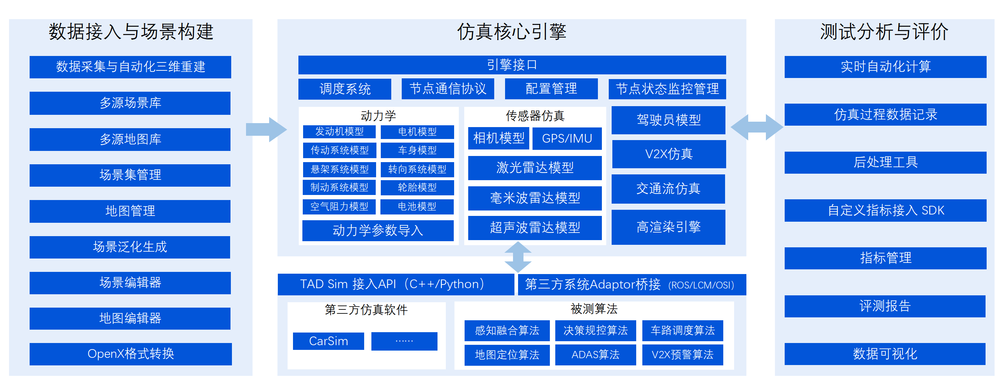

# TAD Sim

# 1. 概述

腾讯自动驾驶仿真系统 **TAD Sim** (Tencent Autonomous Driving Simulation) **单机版** 是腾讯自动驾驶以建立更加安全和高效的自动驾驶测试工具为目标, 为自动驾驶系统研发和验证而量身定做的跨平台分布式系统.

它基于腾讯强大的游戏引擎、虚拟现实、云游戏技术, 集成工业级的车辆动力学模型和专业的渲染引擎, 辅以三维重建技术和虚实一体交通流, 可以完成感知、决策、控制算法等实车上全部模块的闭环仿真验证, 极大地降低了研发成本并缩短了研发实际周期.

# 2. 整体架构

<div align="center"></div><br>

# 3. 入门指南

## 3.1 目录结构
    --adapter                     消息桥接
    --co_simulation               联合仿真
    --common                      通用功能模块
    --datas                       数据汇总
    --docs                        文档及用户使用操作手册
    --simapp                      前端
    --simcore                     后端 & 引擎
    --tools                       工具脚本集合
    --.clang-format               定义 Clang 格式化工具, 主要用于 C++ 代码 (排除 simcore/sensors/display)
    --.editorconfig               统一代码风格
    --Dockerfile                  定义构建镜像所需指令和配置 - desktop
    --Dockerfile_local            定义构建镜像所需指令和配置 - desktop 排除网络限制
    --Dockerfile_display          定义构建镜像所需指令和配置 - display 模块编译
    --Dockerfile_display_runtime  定义构建镜像所需指令和配置 - display 模块运行 (非必须)


## 3.2 环境准备

**通用要求**
  - [git Downloads](https://git-scm.com/downloads)
  - [git-lfs Downloads](https://git-lfs.com/)

**TAD_Sim 编译分为以下 2 个部分：**
- desktop (非 display 以外的所有模块)
- display

## 3.3 windows 应用程序开发

### 3.3.1 destop
- 环境准备
  - 对于 windows 平台下开发, 需手动安装依赖软件, 操作指引见链接.
  - [windows 平台开发指引 - desktop](./docs/prerequisites_windows.md)<br>

- 修改版本号
  ```txt
  找到 TAD_Sim/simapp/package.json 文件, 并手动修改第 3 行 ("version" 对应的值)
  注意格式需为 "x.x.x"
  ```

- 编译指令
  ```powershell
  # current build environment is under windows 11.

  # 切换到工作目录
  cd TAD_Sim

  # 执行编译
  # 此处添加了 > log.txt 2>&1, 将命令的输出重定向到文件
  # 是考虑编译过程较长方便查编译情况, 视情况添加
  .\build.bat > log.txt 2>&1
  ```

- 产物查看
  ```txt
  在 TAD_Sim\build\release 文件夹下, 可查看到如下产物:
    - tadsim-x.x.x.exe            (可执行程序 windows 平台)
    - txSimSDK_xxx.tar.gz         (被测算法及功能模块接入 SDK)
    - txSimMapSDK_xxx.tar.gz      (高精地图处理 SDK)
    - txSimGradingSDK_xxx.tar.gz  (第三方评测指标接入 SDK)
  ```

### 3.3.2 display
- 环境准备
  - > **提示：** 依赖 desktop 环境准备中 6 和 7 章节
  - 对于 windows 平台下开发, 需手动安装依赖软件, 操作指引见链接.
  - [windows 平台开发指引 - display](./docs/prerequisites_windows_display.md)<br>


- 编译指令
  ```powershell
  # current build environment is under windows 11.

  # 切换到工作目录
  cd TAD_Sim\simcore\sensors\display

  # 执行编译
  # 此处添加了 > log.txt 2>&1, 将命令的输出重定向到文件
  # 是考虑编译过程较长方便查编译情况, 视情况添加
  .\build.bat > log.txt 2>&1
  ```

- 产物查看
  ```txt
  在 TAD_Sim\simcore\sensors\display\build\bin 文件夹下, 可查看到如下产物:
    - display.tar.gz              (高保真及传感器资源)
  ```

## 3.4 ubuntu 应用程序开发
### 3.4.1 destop
- 环境准备
  - > **提示：** 如需在 Ubuntu 本机进行, 环境安装及版本请参照 Dockerfile 内容自行进行, 此处不做具体展开.
  - 对于 Ubuntu 平台下开发, 本仓库提供 Dockerfile, 使用该 Dockerfile 构建 Docker 镜像, 并在其中进行相关的开发与编译工作, 操作指引如下方链接.
  - [ubuntu 平台开发指引 - desktop](./docs/prerequisites_ubuntu.md) <br>


- 修改版本号
  ```txt
  找到 TAD_Sim/simapp/package.json 文件, 并手动修改第 3 行 ("version" 对应的值)
  注意格式需为 "x.x.x"
  ```

- 编译指令
  ```bash
  # current build environment is under ubuntu 18.04 (Dockerfile 构建的镜像)

  # 切换到工作目录
  cd TAD_Sim

  # 以交互方式运行 docker 容器, 将其设置为工作目录, 挂载代码, 并启动 Bash shell
  docker run -it --rm -v .:/build -w /build tadsim:desktop_v1.0 /bin/bash

  # 执行编译
  # 此处添加了 > log.txt 2>&1, 将命令的输出重定向到文件
  # 是考虑编译过程较长方便查编译情况, 视情况添加
  ./build.sh > log.txt 2>&1

  ```

- 产物查看
  ```txt
  在 TAD_Sim/build/release 文件夹下, 可查看到如下产物:
    - tadsim_x.x.x_amd64.deb      (可执行程序 ubuntu 平台)
    - txSimSDK_xxx.tar.gz         (被测算法及功能模块接入 SDK)
    - txSimMapSDK_xxx.tar.gz      (高精地图处理 SDK)
    - txSimGradingSDK_xxx.tar.gz  (第三方评测指标接入 SDK)
  ```

### 3.4.2 display
- 环境准备
  - > **提示：** 如需在 Ubuntu 本机进行, 环境安装及版本请参照 Dockerfile 内容自行进行, 此处不做具体展开.
  - 对于 Ubuntu 平台下开发, 本仓库提供 Dockerfile, 使用该 Dockerfile 构建 Docker 镜像, 并在其中进行相关的开发与编译工作, 操作指引如下方链接.
  - [ubuntu 平台开发指引 - display](./docs/prerequisites_ubuntu_display.md) <br>

- 编译指令

  ```bash
  # current build environment is under unreal-engine (Dockerfile_display 构建的镜像)

  # 切换到工作目录
  cd simcore/sensors/display

  # 以交互方式运行 docker 容器, 将其设置为工作目录, 挂载代码, 并启动 Bash shell
  docker run -it --rm -v .:/build -w /build tadsim:display_v1.0 /bin/bash

  # 执行编译
  # 此处添加了 > log.txt 2>&1, 将命令的输出重定向到文件
  # 是考虑编译过程较长方便查编译情况, 视情况添加
  ./build.sh > log.txt 2>&1
  ```

- 产物查看
  ```txt
  在 TAD_Sim/simcore/sensors/display/build/bin 文件夹下, 可查看到如下产物:
    - display.tar.gz              (高保真及传感器资源)
  ```

## 3.5 安装部署

- 产物编译完成后, 可进行安装部署, 具体操作如下:
  - [TAD Sim 单机版安装部署操作指引 - windows & ubuntu](./docs/user_guidelines/user_guidelines_desktop/source/201.单机版安装部署.md)


## 3.6 使用操作

- 用户操作手册可通过如下方式进行编译, 生成本地版 html 静态网站, 可通过浏览器查看.

  - 编译指令:
    ```bash
    # for ubuntu
    cd TAD_Sim/docs/user_guidelines
    ./build.sh
    ```

    ```powershell
    # for windows
    cd TAD_Sim\docs\user_guidelines
    .\build.bat
    ```

  - 产物查看
    ```txt
    - 在 TAD_Sim/docs/user_guidelines/build/user_guidelines_desktop_standard 文件夹下:
    - 点击 index.html 跳转到浏览器后查看
    ```

## 3.7 经验积累
存放于 docs/experience 文件夹. 这里记录了项目开发过程中在各个方面所积累的宝贵经验, 包括但不限于技术选型的考量, 高效的编程实践、优化策略等.

## 3.8 问题排查记录
存放于 docs/troubleshooting 文件夹. 当项目遇到问题时, 再此将问题的详细描述、排查过程、解决方案以及总结反思记录在此. 这不仅有助于快速定位和解决当前问题, 还能为未来可能出现的类似问题提供解决方案的思路, 提升项目的稳定性和可靠性.

# 4. 贡献


# 5. 版权

许可证遵循 [Apache v2.0 协议]. 更多细节请访问 [LICENSE](./LICENSE).
