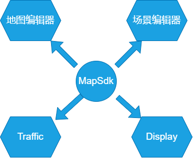
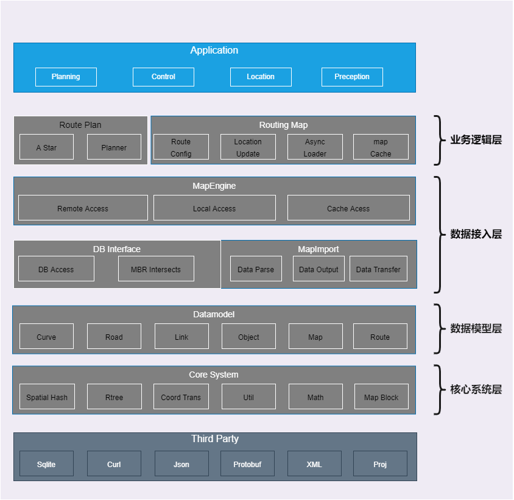
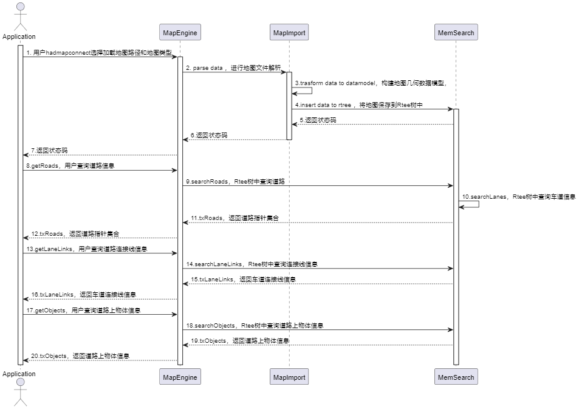
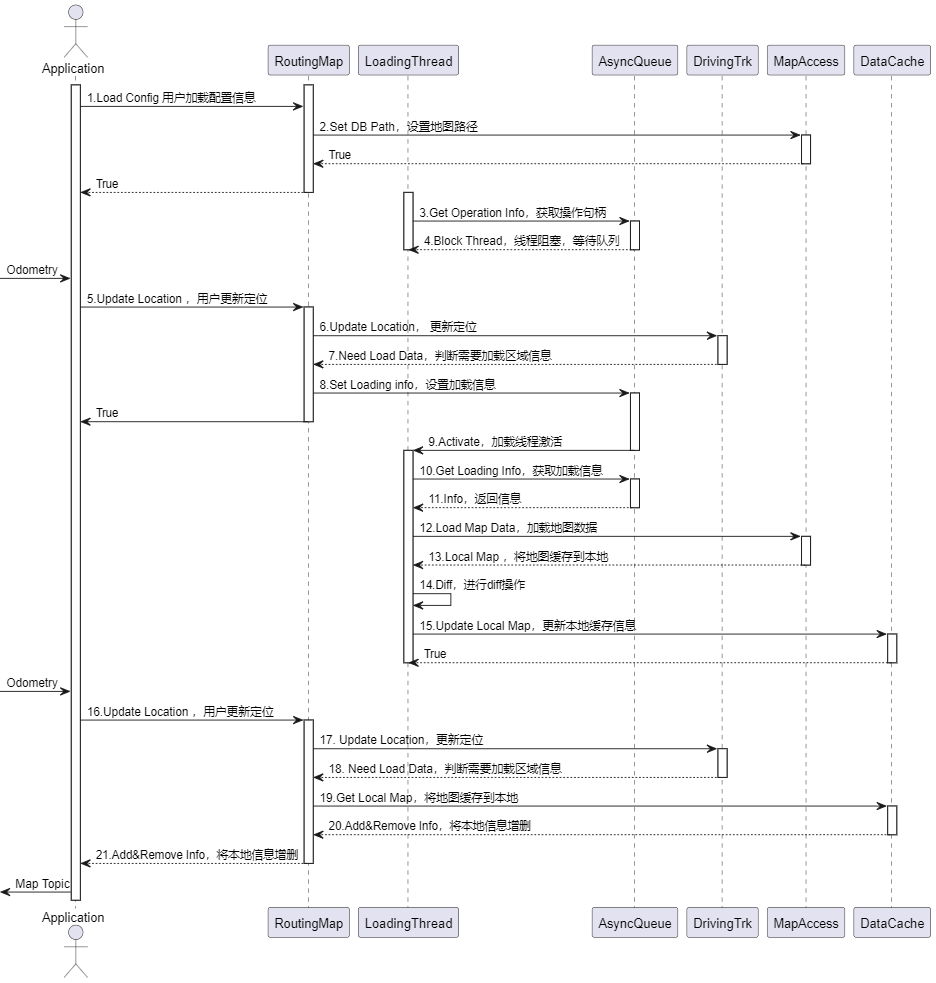
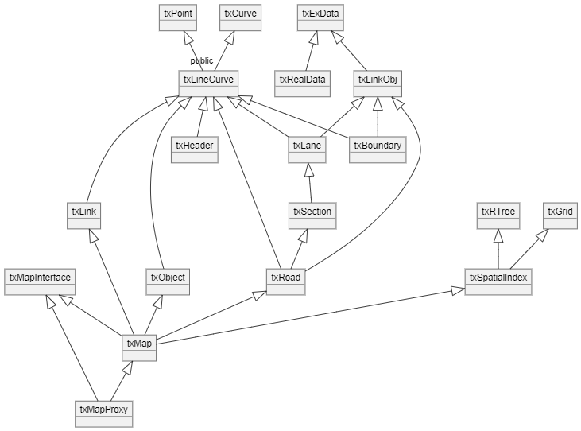
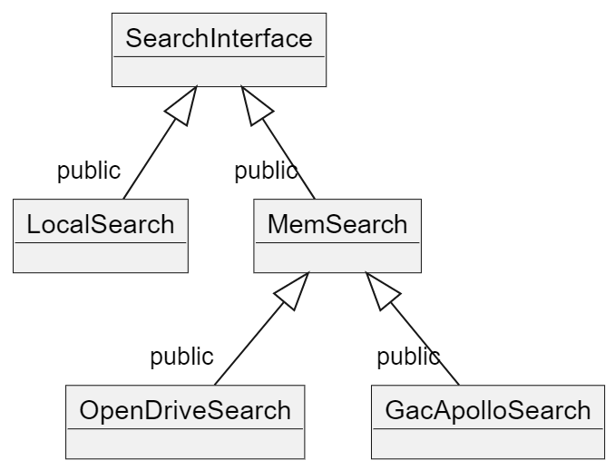
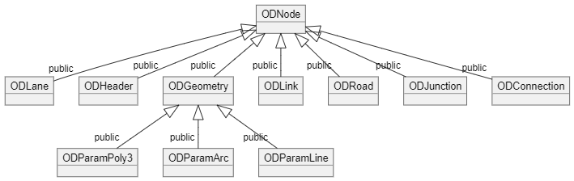

# 1.背景

&emsp;&emsp;地图MapSDK通过解析OpenDrive等格式高精地图数据，转换成相应的数据模型，同时封装特定的API，并以此向应用侧提供相应的数据查询服务，进而支撑L2、L4、仿真等业务对地图的需求。SDK无平台限制，可同时运行在windows 和ubuntu环境下。根据应用侧需求提供相应的lib库及编译文件。<br>
如图所示，在 TAD Sim 中主要对以下等模块提供技术支撑：<br>

<div align="center"></div><br>

# 2.系统结构

&emsp;&emsp;整个SDK 代码架构如下图所示，整个系统分为四层结构，分别为核心系统层、数据模型层、数据接入层、业务逻辑层。<br>

<div align="center"></div><br>

1. 核心系统层：提供偏底层的逻辑功能，诸如空间索（RTree）、几何运算、坐标转换、唯一ID 生成等；<br>
2. 数据模型层：提供对地图要素的抽象表达（参考OpenDrive的设计），并提供相关操作接口；<br>
3. 数据接入层：提供对各种不同规格的地图数据的统一访问接口，想要直接使用地图数据的话，可以从这一层进行接入。这一层里，DB Interface模块提供的是对sqlite的数据访问接口。Map Import提供的是对OpenDrive 等数据的访问接口。<br>
4. 业务逻辑层：主要提供数据动态加载的功能，以及基于高精度地图实现全局路径规划。<br><br>

    备注：
    整个项目中地图的加载方式是通过数据接入层接入，使用的模块主要是核心系统层、数据模型层、数据接入层（DB Interface未使用）


# 3.核心机制

&emsp;&emsp;SDK 的接入方式有两种：<br>
&emsp;&emsp;一种是直接访问数据，以Map Engine模块为入口；Map Engine 模块由于直接访问原始数据，因此，整个业务逻辑相对比较简单，仅仅是完成了对各种不同规格数据解析逻辑的封装。相关模块为map import，对应的规格为opendrive。<br>
&emsp;&emsp; 实现方式时序图如下所示。用户通过hadmapconnect选择加载的地图格式和地图路径，MapEngine通过不同格式在MapImport中解析地图数据，并构建数据模型Datamodel，最后将数据插入到MemSearch内存中，以Rtree方式进行存储，并返回用户错误码和操作句柄；用户再分别通过操作句柄调用getRoads、getLaneLinks、getObjects来查询道路信息、连接线信息、物体元素等信息。

<div align="center"></div><br>

其过程如下：
1）用户通过hadmapconnect选择加载的地图格式和地图路径；
2）MapEngine通过不同格式在MapImport中解析地图数据，并构建数据模型Datamodel，最后将数据插入到以Rtree方式进行存储，并返回用户错误码和操作句柄；
3）用户再分别通过操作句柄调用getRoads、getLaneLinks、getObjects来查询道路信息、连接线信息、物体元素等信息。

&emsp;&emsp;另一种是动态加载数据，构建本地缓存，并提供相应的查询API，以Routing Map模块为入口。Routing Map 基于数据异步加载的逻辑，向应用层提供数据服务。整个异步加载过程分为两步，首先是进行数据异步请求，其过程如下图所示。基于轨迹跟踪的策略，每隔100 米，会启动一次数据的异步加载过程，加载半径500m 范围内的数据，通过在异步队列（mutex+condition variable来实现）插入加载参数来实现。<br>

<div align="center"></div><br>

其过程如下：
1）用户选择配置信息，设置地图路径，加载线程进入阻塞状态；
2）用户输入位置坐标信息，更新地图定位，选则地图需要加载区域，加载线程激活，加载道路信息到本地内存；
3）用户更新位置信息，地图再次选择加载区域，并根据diff操作选择增加和删除的的信息，本地内存信息的更新。

# 4.数据库存储和设计

无

# 5.代码结构

文件目录结构：
```
# 代码结构

├── datamodel           坐标转换、几何计算、数据模型
├── map_engine          外部使用加载地图及查询接口
├── map_import          云版代码
├── map_parser          单机代码
├── mapdb               腾讯私有地图格式查询和访问
├── transmission        json 解析、数据的传输接口（当前已弃用）
├── RoutePlan           路径规划
├── routingmap          异步地图加载接口
├── images              README.md依赖资源
├── UE_H                UE编译所依赖的库
├── README.md
├── API.md
├── lib_build.sh        Linux静态库编译脚本
├── lib_build_so.sh     Linux动态库编译脚本


```
# 6.核心接口
```
地图SDK代码组织结构如下图所示，整体分为6个模块：
datamodel - 包含核心系统层和数据模型层的相关内容；
map engine - 数据访问
map import - OpenDrive数据加载
mapdb      - Sqlite数据加载
route plan - 路径规划
routingmap - 业务逻辑层的相关内容。
```
## 6.1  datamodel 模块说明

&emsp;&emsp;所有的道路对象（road、lane、boundary、object）内部的几何数据均采用txLineCurve进行表示。txLineCurve 通过按序记录矢量点（txPoint）来表示geometry 信息。道路要素之间的相互关系是每个txRoad内部记录一组txSection 信息，每个txSection 内部记录一组txLane 数据，每个txLane 内部记录其左右边界（txLaneBoundary）信息。txObject 用来描述全部道路对象信息，诸如信号灯、杆子、标牌、停止线、通行区域等。<br>

<div align="center"></div><br>

1. txPoint

```c++
记录各地图要素几何坐标信息，使用x，y，z 三个分量，分别表示经度、纬度、高程。数据精度为小数点后7位。
```

2. txCurve

```c++
地图要素几何数据基类，各要素getGeometry 接口会返回该类const 指针。若要素不存在几何信息时，则指针为NULL 或者empty()函数返回true。
// 判断几何数据是否为空
bool empty();
// 获取长度值（单位m）
double getLength();
// 获取sl 坐标系下，指定距离位置的坐标值
txPoint getPoint( double distance );
// 获取起点坐标
txPoint getStart();
// 获取终点坐标
txPoint getEnd();
// 采样，间隔单位为m
void sample( double interval, PointVec& points );
```

3. txLineCurve

```c++
采用矢量线形式表示的几何类，需要获取地图要素原始几何信息时，需要通
过该类的接口实现。
// 获取全部坐标点个数
size_t size();
// 获取指定索引的坐标点
txPoint getPoint( size_t index );
// 获取全部坐标点
void getPoints( PointVec& points );
```

4. txRoad

```c++
描述道路要素，可通过该类获取指定道路的基本属性信息，并通过
getSections 接口，获取道路内部包含的section、lane、boundary 信
息。
// 获取道路id
roadpkid getId();
// 获取道路长度
double getLength();
// 获取全部section 信息
txSections& getSections();
// 获取指定车道中心线（lane）信息
txLanePtr getLane( sectionpkid sectionId, lanepkid laneId );
```

5. txSection

```c++
道路分段信息描述，通过该类获取section 内部全部车道中心线信息。
// 获取当前分段长度信息
double getLength();
// 获取全部车道中心线信息
txLanes& getLanes();
```

6. txLane

```c++
车道中心线描述，记录每条车道引导线信息。
// 获取车道类型
LANE_TYPE getLaneType();
// 获取道路箭头标识
LANE_ARROW getLaneArrow();
// 获取限速信息
uint32_t getSpeedLimit();
// 获取车道宽度，平均宽度信息
double getLaneWidth();
// 获取车道中心线长度
double getLength();
// 获取左侧车道线（boundary）id
laneboundarypkid getLeftBoundaryId();
// 获取左侧车道线（boundary）实例，可能为NULL（map engine 中部
分查询接口不会填充这一项的信息）
txLaneBoundaryPtr getLeftBoundary();
```

7. txLaneBoundary

```c++
实际车道线描述，记录车道线线型、几何信息。
// 获取车道线线型
LANE_MARK getLaneMark();
```

8. txLink

```c++
车道中心线拓扑关系描述，非路口内部的link 仅记录拓扑关系，路口内部
的link 同时记录引导线信息。
// 获取出发车道中心线信息
roadpkid fromRoadId();
sectionpkid fromSectionId();
lanepkid fromLaneId();
// 获取到达车道中心线信息
roadpkid toRoadId();
sectionpkid toSectionId();
lanepkid toLaneId();
```

9. txObject

```c++
记录道路对象（路牙、护栏、特征点等）信息。部分对象（如 特征点）可
能有与车道中心线的附属关系。
// 获取依附的车道中心线信息
void getReliedLaneIds( std::vector< txLaneId >& ids );
// 获取道路要素几何信息
txObjGeomPtr getGeom( size_t index = 0 );
// 获取几何数据方式
objPtr->getGeom()->getGeometry();
```

## 5.2 map_engine 模块说明

&emsp;&emsp; map_engine 模块主要提供各类不同数据源的接口封装（opendrive数据数据）。类图如下所示，SearchInterface 是统一的访问接口，LocalSearch 封装了sqlite 的访问接口，MemSearch 封装的是基于本地缓存（数据先解析，转换成相应的数据模型缓存后，再提供查询服务）的访问接口，支持opendrive数据加载。<br>
&emsp;&emsp;txMapInterface 是应用侧在外部的访问接口，通过txMapInterface 提供的相关查询API，实现各类地图数据的查询调用。txMapInterface 内部记录了txMap实例。txMap 内部记录全部已缓存的道路要素信息，以及相关几何数据空间索引的缓存信息（RTree）。<br>

<div align="center"></div><br>

&emsp;&emsp;map_engine 在初始化时，根据当前使用的初始化参数（SQLITE、OPENDRIVE分别对应LocalSearch、OpenDriveSearch）来构建查询接口实例。<br>
&emsp;&emsp;具体API 详见 API.md

### 5.3 map_import 模块说明

&emsp;&emsp;map_import 内部实现的是数据的解析。ParseInterface.h 是解析数
据的函数入口。以下是OpenDrive 数据结构类图。<br>

<div align="center"></div><br>

### 5.4 mapdb 模块说明 （项目中未使用）

&emsp;&emsp;mapdb 模块实现了sqlite 数据解析功能，通过使用sqlite 及spatialite提供的相关API，读取地图数据。db_operation.h 是抽象接口，外部使用时，通过该接口进行数据查询。sqlite_operation.*是具体实现类，封装了各种sql语句。<br>

### 5.5 route_plan 模块说明（项目中未使用）

&emsp;&emsp;route_plan 模块提供的是基于高精度地图的全局路径规划功能，规划粒度是road 级（高精度地图内定义的road）。支持两点间及多点间的路径规划，规划采用的算法是A*，使用的启发式搜索函数是当前road 到目标road 的直线距离。全局路径规划的算法（两点）流程如下所示：

1. 根据起点和终点坐标进行道路定位，得到road_s，road_e；
2. 若定位失败，直接返回；
3. 根据dijkstra 算法，以待选road 和目标road 间的直线距离为启发函
   数，执行路径规划算法；
4. 若规划成功，返回规划结果（datamodel 模块内的txRoute）。<br>

### 5.6 routingmap 模块说明（项目中未使用）

&emsp;&emsp;routingmap 模块提供数据异步加载，动态更新的功能。采用固定大小的滑动窗口（半径为MAP_RADIUS），每隔指定距离（LOADING_DIS）进行一次数据加载，再对前后帧数据做差分，将需要新增或删除的数据更新到txMap 实例中。并且，由于使用的是ENU 坐标系，因此每隔一段距离（UPDATE_DIS），会启动一次坐标原点更新。

# 6.编译调试

## 6.1 编译依赖库

```
SDK 由于需要使用sqlite 数据库，支持网络传输功能，同时支持解析georeference 的相关内容，因此需要用到如下的三方库：
    1）libsqlite3-dev
    2）libspatialite-dev
    3）libcurl4-openssl-dev
    4）proj4
ubuntu 下，直接使用apt-get 进行安装，windows 下，有已编译完成的库文件可直接使用。
```

## 6.2 编译及使用

```
windows编译
进入hadmap,
cmake

ubuntu已经配置了编译镜像，下载即可。
挂载docker镜像：docker run -u dev --rm -it -w /home/dev -v /mnt/d/workspace/:/home/dev csighub.tencentyun.com/simcloud/simcore_dev:tag-ubuntu1604-v2.2 bash
sh ./lib_build.sh
```
