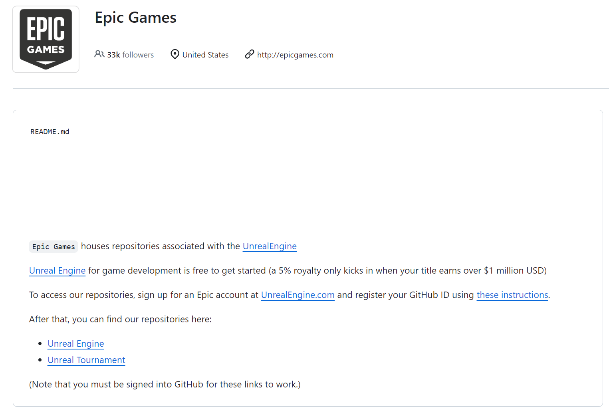
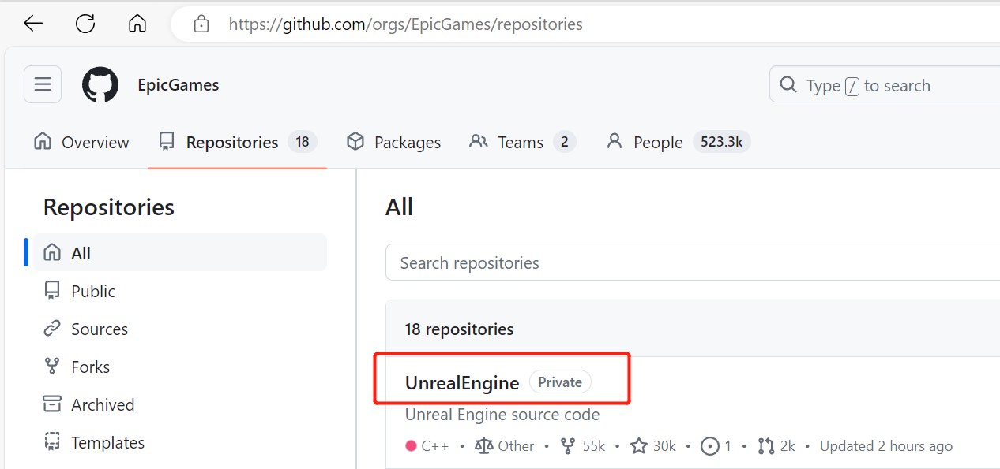

# ubuntu 平台开发指引

## 1. 编译镜像
```bash
# 切换路径为项目根目录
cd TAD_Sim

# 使用 docker build 按当前平台进行构建
# 注意如果本机是 arm 芯片, 则需要使用下面 buildx 方式进行构建
docker build . -t desktop:tag --build-arg BASE_IMAGE=ubuntu:18.04

# 使用 docker buildx 选择平台（linux/amd64 或 linux/arm64）进行构建
# 目前仅 linux/amd64 被验证, 此处保留扩展能力
docker buildx build . --platform linux/amd64 -t desktop:tag --build-arg BASE_IMAGE=ubuntu:18.04

# 如需开发调试
# 以交互方式运行 docker 容器, 将其设置为工作目录, 并启动 Bash shell
docker run -it --rm -v "$(pwd)":/build -w /build desktop:tag /bin/bash
```


## 2. 编译 simcore/sensor/display

### 2.1 获得 UnrealEngine 私有仓库权限
- 注册 Epic Game 账号并登录且关联 github id, 细节请查看 [Epic Games README](https://github.com/EpicGames)
  <div align="center"></div><br>

- github 中 follow EpicGames, 需要确保出现下方的 private 仓库
  <div align="center"></div><br>

### 2.2 获得 github Container registry
- github 中创建 Tokerns, 细节请查看 [Working with the Container registry](https://docs.github.com/en/packages/working-with-a-github-packages-registry/working-with-the-container-registry)
- 复制 TOKEN
- 登录
  ```bash
  # 替换 USERNAME 和 TOKEN 为使用者 github 的信息
  docker login ghcr.io -u USERNAME TOKEN
  ```

### 2.3 编译镜像 display
```bash
# 切换路径为项目根目录
cd TAD_Sim

# 使用 docker build 按当前平台进行构建
# 注意如果本机是 arm 芯片, 则需要使用下面 buildx 方式进行构建
docker build . -t display:tag -f ./Dockerfile_display

# 使用 docker buildx 选择平台（linux/amd64 或 linux/arm64）进行构建
# 目前仅支持 linux/amd64
docker buildx build . --platform linux/amd64 -t display:tag -f ./Dockerfile_display

# 如需开发调试
# 以交互方式运行 docker 容器, 将其设置为工作目录, 并启动 Bash shell
docker run -it --rm -v "$(pwd)":/build -w /build display:tag /bin/bash
```
