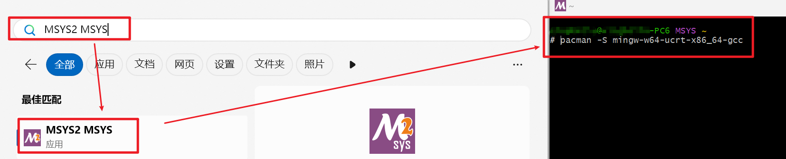
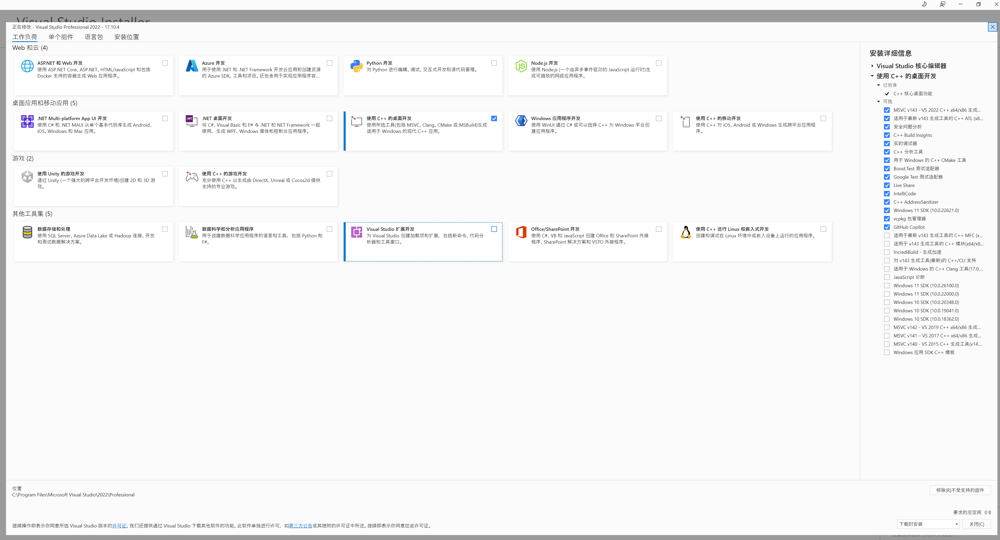

# windows 平台开发指引 - desktop

## 1. 安装 go
> **提示：** go 影响 simcore/map_server & & simcore/framework

- 安装
  - 下载安装包 [Go Downloads](https://golang.org/dl/), 点击下载 `xxx.windows-amd64.msi` 文件
  - 点击界面安装, 建议默认安装位置
- 设置 go 环境变量和参数
  ```powershell
  # 默认自动配置, 检查系统环境变量中系统变量是否有 C:\Program Files\Go\bin

  # 设置项目使用参数
  go env -w CGO_ENABLED=1
  ```
- 验证
  ```powershell
  # current: go1.22.5 windows/amd64
  go version
  # check CGO_ENABLED=1
  go env
  ```

## 2. 安装 gcc
> **提示：** gcc 影响 simcore/map_server

- 安装
  - 下载安装 MSYS2, 安装包及步骤见官方说明 [MSYS2 Downloads](https://www.msys2.org/)
  - 点击界面安装, 建议默认安装位置
  - 安装 mingw-w64-ucrt-x86_64-gcc
    ```powershell
    # 注意需要在 MSYS2 的命令行窗口内执行, 如下图
    pacman -S mingw-w64-ucrt-x86_64-gcc
    ```
    <div align="center"></div><br>
- 设置 gcc 系统 PATH
  ```powershell
  # 下面指令中的 C:\msys64\ucrt64\bin (默认安装位置) 替换为实际目录
  $env:Path += ";C:\msys64\ucrt64\bin"
  [System.Environment]::SetEnvironmentVariable("Path", $env:Path, [System.EnvironmentVariableTarget]::Machine)
  ```
- 验证
  ```powershell
  # current: gcc.exe (Rev6, Built by MSYS2 project) 13.2.0
  gcc --version
  # 如果此时 MSYS 终端执行 gcc --version 提示指令不存在, 但是 powershell 中是正常的, 问题出现在 MSYS 终端的环境变量
  # 在 MSYS 终端中输入 echo $PATH, 检查是否有 C:\msys64\ucrt64\bin
  # 没有的话手动设置, 在 MSYS 终端执行
  #   编辑文件, nano ~/.bashrc
  #   文件末尾添加 export PATH=$PATH:/c/msys64/ucrt64/bin
  #   Ctrl+X, 然后按 Y, 最后按 Enter
  #   使更改生效 source ~/.bashrc
  ```

## 3. 安装 nodejs 及依赖
> **提示：** nodejs 影响 simapp & simcore/framework/src/node_addon

- 安装
  - 下载安装包 [nodejs Downloads](https://nodejs.org/download/release/v18.20.4/), 点击下载 `.msi` 文件
  - 点击界面安装, 建议默认安装位置
- 设置 nodejs 环境变量
  ```powershell
  # 默认自动配置, 检查系统环境变量中系统变量是否有 C:\Program Files\nodejs
  ```
- 验证 node & npm
  ```powershell
  # current: v18.20.4
  node -v
  # current: 10.7.0
  npm -v
  ```
- 安装依赖 (全局)
  ```powershell
  npm install -g cmake-js
  npm install -g node-addon-api
  ```
- 设置 NODE 系统 PATH
  ```powershell
  $env:Path += ";C:\Users\xxx\AppData\Roaming\npm\node_modules"
  $env:Path += ";C:\Users\xxx\AppData\Roaming\npm\node_modules\node-addon-api"
  [System.Environment]::SetEnvironmentVariable("Path", $env:Path, [System.EnvironmentVariableTarget]::Machine)
  ```
- 设置 NODE 系统变量
  ```powershell
  # 下面指令中的 xxx 替换为当前 windows 系统用户名
  [System.Environment]::SetEnvironmentVariable("NODE_PATH", "C:\Users\xxx\AppData\Roaming\npm\node_modules", [System.EnvironmentVariableTarget]::Machine)
  ```
- 验证依赖
  ```powershell
  # current: 7.3.0
  # 如果在执行遇到禁止运行脚本的问题, 可以通过下面步骤解决
  # - 管理员方式打开 powershell
  # - 更改执行策略 Set-ExecutionPolicy RemoteSigned -Scope CurrentUser
  cmake-js --version
  # +-- cmake-js@7.3.0
  # `-- node-addon-api@8.1.0
  npm list -g --depth=0
  ```

## 4. 安装 python
> **提示：** python 影响 simcore/excel2asam & simcore/post_script

> **注意：** 当前指定为 python 3.11.8 版本

- 安装
  - 下载安装 python, 安装包及步骤见官方说明 [python Downloads](https://www.python.org/downloads/)
  - 点击界面安装, 建议默认安装位置 (安装时请选中 Add python.exe to PATH)
- 验证
  ```powershell
  # current: 3.11.8
  python --version
  # current: 3.11.8
  pip --version
  ```

## 5. 安装 Doxygen
> **提示：** Doxygen 影响 docs/user_guidelines & simcore/framework/docs

- 安装
  - 下载安装包 [Doxygen Downloads](https://www.doxygen.nl/download.html), 下载  `System Installer`
  - 点击界面安装, 建议默认安装位置
- 验证
  ```powershell
  # current: 1.12.0 (c73f5d30f9e8b1df5ba15a1d064ff2067cbb8267)
  doxygen --version
  ```

## 6. 安装 Visual Studio 2022 及工作负荷
> **提示：** Visual Studio 2022 影响 adapter & common & co_simulation & simcore
- 安装
  - 下载安装包 [Visual Studio Downloads](https://visualstudio.microsoft.com/zh-hans/downloads/), 当前使用为专业版
  <div align="center"></div><br>

  - 工作负荷中, 安装 使用 C++ 的桌面开发, 右侧可选为默认
  <div align="center"></div><br>

- 设置 Visual Studio 系统 PATH
  ```powershell
  # 专业版会自动设置
  # 社区版, 执行下面指令, 其中的 C:\Program Files\Microsoft Visual Studio\2022\Community\Common7\IDE 替换为实际目录
  $env:Path += ";C:\Program Files\Microsoft Visual Studio\2022\Community\Common7\IDE"
  [System.Environment]::SetEnvironmentVariable("Path", $env:Path, [System.EnvironmentVariableTarget]::Machine)
  ```
- 验证
  ```powershell
  # 此时 Visual Studio 会启动
  devenv
  ```

## 7. 安装 vcpkg 及依赖
> **提示：** vcpkg 及 c++ 依赖影响 adapter & common & co_simulation & simcore

> **注意：** 因 vcpkg 不断更新, 当前采用命令行安装依赖项, 版本不可指定, 故建议安装 2024 年 5 月前的 vcpkg 版本

> **注意：** 此步骤安装时间较长, 还需合理安排时间.

- 下载 vcpkg, 详情请查看 [vcpkg Downloads](https://github.com/microsoft/vcpkg)
  ```powershell
  # 官方安装详细说明: https://learn.microsoft.com/zh-cn/vcpkg/get_started/get-started?pivots=shell-powershell
  # 克隆 vckg 代码
  git clone --no-checkout https://github.com/Microsoft/vcpkg.git
  # 进入目录
  cd vcpkg
  # 检出指定的标签
  git checkout tags/2024.04.26
  # 执行启动脚本
  .\bootstrap-vcpkg.bat
  ```
- 设置 vcpkg 系统变量 (VCPKG_ROOT)
  ```powershell
  # 下面指令中的 D:\UGit\vcpkg 替换为 vcpkg 根目录
  [System.Environment]::SetEnvironmentVariable("VCPKG_ROOT", "D:\UGit\vcpkg", [System.EnvironmentVariableTarget]::Machine)
  ```
- 安装本项目相关的 c++ 依赖
  ```powershell
  # 进入目录
  cd vcpkg
  # 安装本项目涉及的 c++ 依赖
  # 一次安装较多时容易报错, 故建议多次少量安装
  .\vcpkg.exe install eigen3 gflags glm cereal gtest jsoncpp tbb uriparser fftw3 pugixml libxml2 tinyxml tinyxml2 log4cplus sqlite3 soci[sqlite3] flann glog curl proj libspatialite xerces-c cppzmq python3 pybind11 chronoengine protobuf grpc boost
  ```
- 设置 cmake 系统 PATH
  ```powershell
  # 下面指令中的 D:\UGit\vcpkg 替换为 vcpkg 根目录, cmake 替换为实际版本
  $env:Path += ";D:\UGit\vcpkg\downloads\tools\cmake-3.29.2-windows\cmake-3.29.2-windows-i386\bin"
  [System.Environment]::SetEnvironmentVariable("Path", $env:Path, [System.EnvironmentVariableTarget]::Machine)
  ```
- 验证
  ```powershell
  # current: 3.29.2
  # 如果在 vscode 的 terminal 中执行提示找不到 cmake 需要重启 vscode
  cmake --version
  ```

## 8. 安装 LLVM 进行代码格式化
- 安装
  - 下载 LLVM, 详情请查看 [LLVM Downloads](https://github.com/llvm/llvm-project), Releases 中下载最新版本的 exe 程序.
  - 默认安装步骤安装
- VS Code 配置
  - 左侧 Extensions 中安装 Clang-Format
  - Settings 中 Extensions/Clang-Format configuration 中配置
    - Executable 中配置 clang-format 的路径, 默认为 C:\Program Files\LLVM\bin\clang-format.exe
    - 对应语言勾选 (C/Cpp 必须)
    - Style 为 file
