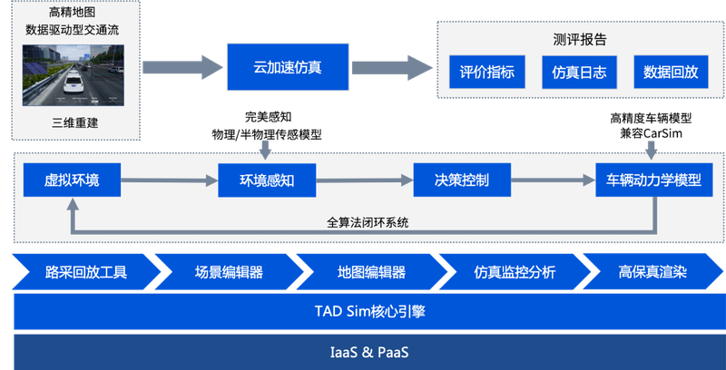

# 1. 关于 TAD Sim 单机版

腾讯自动驾驶仿真系统 **TAD Sim** (Tencent Autonomous Driving Simulation) **单机版** 是腾讯自动驾驶以建立更加安全和高效的自动驾驶测试工具为目标, 为自动驾驶系统研发和验证而量身定做的跨平台分布式系统.

它基于腾讯强大的游戏引擎、虚拟现实、云游戏技术, 集成工业级的车辆动力学模型和专业的渲染引擎, 辅以三维重建技术和虚实一体交通流, 可以完成感知、决策、控制算法等实车上全部模块的闭环仿真验证, 极大地降低了研发成本并缩短了研发实际周期.

<!-- 下面这种方式 Sphinx 可以识别 (就不需要上面的设置了, 但是这种写法 markdown 本身是不认, 预览 markdown 时不方便) -->
<!-- ```{figure} ./_static/images/image8.png
:width: 200px
:align: center
```
<br /> -->

<!-- config.py 中设置了 myst_enable_extensions = ["html_image"] 所以下面的 markdown 写法可以生效, 预览 markdown 时也是生效的 -->
<!-- 如果  这样写是不能控制大小和居中的 -->
<div align="center"></div><br>

TAD Sim 提供 **单机版** 和 **云端版** 两种版本, 云端版包括场景型云仿真和虚拟城市型云仿真两种模式. 涵盖道路场景、交通流、车载传感器和车辆动力学等仿真模型, 可满足研发时的精细调试和测试时批量运行的不同需求, 借助腾讯强大的云计算能力, 帮助用户轻松日行百万公里.

TAD Sim 集成多功能模块以适配更多应用场景, 期望为用户带来更优质的服务. 此说明旨在介绍腾讯自动驾驶仿真系统单机版的应用场景、安装部署、版本更新、基本操作、算法接入等.
