# 1. 单机版安装部署

## 1.1 环境需求

### 1.1.1 软件需求

| 操作系统 | 兼容版本                                                         |
|----------|------------------------------------------------------------------|
| Windows  | 10 / 11                                                          |
| Ubuntu   | 16.04 / 18.04 / 20.04 <br> 需升级安装最新的 NVIDIA 驱动和 Vulkan |

### 1.1.2 硬件需求

| 硬件            | 配置                            | CPU            | 内存         | 显卡            | SSD | 显示器            |
|---------------|-------------------------------|----------------|--------------|-----------------|-----|-------------------|
| 高性能<br>PC 机 | 推荐配置<br>(可根据需求选择)    | i9-<br>13900KF | DDR5<br>64GB | RTX4090<br>24GB | 2TB | 1920<br>x<br>1080 |
| 低性能<br>PC 机 | 最低配置<br>(禁用 Display 模块) | i7             | 8GB          | 无              | 无  | 1920<br>x<br>1080 |

````{note}
注: 以上表格展示了不同配置的硬件参数, 您可以根据实际需要自行调整.
````


## 1.2 Window 安装部署

TAD Sim 安装说明步骤如下:
````{note}
注: 示例操作系统为 Windows10.
````

### 1.2.1 首次安装

**Step 1. 找到安装包**

- 进入安装包所在目录.

<div align="center">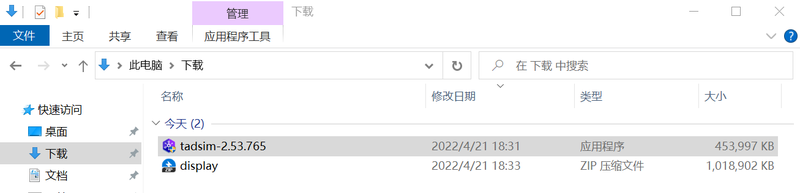</div><br>


**Step 2. 双击打开安装包**

- 在打开的安装窗口中选择目标安装文件夹路径, 并点击"安装"进入安装向导页面, 然后点击 ``完成``.

<div align="center">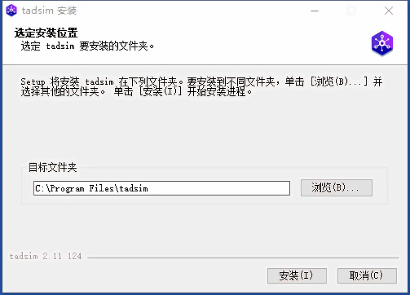</div><br>

<div align="center">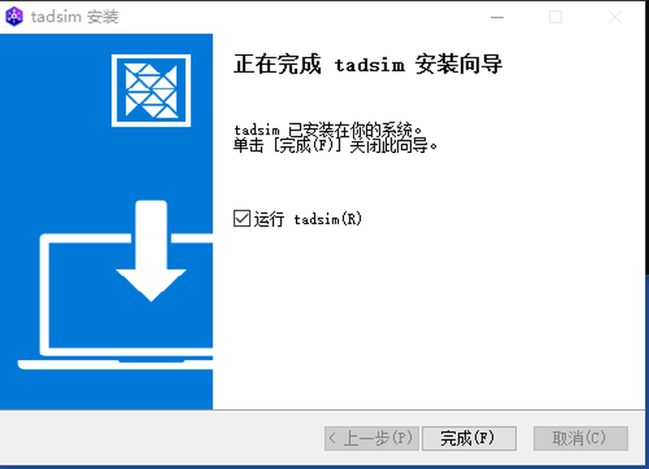</div><br>


**Step 3. 添加 display 文件**

- 解压 display 压缩包
- 将 Display 整个目录复制到 TAD Sim 安装目录的 ``resources\app\service`` 下.
  - 例如, 若把 TAD Sim 安装到 ``C:\Program Files\tadsim``
  - 则将 Display 文件夹复制到 ``C:\Program Files\tadsim\resources\app\service``

<div align="center">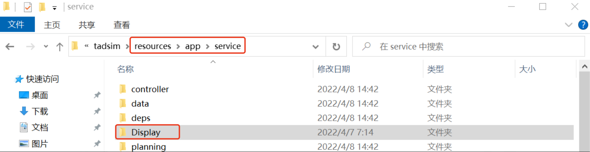</div><br>


### 1.2.2 非首次安装的版本更新

````{note}
注: 如电脑曾安装过旧版本, 需彻底卸载, 并删除对应用户数据.
````

**Step 1. 打开控制面板卸载程序**

- 打开 ``控制面板`` 窗口, 点击 ``卸载程序`` 按钮.
- 在已安装列表中找到 TAD Sim 单机版软件, 右键点击后, 点击 ``卸载`` 按钮.

<div align="center">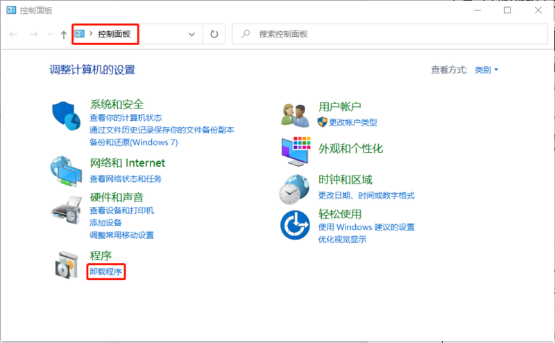</div><br>

<div align="center">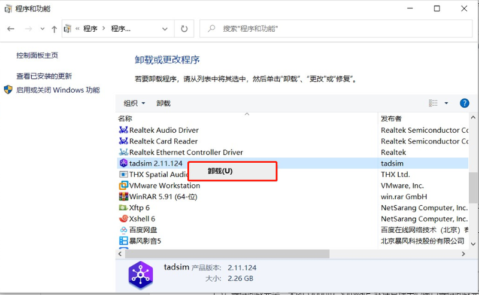</div><br>


**Step 2. 安装新版本**

- 按首次安装的操作流程安装新版本.


## 1.3 Linux 安装部署

TAD Sim 安装说明步骤如下:
````{note}
注: 示例操作系统为 Ubuntu 16.04 LTS.
````

### 1.3.1 首次安装

#### 1.3.1.1 通过命令行安装

- 打开终端窗口, 进入安装包 tadsim_x.x.x_amd64.deb 所在目录.
- 在终端中输入 ``sudo dpkg -i tadsim_x.x.x_amd64.deb``, 按下回车键.
- 在终端中输入当前登录用户的密码, 按下回车键.
- 等待安装完毕, 关闭终端窗口.

<div align="center">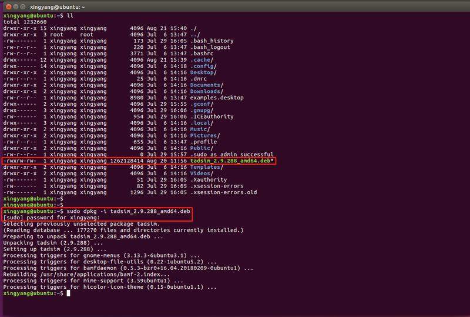</div><br>

- 解压 display 压缩包
- 将 Display 整个目录复制到 TAD Sim 安装目录的 ``/opt/tadsim/resources/app/service/`` 下, 注意权限设置.


#### 1.3.1.2 通过 Ubuntu Software 安装

**Step 1. 找到安装包**

- 进入安装包 tadsim_x.x.x_amd64.deb 所在目录.

<div align="center">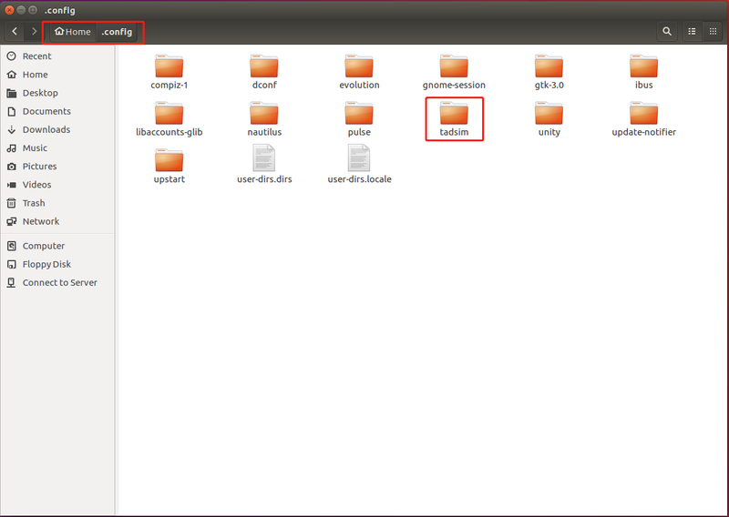</div><br>


**Step 2. 双击打开安装包**

- 双击 ``tadsim_x.x.x_amd64.deb`` 图标, 弹出 ``Ubuntu Software`` 软件安装窗口.
- 点击 ``Install`` 按钮, 输入当前登录用户的密码, 点击 ``Authenticate`` 按钮.
- 等待安装完毕, 关闭 ``Ubuntu Software`` 软件安装窗口.

<div align="center">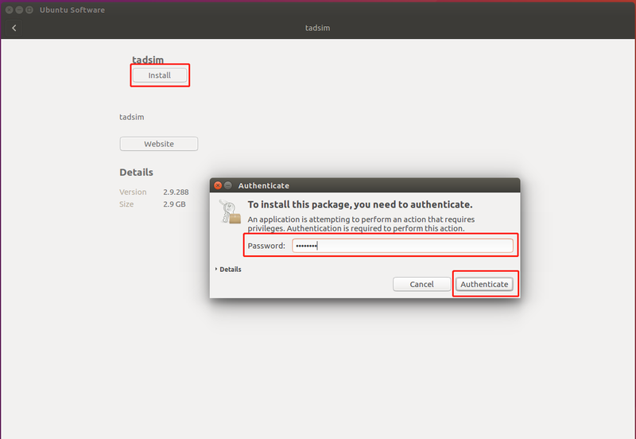</div><br>

**Step 3. 添加 display 文件**

- 解压 display 压缩包
- 将 Display 整个目录复制到 TAD Sim 安装目录的 ``/opt/tadsim/resources/app/service/`` 下, 注意权限设置.


### 1.3.2 非首次安装的版本更新

#### 1.3.2.1 通过命令行安装

- 如电脑曾安装过旧版本, 需彻底卸载, 并删除对应用户数据.


**Step 1. 卸载旧版本**

- 打开终端窗口, 在终端中输入 ``sudo dpkg -P tadsim``, 按下回车键.
- 在终端中输入当前登录用户的密码, 按下回车键.
- 等待卸载完毕.

<div align="center">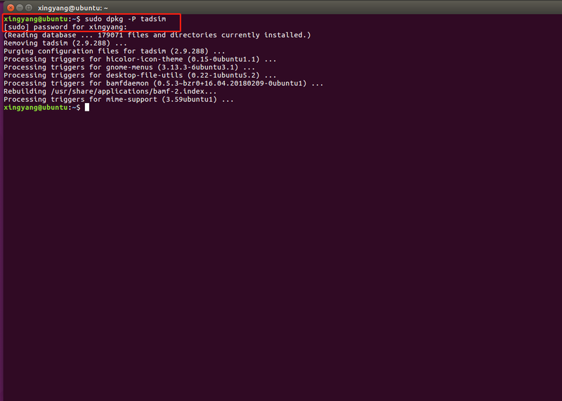</div><br>


**Step 2. 安装新版本**

- 按 [1.3.1.1 通过命令行安装](./201.单机版安装部署.md#1311-通过命令行安装) 的操作流程安装新版本.


#### 1.3.2.2 通过 Ubuntu Software 安装

**Step 1. 卸载旧版本**

- 打开 ``Ubuntu Software`` 软件管理中心窗口, 点击 ``installed`` 进入已安装列表.
- 在已安装列表中找到仿真单机版 ``tadsim``, 点击 ``Remove`` 按钮.
- 在弹窗中, 输入当前登录用户的密码, 点击 ``Authenticate`` 按钮.
- 等待卸载完毕, 关闭 ``Ubuntu Software`` 软件管理中心窗口.

<div align="center">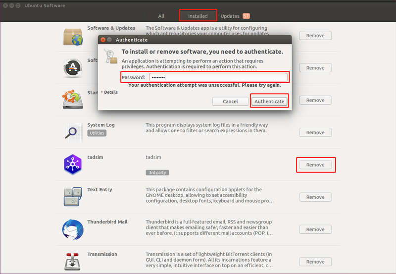</div><br>

<div align="center"></div><br>


**Step 2. 安装新版本**

- 按 [1.3.1.2 通过 Ubuntu Software 安装](./201.单机版安装部署.md#1312-通过-ubuntu-software-安装) 的操作流程安装新版本.
