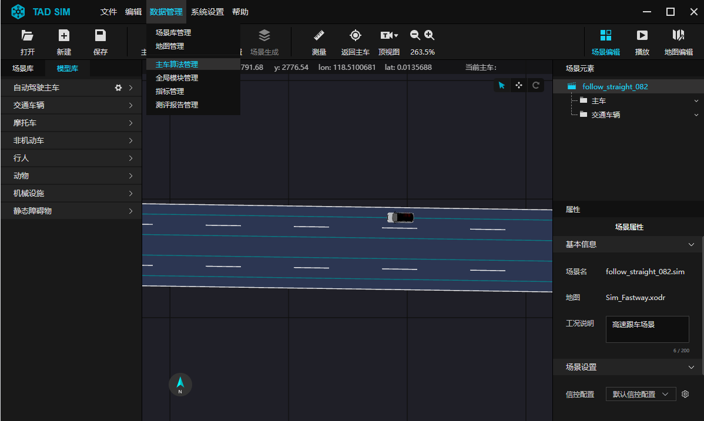
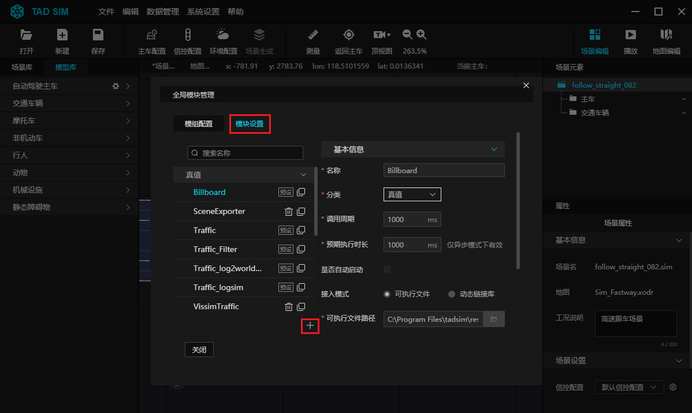
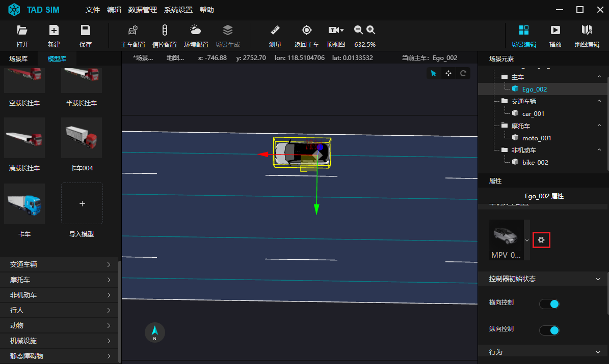
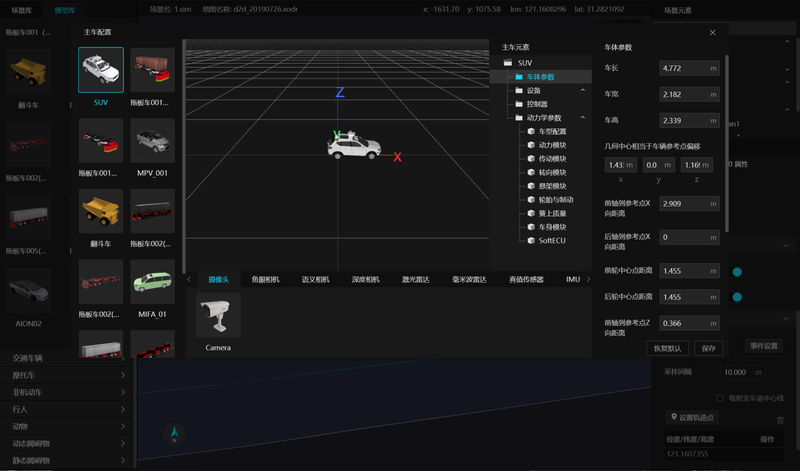

# 3. 导入第一个算法到平台

**Step 1. 打开 TAD Sim 单机版软件**

- 打开已安装好的 ``tadsim.exe`` 程序, 进入 TAD Sim 单机版界面.

 

**Step 2. 进入模块管理界面**

- 在菜单栏中点击 ``数据管理`` 下拉框中 ``主车算法管理`` 按钮, 进入主车算法管理界面.

 

**Step 3. 导入算法**

- 在模块管理界面, 点击 ``模块设置`` 栏, 这里包含所有系统预设的算法模块, 点击界面下方加号图标, 导入新算法, 详情可见 [主车算法管理页面](./302.场景编辑器.md#233-主车算法管理页面)

 

**Step 4. 应用算法**

- 点击主车模型右侧的图标, 页面中间弹出详情窗口, 显示三维主车模型预览, 按住鼠标左键可转动模型, 鼠标滚轮可缩放模型.

 

- 配置主车模型元素的相关参数, 包括传感器模型、控制器模型、动力学模型等.

 

- 点击保存, 配置主车模型下的算法.

**算法模块建议组合示例如下:**

| 系统模块                 | 感知算法测试                | 定位算法测试 | 决策规划测试 | 控制算法测试 | 全算法集成测试                         | 车辆在环测试                | 模型在环测试 | 硬件在环测试 | 真实场景在环测试 |
|--------------------------|-----------------------------|--------------|--------------|--------------|----------------------------------------|-----------------------------|--------------|--------------|------------------|
| Perception (用户算法) | √                           |              |              |              | √                                      |                             |              | √            |                  |
| Location (用户算法)   |                             | √            |              |              | √                                      |                             | √            | √            |                  |
| Planning (用户算法)   |                             |              | √            |              | √                                      |                             | √            |              |                  |
| Controller (用户算法) |                             |              |              | √            | √                                      |                             | √            |              |                  |
| Traffic                  | √                           |              | √            | √            | √                                      | √                           |              |              |                  |
| Display                  | √                           |              |              |              | √                                      | √                           |              |              |                  |
| Perfect_Plannning        |                             | √            |              | √            |                                        |                             |              |              |                  |
| Perfect_Control          |                             | √            | √            |              |                                        |                             |              |              |                  |
| Sensor_Truth             | √                           |              |              |              | √                                      | √                           |              |              |                  |
| Vehicle Dynamics         |                             |              |              | √            | √                                      |                             |              |              |                  |
| Grading                  | √                           | √            | √            | √            | √                                      | √                           | √            | √            | √                |
| 传感器配置               | Camera Lidar Radar... | IMU GPS   |              |              | Camera Lidar Radar IMU GPS | Camera Lidar Radar... |              |              |                  |

系统自带模块详情介绍可见 [主车算法管理页面](./302.场景编辑器.md#233-主车算法管理页面)
