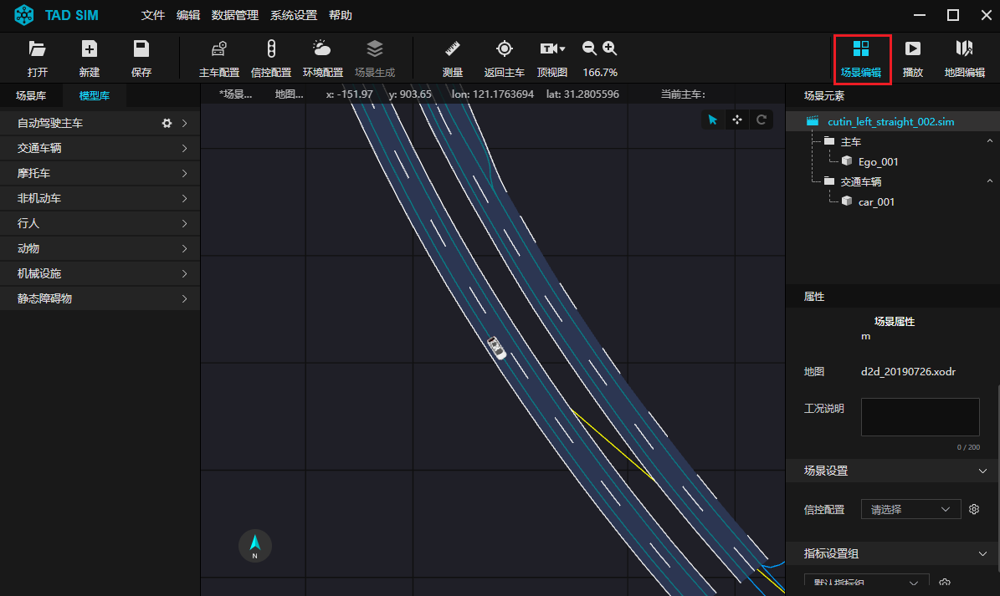
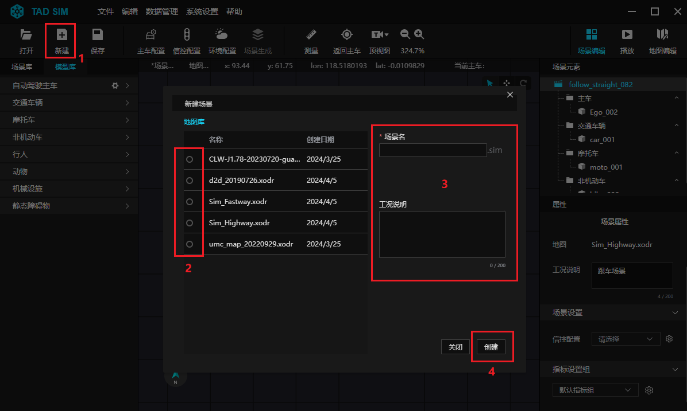
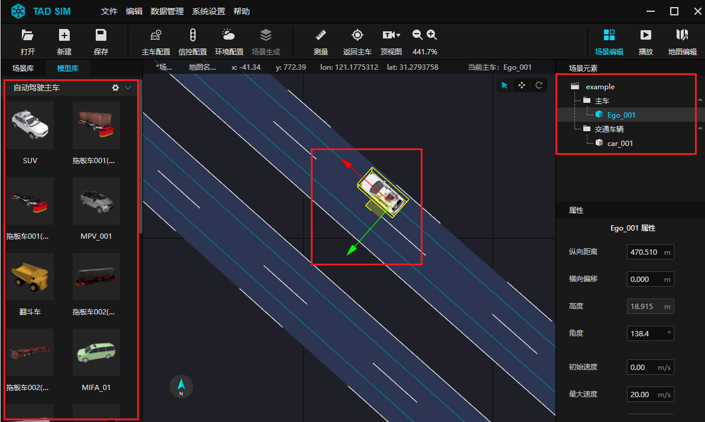
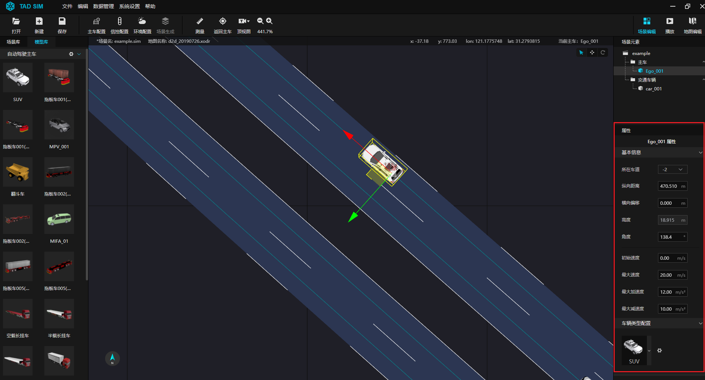
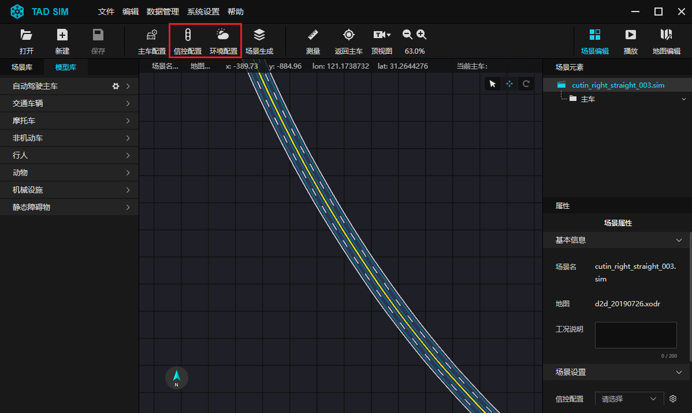
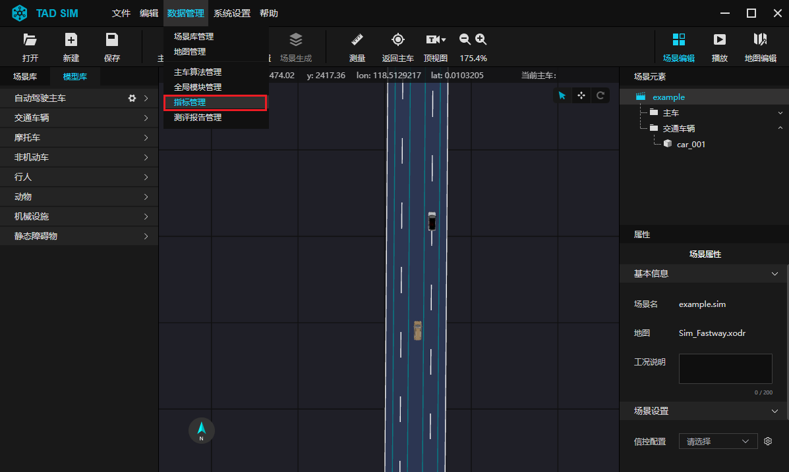
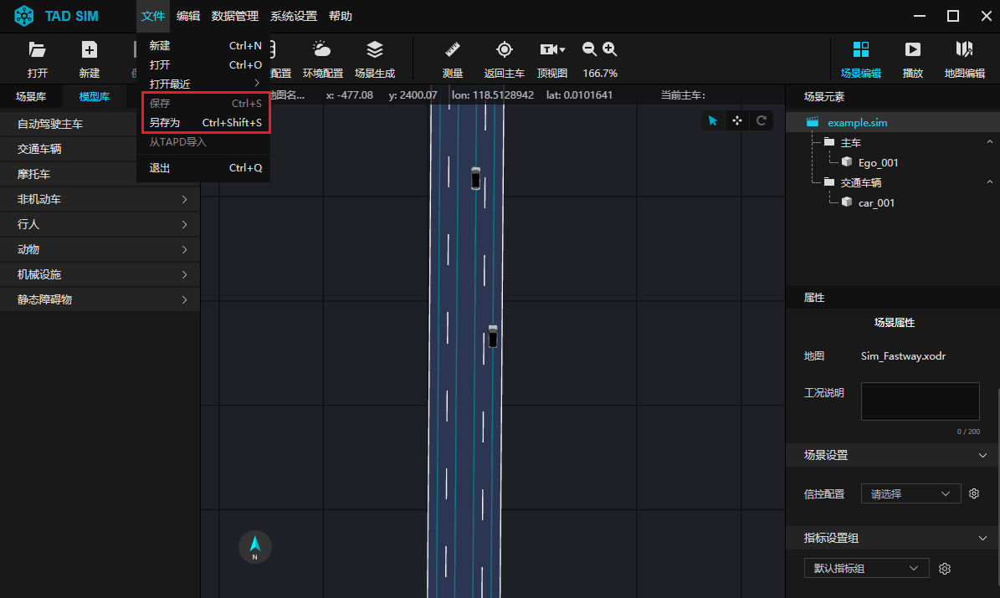
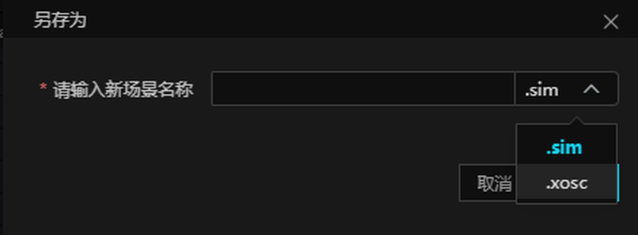

# 4. 创建第一个仿真场景

**Step 1. 进入 TAD Sim 单机版场景编辑器**

- 打开已安装好的 ``tadsim.exe`` 程序, 进入 TAD Sim 单机版界面.
- 用户打开软件后, 系统默认进入 ``场景编辑器`` 中.

<div align="center"></div><br>


**Step 2. 新建场景**

- 点击工具栏中 ``新建`` 图标.
- 打开 ``新建场景`` 弹窗, 弹窗左侧显示 ``地图库``.
- 勾选目标地图, 基于目标地图创建场景.
- 并在 ``场景名`` 栏为场景命名, 在 ``工况说明`` 栏可以备注工况信息.
- 点击 ``创建`` 按钮, 即可创建新场景.

<div align="center"></div><br>


**Step 3. 导入场景元素**

- 基于目标地图创建的场景, 用户可导入所需的场景元素.
- 点击界面右侧 ``模型库`` 栏, 可以查看场景模型, 包括自动驾驶主车、交通车辆、摩托车、非机动车、行人、动物及障碍物.
- 选中目标模型, 鼠标左键长按拖动, 可以将模型导入至地图中相应道路位置.
- 模型导入至编辑界面中, 页面右侧 ``场景元素`` 栏即显示出所导入的元素.

<div align="center"></div><br>


**Step 4. 编辑场景元素属性**

- 在编辑界面中或 ``场景元素`` 栏中, 鼠标左键选中目标元素, 页面右侧即显示元素属性, 可以对其进行参数自定义.
- 这里以主车为例, 在 ``属性`` 栏可以对主车的位置、速度及运行轨迹点进行设定, 详情可见 [主车属性](./302.场景编辑器.md#222-主车属性) 章节.
- 同时也可点击场景编辑器 -> 主车模型右侧的图标, 对主车搭载的传感器进行配置, 支持多种硬件传感器模拟, 允许自定义传感器参数.
- 交通车、行人、动物及障碍物的属性均可进行配置, 详情可见  [属性栏](./302.场景编辑器.md#22-属性栏) 章节.

<div align="center"></div><br>


**Step 5. 配置场景**

- 用户可通过点击工具栏中各工具图标对场景进行配置, 通过点击工具栏 ``环境配置`` 图标, 可对仿真场景中对场景的物理天气信息进行配置, 详情可见 [环境配置页面](./302.场景编辑器.md#246-环境配置页面)
- 点击工具栏 ``交通流`` 图标可配置交通流 (暂未开放), 详情可见 [交通流页面](./302.场景编辑器.md#244-交通流页面)
- 点击工具栏 ``信控配置``, 用于配置当前场景中包含的信控⽅案.详情可见 [信控配置页面](./302.场景编辑器.md#245-信控配置页面)

<div align="center"></div><br>

- 用户也可通过点击菜单栏 ``数据管理`` 下拉框中 ``指标管理`` 按钮对场景评测指标进行编辑, 详见 [指标管理](./302.场景编辑器.md#236-指标管理页面)

<div align="center"></div><br>

<div align="center"></div><br>


**Step 6. 保存场景**

- 在工具栏中单击 ``保存`` 按键, 或在菜单栏 ``文件`` 下拉框中点击 ``保存``, 即可保存当前编辑场景.

<div align="center"></div><br>

<div align="center"></div><br>

<div align="center"></div><br>

- 支持将 .sim 格式的场景另存为 OpenSCENARIOS 1.0 标准的 .xosc 格式.

<div align="center"></div><br>

````{note}
注: 格式另存为时因为格式兼容问题, 少许功能或信息可能会丢失.
````
