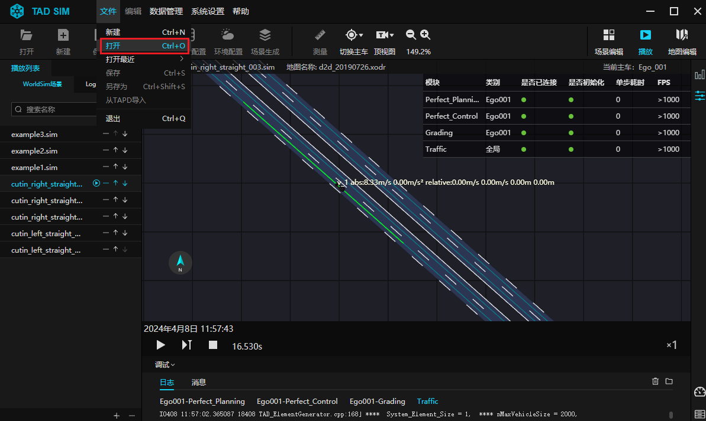
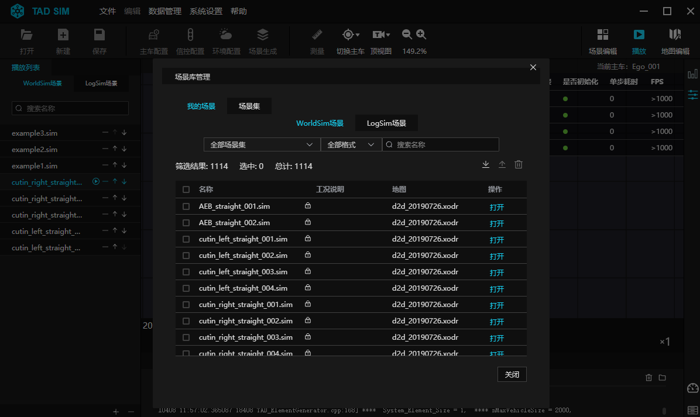
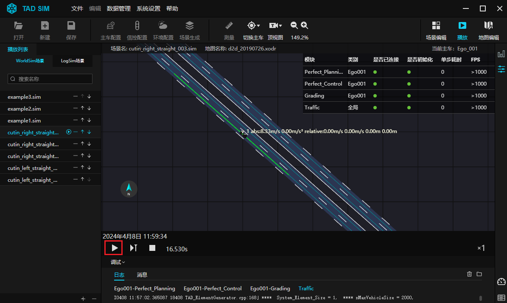

# 5. 播放第一个场景

**Step 1. 打开播放器**

- 在 TAD Sim 单机版中, 点击界面右上角 ``播放`` 图标进入播放器界面.

<div align="center"></div><br>

````{note}
注: 若用户从编辑器编辑场景状态进入播放器, 则系统会出现提示弹窗, 可选择自动保存并播放当前场景.
````


**Step 2. 打开场景文件**

- 在播放器中, 单击左侧 ``播放列表`` 栏中目标场景, 即可进入目标场景播放界面.
- 或点击菜单栏中 ``文件`` 下拉框中``打开``按钮, 即可进入 ``场景管理`` 弹窗, 可以在该弹窗中, 筛选及搜索目标场景, 通过点击场景右侧 ``打开`` 按钮, 即可打开场景文件.
- 或鼠标点击在菜单栏中 ``文件`` 下拉框中 ``打开最近`` 按钮, 即可显示近期编辑的场景文件, 选中目标文件, 即可打开其场景界面.

<div align="center"></div><br>

<div align="center"></div><br>


**Step 3. 播放场景**

- 在二维播放界面下侧, 点击播放图标, 即可开始场景播放.

<div align="center"></div><br>

- 关于播放器的详细功能, 可见 [场景播放器](./303.场景播放器.md#3-场景播放器)
