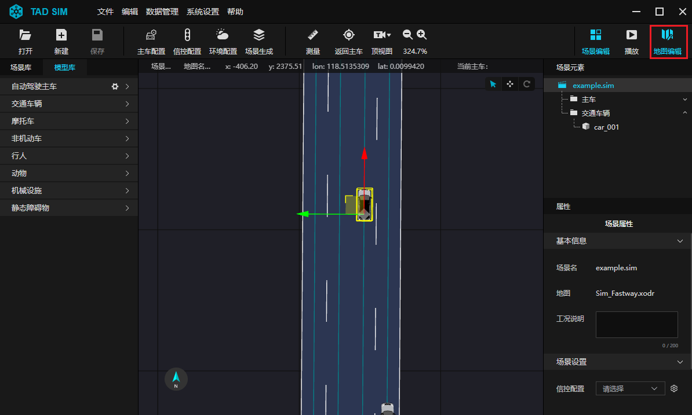
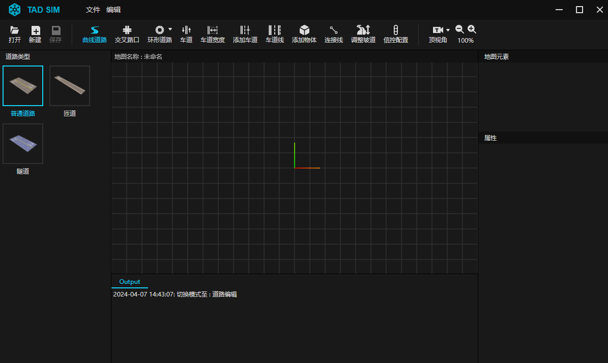
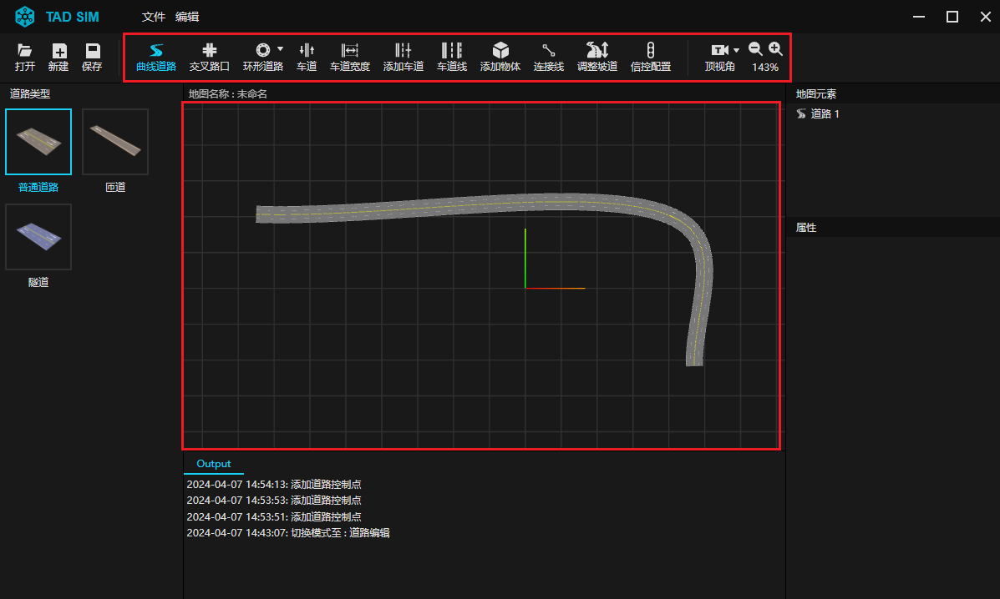
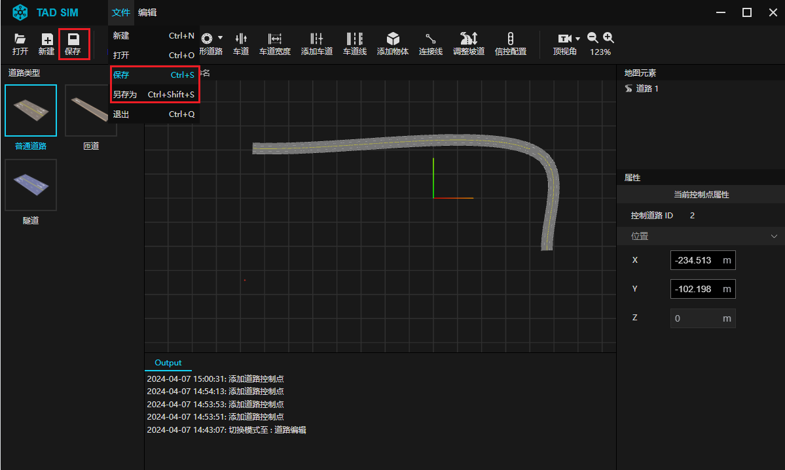
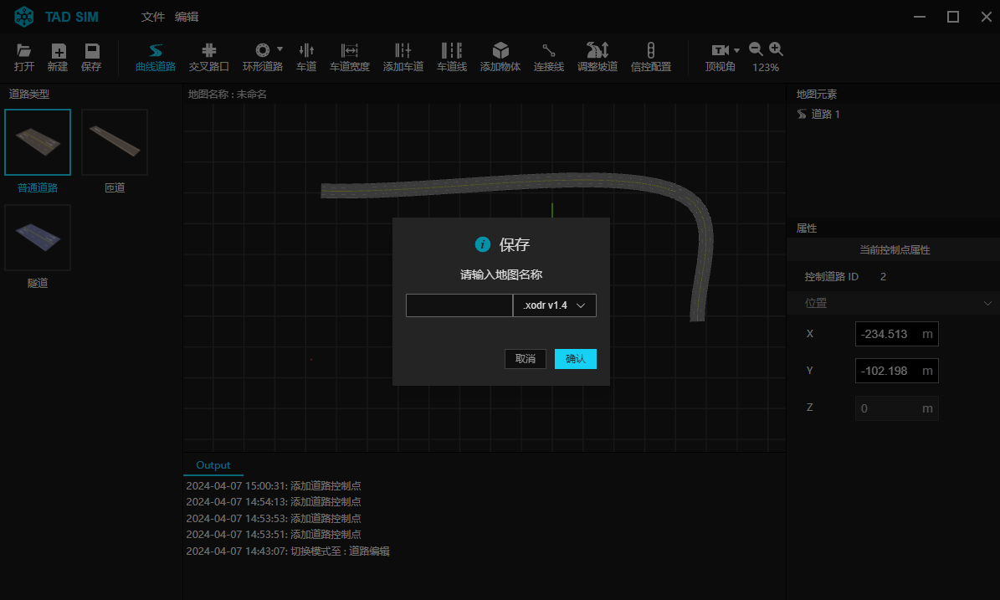

# 6. 创建第一个地图

在 TAD Sim 单机版中, 提供专业的地图编辑器, 支持 OpenDrive1.4/1.5 格式地图的导入、编辑、保存, 并支持关联 OpenCRG.

**Step 1. 打开地图编辑器**

- 在 TAD Sim 单机版中, 点击界面右上角 ``地图编辑`` 图标.

 

- 即可进入地图编辑器界面, 如下图.

 

**Step 2. 绘制地图**

- 通过点击工具栏中工具, 对地图进行绘制.
- 以 ``曲线道路`` 工具为例, 选择 ``曲线道路`` 工具, 右键连续单击其他位置, 创建道路控制点, 绘制道路.
- 与此同时, 界面右侧 ``属性`` 栏显示道路属性, 可以对曲线道路的位置及曲率特征进行设定.
- 同样, 可以对地图进行添加交叉路口、添加物体、调整坡道、调整车道等操作.
- 详细内容可见 [地图编辑器](./304.地图编辑器.md#4-地图编辑器)

 

**Step 3. 保存地图**

- 在工具栏中单击 ``保存`` 图标, 或在菜单栏中 ``文件`` 下拉框中, 点击 ``保存`` , 即可对当前地图进行命名及保存.

 

- 保存时输入地图名称, 以及 OpenDRIVE 版本. (目前支持 1.4 和 1.5)

 
