# 2. 场景编辑器

场景编辑器具备丰富的操作功能, 可以对主车配置、地图、交通参与者、环境等场景要素进行参数级设定, 以满足用户多样化需求.

<div align="center">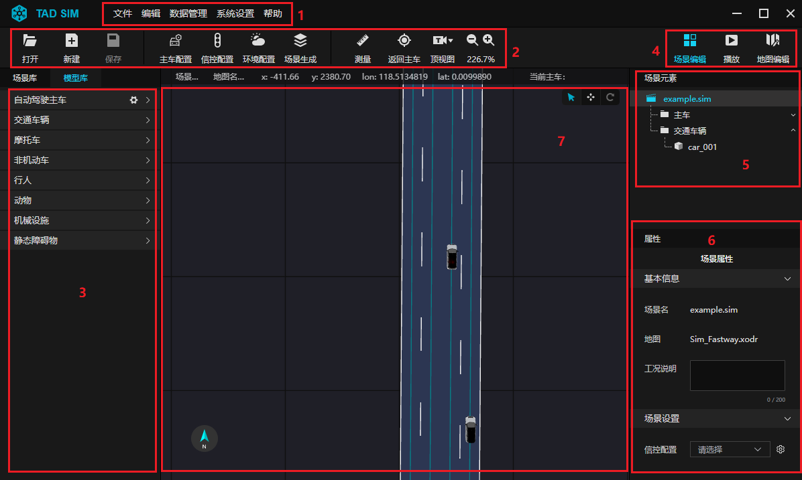</div><br>


## 2.1 功能清单
| ID | 功能              | 说明                                                                                                                                                                                                                                                                                                                                                                                                                                                                                                                                                                                                                                                                                                                                                                                                                                                                                                                                                                                                                                                                                                                                                                                                                                                                                                                                                                                                                  |
|----|-----------------|---------------------------------------------------------------------------------------------------------------------------------------------------------------------------------------------------------------------------------------------------------------------------------------------------------------------------------------------------------------------------------------------------------------------------------------------------------------------------------------------------------------------------------------------------------------------------------------------------------------------------------------------------------------------------------------------------------------------------------------------------------------------------------------------------------------------------------------------------------------------------------------------------------------------------------------------------------------------------------------------------------------------------------------------------------------------------------------------------------------------------------------------------------------------------------------------------------------------------------------------------------------------------------------------------------------------------------------------------------------------------------------------------------------------|
| 1  | 菜单栏            | 菜单栏提供各种编辑和查看操作.菜单栏包括以下功能: <br> - 文件:包括新建、打开、打开最近、保存、另存为、从TAPD导入 (暂不支持)、退出功能. <br> - 编辑:包括删除功能. <br> - 数据管理:下拉框中包括场景库管理、地图管理、主车算法管理、全局模块管理、指标管理、评测报告管理功能. <br> - 系统设置:仿真设置, 具体介绍见[仿真设置](./302.场景编辑器.md#238-仿真设置页面). <br> - 帮助:可查看版本信息.                                                                                                                                                                                                                                                                                                                                                                                                                                                                                                                                                                                                                                                                                                                                                                                                                                                                                                                                                                                                                                      |
| 2  | 工具栏            | 工具栏用于选择当前编辑工具, 并进入下一步操作.工具栏包括以下项: <br> - 打开:打开场景库操作, 具体流程见[打开](./302.场景编辑器.md#241-打开页面)页面. <br> - 新建:全新创建一个测试场景, 新建流程具体见[新建](./302.场景编辑器.md#242-新建页面)页面. <br> - 保存:保存正在编辑的场景, [保存](./302.场景编辑器.md#243-保存页面)页面.<br> - 交通流:交通流的相关配置 (暂未开放).  <br> - 主车配置:配置主车模型元素的相关参数, 包括传感器模型、控制器模型、动力学模型等, 见[主车属性](./302.场景编辑器.md#222-主车属性)页面. <br> - 信控配置:用于配置当前场景中包含的信控⽅案, 见[信控配置](./302.场景编辑器.md#245-信控配置页面)页面. <br> - 环境配置:仿真场景中对场景的物理天气信息进行配置, 见[环境配置](./302.场景编辑器.md#246-环境配置页面)页面. <br> - 场景生成:批量生成场景, 通过对所编辑的场景进行基本信息配置, 可大量生成场景, 见[场景生成](./302.场景编辑器.md#247-场景生成页面)页面<br> - 测量:对当前场景增加测量线, 实现测量距离、朝向、夹角功能, 见[测量](./302.场景编辑器.md#248-测量页面)页面 <br> - 返回主车:场景编辑状态时, 捕捉定位主车位置, 见[返回主车](./302.场景编辑器.md#249-返回主车页面)页面 <br> - 视角切换:场景播放状态下可以切换播放视角效果, 场景编辑目前支持顶视角及透视角. <br> - "播放"页面目前支持顶视角、司机视角、跟车视角及自由视角, 见[视角切换](./302.场景编辑器.md#2410-视角切换页面)页面<br> - 视窗放大缩小:支持放大缩小阈值 (0.1%-1000%). 用户滚动鼠标中间滚轮即有放大或缩小编辑器视图效果. |
| 3  | 场景库/<br>模型库 | -  场景库:用户上传或系统自带的场景, 存于场景库中.以场景集分组显示场景, 单击场景集可展开或折叠子场景. <br> 鼠标双击场景名称可打开当前场景.未添加到任何场景集中的场景显示在"未分组场景"中. <br> - 模型库:提供多种场景元素, 目前支持自动驾驶主车、交通车辆、摩托车、非机动车、行人、动物、障碍物.                                                                                                                                                                                                                                                                                                                                                                                                                                                                                                                                                                                                                                                                                                                                                                                                                                                                                                                                                                                                                                                                                                                              |
| 4  | 窗口              | - 场景编辑:切换场景编辑状态时, 支持在当前场景添加模型库中的场景元素, 调整各种配置参数. <br> - 播放:播放目标场景, 场景进入播放运行状态. <br> - 地图编辑:点击进入地图编辑器.                                                                                                                                                                                                                                                                                                                                                                                                                                                                                                                                                                                                                                                                                                                                                                                                                                                                                                                                                                                                                                                                                                                                                                                                                                            |
| 5  | 场景元素栏        | 用户可在编辑器中添加各种元素, 场景元素将分类呈现.选中目标元素, 可在编辑器中聚焦此元素.点中某场景元素, 右键删除, 同时该元素会同步在编辑器视图中删除.                                                                                                                                                                                                                                                                                                                                                                                                                                                                                                                                                                                                                                                                                                                                                                                                                                                                                                                                                                                                                                                                                                                                                                                                                                                                   |
| 6  | 属性栏            | - 显示地图中元素的基本信息, 用户可根据需要自定义参数, 可编辑类型包括场景、主车、交通车、摩托车、非机动车、行人、动物、障碍物及交通灯.详情可见[属性栏](./302.场景编辑器.md#22-属性栏)页面. <br> - 传感器:支持主车的多种模拟硬件传感器配置, 允许用户自定义传感器参数, 见["传感器"页面]                                                                                                                                                                                                                                                                                                                                                                                                                                                                                                                                                                                                                                                                                                                                                                                                                                                                                                                                                                                                                                                                                                                                         |
| 7  | 编辑界面          | 场景编辑状态下, 编辑界面上方分别显示场景名称、地图名称、地图位置偏移坐标、地图经纬度坐标.播放状态下, 编辑界面上方分别显示场景名称、地图名称、算法运行数据.支持播放当前场景库中全部场景.                                                                                                                                                                                                                                                                                                                                                                                                                                                                                                                                                                                                                                                                                                                                                                                                                                                                                                                                                                                                                                                                                                                                                                                                                                    |


## 2.2. 属性栏
### 2.2.1. 场景属性

选中场景元素中的场景, 该栏即显示场景基本信息.

<div align="center">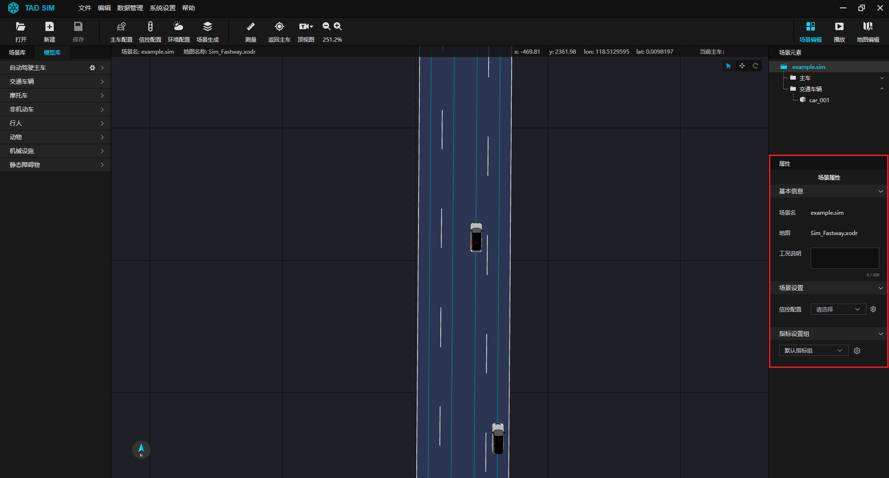</div><br>

- **基本信息栏:**
  - 包括场景名称、地图及其工况说明.
- **指标设置组栏**:
  - 点击下拉栏可以设置该场景关联的评测指标组.


### 2.2.2. 主车属性

选中场景元素中的主车, 该栏即显示场景基本信息, 用户可根据需要自定义参数. (此处轨迹点-设置轨迹点特指主车的行驶轨迹点, 必须设置).

<div align="center">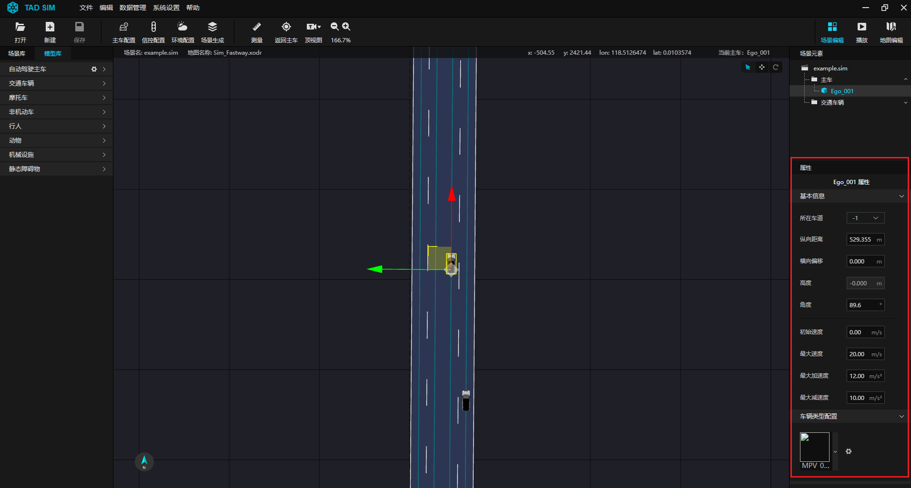</div><br>

- **所在车道**:
  - 以车道行驶方向为前方.如果是单向车道, 车道编号从左到右依次是 -1, -2,  -3,  -4, -5.
  - 如果是双向车道, 则车道编号从左到右依次是 5, 4, 3, 2, 1, -1, -2, -3, -4, -5.
- **纵向距离**:
  - 距离某路段 (section) 的纵向位置.
- **横向偏移**:
  - 车道线中心位置的横向偏移量, 向左偏移为正, 向右偏移为负.
- **高度**:
  - 车辆所在高度.
- **角度**:
  - 车辆的方位朝向角度.
- **速度**:
  - 设置主车的初始速度和最大速度、最大加速度、最大减速度.
- **车辆类型配置**:
  - 修改主车模型.
- **控制器初始状态**:
  - 主车的横向控制和纵向控制, 默认开启.
- **轨迹跟踪**:
  - 轨迹跟踪模式下, 通过选点绘制的轨迹线需要通过拟合曲线的方式呈现, 并保持一定的弧度, 不能出现尖角等转弯, 曲率半径在2m以上.
  - 勾选后, 车辆完全根据设定轨迹行驶, 无智能控制模型且无判断道路、识别方向、避障等能力.
  - 如不勾选, 车辆只会一定程度上参考用户设置的轨迹, 但会通过寻路主动规划合理路径.
  - 轨迹跟踪模式开启后, ``吸附至车道中心线`` 不可框选.
- **采样间隔**:
  - 可输入范围: [-360, 360°].
  - 小数点后限制: 3位.
- **事件设置**:
  - 点击 ``事件设置`` 按钮可以进入 ``事件设置`` 弹窗.详细说明见"[事件设置](./302.场景编辑器.md#229-事件设置)"页面说明.
- **设置轨迹点**:
  - 设置主车行驶必须要经过的轨迹点.
  - 单击设置轨迹点, 开始绘制轨迹点, 绘制完毕, 单击回车键, 停止绘制.
  - 按住 ctrl 的同时点击鼠标左键可在现有的轨迹线上新增轨迹点. (注: 点击"设置轨迹点"再次绘制, 会在之前次绘制的基础上继续绘制轨迹点)
- **吸附至车道中心线**:
  - 勾选后, 每次绘制轨迹点时, 轨迹点位置会自动吸附在绘制点所属车道中心线位置.

<div align="center">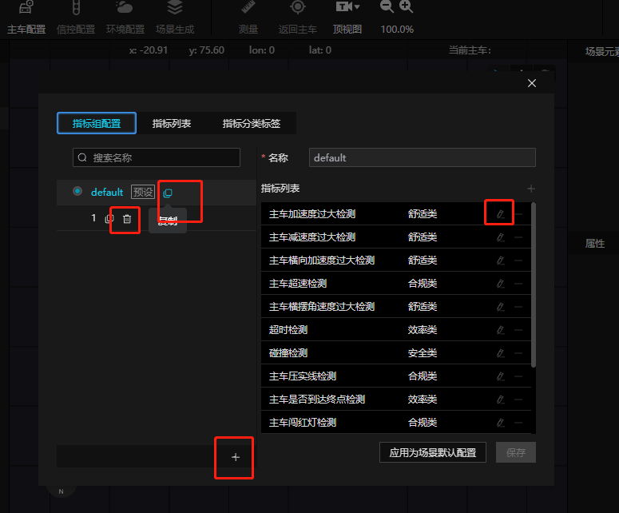</div><br>

- 打开主车配置界面, 点击对应图标, 可以对配置好的主车模型进行一键克隆, 同时也可以对新增的模型进行删除.

<div align="center">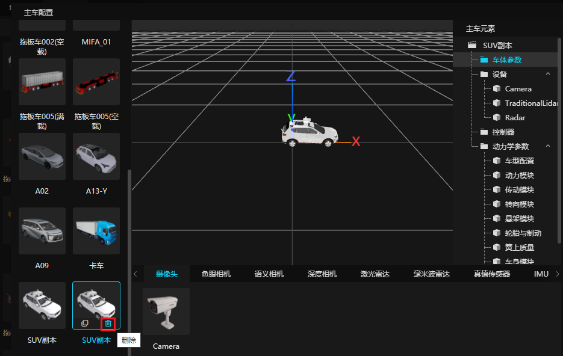</div><br>

````{note}
注: 系统内置模型无法删除.
````


**关于主车传感器、控制器、动力学参数配置如下所示:**

点击主车模型右侧的 ``设置`` 图标, 页面中间弹出详情窗口, 显示三维主车模型预览, 按住鼠标左键可转动模型, 鼠标滚轮可缩放模型.

<div align="center"></div><br>

配置主车模型元素的相关参数, 包括传感器模型、控制器模型、动力学模型等.<br>
点击 ``保存``, 配置主车模型完成.

<div align="center"></div><br>


#### 2.2.2.1. 传感器设备配置

传感器设备配置支持摄像头、鱼眼Camera、语义Camera、深度Camera、Lidar、Radar、超声波雷达、IMU、GPS、V2X 以及真值传感器等.


- 支持设备从下方的设备列表中拖拽到主车上, 设备列表显示的传感器名称和下方的传感器列表需要一致.
- 鼠标选中后拖拽到车上, 自动吸附到松开时的车上相应装配位置, 可通过右侧参数调节调整位置.
- 列表中选中一个传感器, 左侧视图需要高亮定位, 右侧基本信息需要显示该传感器信息.
- 在列表选中后可右键删除和 delete 键删除传感器, 支持按住 shift 和 ctrl 多选.
- 多选后, 右侧信息列表显示为空.

<div align="center"></div><br>


**以摄像头为例, 选中下方设备列表中的摄像头拖拽至主车上, 配置如下参数:**


| 名称       | 默认值      | 范围          | 含义                                                                                                                                                                                                                    |
|----------|-------------|---------------|-------------------------------------------------------------------------------------------------------------------------------------------------------------------------------------------------------------------------|
| 位置 X(cm) | 0           | [-1000, 1000] | 安装位置, 坐标原点位于四轮中心的地面垂点                                                                                                                                                                                |
| 位置 Y(cm) | 0           | [-1000, 1000] | 安装位置, 坐标原点位于四轮中心的地面垂点                                                                                                                                                                                |
| 位置 Z(cm) | 171         | [0, 1000]     | 安装位置, 坐标原点位于四轮中心的地面垂点                                                                                                                                                                                |
| 旋转 X(°)  | 0           | [-180, 180]   | 安装角度                                                                                                                                                                                                                |
| 旋转 Y(°)  | 0           | [-180, 180]   | 安装角度                                                                                                                                                                                                                |
| 旋转 Z(°)  | 0           | [-180, 180]   | 安装角度                                                                                                                                                                                                                |
| GPU配置    | 空(前端GPU) | -             | 多实例模式下, 分配的GPU序号                                                                                                                                                                                             |
| 实例ID     | 0           | -             | 和GPU配置一起使用, <br> 当配置了多个 display 实例时, <br> 每个实例必须指定格式为"A.B"的实例编号, <br> 其中A为实例ID, B为 GPU 序号, 多实例则会运行在不同的 GPU 上. <br> 这两个传感器配置则规定了该传感器分配在哪个实例上 |
| 频率 (Hz)  | 25          | [0, 1000]     | 拍照频率                                                                                                                                                                                                                |
| 色彩模式   | 彩色        | 彩色 \| 灰度  | -                                                                                                                                                                                                                       |
| 水平分辨率 | 1920        | 整数          | 图像尺寸, 像素                                                                                                                                                                                                          |
| 垂直分辨率 | 1208        | 整数          | 图像尺寸, 像素                                                                                                                                                                                                          |
| 细腻度     | 0           | [-5.0, 5.0]   | 正数细腻, 负数粗糙.细腻会增加渲染负担                                                                                                                                                                                   |
| 模糊       | 0           | [0, 1]        | -                                                                                                                                                                                                                       |
| 运动模糊   | 0           | [0, 1]        | -                                                                                                                                                                                                                       |
| 光晕强度   | 0           | [0, 1]        | -                                                                                                                                                                                                                       |
| 噪声强度   | 0           | [0.0, 1.0]    | -                                                                                                                                                                                                                       |
| 暗角       | 0.4         | [0.0, 1.0]    |                                                                                                                                                                                                                         |
| 泛光bloom  | 0.675       | [0.0, 1.0]    |                                                                                                                                                                                                                         |
| 曝光模式         | 0                                                                                                                                                                                               | 自动0 <br> 手动1 <br> (手动时:快门速度, <br> ISO,孔径参数有效)                        |
| 曝光补偿         | 1                                                                                                                                                                                               | -15.0～15.0                                                                  | 曝光的对数2\^n调整, 负值变暗, 正值加亮                                                                                                                                                                            |
| 快门速度         | 60                                                                                                                                                                                              | 1.0\~2000.0, 单位1/s                                                         | 像素亮度B = 曝光 * 场景表面亮度L <br> 曝光 = 1 / (孔径^2 / 快门速度 * 100 / ISO)                                                                                                                                  |
| ISO              | 100                                                                                                                                                                                             | 1.0 ~ 无穷                                                                   | 1.0 ~ 无穷                                                                                                                                                                                                        |
| 孔径(光阑、光圈) | 4                                                                                                                                                                                               | 1.0 ~ 32.0                                                                   | 1.0 ~ 32.0                                                                                                                                                                                                        |
| 色温             | 6500                                                                                                                                                                                            | 1500 ～ 15000K                                                               | 色温                                                                                                                                                                                                              |
| 白色调           | 0                                                                                                                                                                                               | -1.0 ～ 1.0                                                                  |                                                                                                                                                                                                                   |
| 镜头透镜率       | 98                                                                                                                                                                                              | 1.0 ～ 100.0%                                                                |                                                                                                                                                                                                                   |
| 畸变参数         | k1=-5.3336804278253547e-001,  <br> k2=4.5773462092698042e-001, <br> k3=-4.8360765272003647e-001,  <br> p1=-2.3929586859060227e-003, <br> p2=1.8364297357014352e-003 | -                                                                            | 分布表示 k1,k2,k3,p1,p2                                                                                                                                                                                           |
| 内参形式         | 0                                                                                                                                                                                               | 0:矩阵 <br> 1:FOV <br> 2:感光器                                                     | -                                                                                                                                                                                                                 |
| 内参矩阵         | 1.9451674168728503e+003, <br> 0,  <br> 9.4611889604089231e+002; <br> 0, <br> 1.9381372280069070e+003, <br> 6.1970485474739780e+002; <br> 0,0,1                                                                         | 长度为9的数组, <br> 给出默认值的位置readonly, <br> 其余位置值依次为fx, skew, cx, fy, cy. | 当内参形式为矩阵时                                                                                                                                                                                                |
| 水平 FOV(°)      | 60                                                                                                                                                                                              | [0, 180]                                                                     | 当内参形式为fov时                                                                                                                                                                                                 |
| 垂直 FOV(°)      | 36.28                                                                                                                                                                                           | [0, 180]                                                                     | 当内参形式为fov时                                                                                                                                                                                                 |
| 感光器宽度 (mm)  | 10                                                                                                                                                                                              | (0, 10000]                                                                   | 当内参形式为感光器时                                                                                                                                                                                              |
| 感光器高度(mm)   | 10                                                                                                                                                                                              | (0, 10000]                                                                   | 当内参形式为感光器时                                                                                                                                                                                              |
| 镜头焦距(mm)     | 10                                                                                                                                                                                              | (0, 10000]                                     f                              | 当内参形式为感光器时                                                                                                                                                                                              |


#### 2.2.2.2. 控制器配置

下拉列表显示主车控制器配置列表, 包括系统预设和用户创建的配置.

选择主车模型应用的控制器算法.

<div align="center">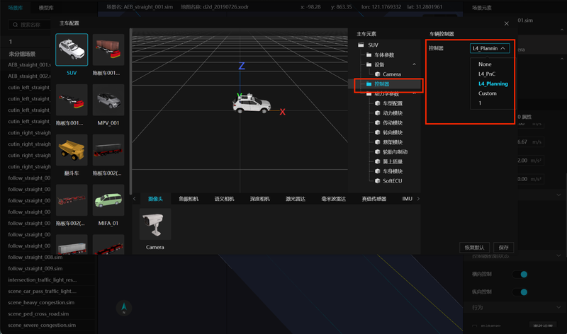</div><br>


#### 2.2.2.3. 动力学参数配置

动力学模型采用参数化建模, 可通过前端编辑动力学参数集, 动力学模型通过加载生成的动力学参数集, 实现对车辆特性的模拟.

同时结合 OpenDRIVE 高精度地图, 动力学模型能够自动生成路面高程, 模拟路面起伏对于算法仿真的影响, 如感知算法, 规划控制算法等.

动力学参数包括车型配置、动力模块、传动模块、转向模块、悬架模块、轮胎与制动、簧上质量、车身模块、SoftECU 等信息.


配置如下图所示:

<div align="center">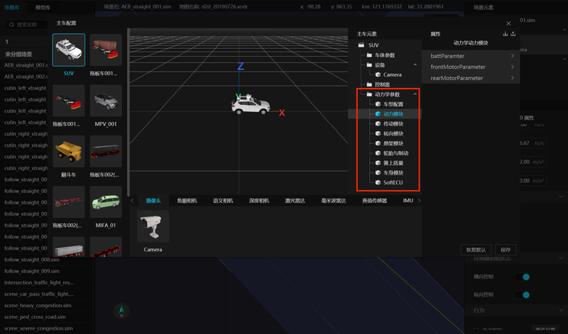</div><br>

-   车型配置参数:

<div align="center">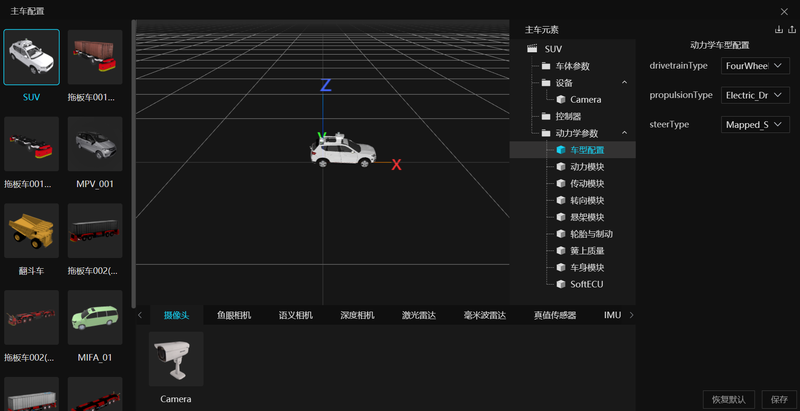</div><br>

-   动力模块参数:

<div align="center">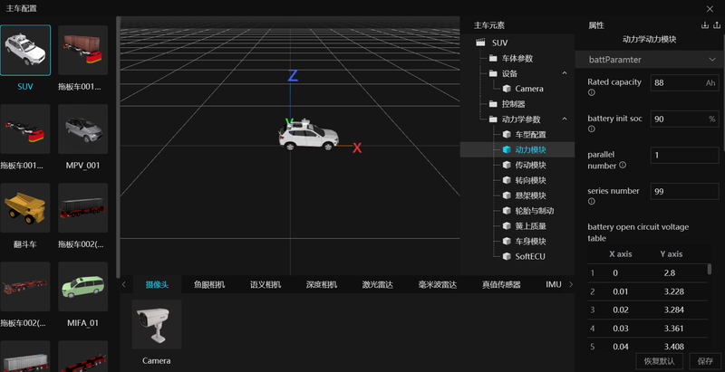</div><br>

-   传动模块参数:

<div align="center">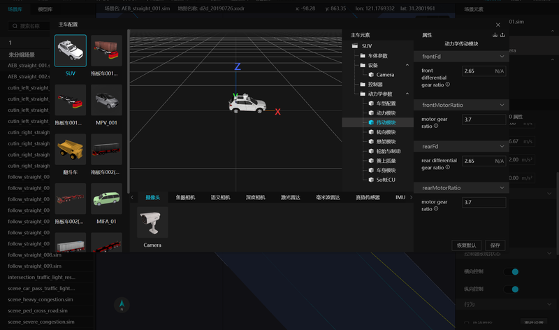</div><br>

-   转向模块参数:

<div align="center">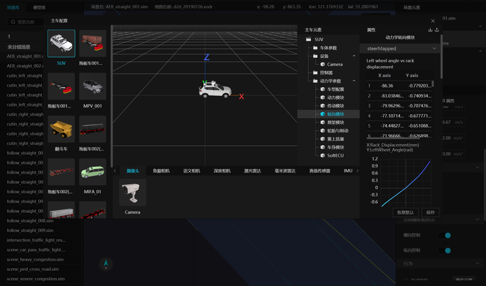</div><br>

-   悬架模块参数:

<div align="center">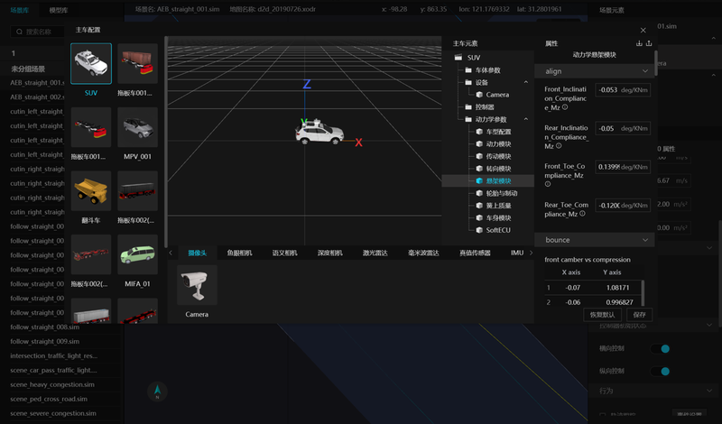</div><br>

-   轮胎与制动参数:

<div align="center">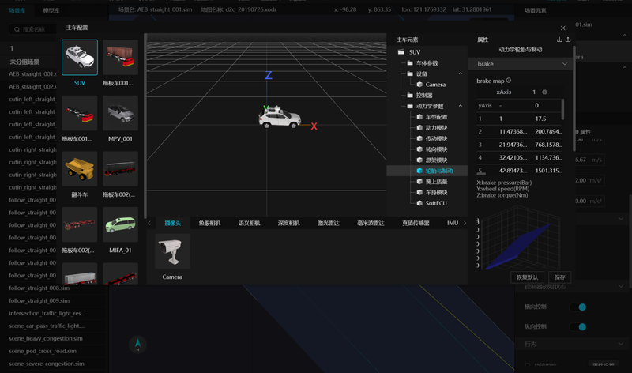</div><br>

-   簧上质量参数:

<div align="center">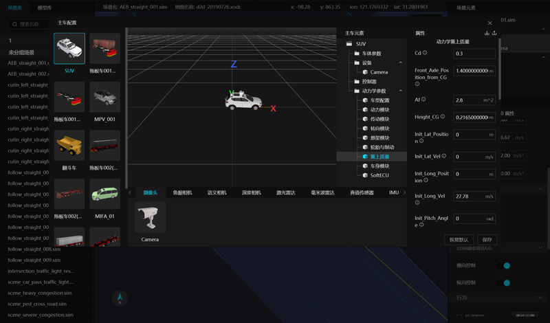</div><br>

-   车身模块参数:

<div align="center">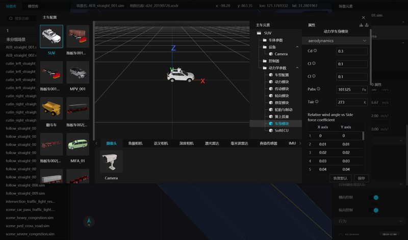</div><br>

-   SoftECU参数

<div align="center"></div><br>


### 2.2.3. 交通车属性

选中场景元素中的交通车, 该栏即显示场景基本信息, 用户可根据需要自定义参数.

````{note}
注: 此处轨迹点-设置轨迹点特指主车的行驶轨迹点, 必须设置.
````

<div align="center">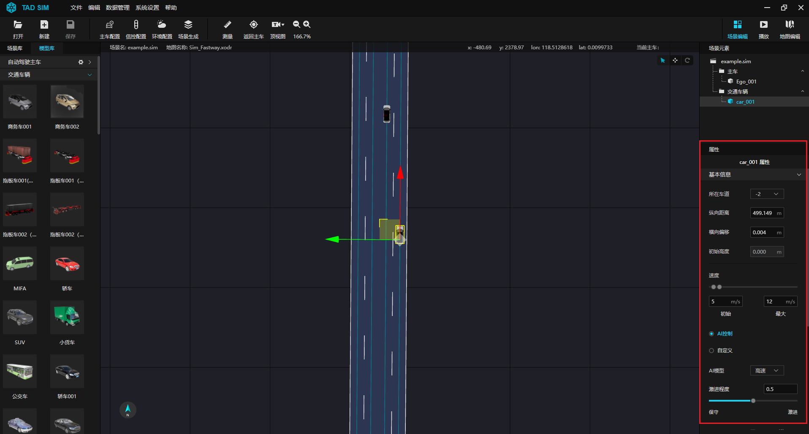</div><br>

- **所在车道:**
  - 以车道行驶方向为前方,
  - 如果是单向车道, 车道编号从左到右依次是 -1, -2,  -3, -4, -5.
  - 如果是双向车道, 则车道编号从左到右依次是 5, 4, 3, 2, 1, -1, -2, -3, -4, -5.
- **纵向距离:**
  - 距离某路段的纵向位置.
- **横向偏移:**
  - 车道线中心位置的横向偏移量,  向左偏移为正, 向右偏移为负.
- **初始高度:**
  - 交通车的初始高度.
- **速度:**
  - 设置交通车的初始速度和最大速度.
- **AI 控制:**
  - AI 控制交通车行驶行为, 其动作行为具有随机性.
- **AI模型:**
  - 支持高速和城区两种AI模型切换
- **激进程度:**
  - 仅在AI控制模式的交通车对驾驶员模型参数的调节.
  - 数值越大, 驾驶员行为越激进.
- **自定义:**
  - 自定义控制下, 可以设置交通车的具体触发行为参数.
  - 点击 ``事件设置`` 按钮可以进入 [事件设置](302.场景编辑器.md#229-事件设置) 弹窗.
- **轨迹跟踪:**
  - 勾选后, 车辆完全根据设定轨迹行驶, 无智能控制模型且无判断道路、识别方向、避障等能力.
  - 如不勾选, 车辆只会一定程度上参考用户设置的轨迹, 但会通过寻路主动规划合理路径.
  - 两种模式下都支持触发设置, 触发设置优先级更高, 一旦满足触发条件后, 会不遵循轨迹运行.
- **参照车:**
  - 非轨迹跟踪模式的自定义控制交通车可设置速度参照车.
  - 参照车可选择主车或其他自定义控制的交通车.
  - 当前车辆只有速度会和参照车保持一致.
- **设置轨迹点:**
  - 设置交通车轨迹点.轨迹跟踪模式下需设置轨迹点速度和档位.
- **大小:**
  - 显示交通车的长宽高.


### 2.2.4. 摩托车/非机动车属性

摩托车/非机动车参数配置功能包含种类、数量、位置、速度、轨迹路径、事件设置等参数配置:

<div align="center">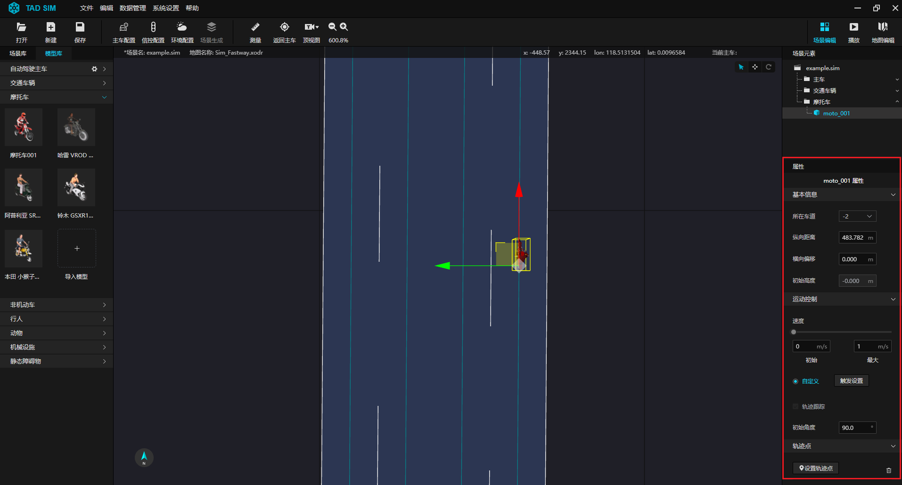</div><br>

- **所在车道:**
  - 以车道行驶方向为前方,
  - 如果是单向车道, 车道编号从左到右依次是 -1, -2, -3, -4, -5.
  - 如果是双向车道, 则车道编号从左到右依次是 5, 4, 3, 2, 1, -1, -2, -3, -4, -5.
- **纵向距离:**
  - 距离某路段的纵向位置.
- **横向偏移:**
  - 车道线中心位置的横向偏移量, 向左偏移为正, 向右偏移为负.
- **初始高度:**
  - 摩托车/非机动车的初始高度.
- **速度:**
  - 设置初始速度和最大速度.
- **自定义:**
  - 自定义控制下, 可以设置摩托车/非机动车的具体触发行为参数.
  - 点击 ``触发设置`` 按钮可以进入 ``触发条件配置`` 弹窗.
  - 分别配置 ``时间触发`` 和 ``条件触发`` 信息,
  - 当前版本的 ``条件触发`` 类型仅支持 ``TTC`` 和 ``与主车距离`` 两种.

<div align="center">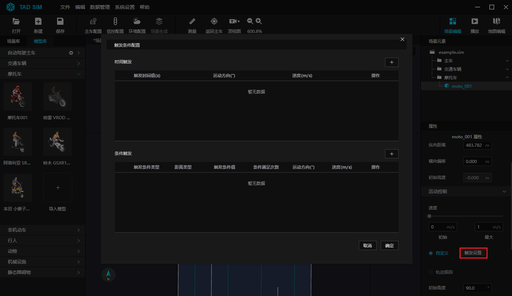</div><br>

- **设置轨迹点:**
  - 设置摩托车/非机动车轨迹点.


### 2.2.5. 行人属性

行人参数配置功能支持种类、数量、位置、速度、轨迹路径、行为事件等参数配置:

<div align="center">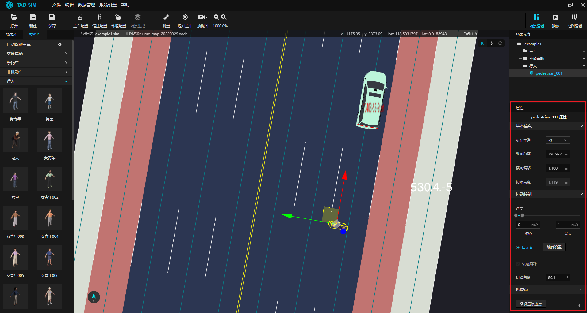</div><br>

- **所在车道:**
  - 以车道行驶方向为前方,
  - 如果是单向车道, 车道编号从左到右依次是 -1, -2,  -3,  -4, -5.
  - 如果是双向车道, 则车道编号从左到右依次是 5, 4, 3, 2, 1, -1, -2, -3, -4, -5.
- **纵向距离:**
  - 距离某路段的纵向位置.
- **横向偏移:**
  - 车道线中心位置的横向偏移量, 向左偏移为正,  向右偏移为负.
- **初始高度:**
  - 行人的初始高度.
- **速度:**
  -  行人速度范围在 0-10m/s 之间.
- **设置轨迹点:**
  - 设置行人轨迹点.(同主车轨迹点设置)
- **自定义:**
  - 自定义控制下, 可以设置行人的具体触发行为参数.
  - 点击 ``触发设置`` 按钮可以进入 ``触发条件配置`` 弹窗.
  - 分别配置 ``时间触发`` 和 ``条件触发`` 信息,
  - 当前版本的 ``条件触发`` 类型仅支持 ``TTC`` 和 ``与主车距离`` 两种.


### 2.2.6. 动物属性

动物参数配置功能支持种类、数量、位置、速度、轨迹路径等参数配置.

<div align="center">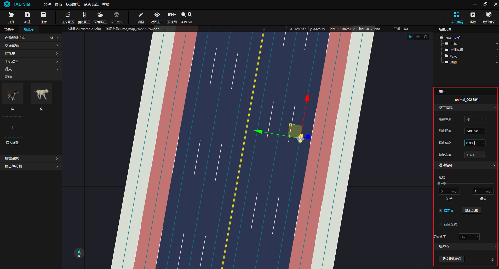</div><br>

选中场景元素中的动物, 该栏即显示场景基本信息, 用户可根据需要自定义参数.

- **所在车道:**
  - 以车道行驶方向为前方,
  - 如果是单向车道, 车道编号从左到右依次是 -1, -2,  -3,  -4, -5.
  - 如果是双向车道, 则车道编号从左到右依次是 5, 4, 3, 2, 1, -1, -2, -3, -4, -5.
- **纵向距离:**
  - 距离某路段的纵向位置.
- **横向偏移:**
  - 车道线中心位置的横向偏移量, 向左偏移为正, 向右偏移为负.
- **初始高度:**
  - 动物的初始高度.
- **速度:**
  - 设置动物的初始速度和最大速度.动物的速度范围是0-33.34m/s.
- **自定义:**
  - 自定义控制下, 可以设置动物的具体触发行为参数.
  - 点击 ``触发设置`` 按钮可以进入 ``触发条件配置`` 弹窗.
  - 分别配置 ``时间触发`` 和 ``条件触发`` 信息,
  - 当前版本的 ``条件触发`` 类型仅支持 ``TTC`` 和 ``与主车距离`` 两种.
- **设置轨迹点:**
  - 设置动物轨迹点.(同主车轨迹点设置)


### 2.2.7. 动态障碍物属性

动态障碍物参数配置功能支持种类、数量、位置、速度、轨迹路径等参数配置.

<div align="center">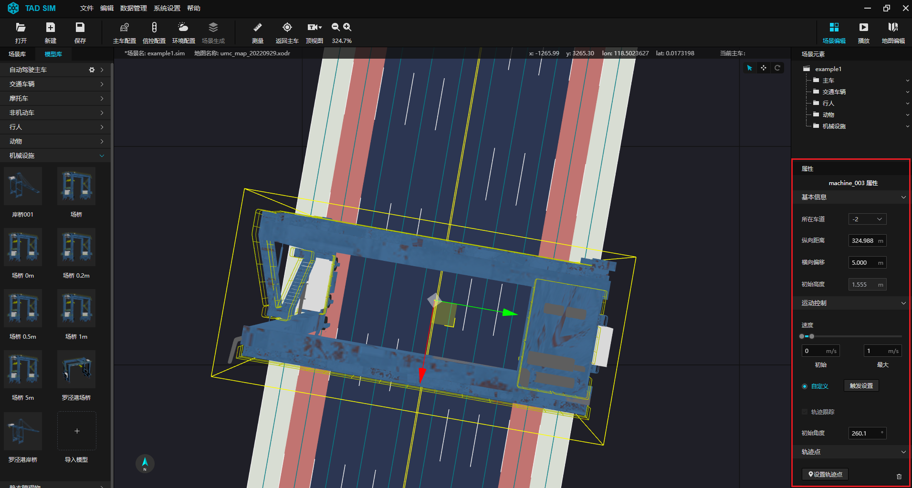</div><br>

选中场景元素中的障碍物, 该栏即显示场景基本信息, 用户可根据需要自定义参数.

- **所在车道:**
  - 以车道行驶方向为前方,
  - 如果是单向车道, 车道编号从左到右依次是 -1, -2,  -3,  -4, -5.
  - 如果是双向车道, 则车道编号从左到右依次是 5, 4, 3, 2, 1, -1, -2, -3, -4, -5.
- **纵向距离:**
  - 距离某路段的纵向位置.
- **横向偏移:**
  - 车道线中心位置的横向偏移量, 向左偏移为正, 向右偏移为负.
- **初始高度:**
  - 障碍物的初始高度.
- **速度:**
  - 设置障碍物的初始速度和最大速度.
- **自定义:**
  - 自定义控制下, 可以设置障碍物的具体触发行为参数.
  - 点击 ``触发设置`` 按钮可以进入 ``事件配置`` 弹窗.
  - 详细说明见 [事件设置](302.场景编辑器.md#229-事件设置).
- **设置轨迹点:**
  - 设置障碍物轨迹点.(同主车轨迹点­设置).


### 2.2.8. 静态障碍物属性

静态障碍物参数配置功能支持种类、数量、位置等参数配置选中场景元素中的障碍物, 该栏即显示场景基本信息, 用户可根据需要自定义参数.

<div align="center">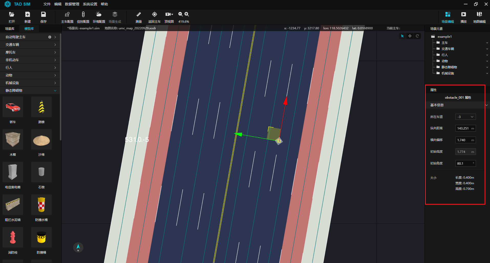</div><br>

- **所在车道:**
  - 以车道行驶方向为前方,
  - 如果是单向车道, 车道编号从左到右依次是 -1, -2,  -3,  -4, -5.
  - 如果是双向车道, 则车道编号从左到右依次是5, 4, 3, 2, 1, -1, -2, -3, -4, -5.
- **纵向距离:**
  - 距离某路段的纵向位置.
- **横向偏移:**
  - 车道线中心位置的横向偏移量, 向左偏移为正, 向右偏移为负.
- **初始高度:**
  - 障碍物的初始高度.
- **角度:**
  - 障碍物的方位朝向角度.
- **大小:**
  - 障碍物长宽高.


### 2.2.9. 事件设置

点击事件设置后进入事件设置事件配置窗口.

<div align="center">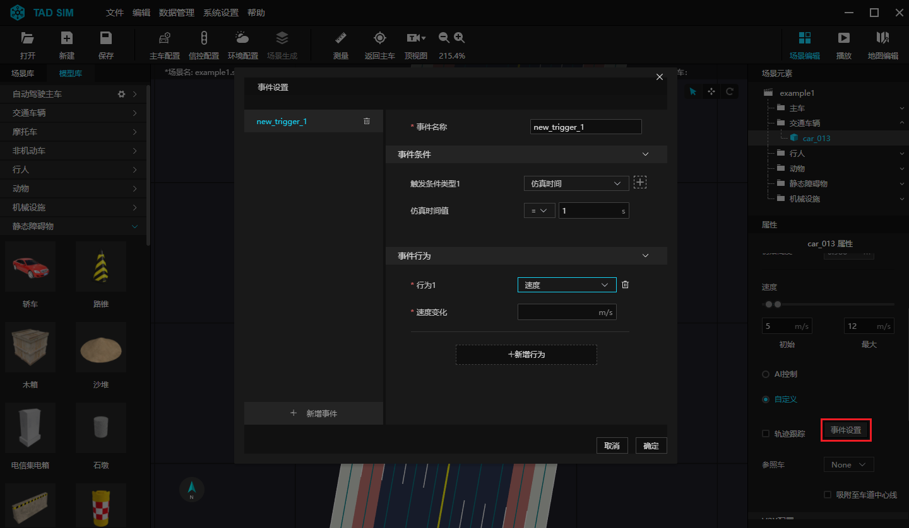</div><br>

**详细交互说明如下:**

<div align="center">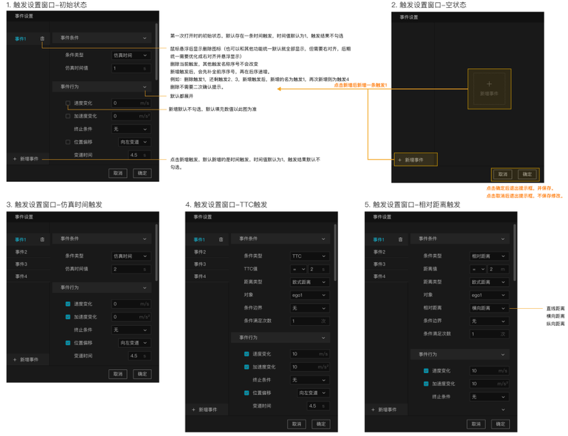</div><br>

<div align="center">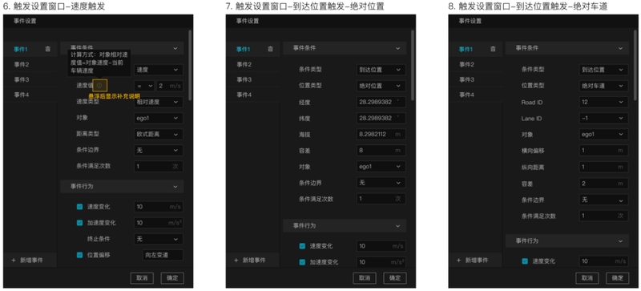</div><br>

<div align="center">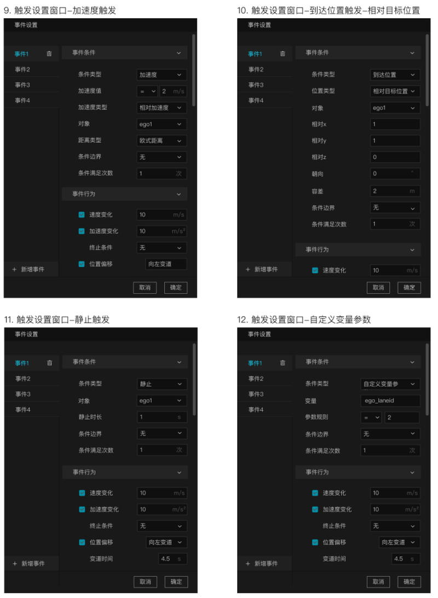</div><br>

**事件设置具体功能说明如下 (加速度触发、静止触发当前暂不支持):**

<div align="center">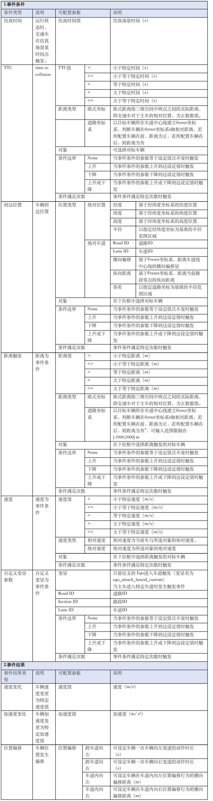</div><br>


**字段规则说明:**
| 字段名     | 明细项                                                         | 备注               |
|------------|----------------------------------------------------------------|--------------------|
| 值         | =                                                              |                    |
|            | <                                                              |                    |
|            | >                                                              |                    |
| 速度值     | 范围[-33.34,33.34], 限数字、小数点,保留小数点后两位             | 默认为0            |
| 经度       | 限数字、小数点,保留小数点后八位                                 | 默认为当前位置经度 |
| 纬度       | 限数字、小数点,保留小数点后八位                                 | 默认为当前位置纬度 |
| 海拔       | 范围[0,100],限数字、小数点,保留小数点后两位                     | 默认为当前位置高度 |
| 距离值     | 限数字、小数点,保留小数点后三位                                 | 默认为5            |
| 半径(容差) | 范围[0,10000],限数字、小数点,保留小数点后两位                   | 默认为0            |
| 偏移       | 横向范围[-9,9],纵向范围[-80,80],限数字、小数点,保留小数点后三位 | 默认为0            |
| 容差       | 范围[0,100],限数字、小数点,保留小数点后两位                     | 默认为0            |
| 距离类型   | 欧式距离/道路坐标系距离                                        |                    |
| 速度类型   | 绝对                                                           |                    |
|            | 相对                                                           |                    |
| 加速度值   | m/s²,范围[-20,20],限数字、小数点,保留小数                       | 默认为0            |
| 加速度类型 | 绝对加速度                                                     | 绝对加速度         |
|            | 相对加速度                                                     |                    |
| 相对x      | 范围[-100000,100000],限数字、小数点,保留小数点后三位            | 0                  |
| 相对y      | 范围[-100000,100000],限数字、小数点,保留小数点后三位            | 0                  |
| 相对z      | 范围[-100000,100000],限数字、小数点,保留小数点后三位            | 0                  |
| 朝向       | °,范围[-360,360°],小数点后限制三位                             | 0                  |
| 容差       | m,范围[0,100],限数字、小数点,保留小数点后                       | 5                  |
| 静止时长   | s,范围[1,100000],限数字、小数点,保留小数点                      | 5                  |
| 变量       | 允许用户自定义                                                 | 为空               |
| 参数规则   | 允许用户自定义                                                 | 为空               |
| 条件边界   | 无                                                             |                    |
|            | 上升                                                           |                    |
|            | 下降                                                           |                    |
|            | 上升或下降                                                     |                    |
| 对象选择   | 主车                                                           |                    |
|            | 动态交通车                                                     |                    |
|            | 行人、非机动车、摩托车                                           |                    |
|            | 动物                                                           |                    |


### 2.2.10. 自定义三维模型导入


TAD Sim 场景编辑器支持自定义三维模型导入, 方便您开展个性化开发测试工程.


实施方法及注意事项如下：

#### 2.2.10.1 三维模型导入步骤

- 点击 ``导入模型`` 按钮.
- 在弹出的 ``导入模型`` 窗口中, 输入 ``模型名称``.
- 选择 ``模型类型``, 并点击上传三维模型文件, 或将三维模型文件拖拽到对应区域, 同时点击 ``缩略图`` 图标上传模型缩略图.

<div align="center">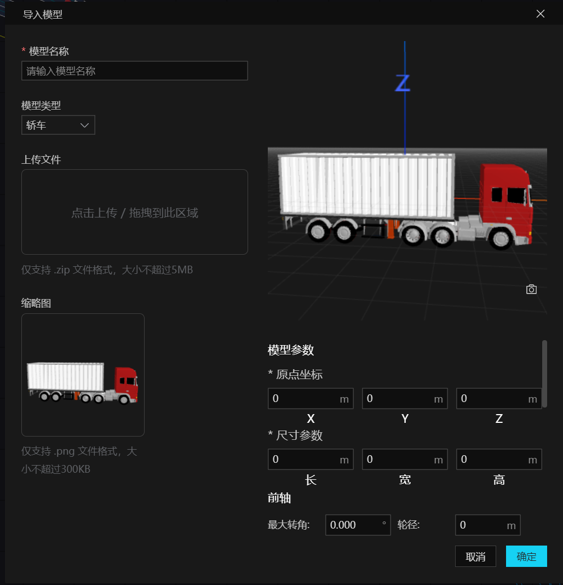</div><br>

待缩略图上传成功后, 鼠标悬浮至``缩略图``处, 可进行模型的修改、删除操作.模型参数的修改参见下图所示.
- 场景编辑器的属性配置同当前各类型模型；
- 地图编辑器支持位置、尺寸编辑.

<div align="center">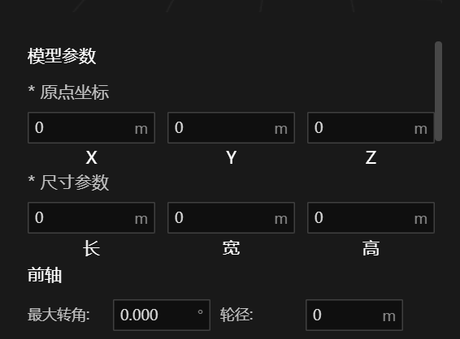</div><br>

<div align="center">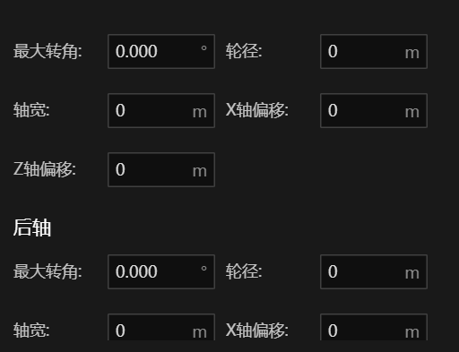</div><br>

<div align="center">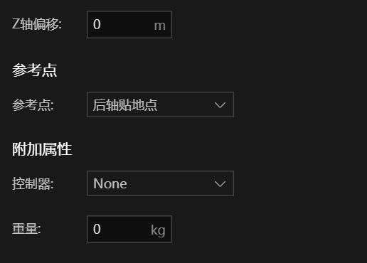</div><br>

编辑完成并点击确定后, 会出现如下提示弹窗, 需要进一步确认.

<div align="center"></div><br>


#### 2.2.10.2 三维模型导入要求

**为保证导入模型的可用性，作如下必要要求:**
- **模型名称**: 支持中文、英文字母、数字, 长度限制20个字符, 中文算两个字符, 其余算一个, 具体要求如下：<br>
  1. 中文版：模型名称填入中文, 作为中文名记入；<br>
  2. 英文版：model name填入英文, 作为英文名记入；<br>
  3. 变量名：根据模型类型自动生成.<br>
- **模型类型**: 根据不同模型类型, 下拉框中包含不同选择:
  1. 自动驾驶主车：包括轿车（默认）、货车、卡车、拖车、半拖车、公交车;<br>
  2. 交通车辆：包括轿车（默认）、货车、卡车、拖车、半拖车、公交车、火车、有轨电车；<br>
  3. 摩托车：摩托车；<br>
  4. 非机动车：自行车；<br>
  5. 行人：行人；<br>
  6. 动物：动物；<br>
  7. 静态障碍物：障碍物（默认）、灯杆、树木、植被、路障、栏杆、建筑、路灯、龙门架、路标.<br>
- **模型格式**：
  - 上传文件：仅支持上传.zip 格式, 其中.zip不超过5Mb，压缩包内包含的 fbx 模型文件大小不超过2Mb；
  - 缩略图：支持上传.png格式, 大小不超过 300Kb, 非必填, 当未上传时, 自动生成模型缩略图；
````{warning}
注意事项：
上传的文件需包含FBX模型、贴图, 支持校验, 当缺少文件或格式错误时, 会出现错误提示；
````
- **模型建模工具**
  - 目前支持 3dsmax2020 及以下版本输出的文件
- **模型整理**
  - 导入的模型文件需以米为单位
  - 车辆正方向朝向x轴
  - 模型导出前需进行重置变换
  - 模型导入前需清除贴图路径
  - 坐标轴居模型中央
- **模型规范**
  - 无多余贴图通道, 无孤立点

**同时，为保证模型导入后系统的工作效率及显示效果，对模型的建议要求如下：**
- **导入模型建议制作要求概述**
  - TAD Sim使用 Unreal Engine 作为核心渲染模块, 导入的模型需符合基本游戏建模要求.模型需结构准确, 写实风格, PBR 材质真实, 材质类型使用标准standard, 精简材质球数量.通过布线和贴图绘制表现丰富的结构细节.材质数量按规范尽量压缩, 面数保持节制, 保障模型在渲染时高效运行.
  - 模型设置单面显示, 即背面消隐.
  - 模型不应出现漏缝、露面、穿帮面、不规整面、重叠面、无用的点线面, 清除通道信息、自定义通道信息、游离点以及位图光学路径.
  - 任意三角形、四边形或多边形的长宽比小于5倍, 任意点引出的线不超过7条.

- **以车辆模型为例，建议制作规范**
  - 车辆长、宽、高尺寸准确, 与真实数据一致, 模型外轮廓无几何边缘感.
  - 模型朝向以行驶方向为 X 轴, 正方向车辆上方向为 Z 轴正方向.
  - 模型材质真实, 贴图各个通道绘制准确, 无溶色, 无遗漏的通道.

- **模型贴图建议制作规范**
  - 推荐以标准 PBR 流程制作, 建议使用 Substance Painter 进行制作.
  - 贴图尺寸采用 2N 次幂原则, 即贴图的宽或高的数值都符合2的N次幂数, 多拼一贴图或子贴图符合 2N 次幂原则.
  - 贴图按中距离原则控制像素密度, 贴图的清晰度尽量修整锐度, 保持高清, 在放大200%的时候贴图与原尺寸的差别肉眼分辨几乎相同, 而放大800%时有明显的马赛克化而无模糊.
  - 贴图最大尺寸``2048*2048``, png 格式.


## 2.3. 菜单栏

### 2.3.1. 场景库管理页面

在菜单栏中 ``数据管理`` 下拉框中, 点击 ``场景库管理``, 或单击工具栏``打开``按键, 或在菜单栏中 ``文件`` 下拉框中点击 ``打开``, 出现 ``场景管理`` 弹窗.

<div align="center">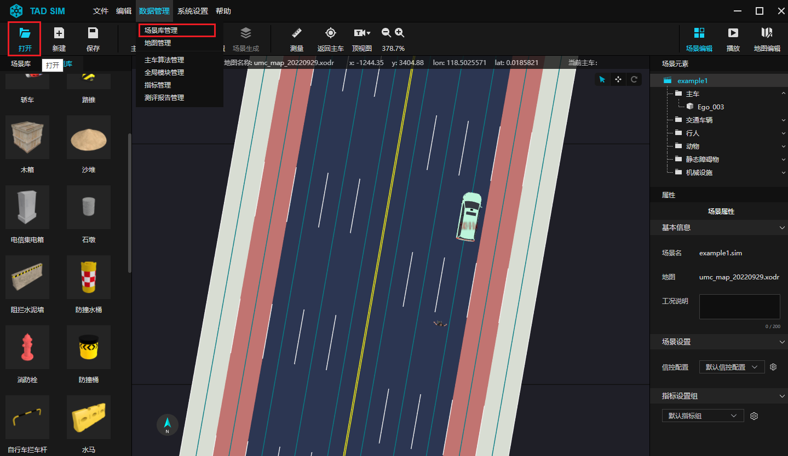</div><br>

在 ``我的场景`` 模块中, 可以通过点击某一特定场景右侧 ``打开`` 按钮, 在场景编辑页面打开该场景.

<div align="center">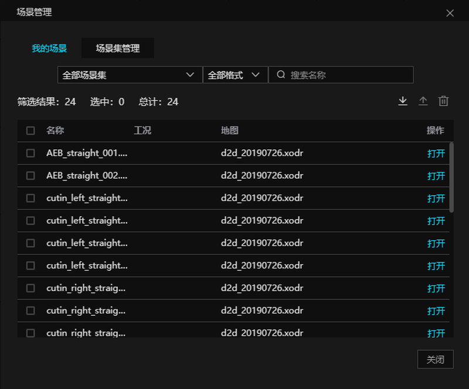</div><br>

场景列表可通过关键词搜索、场景集或场景格式的筛选来快速定位到目标场景.

勾选目标场景后点击导出或删除图标, 支持对场景的批量导出和删除. 单击导入图标, 将外部场景导入到场景库中, 目前不支持含中文字符的路径.

在 ``场景集管理`` 模块中, 用户可以创建、删除及复制场景集, 设置场景集名称, 添加及删除子场景, 点击 ``保存`` 后保存场景集.

在更新版本中, 支持场景集管理、场景管理的 logsim 和 worldsim 场景区分.

<div align="center">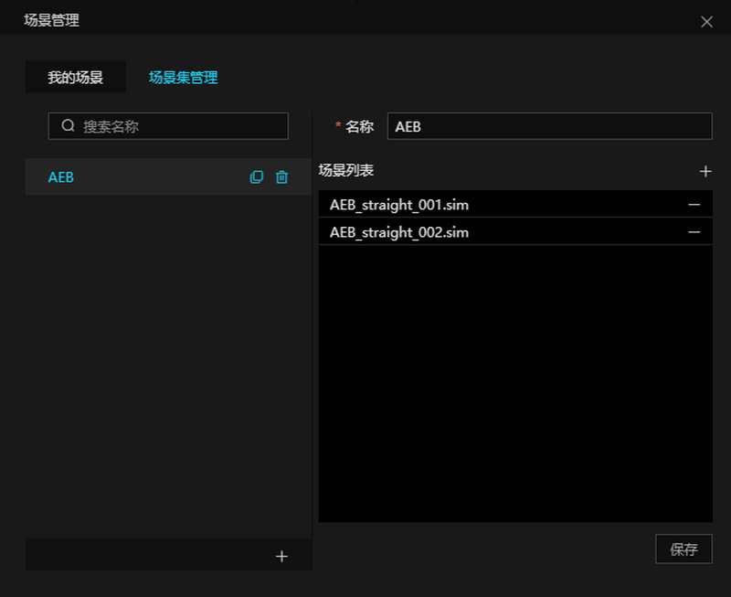</div><br>


### 2.3.2. 地图管理页面

在菜单栏中 ``数据管理`` 下拉框中, 点击 ``地图管理``, 进入 ``地图管理`` 弹窗.

<div align="center">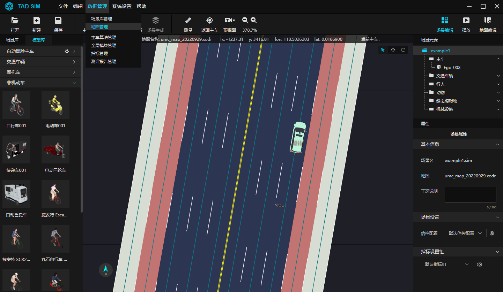</div><br>

勾选目标地图, 支持批量导出.单击导入图标, 将外部地图导入至地图库中存储, 目前不支持含中文字符的路径. 可以通过名称搜索, 快速筛选目标地图.

<div align="center">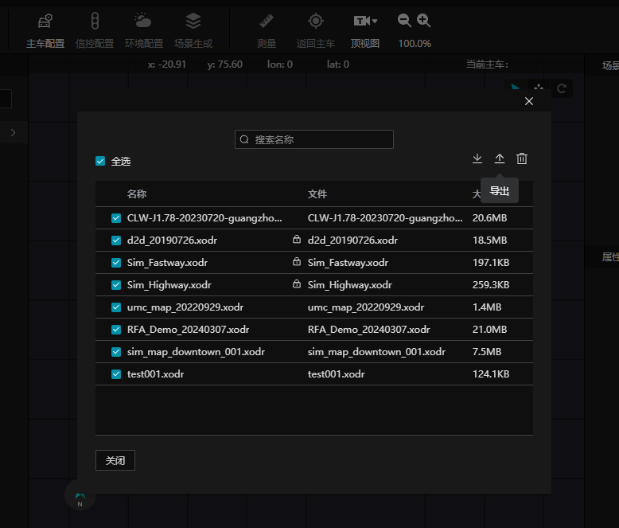</div><br>


### 2.3.3. 主车算法管理页面

主车算法管理可针对主车的算法模块进行统一管理.

在菜单栏中 ``数据管理`` 下拉框中, 点击 ``主车算法管理``, 进入 ``主车算法管理`` 弹窗.

<div align="center">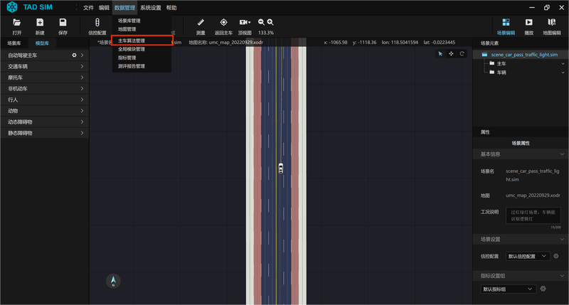</div><br>

在 ``模组配置`` 模块中, 用户可通过模组配置的方式, 设置并保存多个模块的固定组合方式.

所勾选中的模组为当前应用的模组配置, 在需要切换算法运行时, 用户只需切换对应的模组.

<div align="center">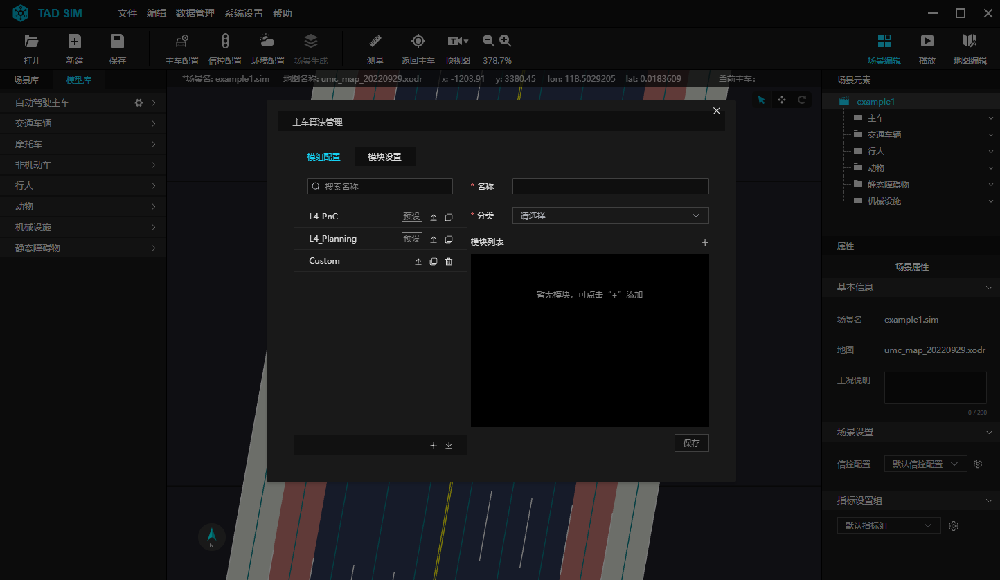</div><br>


#### 2.3.3.1. 模组配置

- **名称栏:**
  - 当前模组配置的自定义名称.
- **上下箭头图标:**
  - 上移、下移, 调整模块的运行先后顺序.
- **加号图标:**
  - 支持新增模组. 支持在当前模组配置中添加模块.
- **减号图标:**
  - 将选中的模块移出当前模组配置(不是将模块删除).
- **复制图标:**
  - 复制当前模组.
- **导入图标:**
  - 导入模组.
- **导出图标:**
  - 导出当前选中的模组.

**关于算法执行顺序对仿真结果的影响说明如下所示:**
- 算法分为同步、异步以及优先级调度方式, 同步、异步和优先级的调度方式在实现方式上都是基于有优先级的事件队列, 当前系统对每个模块定义了 2 个有关调度的属性:
  - execution period: 当前模块计划的执行周期, 即每隔多久时间会被调用执行一次.
  - response time: 当前模块每次执行时预期的执行耗时.
- 云平台中, 任务执行过程默认为 ``同步调度模式``.
- 当同步调度模式时, 算法按照执行顺序的配置依次执行.如果算法顺序符合逻辑流程, 那么每一个算法执行后的输出, 都将在当前周期内, 给到下一个算法作为输入. 如果算法顺序打乱, 那么算法的输入可能来源于上一个周期的其他算法的输出.由于仿真系统是闭环的,即算法之间的输入输出是相互依赖的, 所以实际执行过程中, 差一帧对于仿真结果并没有影响.
- 在同步调度模式中, 目前腾讯内置的算法对于执行顺序没有要求.如果外部算法或者新建算法本身对于输入输出有特别的要求, 那么可以通过调整算法顺序, 适配算法逻辑. 否则, 算法的顺序对于仿真的结果没有影响.一般建议将评测算法放在最下方, 如果不配置, 并不产生影响.
- 当异步调度模式时, 算法同时执行, 在当前步长内, 顺序为 n的算法, 无法获取顺序为 1 的算法的输出, 所以在异步模式下, 算法的顺序对仿真结果并没有依赖.
- 当优先级调度模式时, 即在异步调度的基础上, 部分算法对于优先级有要求.用户可以对这部分算法进行移动, 以配置优先级.


#### 2.3.3.2. 模块设置

在 ``模块设置`` 模块中, 用户可对某一特定模块进行具体设置.

<div align="center">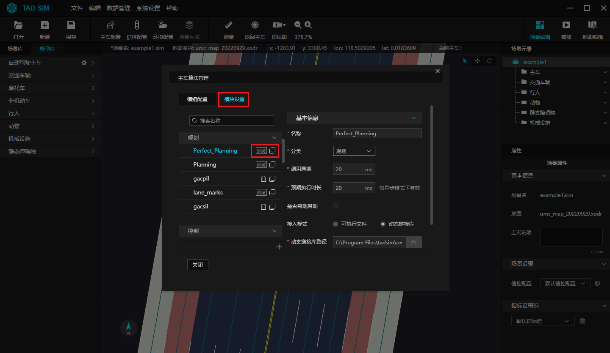</div><br>

- **预设图标:**
  - 系统自带 ``预设`` 图标, 用户自定义创建模块无此图标.
- **复制图标:**
  - 克隆当前模块, 保存克隆即完成新建模块.
- **加号图标:**
  - 可新增配置本地算法, 需在右侧基本信息处完善基本信息.
- **基本信息栏:**
  - 模块基本信息配置.
- **高级配置栏:**
  - 特殊信息配置.
- **保存按钮:**
  - 保存当前参数配置修改.


**系统预置 Traffic、Planning 等多个模块, 详细信息如下:**
| 模块名称            | 说明                                                                                                                                                                                                                                                                                                                                                                                                                                                                                                      |
|---------------------|---------------------------------------------------------------------------------------------------------------------------------------------------------------------------------------------------------------------------------------------------------------------------------------------------------------------------------------------------------------------------------------------------------------------------------------------------------------------------------------------------------|
| Traffic             | 交通流模块为自动驾驶系统提供一个高保真、 可重复、 可度量、可对比、 可评价、 可预测、 可增强的虚拟仿真交通流验证环境.                                                                                                                                                                                                                                                                                                                                                                                            |
| Sensor_Truth        | 真值传感器模块, 输出真值                                                                                                                                                                                                                                                                                                                                                                                                                                                                                  |
| Traffic_Filter      | 依赖真值传感器的交通流数据输出                                                                                                                                                                                                                                                                                                                                                                                                                                                                            |
| Planning            | 路径规划模块                                                                                                                                                                                                                                                                                                                                                                                                                                                                                              |
| Perfect_Control     | 完美控制, 忽略车辆物理条件等的限制, 输入是planning给出的轨迹trajectory, 输出直接是车辆当前一帧的定位location和运动信息, 包含位置、速度、朝向、横摆角速度、加速度等, 满足Planning闭环仿真测试的需求.                                                                                                                                                                                                                                                                                                           |
| Controller          | 控制模块, 需要和车辆动力学模块 vehicle_dynamics 一起运行, <br> controller 的输入是 planning 给出的轨迹 trajectory, <br> 输出是给到车辆动力学模块的控制信号(刹车、油门、方向盘等), <br> 车辆动力学模块根据车和周围环境的物理性质计算出车辆下一帧的定位 location                                                                                                                                                                                                                                              |
| Vehicle_dynamics    | 车辆动力学模块, 接收控制模块的控制命令, 输出车辆的底盘、车身、动力等系统信息, 以及车辆的定位信息.详情可见 [动力学仿真](./305.动力学仿真.md)页面                                                                                                                                                                                                                                                                                                                                                             |
| Grading             | 评测模块, 主要用于辅助/自动驾驶车辆的仿真测试评测. 模块从TADSim仿真系统中获取特定的消息, 如主车定位消息、交通参与者感知消息、高精度地图、红绿灯状态、规划轨迹等, 通过对客户选择的特定指标进行监测及评测, 并给出对应的详细评测数据. 支持测评报告自动生成. 详情可见 [场景评测](./309.场景评测.md#9-场景评测) 页面.                                                                                                                                                                                             |
| Protobuf_Log_Player | 回放仿真数据模块, 可以回放指定的topic的仿真数据, 从而实现多次重复实验. 详情可见 [Protobuf_Log_Player模块](310.仿真数据的记录和回放.md#1021protobuf_log_player-模块)页面                                                                                                                                                                                                                                                                                                                                   |
| imu_gps             | IMU仿真数据的topic是IMU_SIM,对应的proto是osi_imu.  proto.GPS仿真数据的topic是GPS_SIM, 对应的proto是osi_gps.proto.                                                                                                                                                                                                                                                                                                                                                                                         |
| Protobuf_Logger     | 仿真数据录制模块, 可以录制tadsim指定topic的仿真数据. 配合回放模块, 可实现多次重复实验. 详情可见 [Protobuf_Logger模块](310.仿真数据的记录和回放.md#1012-protobuf_logger-模块) 页面                                                                                                                                                                                                                                                                                                                         |
| Perfect_Planning    | 路径规划模块, 支持大规模交通流场景、虚拟城市多主车交互场景, 支持虚拟城市交通元素交互.                                                                                                                                                                                                                                                                                                                                                                                                                      |
| Display             | 三维渲染播放模块, 接收主车与交通车的轨迹数据, 在三维场景下动态渲染车辆、障碍物、地图放置物等物体. 并支持激光雷达、深度相机等多种传感器仿真渲染.                                                                                                                                                                                                                                                                                                                                                              |
| V2X                 | 根据前端传感器配置的OUB和RSU参数输出主车OUB接受到的交通消息, 输出消息topic-V2XASN1, 输出pb消息文件v2x_asn1_2020.proto. 输出消息包含BSM、RSM、RSI、SPAT和MAP消息, 模拟RSU发送频率、传输距离、数据延迟、数据丢包和网络传输速率等因子对V2X通讯的影响, 需要在前端传感器参数窗口进行配置才能启动V2X功能.                                                                                                                                                                                                             |
| Radar               | 毫米波雷达传感器模块块                                                                                                                                                                                                                                                                                                                                                                                                                                                                                    |
| Lane_Marks          | 主车附近车道线信息输出模块, 输出消息topic-LANE_MARKS, 输出pb消息文件laneMarks.protoc, 依赖pb文件basic.protoc、location.protoc和traffic.protco. 根据主车位置不断变化, 输出主车左右多车道线(1-n, 左右输出车道数由前端参数配置)数据, 每个车道线按照以主车为参考点向前和向后离散坐标形式输出; 坐标以车身坐标系为参考, 车头向前为正X, 车身向左为正Y, 车身垂直向上为正Z. 同时输出主车在某一个车道累计滞留时间、主车距离下一个路口距离、主车距离车道中心线距离、主车距离左侧车道线距离、主车距离右侧车道线距离等信息. |


自动驾驶算法测试的模块组合配置示例如下:
| 系统模块         | 感知算法 <br> 单元测试          | 定位算法 <br> 单元测试 | 决策规划算法 <br> 单元测试 | 控制算法 <br> 单元测试 | 全算法 <br> 闭环测试                           | 车辆在环 <br> 测试 VIL | 模型在环 <br> 测试 MIL | 硬件在环 <br> 测试 | 真实场景 <br> 测试 |
|------------------|---------------------------------|------------------------|----------------------------|------------------------|------------------------------------------------|------------------------|------------------------|--------------------|--------------------|
| Perception       | √                               |                        |                            |                        | √                                              |                        |                        |                    |                    |
| Location         |                                 | √                      |                            |                        | √                                              |                        |                        |                    |                    |
| Planning         |                                 | √                      | √                          |                        | √                                              |                        |                        |                    |                    |
| Controller       |                                 |                        |                            | √                      | √                                              |                        |                        |                    |                    |
| Traffic          | √                               |                        | √                          |                        |                                                | √                      |                        |                    |                    |
| Display          | √                               |                        |                            |                        | √                                              | √                      |                        |                    |                    |
| Perfect_Control  |                                 | √                      | √                          |                        |                                                |                        |                        |                    |                    |
| Sensor_Truth     | √                               |                        |                            |                        | √                                              |                        |                        |                    |                    |
| vehicle_dynamics |                                 |                        |                            | √                      | √                                              |                        |                        |                    |                    |
| Grading          |                                 |                        |                            | √                      | √                                              | √                      |                        |                    |                    |
| VIL              |                                 |                        |                            |                        |                                                | √                      |                        |                    |                    |
| MIL              |                                 |                        |                            |                        |                                                |                        |                        |                    |                    |
| 传感器配置       | Camera <br> Lidar <br> Radar... | IMU <br> GPS           |                            |                        | Camera <br> Lidar <br> Radar <br> IMU <br> GPS |                        |                        |                    |                    |


**各模块可配置参数项如下:**
- **名称:**
  - 模块名称, 每个模块名称应该保持唯一, 不能重复.
- **分类:**
  - 定义当前模块的分类.
- **调用周期:**
  - 模块 Step 方法被调用的周期, 单位 ms.
- **预期执行时长:**
  - 模块 Step 方法预期的执行时长, 不应大于该模块的调用周期.
  - (仿真系统为了保证场景的可复现性, 无论模块每次实际运行时长为多少, 对于该模块发出的消息而言, 保证在模块预期执行时长结束之前不会被其他模块所见, 而在预期结束时长结束之后会立即被其他模块可见)
- **是否自动启动:**
  - 该模块程序是否在加载场景时由仿真系统自动启动, 如果勾选, 下面的启动相关参数必须填写.
- **接入模式:**
  - 选择该模块是动态库或者可执行文件.
- **可执行文件路径:**
  - 对应 ``可执行文件`` 接入模式.
  - 填写可执行文件的在用户电脑中的绝对路径 (最好使用绝对路径, 尽量避免使用相对路径).
  - 以 py 脚本为例, 该栏填写用户电脑上 python 解释器的绝对路径,
  - 例如 ``C:\Users\AppData\Local\Programs\Python\Python39\python.exe``.
- **可执行文件参数:**
  - 对应 ``可执行文件`` 接入模式, 所填写字段与所执行的算法脚本一致.
  - 以 py 脚本为例, Python 执行命令一般使用 ``python xxx.py --key value``,
  - 那么该栏填写 python 的命令行参数, ``["xxx.py", "--key", "value"]``, 如下图所示:

<div align="center">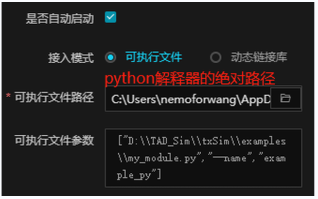</div><br>

  - 针对Traffic模块用户可选择是否过滤掉特定范围外车辆相关信息, 可以通过 ``可执行文件参数`` 栏进行设置. 系统默认不对交通车辆进行过滤, 设置情况如下:
  ```ini
  [
    "--app_name", "Traffic_clone",
    "--ip_addr_port", "",
    "--EnableTrafficVisionFilter=false",
    "--TrafficVisionFilterAltitudeDiff=100",
    "--TrafficVisionFilterRadius=1000.0"
  ]

  # 用户可开启对交通车辆的过滤并自定义过滤参数,
  # "TrafficVisionFilterRadius=100.0", 表示仅过滤出主车方圆100.0米内的车辆.
  # "TrafficVisionFilterAltitudeDiff=2.0", 表示仅过滤出高度差在2米内的车辆.

  # 设置情况举例如下
  [
    "--app_name", "Traffic_clone",
    "--ip_addr_port", "",
    "--EnableTrafficVisionFilter=true",
    "--TrafficVisionFilterAltitudeDiff=100",
    "--TrafficVisionFilterRadius=2.0"
  ]
  ```

- **动态链接库路径:**
  - 对应 ``动态链接库`` 接入模式.
- **依赖路径**
  - 自动启动模块时模块程序的依赖库搜索路径.(系统路径默认包含, 格式为json字符串)
  - 仅linux版本支持, 如下图所示:
<div align="center">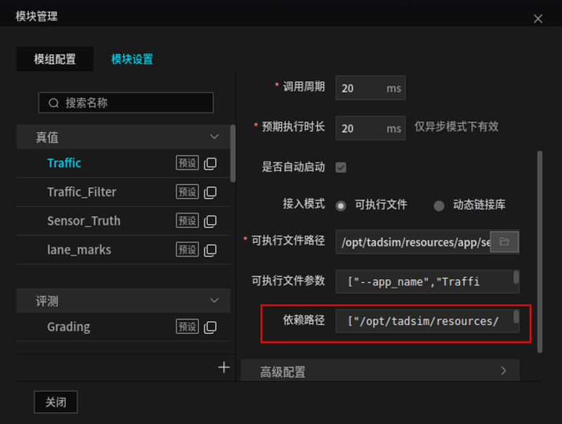</div><br>

- **服务器接入地址:**
  - 如果填写, 模块进程则会监听在指定地址上, 默认不填会由系统自动指定可用端口.一般用于模块开发人员调试.

- **初始化参数:**
  - 由模块自己定义.


具体信息如下表:

| 模块名称            | 模块说明                                                                                                                                                                                                                                         | 初始化参数说明                                                                                                                                                                                                                                                                                                                                                                                                                                                                                                                                                                                                                                                                                                                                                                                                                                                                                                                                                                                                                                                                                                                                                                                                                                                                                                                                                                                          |
|---------------------|----------------------------------------------------------------------------------------------------------------------------------------------------------------------------------------------------------------------------------------------|---------------------------------------------------------------------------------------------------------------------------------------------------------------------------------------------------------------------------------------------------------------------------------------------------------------------------------------------------------------------------------------------------------------------------------------------------------------------------------------------------------------------------------------------------------------------------------------------------------------------------------------------------------------------------------------------------------------------------------------------------------------------------------------------------------------------------------------------------------------------------------------------------------------------------------------------------------------------------------------------------------------------------------------------------------------------------------------------------------------------------------------------------------------------------------------------------------------------------------------------------------------------------------------------------------------------------------------------------------------------------------------------------------|
| Sensor_Truth        | 真值传感器模块,输出真值                                                                                                                                                                                                                          | freespace_limitZ 参数:用于设置真值传感器输出的消息<br> 过滤情况,仅过滤出车辆高度差为特定数值(米)<br> 范围内的车辆信息.如设置 ``freespace_limitZ=2.0``, <br> 用于设置真值传感器仅输出<br> 车辆高度差为2米内的车辆信息.<br> - CameraTruth=ON: 开启图像真值子模块 <br> -LidarTruth=ON: 开启lidar真值子模块 <br> - UltrasonicTruth=ON: 开启超声波真值子模块 <br> -SensorTruth=ON: 开启目标真值子模块 <br> - DebugDir=XXX/XXX: 指定调试输出目录 <br> - device=0, 默认all: 指定算法id, 只有绑定到该id的<br> 传感器才被读取, 可以指定all, 表示所有传感器 <br> -CT_MaxDistance=100.0: 相机目标最大距离 <br> -CT_Completeness=0.5: 相机目标完整度, 被遮挡的<br> 面积比例不能小于该值 <br> - CT_MinArea=20: 相机目标的像素面积 <br> - LT_Completeness=0.5: Lidar目标完整度, 被遮挡的<br> 激光数比例不能小于该值 <br> - LT_MinHitNum=5: 最小激光个数, 小于它的目标被丢弃                                                                                                                                                                                                                                                                                                                                                                                                                                                                                                                                           |
| Lane_Marks          | 主车附近车道线信息输出模块                                                                                                                                                                                                                       | - forwardLength参数:车道线向前取点最大距离(m)<br> (初始参数为80) <br> - laneDetectingCount 参数:左右输出车道线数<br> (比如2,左右同时输出两条车道线信息)(初始参数为2) <br> - sampleInterval参数:车道线取点间距(m) (初始参数为3)                                                                                                                                                                                                                                                                                                                                                                                                                                                                                                                                                                                                                                                                                                                                                                                                                                                                                                                                                                                                                                                                                                                                                                          |
| Traffic_Filter      | 依赖真值传感器的交通流数据输出                                                                                                                                                                                                                   | - FilterSensorIDs 参数:表示需要该模块生效的真值<br> 传感器的id,空格隔开,不写就是全部使用 <br> - FilterLimitZ 参数:表示高度过滤值,0表示不过滤                                                                                                                                                                                                                                                                                                                                                                                                                                                                                                                                                                                                                                                                                                                                                                                                                                                                                                                                                                                                                                                                                                                                                                                                                                                            |
| V2X_Traffic_Filter  | 根据前端传感器配置的 OUB 和 RSU 参数输出主车 OUB 接受到的交通消息                                                                                                                                                                                | -                                                                                                                                                                                                                                                                                                                                                                                                                                                                                                                                                                                                                                                                                                                                                                                                                                                                                                                                                                                                                                                                                                                                                                                                                                                                                                                                                                                                       |
| Radar               | Radar传感器模块                                                                                                                                                                                                                                  | -IgnoreZ=ON: 是否忽略z值, 解决某些情况下<br> location和traffic的z值不一致的问题. <br> - DebugDir=XXX/XXX: 指定调试输出目录device=0: <br> 指定算法id, 只有绑定到该id的传感器才被读取, <br> 可以指定all, 表示所有传感器.                                                                                                                                                                                                                                                                                                                                                                                                                                                                                                                                                                                                                                                                                                                                                                                                                                                                                                                                                                                                                                                                                                                                                                                  |
| Planning            | 路径规划模块                                                                                                                                                                                                                                     | -                                                                                                                                                                                                                                                                                                                                                                                                                                                                                                                                                                                                                                                                                                                                                                                                                                                                                                                                                                                                                                                                                                                                                                                                                                                                                                                                                                                                       |
| Perfect_Control     | 完美控制,输入是 planning 给出的轨迹 trajectory ,输出直接是车辆下一帧的定位 location ,不管车辆物理条件的限制                                                                                                                                      | - Option 参数:可选参数包括global/local),global模式输出<br> 定位消息为 ENU 坐标系,local 模式除了输出 ENU 坐标系下<br> 的定位,还输出为局部坐标系(初始参数为 global ) <br> - StepTime 参数:模块仿真步长(初始参数为20) <br> - useMapZValue 参数:输出定位信息时是否包含高程<br> (不需要初始化, 程序内默认值0, 一般无须关注), <br> 可选参数为0/1, 0表示不含高程, 1表示包含高程 <br> - enableFakeTrailer 参数:可选参数为0/1, 0表示输出的<br> 定位信息不包含挂车, 1表示输出<br> 的定位信息包含挂车(初始参数为0) <br> - _log_level: 日志等级(不需要初始化, 程序内默认值0, <br> 一般无须关注), 可选参数0/1/2/3, 等级越高, <br> 日志越多越详细, 但性能可能有所下降                                                                                                                                                                                                                                                                                                                                                                                                                                                                                                                                                                                                                                                                                                                                                 |
| Controller          | 控制模块, 需要和车辆动力学模块 vehicle_dyna <br> mics一起运行,controller 的输入是 planning 给出的轨迹 trajectory, 输出是给到车辆动力学模块的控制信号(刹车、油门、方向盘等),车辆动力学模块根据车和周围环境的物理性质计算出车辆下一帧的定位 location | configFile 参数: <br> - 控制模块参数文件路径 <br> - 初始参数为 C:\Program Files\tadsim\resources<br> \app\service\controller\ControlConfig_gw.cfg                                                                                                                                                                                                                                                                                                                                                                                                                                                                                                                                                                                                                                                                                                                                                                                                                                                                                                                                                                                                                                                                                                                                                                                                                                                       |
| Traffic             | 交通流模块. 为自动驾驶系统提供一个高保真、 可重复、 可度量、可对比、 可评价、 可预测、 可增强的虚拟仿真交通流验证环境.                                                                                                                                 | AI交通流随机种子: 勾选后开放交通流生成的随机性,<br> 含AI交通流的同一个场景多次运行可能产生不同的交通流<br> 行为结果, 默认情况下不勾选.                                                                                                                                                                                                                                                                                                                                                                                                                                                                                                                                                                                                                                                                                                                                                                                                                                                                                                                                                                                                                                                                                                                                                                                                                                                                  |
| Grading             | 评测模块,详情可见[场景评测](./311.场景评测.md)章节                                                                                                                                                                                               | - 1、channels: 表示所需订阅Topic和protobuf消息<br>(初始参数为 CONTROL\|\|LOCATION<br>\|\|TRAJECTORY\|\|VEHICLE_STATE\|\|<br>TRAFFIC\|\|GRADING\|\|ENVIRONMENTAL). <br> -2、 post-script: 将 pblog 中的数据导出<br>为 xlsx 和 json 格式的后处理脚本(初始化参数, windows 为<br>C:\Users\%USER%\AppData\Roaming\tadsim\data\service_data\..<br>\..\sys\service_data\script\post_process, <br>linux为/home/%USER%/.config/tadsim/data<br>/service_data/../../sys/service_data/script<br> /post_process)<br> - 3、log-folder: 仿真数据存放的路径(初始化参数, windows是<br>C:\Users\%USER%\AppData\Roaming\tadsim\data<br>\service_data\sim_data\pblog, linux 是/home/%USER%<br>/.config/tadsim/data/service_data/sim_data/pblog <br> - 4、enableGrading: 是否开启评测(初始化为1)<br> - 5、enablePBLogger: 是否录制数据(单机版初始化为1,<br> 云端初始化为0), 可自动实现仿真数据录制 <br> - 6、DataDir: 云端文件路径(仅云端初始化为<br> ``@{SimRoot}``, 单机版无须填写和关注) <br> - 7、sync: stop时是否等待录制线程结束, 1为等待,<br>  0为不等直接stop(仅云端初始化为1, 程序内默认值0,<br>  一般无须关注)<br> - 8、stepTime: 模块仿真步长<br> (不需要初始化, 调试用, 一般无须关注)<br> - 9、simcity: 是否开启虚拟城市模式, 若开启则不写<br>评测报告 (仅云端关注并按情况初始化, 单机版无须填写和关注)<br> - 10、_log_level: 日志等级(初始化为0), <br>可选参数0/1/2/3, 等级越高, 日志越多越详细, <br>但性能可能有所下降.) |
| Protobuf_Log_Player | 仿真数据回放模块, 可以回放指定的topic的仿真数据, 从而实现多次重复实验.                                                                                                                                                                           | - 1、channels: 要回放的仿真 topic 数据(初始参数<br>为CONTROL\|\|LOCATION\|\|TRAJECTORY<br> \|\|VEHICLE_STATE\|\|TRAFFIC).<br> - 2、log-file: 要回放的仿真 pblog 数据文件路径<br>(初始参数, windows 是C:\Users\%USER%\AppData<br>\Roaming\tadsim\data\service_data\sim_data<br>\pblog\some_xxx.pblog, linux是/home/%USER%<br>/.config/tadsim/data/service_data/sim_data<br>/pblog/some_xxx.pblog)                                                                                                                                                                                                                                                                                                                                                                                                                                                                                                                                                                                                                                                                                                                                                                                                                                                                                                                                                                                                          |
| Vehicle_dynamics    | 车辆动力学模块, 接收控制模块的控制命令, 输出车辆的底盘, 车身, 动力等系统信息, 以及车辆的定位信息                                                                                                                                                 | - LicFile: 车辆动力学 license 文件路径(初始参数为<br>C:\Program Files\tadsim\resources\app\service<br>\vehicle_dynamics\EchoSim_TENCENT_LX.lic). <br> - ParaFile: 车辆动力学参数文件路径(初始参数为<br>C:\Program Files\tadsim\resources\app\service<br> \vehicle_dynamics\Run_Tencent_20191028<br> _EngineMap_GearShift.PAR). <br> - enableTerrain: 初始参数为1, 可选参数为0/1, <br> 0表示不使用高程信息, 1表示使用高程信息. <br> - stepTime: 模块仿真步长(初始参数为 10)                                                                                                                                                                                                                                                                                                                                                                                                                                                                                                                                                                                                                                                                                                                                                                                                                                                                                                                              |
| MIL                 | 模型在环, 用于 simulink 和 tadsim 联合仿真, 详情可见[模型在环](./305.模型在环%20.md)章节                                                                                                                                                         | - pub-topics: (初始参数为CONTORL), simulink 往<br>  tadsim 发送的仿真 topic. <br> -sub-topic: (初始设为 LOCATION\|\|VEHICLE_STATE<br> \|\|TXSIM_SENSOR_DATA\|\|LOCAL_LOCATION\|\|<br> TXSIM_DETECTED_LINES), tadsim 发送给 simulink<br> 的仿真topic <br> - xil-cfg: simulink 链接的 ip 和端口定义文件<br> (初始参数为C:\Program Files\tadsim\resources<br> \app\service\mil\mil_cfg.json)                                                                                                                                                                                                                                                                                                                                                                                                                                                                                                                                                                                                                                                                                                                                                                                                                                                                                                                                                                                                               |
| imu_gps             | IMU 仿真数据的 topic 是IMU_SIM, 对应的 proto 是 osi_imu.proto.GPS 仿真数据的 topic 是 GPS_SIM, 对应的 proto 是 osi_gps.proto.                                                                                                                    | - mode: 可选, 可指定 imu 或 gps, 分别表示<br> imu only, gps only                                                                                                                                                                                                                                                                                                                                                                                                                                                                                                                                                                                                                                                                                                                                                                                                                                                                                                                                                                                                                                                                                                                                                                                                                                                                                                                                        |
| Protobuf_Logger     | 仿真数据录制模块, 可以录制 tadsim 指定 topic 的仿真数据. 配合回放模块, 可实现多次重复实验.                                                                                                                                                       | - 1、channels: 要录制的仿真 topic 数据(初始参数<br> 为CONTROL\|\|LOCATION\|\|TRAJECTORY\|\|<br> VEHICLE_STATE\|\|TRAFFIC) <br> -2、log-folder: 仿真数据存放的路径(初始化参数, <br> windows 是C:\Users\%USER%\AppData<br> \Roaming\tadsim\data\service_data\sim_data\pblog, linux是/home/%USER%/.config/tadsim/data/service_data/sim_data/pblog)<br> -3、sync: stop 时是否等待录制线程结束, 1为等待, 0为<br> 不等直接 stop(不需要初始化, 程序内默认值0, 一般无须关注) <br> -4、post-script: 自定义的数据后处理的工具(windows<br>为 dir、linux 为ls, 即单独运行时不使用工具, 一般<br>无须关注)                                                                                                                                                                                                                                                                                                                                                                                                                                                                                                                                                                                                                                                                                                                                                                                                                 |
| Perfect_Planning    | 路径规划模块, 支持大规模交通流场景、虚拟城市多主车交互场景, 支持虚拟城市交通元素交互                                                                                                                                                              | 1、ego_rnd_seed ( 主车随机种子 ) <br> 2、ego_pubilc_location (是否订阅 Location 消息) <br> 3、dummy_ignore_perception (是否忽略障碍车 ) <br> 4、ego_location_closed_loop (是否启用<br> Location 进行实时轨迹的重新规划) <br> 5、route_end_behavior_force_stop ( 是否到达轨迹<br>终点强制停止默认为false)  <br> 6、looking_distance_factor( 描点距离调节因子, <br>默认为1.0 )  <br> 7、wheel2steer(车轮角与方向盘的转换值, 默认为18.0 ) <br> 8、use_ego_lanechange( 主车是否根据交通流进行变道, <br>默认为true )                                                                                                                                                                                                                                                                                                                                                                                                                                                                                                                                                                                                                                                                                                                                                                                                                                                                                                 |


- **执行超时时间:**
  - 模块执行仿真定义的接口函数时的最大超时时间.
- **单步超时时间:**
  - 模块Step方法的最大超时时间.


### 2.3.4. 全局模块管理页面

全局模块管理用于管理全局算法模块. 在菜单栏中 ``数据管理`` 下拉框中, 点击 ``全局模块管理``, 进入 ``全局模块管理`` 弹窗.

<div align="center">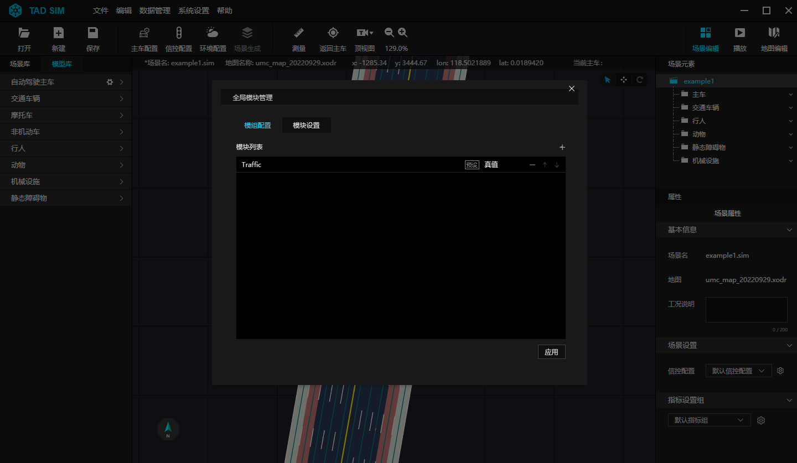</div><br>

在 ``模组配置`` 模块中, 用户可通过模组配置的方式, 应用特定模组在系统中运行.

<div align="center">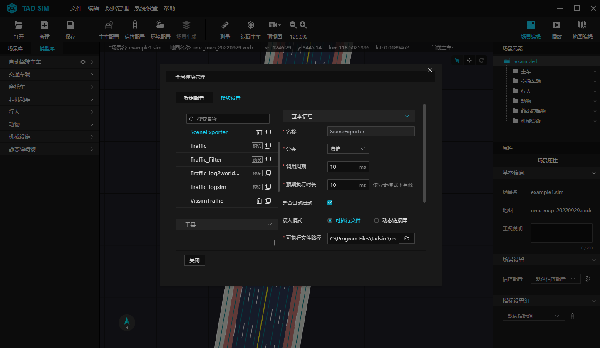</div><br>


在 ``模块设置`` 模块中, 用户可对某一特定模块进行具体设置.
- **预设图标:**
  - 系统自带 ``预设`` 图标, 用户自定义创建模块无此图标.
- **复制图标**:
  - 克隆当前模块, 保存克隆即完成新建模块.
- **加号图标**:
  - 可新增配置本地算法, 需在右侧基本信息处完善基本信息.
- **基本信息栏**:
  - 模块 ``基本信息`` 配置.
- **高级配置**:
  - 特殊信息配置.
- **保存按钮**:
  - 保存当前参数配置修改.

**系统预置 Traffic、Protobuf_Logger 等多个模块, 详细信息如下:**
| 模块名称            | 说明                                                                                                                                                       |
|---------------------|----------------------------------------------------------------------------------------------------------------------------------------------------------|
| Traffic             | 交通流模块. <br> 勾选``AI交通流随机种子``后开放交通流生成的随机性, <br> 含AI交通流的同一个场景多次运行可能产生不同的交通流行为结果, <br> 默认情况下不勾选. |
| SceneExporter       | 问题场景导出, 用于 VISSIM 联合仿真                                                                                                                         |
| Traffic_log2world   | 用于 log2world 仿真                                                                                                                                        |
| Traffic_logsim      | 用于回放型仿真                                                                                                                                             |
| VissimTraffic       | 用于 VISSIM 联合仿真                                                                                                                                       |
| Protobuf_Log_Player | 回放仿真数据模块, 详情可见[Protobuf_Logger模块](310.仿真数据的记录和回放.md#1021protobuf_log_player-模块)章节                                               |
| Display             | 三维渲染播放模块                                                                                                                                           |
| Protobuf_Logger     | 数据记录模块, 详情可见"[Protobuf_Logger模块](310.仿真数据的记录和回放.md#1012-protobuf_logger-模块)"章节                                                 |
| OSI_Adaptor         | OSI标准数据转发模块                                                                                                                                        |


### 2.3.5. 交通流配置页面
````{warning}
当前版本暂不提供该功能，敬请期待.
````


### 2.3.6. 指标管理页面

在菜单栏中 ``数据管理`` 下拉框中, 点击 ``指标管理``, 即可进入 ``指标管理`` 弹窗.

用户在场景编辑器中, 每个场景会使用用户设置的默认指标组. 同时, 每个场景可在场景属性编辑中单独设置指标组.

<div align="center">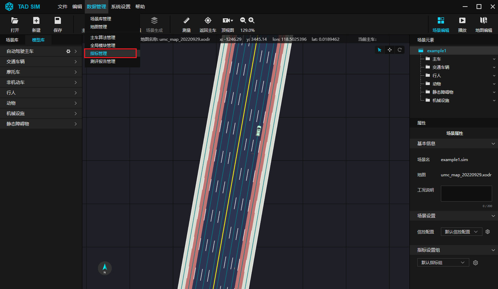</div><br>

在 ``指标组配置`` 模块中, 用户可自定义指标组合方式, 不同的测试场景可应用不同的指标分组.

点击 ``应用为场景默认配置`` 后, 新增的场景将默认使用当前指标组作为评测报告输出的依据.

<div align="center"></div><br>

在 ``指标列表`` 模块中, 用户可查看指标分类、名称、定义、计算方式、阈值的默认设置等信息.
- **通过判定条件:**
  - 指标是否通过的默认判定条件.
- **结束判定**:
  - 指标是否作为场景结束的判定条件.

<div align="center">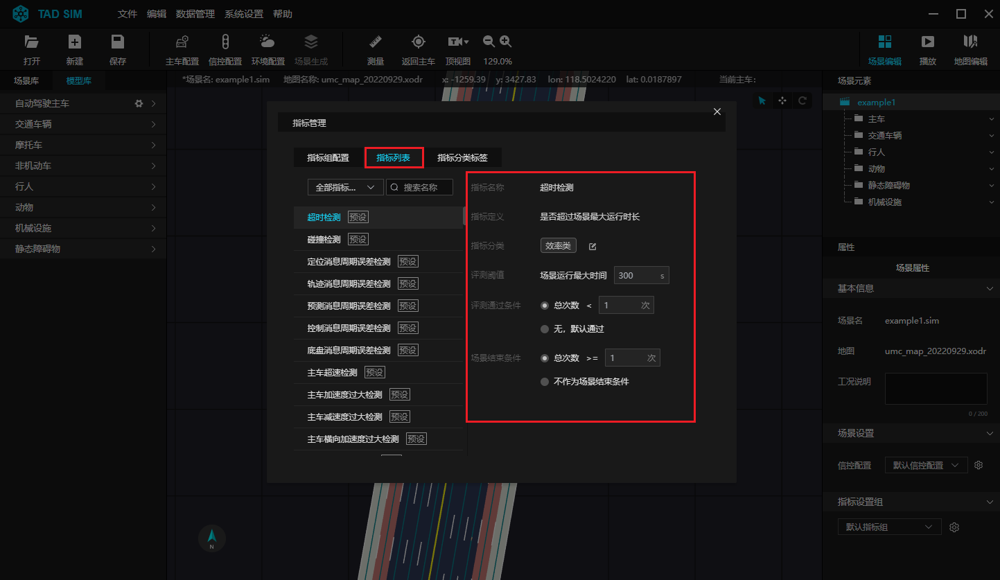</div><br>


用户可通过指标分类筛选以及关键字搜索的方式查询指标,且可对指标分类进行编辑.

<div align="center">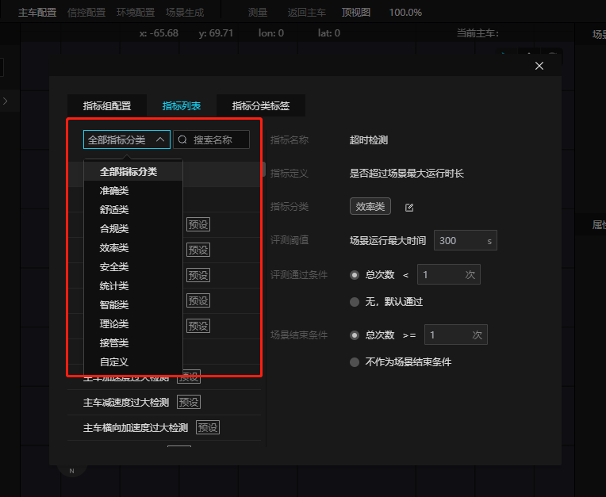</div><br>

用户可对指标分类标签进行新建、编辑和删除

<div align="center">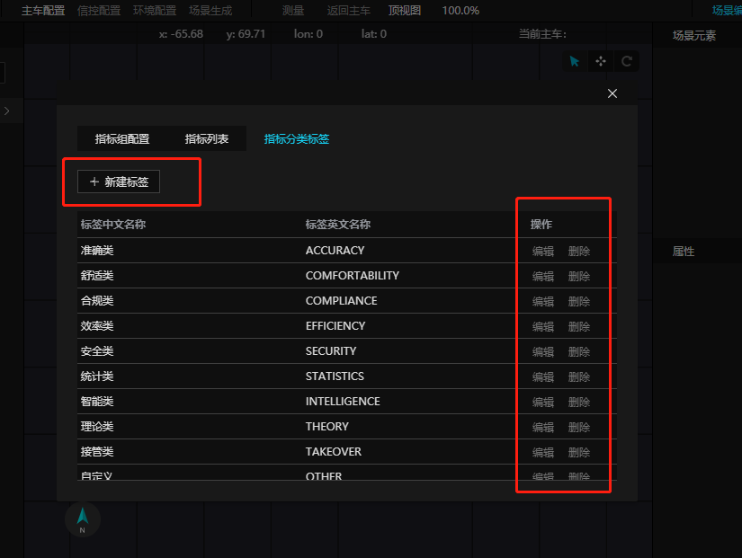</div><br>

支持用户查看指标列表, 且可对指标组进行创建、编辑、删除、克隆等操作.

<div align="center"></div><br>


### 2.3.7. 评测报告管理页面

在菜单栏中 ``数据管理`` 下拉框中, 点击 ``评测报告管理``, 即可进入 ``评测报告管理`` 弹窗.

<div align="center">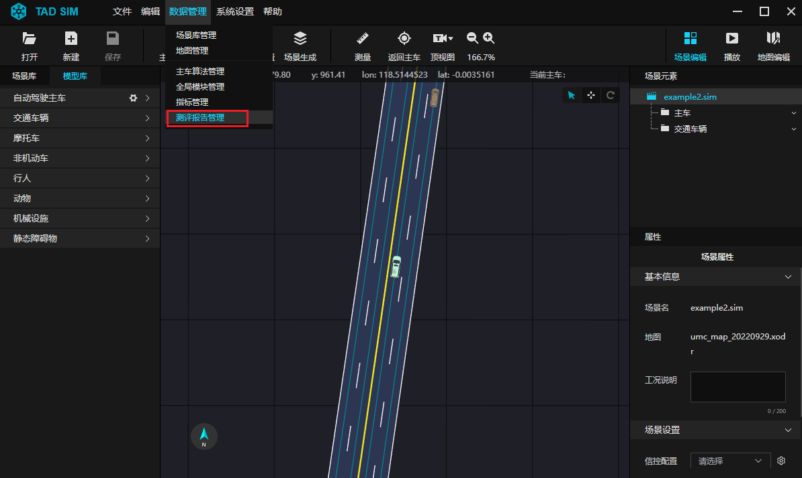</div><br>

可查看到历史播放记录的评测报告汇总 (前提条件: 需在模块管理中选中并运行 Grading 模块, 需配置后处理脚本).

<div align="center">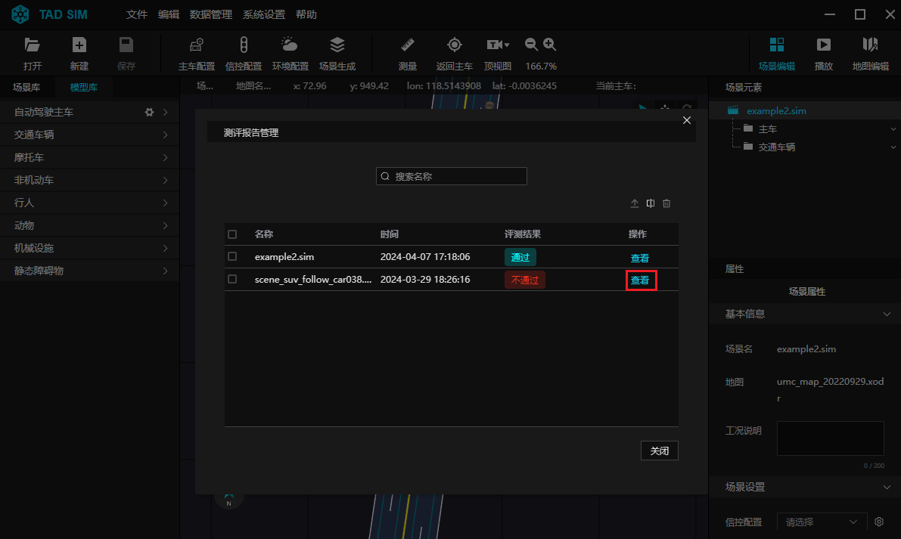</div><br>

<div align="center">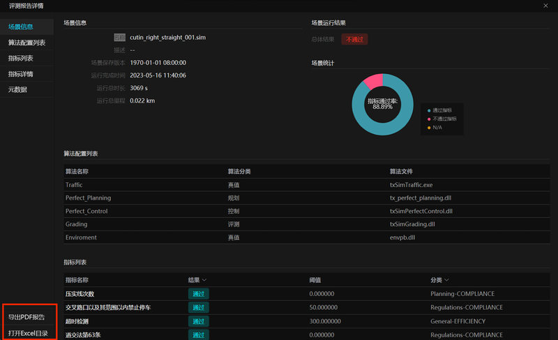</div><br>

- **"查看"按钮:**
  - 点击 ``查看`` 后显示场景评测报告详情,
  - 包含场景信息、算法配置列表、指标列表、指标详情、元数据信息, 指标详情及元数据信息通过图表形式呈现(元数据包括速度、加速度、及侧向加速度等信息).
- **对比图标:**
  - 对两个报告进行横向比较.
  - 点击对比图标后, 出现选择弹窗, 选择两个目标报告后, 点击 ``对比``, 即可进入 ``测评报告详情`` 页面.
  - 该页面针对两个场景进行对比, 展示场景信息、算法配置列表、指标列表、指标详情、元数据信息.
- **删除图标:**
  - 勾选报告后, 删除报告及对应的评测数据.
- **"导出 PDF 报告"按钮:**
  - 支持评测报告详情导出为 PDF 格式文件.
- **"打开 EXCEL 目录"按钮:**
  - 点击后打开数据存储文件地址.


### 2.3.8. 仿真设置页面

在菜单栏中 ``系统设置`` 下拉框中, 点击 ``仿真设置``, 即可进入 ``仿真设置`` 弹窗.

<div align="center">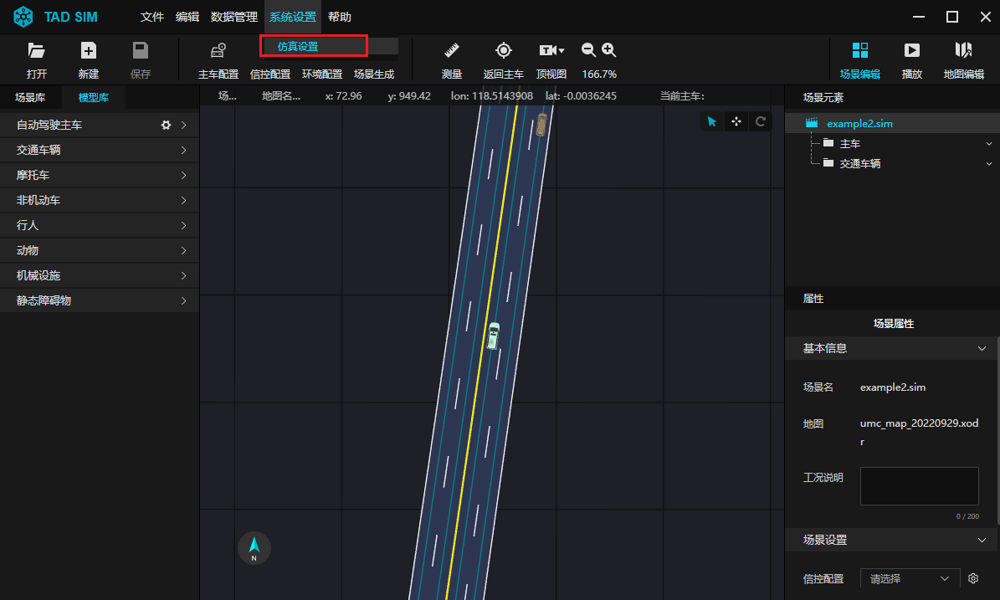</div><br>

<div align="center">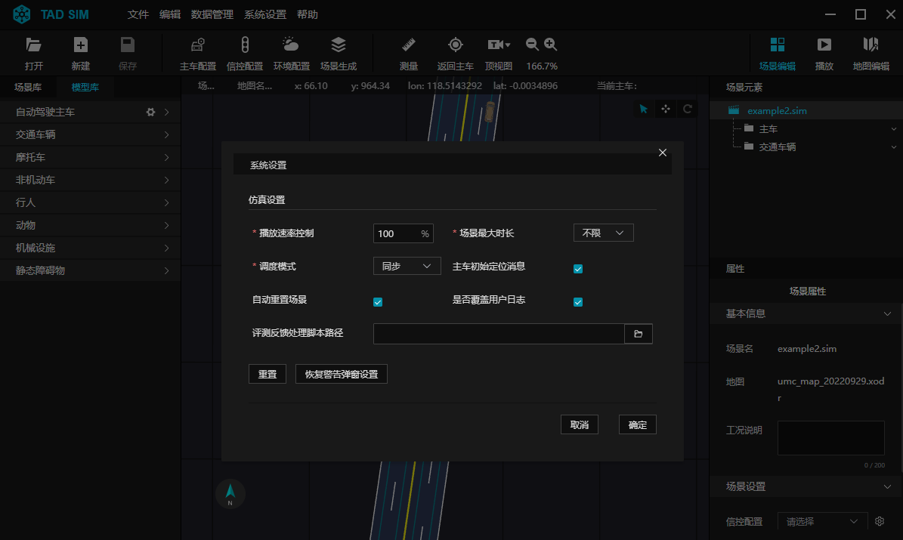</div><br>

本设置基于对算法模块运行的限制管理.
- **播放速率控制栏:**
  - 场景播放的速率设置, 数值越大, 速度越慢.
- **场景最大时长栏:**
  - 场景主车在不同算法条件下运行, 完成运行时长不一样.此处为最大运行时长, 超过时长运行停止.
  - (注:默认最大时长为不限, 用户也可选择自定义)
- **调度模式栏:**
  - 同步/异步/按优先级.
- **主车初始定位消息勾选框:**
  - 可勾选是否显示主车初始定位消息.
- **自动重置场景勾选框:**
  - 播放完一个场景后根据当前播放模式, 可勾选是否自动重新加载当前/下一个场景.
- **是否覆盖用户日志勾选框:**
  - 可勾选是否覆盖用户日志.
- **评测反馈处理脚本路径栏:**
  - 选择存储路径.
- **重置按钮:**
  - 将用户在当前弹窗的设置恢复到系统默认状态.
- **恢复警告弹窗设置按钮:**
  - 将用户在警告弹窗的设置恢复到默认状态, 如"不再提示"的勾选状态等.


## 2.4. 工具栏
### 2.4.1. 打开页面

在工具栏中单击 ``打开`` 按键, 出现 ``场景管理`` 弹窗, 与前文, 在菜单栏中 ``数据管理`` 下拉框中, 点击 ``场景库管理``, 或在菜单栏中 ``文件`` 下拉框中点击 ``打开``, 出现相同弹窗.

<div align="center">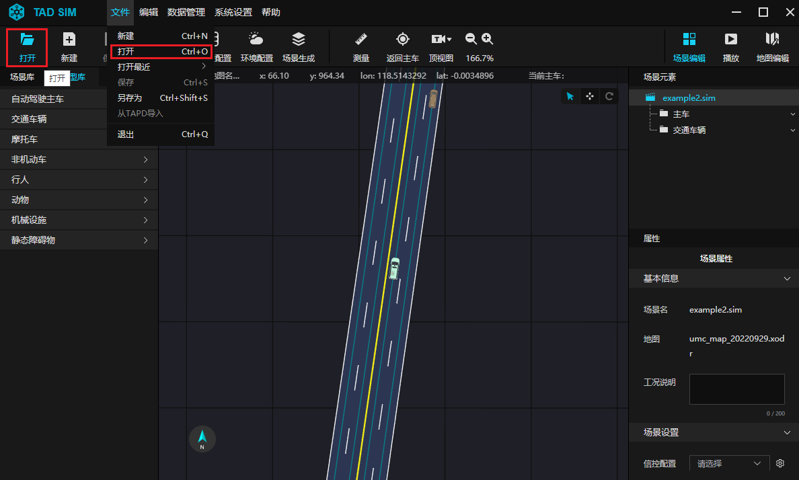</div><br>

在 ``我的场景`` 模块中, 可以通过点击某一特定场景右侧 ``打开`` 按钮, 在场景编辑页面打开该场景.<br>
场景列表可通过关键词搜索场景集或场景格式的筛选来快速定位到目标场景.<br>
勾选目标场景后点击导出或删除图标, 支持对场景的批量导出和删除.<br>
单击导入图标, 将外部场景导入到场景库中, 目前不支持含中文字符的路径.

<div align="center">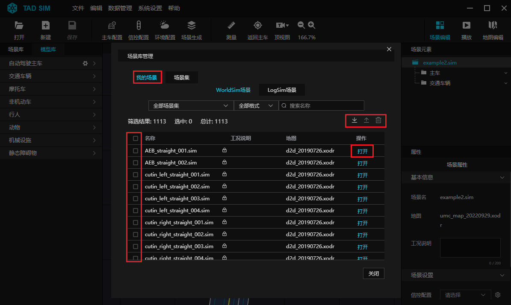</div><br>

在 ``场景集管理`` 模块中, 用户可以创建、删除及复制场景集, 设置场景集名称, 添加及删除子场景, 点击 ``保存`` 后保存场景集.

<div align="center">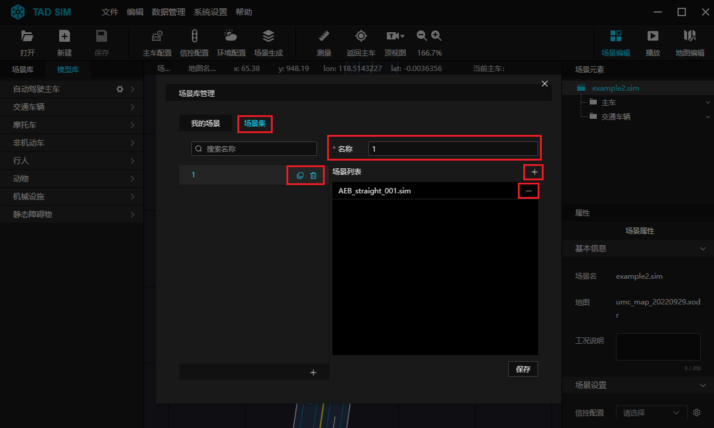</div><br>


### 2.4.2. 新建页面

在工具栏中单击 ``新建`` 按键, 或在菜单栏中 ``文件`` 下拉框中点击 ``新建``, 出现 ``新建场景`` 弹窗.

<div align="center">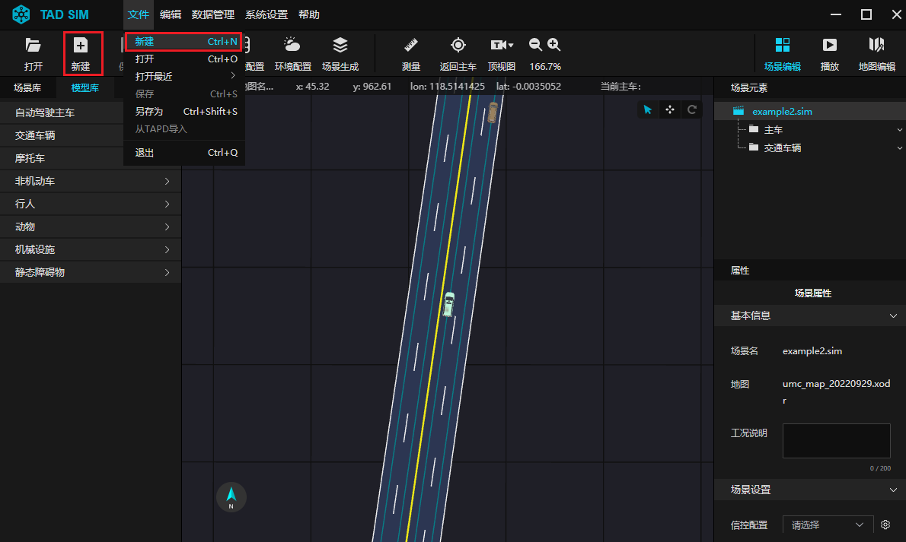</div><br>

用户可以在 ``地图库`` 栏中勾选目标地图, 并编辑场景名称及工况说明, 即可创建场景. 点击 ``创建`` 按钮完成创建.

<div align="center">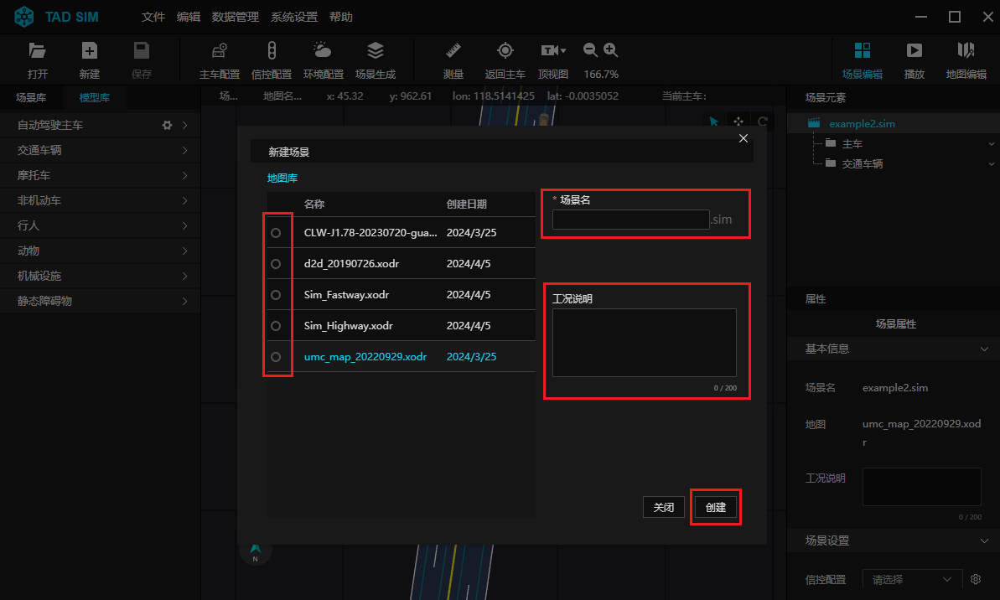</div><br>


### 2.4.3. 保存页面

在工具栏中单击 ``保存`` 按键, 或在菜单栏 ``文件`` 下拉框中点击 ``保存``, 即可保存当前编辑场景.

<div align="center"></div><br>

<div align="center">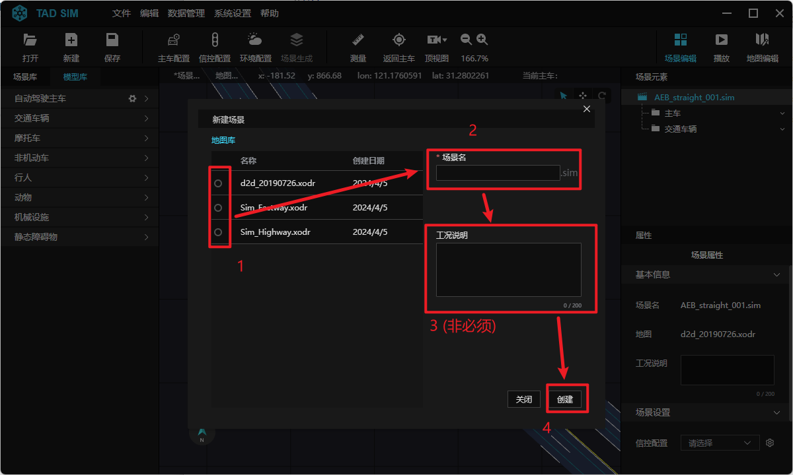</div><br>

<div align="center"></div><br>

支持将 .sim 格式的场景另存为 OpenSCENARIO 1.0 标准的 .xosc 格式. 因为格式兼容问题, 少许功能或信息可能会丢失.

<div align="center"></div><br>


### 2.4.4. 交通流页面

````{warning}
当前版本暂不提供该功能，敬请期待.
````

### 2.4.5. 信控配置页面

交通灯配置功能作为⾃动驾驶⻋辆感知、规划控制算法的重要交互能⼒之⼀, ⽀持⾃定义红绿灯在地图编辑器中的静态信息添加及场景编辑器中的⾃定义灯态配时.


交通灯配置功能作为⾃动驾驶⻋辆感知、规划控制算法的重要交互能⼒之⼀, ⽀持⾃定义红绿灯在地图编辑器中的静态信息添加及场景编辑器中的⾃定义灯态配时.

<div align="center">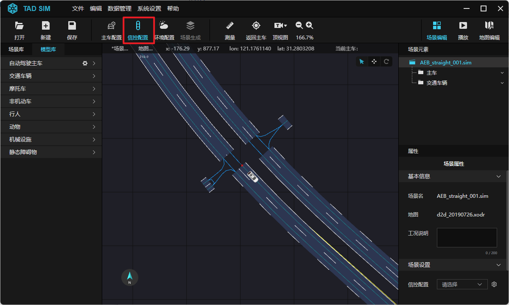</div><br>

<div align="center">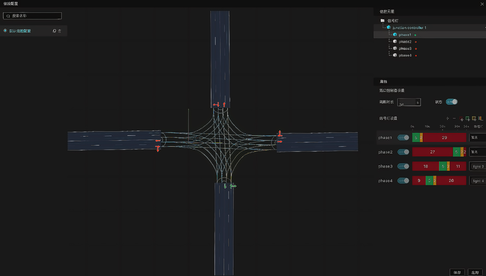</div><br>

- 信控配置⽅案栏
  - 功能说明:
    - ⽤于展示当前场景中包含的信控配置⽅案, ⼀套信控配置⽅案对应当前场景中每个路⼝的所有相位配置、及其与语义灯关联、物理灯关联信息.
    - ⽀持信控配置⽅案的克隆、删除.
  - 边界说明:
    - 打开信控配置功能窗后, ⽣成⼀套默认信控配置, 不⽀持编辑, 可克隆修改, 默认应⽤默认信控配置.
- 物理灯显示
  - 在场景编辑器画板中(场景编辑器主界⾯及信控配置功能界⾯) 显示物理灯, 即三维模型, 来源为:
    - 地图编辑器添加:  按地图编辑器添加信号灯结果⾃动显示物理灯.
    - 第三⽅地图⾃带:  按地图存储数据⾃动显示物理灯.
<div align="center">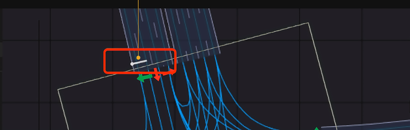</div><br>

- 语义灯
  - 功能: 语义灯⽤于整个地图信控配置⽅案配置, 通过可视化⽅式显示
    - 当新建/打开场景时, 场景⽂件中⽆信控配置, 则场景编辑器主界⾯中不显示语义灯, 当打开信控配置功能界⾯时, 根据信控配置模版⽣成默认信控配置⽅案,显示整个地图的全量语义灯及其对应初始颜⾊
      - 当未应⽤某⼀信控配置, 关闭信控配置功能界⾯时, 场景编辑画板不显示语义灯
      - 当应⽤了特定信控配置, 返回场景编辑器主界⾯, 场景编辑画板显示所应⽤配置⽅案的语义灯
    - 当打开包含信控配置的场景⽂件时, 场景编辑器主界⾯显示场景⽂件中语义灯, 当打开信控配置功能界⾯时, 原信控配置⽅案为信控配置⽅案⼀, 并⽣成系统默认信控配置⽅案, 默认应⽤信控配置⽅案⼀
<div align="center">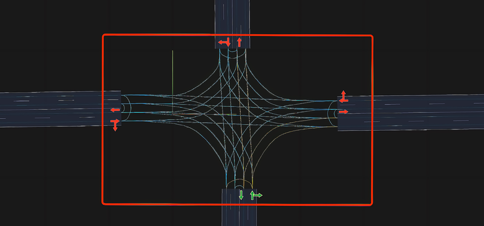</div><br>

- 信控元素栏
  - 路⼝控制器交互:
    - 右键点击路⼝控制器后, ⽀持点击禁⽤/启⽤(默认、全绿、全红、全灭), 该状态调节后, 属性栏中状态同步变化.
    - 复制属性/粘贴属性置灰
  - 相位交互:
    - 右键点击相位, ⽀持选择禁⽤/启⽤(默认、全绿、全红、全灭) /复制属性/粘贴属性.
    - 禁⽤及启⽤状态调节后, 属性栏中状态同步变化. 复制当前相位属性后, 可粘贴⾄同⼀路⼝控制器的其他相位, 属性栏中状态同步变化
<div align="center">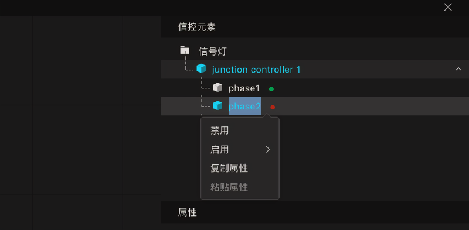</div><br>

- 属性栏
  - 周期时⻓
    - 功能说明: 当前路⼝控制器的亮灯总时⻓, 输⼊范围为5-600s.
    - 边界说明: 周期时⻓调整后, 最后⼀个灯态时间拉⻓
  - 状态
    - 功能说明:⽤于控制当前路⼝控制器所有相位的禁⽤及启⽤
      - 路⼝控制器启⽤时, 所属相位可⾃⾏修改启⽤/禁⽤状态
      - 路⼝控制器禁⽤时, 所属相位均为禁⽤状态
      - 路⼝控制器从禁⽤切换为启⽤状态时, 所有所属相位均切换为启⽤状态.
    - 边界说明:
      - 针对⽆灯态相位(灰⾊全灭灯相位), 该相位⾃动切换为禁⽤状态, 当路⼝控制器从禁⽤状态切换为启⽤状态, 改相位仍为禁⽤状态
<div align="center"></div><br>

- 信号灯设置
  - 功能说明(从左⾄右分别为):
    - 增加相位(phase): 点击后新增⼀⾏可配置相位, 默认⽣绿灯3s, ⻩灯2s, 红灯补充剩余周期时间
    - 删除相位phase: 点击后删除选中⾏相位
    - 添加绿灯: 默认添加5s, 若剩余可添加时⻓不⾜5s则添加剩余时⻓
    - 添加红灯: 默认添加5s, 若剩余可添加时⻓不⾜5s则添加剩余时⻓
    - 添加⻩灯: 默认添加5s, 若剩余可添加时⻓不⾜5s则添加剩余时⻓
    - 删除灯态: 删除当前选中灯态
  - 边界说明:
    - 新增灯时, 如果当前周期的灯已满, 则新增灯态默认5s, 若添加绿灯, 则⻩灯减少 5s, 若添加⻩灯, 则红灯减少 5s, 若添加红灯, 则绿灯减少 5s (改动某个灯态时间, 该灯态相邻后⾯的灯态调整时间, 直⾄覆盖);如果当前周期灯态为灰⾊, 新增灯填满整个周期. 删除灯时, 其时⻓由后⼀个灯态补⻬, 直⾄灰⾊.
<div align="center"></div><br>

- 物理灯下拉框
  - 功能:
    - 物理灯为在地图编辑器中添加的三维信号灯, 场景运⾏时 Display 亮灯⽅式采⽤与之关联的 phase 的灯态组合
  - 交互:
    - 选项框中⾃动填充与当前phase关联的物理灯, 下拉框中包含当前路⼝所有物理灯, ⽤户可勾选相应物理灯与当前phase关联, 选中的物理灯在编辑画板中显示为选中态
<div align="center">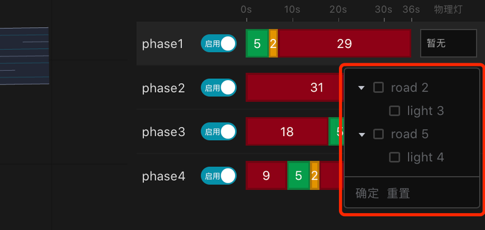</div><br>

- 相位(phase)
  - 功能说明:
    - 相位为信号灯红绿黄显示状态及显示时间的一套组合方式.
      - 当选中特定一行相位时, 可对当前相位进行编辑操作
      - 相位固定为绿色后接黄色, 黄色后接红色, 红色后接绿色顺序 (如红色、绿色、黄色、红色), 不可乱序
  - 关联语义灯:
    - 选中某行相位时, 可在编辑画板中单击选中与该相位关联的语义灯 (语义灯被选中后黄色描边高亮显示可关联当前路口多个语义灯, 选中的语义灯在场景运行时按当前相位灯态顺序显示)
  - 默认相位 (phase) 生成规则:
    - 打开信控配置功能界面时, 生成默认信控配置方案, mapsdk 输出路口对应进向 road 数量、id 及 roadid 所关联物理灯 id, 生成默认相位(phase) 及相位 (phase)关联的物理灯、语义灯(无物理灯控制的road所对应的语义灯默认为全灭状态)


### 2.4.6. 环境配置页面

在工具栏中, 单击 ``环境配置`` 按钮, 进入 ``环境配置`` 弹窗. 场景构建过程中, 增加对于天气元素的配置. 当前支持单个场景或全局场景的配置.

<div align="center">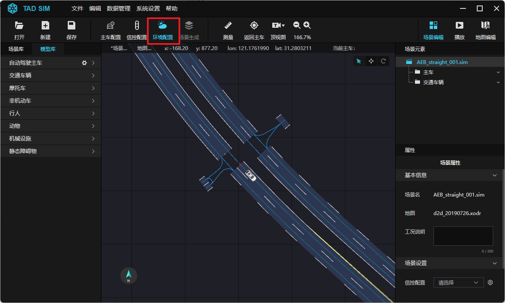</div><br>


环境配置仅在 Display 模块勾选状态下, 支持运行.

<div align="center">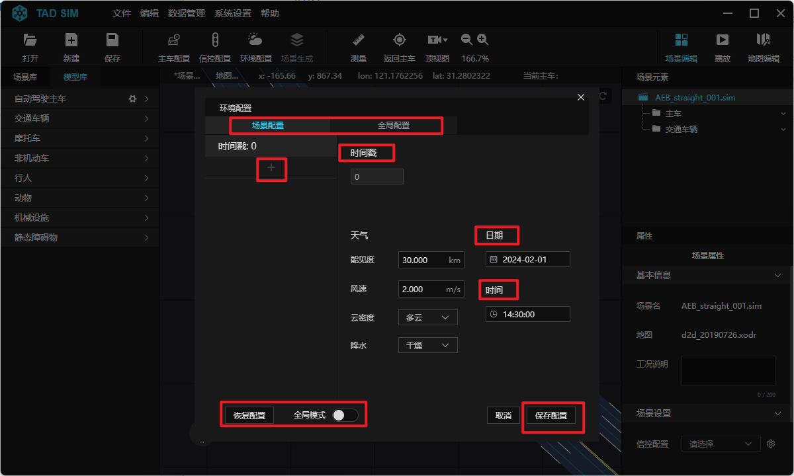</div><br>

- **"场景配置"栏:**
  - 当前场景的环境配置.(默认状态为: 用户上传场景, 场景自带传感器的配置参数信息)
- **"全局配置"栏:**
  - 当前场景库中所有场景的环境配置.支持当前场景库中给所有场景开启全局模式, 同步运行此环境配置参数. 关闭全局模式, 即取消当前全局适配设置.
- **加号图标:**
  - 点击"+"号, 增加新时间戳, 即新时间节点, 对新时间点的环境进行配置.
- **"时间戳"栏:**
  - 单位毫秒.特指播放状态下, 在某时间点发生某个行为.
- **"天气"栏:**
  - 默认常规数值, 用户可自定义.
- **"日期"及"时间"栏:**
  - 用于设置日期和时间, 表示应用确定时间节点规则.(例: 冬至下午4点太阳位置、日照偏移等)
- **"恢复配置"按钮:**
  - 恢复前一次编辑的数据.
- **"全局模式"滑块:**
  - 点击"全局模式"滑块, 其变成高亮状态则说明打开全局模式, 配置好环境后, 点击保存, 即可将该配置应用到所有场景.
- **保存配置:**
  - 保存本次设置的参数, 即开始应用于场景运行中.
- (注: 全局配置的参数数据应用, 仅适用于全局模式. 场景配置的参数默认适用于当前场景, 打开全局模式, 即在全局场景中应用, 关闭恢复正常状态)


### 2.4.7. 场景生成页面

``场景生成`` 功能支持场景的批量生成. 用户可快速创建测试组, 可以通过单机版连续运行多个仿真测试场景或者重复运行单个仿真测试场景.支持用户通过excel模版批量生成场景


在工具栏中, 单击 ``场景生成``按钮, 进入 ``场景生成`` 弹窗.
<div align="center">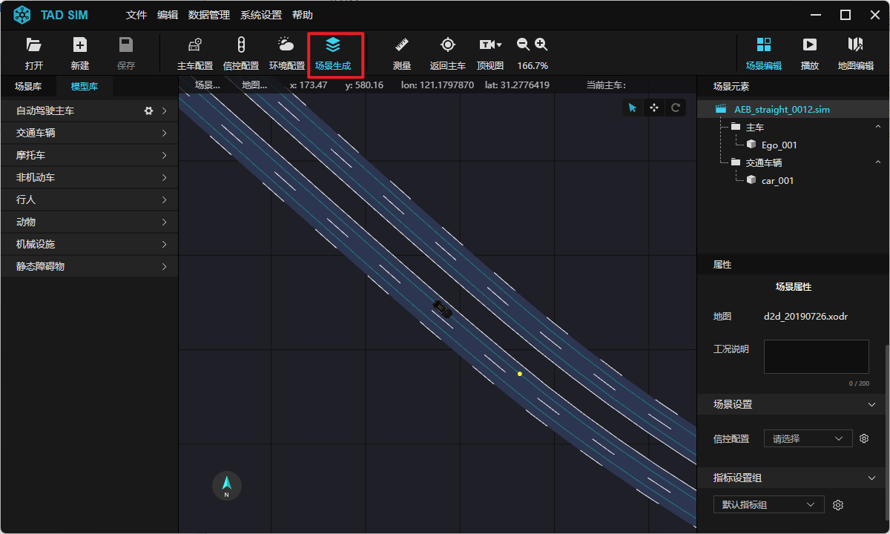</div><br>


支持 ``场景泛化``以及``语义生成``的方式批量生成场景， 批量生成场景规则如下:

1. 场景泛化


<div align="center">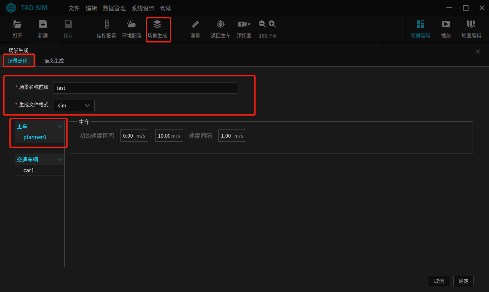</div><br>

<div align="center">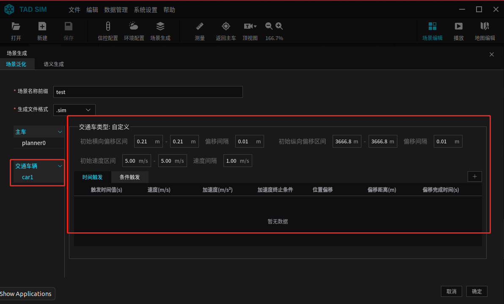</div><br>

文件序号编排规则

依据以下变化要素顺序依次展开: 主车(速度)、交通流车(速度、横向偏移、纵向偏移、加速度、加速度触发时间/距离、变道持续时间、变道横向偏移、变道触发时间/距离、速度变化值、速度变化触发时间/距离).
- 计算出主车速度的变化区间, 并依次迭代固定主车速度的变化, 再依次与下列要素组合:
- 计算交通流车辆本身的变化(先速度、再横向偏移, 再纵向偏移), 并依次与下列要素组合:
- 计算交通流车加速度变化区间(先加速度, 后触发值), 并依次迭代固定取值, 再依次与下列要素组合:
- 计算变道变化区间(先持续时间、再横向偏移, 最后触发值), 并依次迭代固定取值, 再依次与下列要素组合:
- 计算速度变化区间(先速度, 后触发值), 并依次迭代取值, 生成一个文件编号.

举例(以下文的生成规则来生成场景):
- 设置内容: 主车速度区间为 (1, 2), 速度间隔为 1m/s, 则生成场景数量为 2 个, 位置区间为(1, 2).交通车(id为-1) 生成规则为:

| 项目         | 初始速度 | 横向偏移   | 纵向偏移 |
|------------|----------|------------|----------|
| 区间         | (1, 2)   | (1.4, 1.5) | (1, 4)   |
| 间隔         | 1        | 0.1        | 2        |
| 生成场景数量 | 2        | 2          | 2        |
| 实际取值     | 1, 2     | 1.4, 1.5   | 1, 3     |

- 生成文件序列号(acc为自定义前缀):

| 序号 | (1, 2) X [(1, 2) X(1.4, 1.5) X(1, 3)] | 生成文件序列号 |
|------|---------------------------------------|----------------|
| 1    | 主车(1) 交通流车[(1) (1.4) (1)]       | acc_0          |
| 2    | 主车(1) 交通车[(1) (1.4) (3)]         | acc_1          |
| 3    | 主车(1) 交流车[(1) (1.5) (1)]         | acc_2          |
| 4    | 主车(1) 交通车[(1) (1.5) (3)]         | acc_3          |
| 5    | 主车(1) 交流车[(2) (1.5) (1)]         | acc_4          |
| 6    | 主车(1) 交通车[(2) (1.4) (3)]         | acc_5          |
| 7    | 主车(1) 交流车[(2) (1.5) (1)]         | acc_6          |
| 8    | 主车(1) 交通车[(2) (1.5) (3)]         | acc_7          |
| 9    | 主车(2) 交通车[(1) (1.4) (1)]         | acc_8          |
| 10   | 主车(2) 交流车[(1) (1.4) (3)]         | acc_9          |
| ...  | ...                                   | ...            |
| 64   |                                       | acc_63         |


基于要素顺序, 顺次生成场景序列, 如上表.时间触发、条件触发情况, 序列号生成, 基于要素顺序, 同上规则.

生成场景数计算规则

基于当前编辑的场景, 可根据界面参数设置, 批量生成相关场景.生成策略基于对交通流车辆的限制.(注: 触发时间或者触发条件只有和速度、加速度和变道中的一种进行结合时才有意义, 仅设置触发时间或者触发条件时无效.) 生成逻辑先以速度、加速度和变道单独进行泛化, 然后再对泛化之后结果进行组合返回.

  1) 计算速度泛化.
  2) 计算加速度泛化.
  3) 计算变道泛化.
  4) 计算触发条件的总泛化, 为 速度泛化 \* 加速度泛化 \* 变道泛化.
  5) 计算总泛化= 主车泛化 \* 交通流车泛化 \* 触发条件泛化.

- "主车"栏:
  - 设置场景中, 主车的初始速度数值.(例如: M=初始速度1-10m/s, 速度间隔1m/s, 场景数=10/1+1=11)
- "交通车"栏:
  - 交通车的行为参数设置.选择单一交通车(例如: A=初始横向偏移1-10m, 位置间隔1m, 场景数=10/1+1=11. B=初始速度1-10m/s, 速度间隔1m/s, 场景数=10/1+1=11)
- "时间触发"栏:
  - 触发时间或者触发条件只有和速度、加速度和变道中的一种进行结合时才有意义, 仅设置触发时间或者触发条件时无效.生成的场景总数=M\*A\*B\*(C\*D) \*(C\*E) \*(C\*F\*G), 增加时间触发条件的条数x条, 相应场景总数量增加x倍.
- 触发时间值(s)
  - =(初始时间到结束时间的步长) /时间间隔+1. C=初始时间1-10s, 时间间隔1s, 场景数=10/1+1=11.
- 速度:
  - D=初始速度1-10m/s, 速度间隔1m/s, 场景数=10/1+1=11.
- 加速度:
  - E=初始加速度1-10m/s2, 加速度间隔1m/s2, 场景数=10/1+1=11.
- 位置偏移:
  - 交通车偏移行为描述.
- 偏移距离:
  - 当且仅当位置偏移为'车道内偏移'时, 偏移距离条件可使用. F=偏移距离1-10m, 距离间隔1m, 场景数=10/1+1=11.
- 偏移完成时间:
  - 完成偏移行为所用的时间. G=偏移完成时间1-10s, 时间间隔1s, 场景数=10/1+1=11.
- "条件触发"栏:
    - 生成的场景总数=M*A*B*(I*J) *(I*K) *(I*L*O), 增加条件触发条件的条数x条, 相应场景总数量增加x倍.
- 触发条件类型:
  - TTC 与 主车距离.
- 距离类型:
  - 道路坐标系距离(默认) 、欧式距离.
- 触发条件值:
  - 例: 在TTC和欧式距离条件下, 触发条件进行计算.相对距离来说: H=初始距离1-10m, 距离间隔1m, 场景数=10/1+1=11. 相对时间来说: I=时间长度1-10s, 时间间隔1s, 场景数=10/1+1=11.
- 条件满足次数:
  - 指满足当前条件第几次行为, 不参与计算.
  - 例: 3表示第3次满足触发条件时, 计算场景值.速度: J=初始速度1-10m/s, 速度间隔1m/s, 场景数=10/1+1=11. 加速度: K=初始加速度1-10m/s², 加速度间隔1m/s², 场景数=10/1+1=11.
- 位置偏移:
  - 交通车偏移行为描述.
- 偏移距离:
  - 当且仅当位置偏移为'车道内偏移'时, 偏移距离条件可使用. L=偏移距离1-10m, 距离间隔1m, 场景数=10/1+1=11.
- 偏移完成时间:
  - 完成偏移行为所用的时间. O=偏移完成时间1-10s, 时间间隔1s, 场景数=10/1+1=11.

2. 语义生成

   支持通过语义描述进行简单高精地图的生成（如直道，弯道，路口，上下匝道，红绿灯）。支持通过语义描述进行OpenScenario动态场景的生成，且生成的xosc文件带有ParameterDeclaration属性。

   在``场景生成``页面点击``语义生成``即可进入语义生成页面
<div align="center">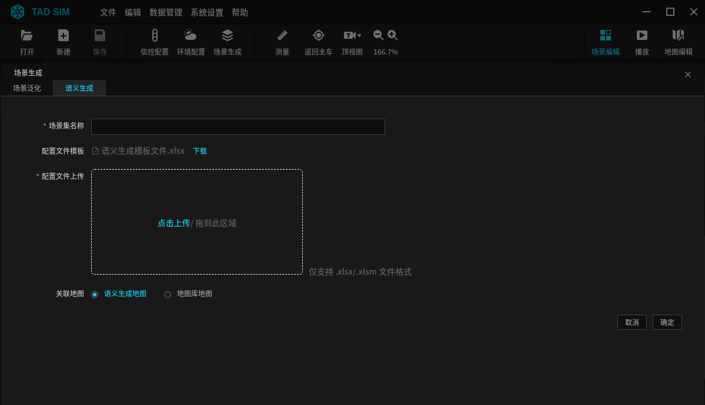</div><br>

- 在“场景集名称”栏，填写场景集名称；在“配置文件文件上传”栏，上传配置文件（可下载配置文件模板，基于模板编辑所需配置）
- 在“关联地图”栏，选择关联地图，支持“语义生成地图”和“地图库地图”两种方式。
  -  当关联地图为“语义生成地图“时，通过语义描述进行简单高精地图的生成（如直道，弯道，路口，上下匝道，红绿灯）。点击进入下拉框，下拉选择语义生成的地图地图所属目录，根据目录选择地图集，支持多选；
  - 当关联地图为“地图库地图时，点击“选择地图”按钮，选择具体的地图作为测试用例场景的地图，支持多选
  - 全部设置完成后，点击保存，新建语义生成任务完成。
<div align="center">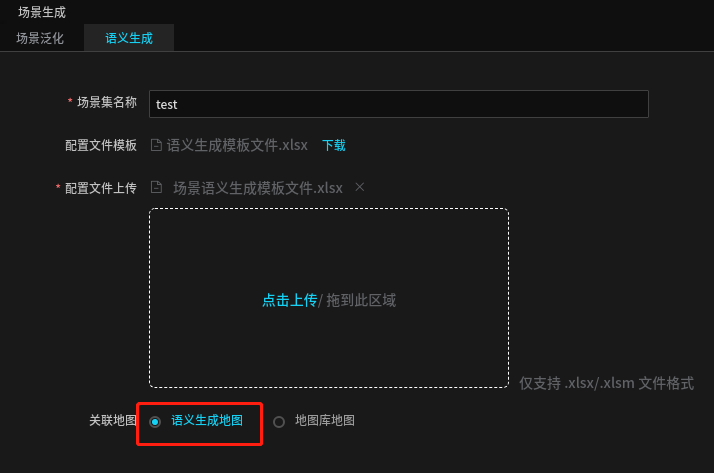</div><br>

<div align="center">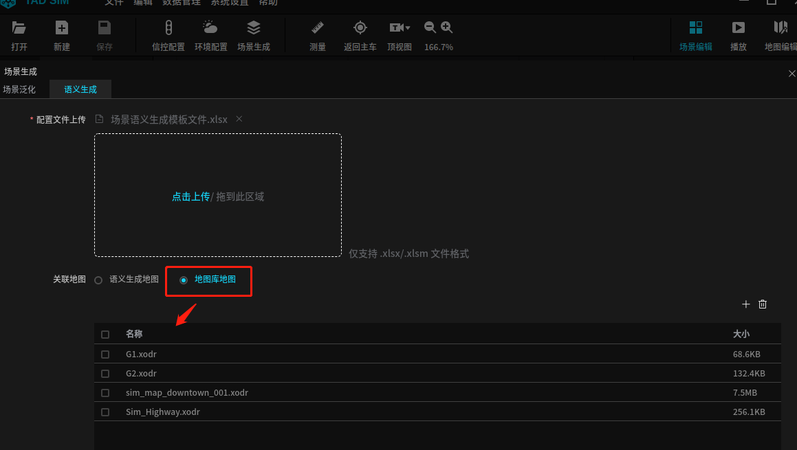</div><br>


 - 语义生成配置信息

   - 场景集名称：生成的一系列场景归属一个场景集
   - 配置文件模版：附配置模版XLSX文件提供下载,下载完成经本地编辑后上传即可
   - 关联地图：可选择“语义生成地图”或“地图库地图”
     - 语义生成地图：根据语义生成模版生成地图，生成后可在地图管理中查看并打开对应地图文件
     - 地图库地图：可选择系统中已有地图，支持多选（上限数量10）

模板内容举例(以下文的生成规则来生成场景):
a. 场景配置信息
<div align="center"></div><br>

  - FuncId（场景一级名称）（必填项）
  - LogicId（场景二级名称）（必填项）
  - Label（云平台上已有的场景标签）
  - Description（场景描述）
  - Mask（是否完成场景设计）（必填项）
  - Naming（场景命名规则）****
  - MapFile（基于平台上已有地图生成场景）（限制条件下必填项）

**b. 场景描述信息**

<div align="center"></div><br>

- L1_Road
  - 道路
    - 道路类型：直道、弯道入口、弯道出口、弯道S、弯道中
    - 曲率：可正负, 正代表左偏, 负代表右偏
    - 方向：单向、双向
   - 路口
     - 路口类型：无、十字路口、T字路口、Y字路口、道路入口、道路出口
    - 车道
      - 车道类型：无、驾驶、自行车道、路肩、专用车道、人行道、停车区域、停止车道、施工道路、有轨电车轨道、铁路轨道、车道入口、车道出口、使出匝道、驶入匝道
      - 数量：3、3变2@200m（200m处3车道变2车道）
      边缘：有、无
  - 道线
    - 类型-类型：无、双实、实虚、虚实、双虚
    - 类型-颜色：白、黄、蓝、绿、红、橙
    - 状态：清晰、模糊

- L2_RoadFurnitureAndRules
  - 红绿灯
    - 状态：无、有
    - 周期：红绿黄总周期 (如果此处填0, 则使用系统默认的 81s, 系统会按照预设的规则生成)

- L4_MovingObjects：
  - 主车及交通参与者
    - 物理属性：物理模型选择
    - 初始：速度，路径
    - 关系：参考物，相对纵向距离，相对横向距离，相对航向角
    - 动态：触发类（仿真时间/ttc/距离/到达位置/速度触发），触发值，动作类（加速/减速/速度/变道/车道内偏移），动作值

- L5_EnvironmentalConditions
  - 环境
    - 时间：清晨、上午、中午、黄昏、夜晚
    - 天气：晴朗、多云、小雨、中雨、大雨、小雪、中雪、大雪、小雾、中雾、大雾


### 2.4.8. 测量页面

在工具栏中, 单击 ``测量`` 工具图标, 鼠标变为添加测量点状态.

<div align="center">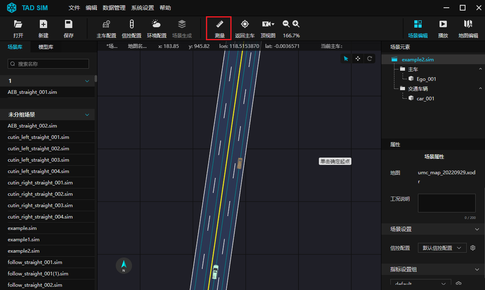</div><br>

在编辑界面任意位置左键单击后可生成测量点, 按回车键为结束添加点, 单击"x"删除已添加的点, 单击终点的删除 icon 删除整条测量线.

鼠标接触测量线, 按住ctrl同时鼠标左键在测量线上单击可添加新点, 并显示当前点到起点的距离.鼠标点击圆点时, 圆点呈现高亮状态, 点击按住圆点拖动, 可移动圆点位置.

<div align="center">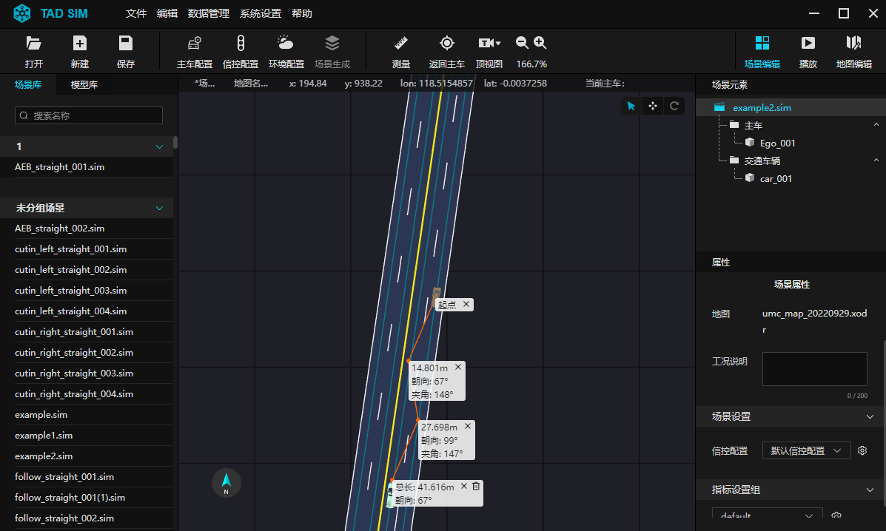</div><br>

绘制点后, 鼠标移动时会实时显示:
- **总长:**
  - 当前点到起点的距离.
- **朝向:**
  - 从上一个点出发, 到当前点的朝向.
- **夹角:**
  - 当前点相邻线段的锐角夹角.


### 2.4.9. 返回主车页面

在工具栏中, 单击 ``返回主车`` 图标, 快速聚焦到主车元素. 也可以通过单击右侧 ``场景元素`` 栏中主车元素, 聚焦主车.

聚焦主车时, 属性栏处同时显示主车属性, 用户可自定义主车属性.

<div align="center"></div><br>


### 2.4.10. 视角切换页面

在工具栏, 点击视角切换图标, 可以对编辑界面视角进行 ``顶视角`` 及 ``透视角`` 切换.

<div align="center">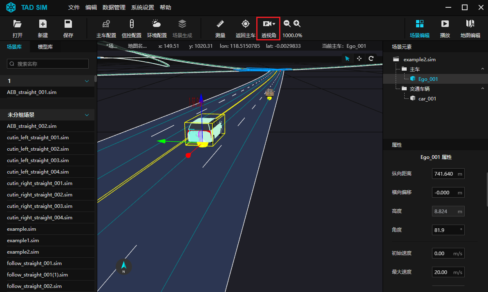</div><br>


## 2.5. 快捷键操作
| 操作             | 说明           |
|------------------|--------------|
| 鼠标右键长按拖动 | 平移视图       |
| 鼠标左键长按拖动 | 添加元素       |
| 鼠标滚轮         | 放大缩小视图   |
| Enter            | 结束添加轨迹点 |
| Ctrl + N         | 新建           |
| Ctrl + S         | 保存           |
| Ctrl + Q         | 退出           |
| P                | 自由视角       |
| T                | 顶视角         |
