# 3. 场景播放器

播放器可在场景编辑完成后, 快速生成场景, 支持二维播放和三维场景渲染, 通过可视化图表的方式实时显示主车状态, 支持日志查看和算法评估等多种调试方式.

- 用户可以通过点击窗口切换栏中 ``播放`` 图标.

<div align="center"></div><br>

- 即可进入播放器, 可直接进入场景播放器中所编辑的场景的播放界面.

<div align="center">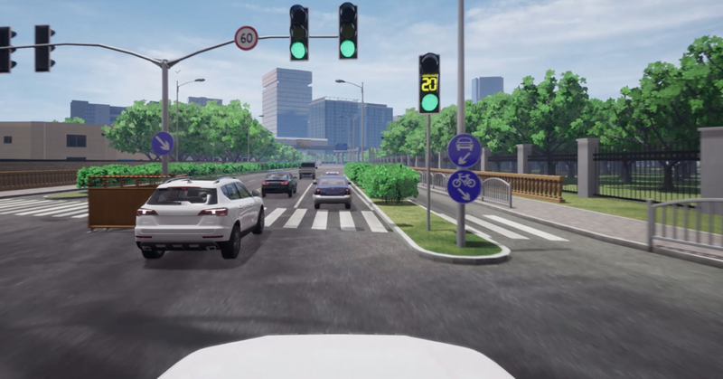</div><br>


## 3.1 功能清单

| ID | 功能     | 说明                                                                                                                                                                                                                                                          |
|----|----------|----------------------------------------------------------------------------------------------------------------------------------------------------------------------------------------------------------------------------------------------------------------------------------------------------------------------------------------|
|  1  | 菜单栏  | 菜单栏提供各种编辑和查看操作.菜单栏包括以下顶级菜单及子菜单: <br> - 文件: 新建、打开、打开最近、退出. <br> - 数据管理: 场景库管理、地图管理、主车算法管理、全局模块管理、指标管理、评测报告管理. <br> - 系统设置: 仿真设置, 同 [场景编辑器-仿真设置](./302.场景编辑器.md#238-仿真设置页面) <br> - 帮助: 关于软件版本信息说明.                                                                                                                                                                                                                    |
| 2  | 工具栏 | 工具栏用于选择当前编辑工具, 并进入下一步操作. 工具栏包括以下项: <br> - 返回主车: 场景编辑状态时, 捕捉定位主车位置, 同 [场景编辑器-返回主车](./302.场景编辑器.md#249-返回主车页面)  <br> - 视角切换: 场景播放状态下可以切换播放视角效果, 播放器页面目前支持顶视角、司机视角、跟车视角及自由视角, 见 [场景编辑器-视角切换](./302.场景编辑器.md#2410-视角切换页面). <br> - 视窗放大缩小: 支持放大缩小阈值(0.1%-1000%). <br> (用户滚动鼠标中间滚轮亦有放大或缩小编辑器视图效果). |
| 3   | 播放列表     | 用户播放过的场景列表, 支持名称搜索功能.                                                                                                                                                                                                                                                                                                                                                                                                                                                               |  |
| 4   | 运行数据栏   | 用户可通过点击运行右侧数据栏图标, 筛选显示运行数据内容, 包括主车速度、加速度、碰撞次数及算法模块数据, 并可以通过调整显示设置来选择是否显示主车、动态交通流等信息, 数据栏的底部图标可以显示车辆仪表盘信息, 以及 V2X 预警信息等.                                                                                                                                                                                                                                                                                                                                                                                                 |
| 5   | 播放界面     | 显示二维渲染场景. 播放运行过程中, 交通参与者周围会显示实时变化的绝对速度、加速度、相对速度和相对距离等数据, 主车周围显示当前车速及方位信息.                                                                                                                                                                                                                                                                                                                                                            |
| 6   | 操作栏       | 用户可对场景播放状态进行操作. 详情可见 [播放器-操作栏](./303.场景播放器.md#34-操作栏)章节. <br> - 播放状态图标: 播放状态支持场景单次播放和列表顺序播放的两个模式切换. <br> 在列表顺序播放模式下可以设置循环播放次数. <br> 列表顺序播放模式下, 点击 ``开始批量播放`` 三角图标后,  <br> 可点击 ``结束当前场景`` 图标, 直接跳到下 一个场景播放. <br> 点击 ``结束批量播放`` 后, 结束所有场景播放. <br> - 三角图标: 播放当前场景. <br> - 三角加播放帧图标: 单击后播放下一帧场景. <br> - 方形图标: 停止场景播放. <br> - 切换设置: 在 logsim 模式下支持 log2world 切换设置 |
| 7   | 调试栏       | 记录当前场景各算法模块运行日志并支持日志查看及记录日志位置. 详情可见 [播放器-调试栏](./303.场景播放器.md#35-调试栏)章节                                                                                                                                                                                                                                                                                                                                                                                                                                 |
| 8   | 三维播放界面 | 基于三维重建技术的场景重建, 可输出场景元素真值, 自动生成各种天气、路况. 在 ``模块管理`` 的 ``模组配置`` 中加 ``display`` 后, 点击 ``播放`` 时可自动弹出 display 模式窗口. <br> - 键盘C: 窗口中通过键盘C键切换不同视角. <br> - 键盘P: 窗口中通过键盘P键打开环境设置.                                                                                                                                                                                                                                                     |

## 3.2. 工具栏

### 3.2.1 返回主车页面

- 返回主车, 场景编辑状态时, 捕捉定位主车位置.
<div align="center">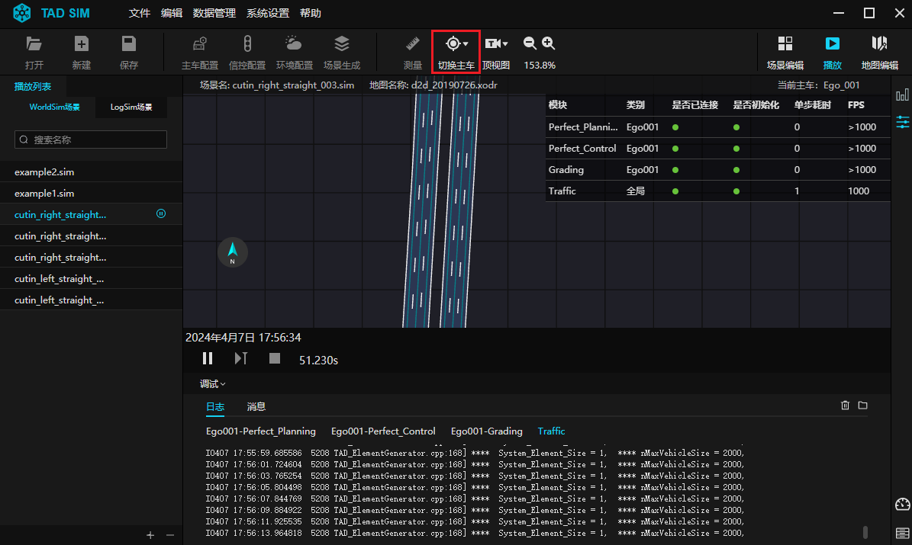</div><br>
<!-- <div align="center">
  
  <p></p>
</div> -->


### 3.2.2 视角切换页面

- 在工具栏点击视角切换图标, 支持二维播放界面 ``顶视角`` （默认）、``司机视角``、``跟车视角``、``自由视角`` 播放.

<div align="center">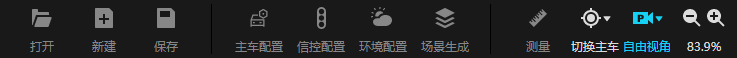</div><br>

<div align="center">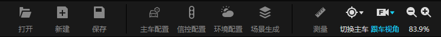</div><br>

<div align="center">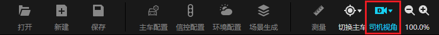</div><br>

<!-- <div align="center">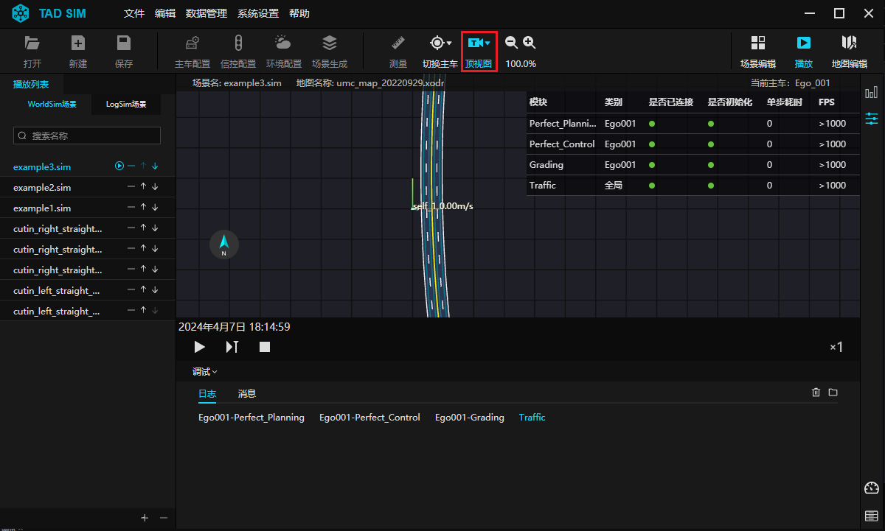</div><br>

<div align="center"></div><br> -->

- 效果如下:

<div align="center">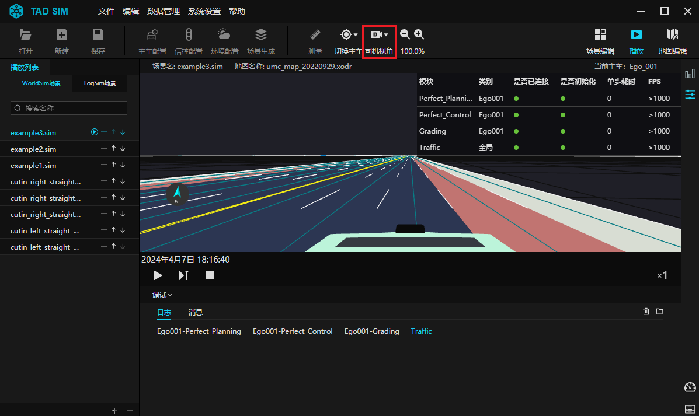</div><br>

<div align="center">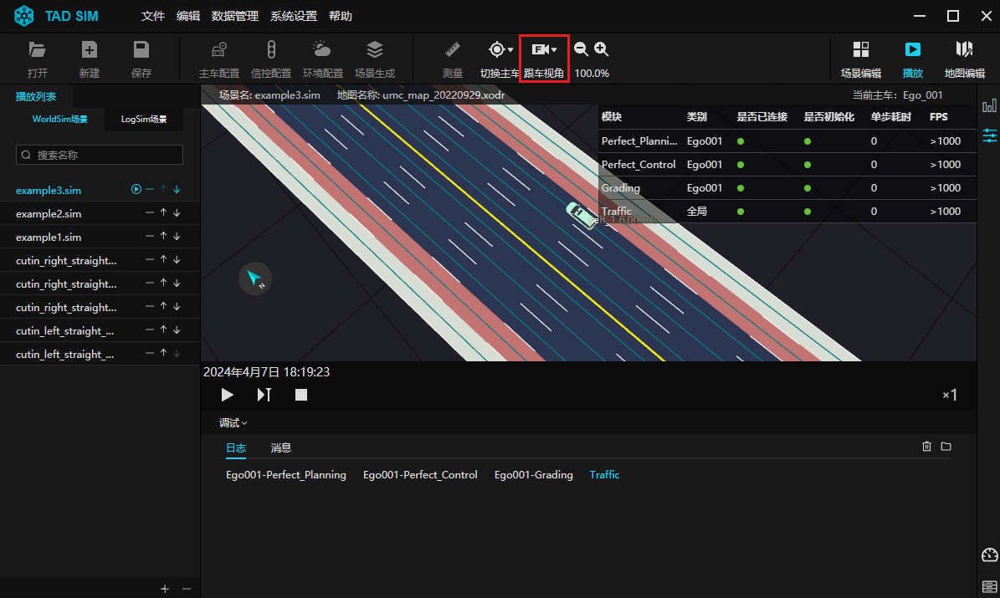</div><br>

<div align="center">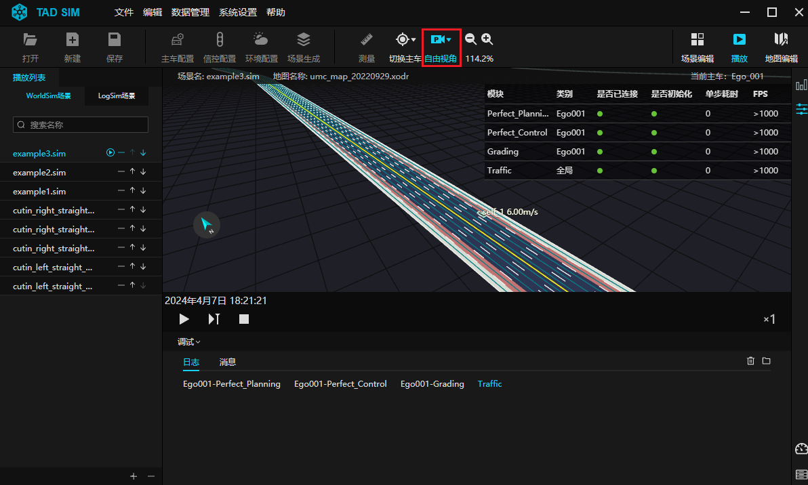</div><br>


## 3.3. 播放列表

- 用户可在左侧 ``播放列表`` 栏处可点击加号图标, 在弹出 ``添加场景`` 窗口, 可多选场景添加入播放列表.
- 点击 ``减号 -`` 图标, 可以在播放列表中删除某一场景.
- 在列表中按住 ``shift`` 可多选场景批量删除.
- 点击上下箭头图标, 可以调整场景在播放列表中的前后位置.

<div align="center">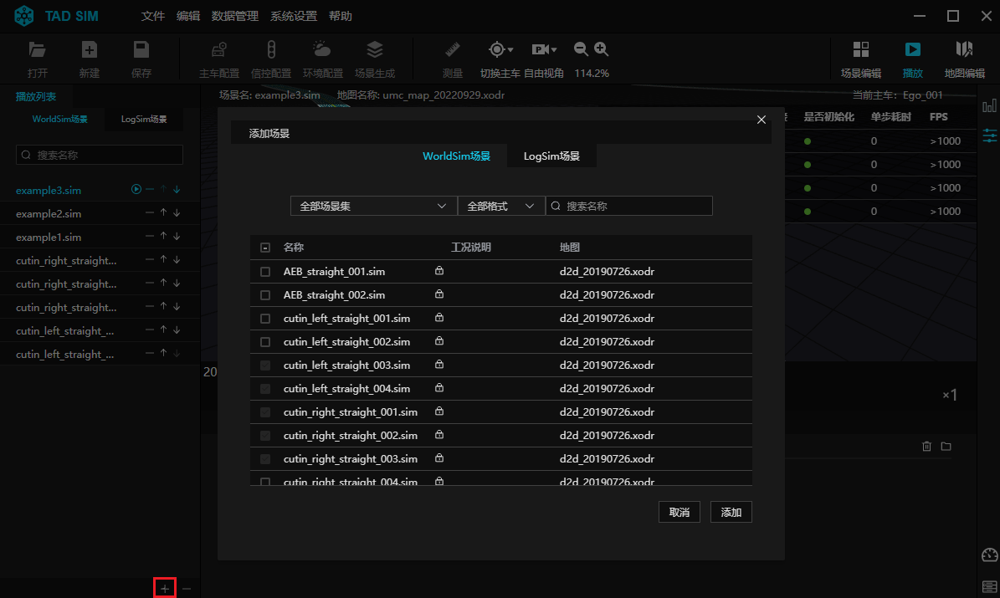</div><br>

````{note}
注: 场景列表只可添加相同类型的场景.
````


## 3.4. 操作栏

场景运行在界面左上角可切换 Worldsim 模式和 Logsim 模式.

- 播放状态支持单次场景播放和列表顺序播放的两个模式切换.
- 在列表顺序播放模式下可以设置循环播放次数.
- 列表顺序播放模式下, 点击 ``开始批量播放`` 三角图标后, 可点击方形 ``结束当前场景`` 图标, 直接跳到下一个场景播放.
- 点击 ``结束批量播放`` 后, 结束所有场景播放.
- 图标说明：
  - 三角图标:
    - 播放当前场景.
  - 暂停图标:
    - 暂停场景播放, 可切换别的场景播放或进入场景编辑状态, 进行再编辑.
  - 下一帧图标:
    - 暂停播放后, 单击下一帧图标播放下一帧场景.
  - 方形图标:
    - 场景单次播放模式下, 停止当前场景播放.列表顺序播放模式下, 结束当前场景播放, 直接跳到下一场景.

<div align="center">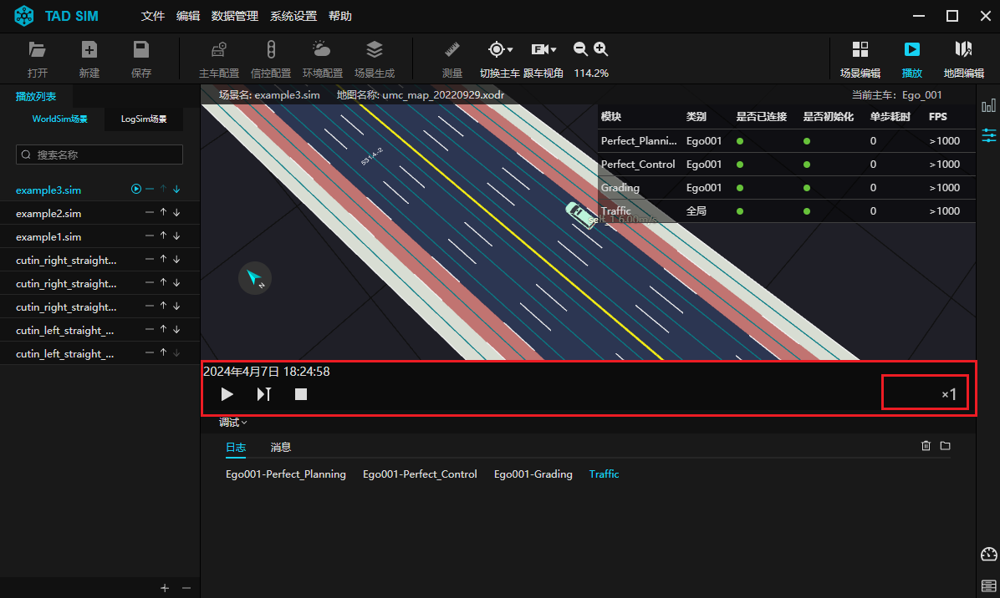</div><br>
<div align="center">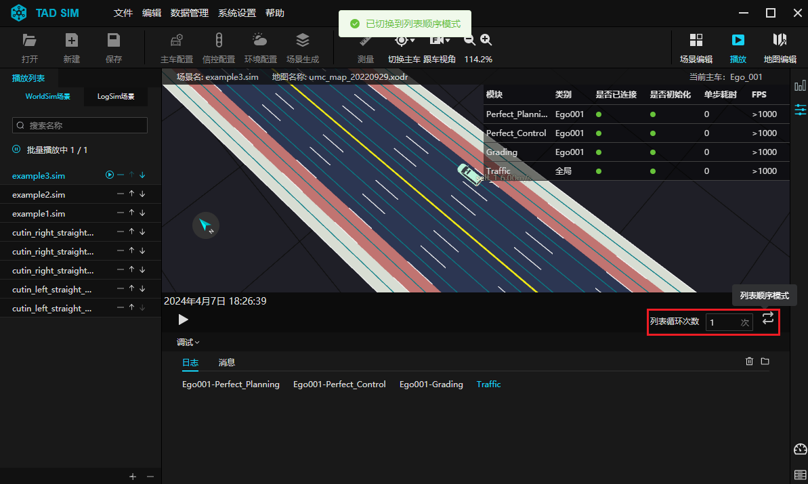</div><br>

- 切换为 Logsim 模式时, 可以设置当前场景运行是否启用 log2world 切换, 如开启主车切换, 则主车由回放数据驱动切换为新算法驱动.

  - 如开启交通流切换, 则在固定切换时机后, 交通流行为由回放数据驱动切换为 AI 驱动.
  - 如开启 log2world 切换，则播放时会提示log2world 已切换.
  - 切换时机设置分为事件点和场景固定时间两类.
  - 仅在场景非运行中状态下可修改切换设置.

<div align="center">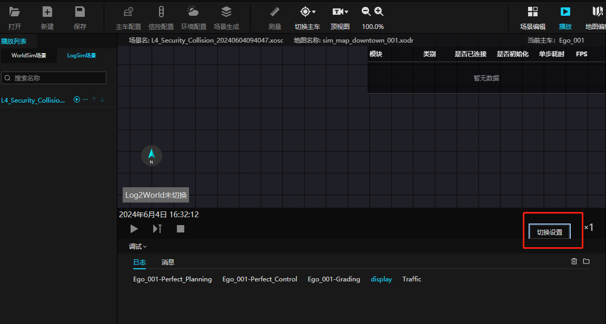</div><br>
<div align="center">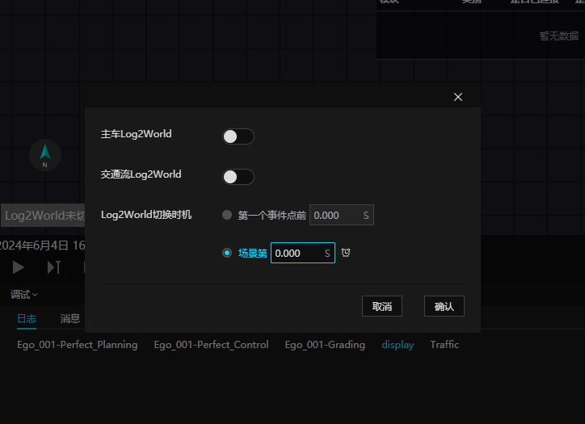</div><br>
<div align="center">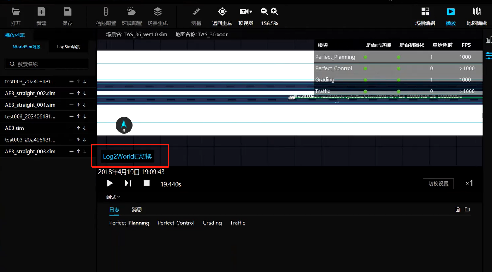</div><br>

## 3.5. 调试栏

- 单击调试展开图标, 可查看调试日志和消息.
- 支持查看多个模块运行日志并打开相应日志位置.
- 仿真数据的记录和导出方法:
  - TAD Sim 各个模块之间数据交互基于 google protobuf, 目前使用版本是 3.9.1.
  - TAD Sim 提供两个模块用于交互数据的存储和回放.
  - TAD Sim 提供一个基于 python 的后处理 demo 脚本, 用于演示如何使用 python 处理 tadsim log 数据.

<div align="center">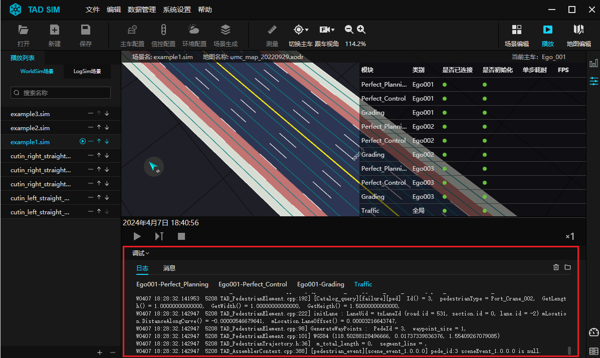</div><br>


### 3.5.1. 记录仿真数据设置

在 ``主车算法管理`` 弹窗中, 进入 ``模组配置`` 栏, 添加 Grading 评测模块, 通常 Grading 模块作为最后一个模块, 对 Grading 模块, 进行以下配置:
- ``通道设置`` 栏勾选用户想要记录的数据的 topic 类型.
- ``导出路径设置`` 指定 pblog 存放的目录, tadsim 会自动生成 ``场景名称-年-月-日-时-分秒.pblog`` 和 ``场景名称-年-月-日-时-分秒.xlsx`` 命名格式的文件.

<div align="center">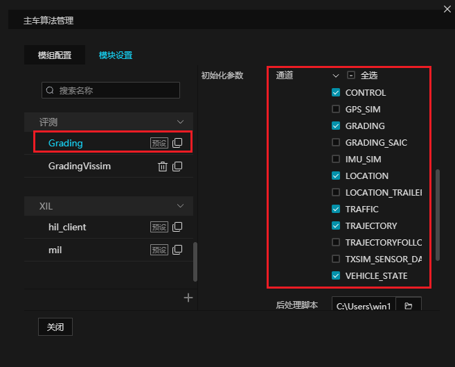</div><br>

- ``后处理脚本`` 栏设置为文件浏览器位置, 通过文件浏览器选择后处理脚本文件.

<div align="center">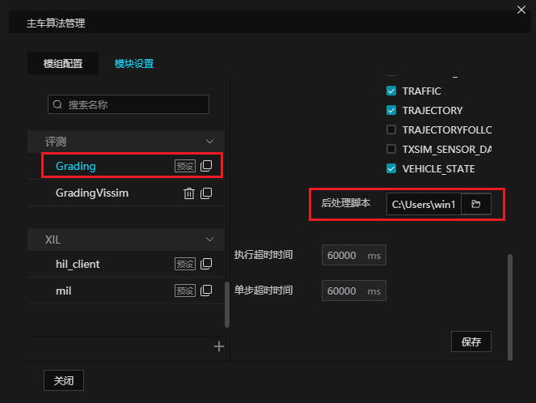</div><br>


### 3.5.2. 回放仿真数据设置

在 ``全局模块管理`` 弹窗中, 进入 ``模块设置`` 栏, 添加 ``Protobuf_Log_Player`` 模块, 对 Protobuf_Log_Player 模块, 进行以下配置:
- ``通道设置`` 栏勾选要回放数据的 topic 类型.

<div align="center">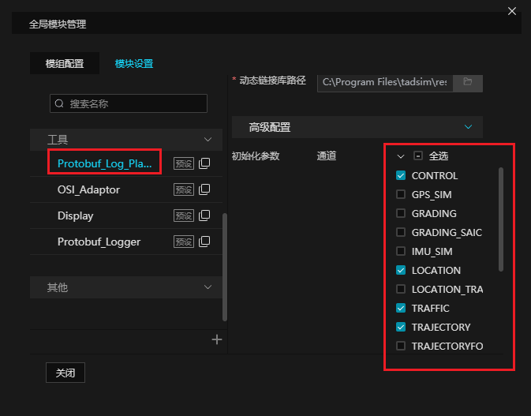</div><br>

- ``回放文件路径`` 设置为要回放的 pblog 数据文件路径.

<div align="center">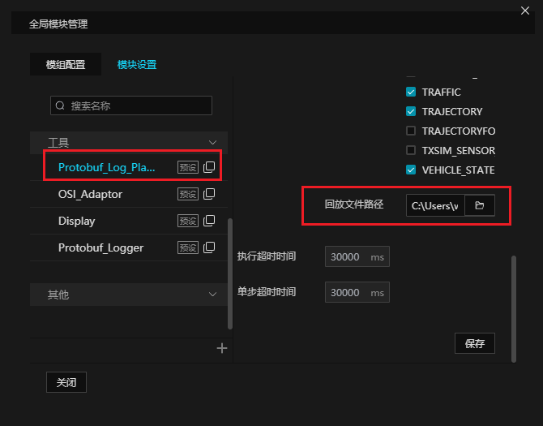</div><br>

````{note}
注: 使用 Protobuf_Log_Player 模块时, 要注意回放的 topic 跟模块正在发送的 topic 避免冲突,
    例如, Protobuf_Log_Player 模块在回放 TRAJECTORY, 那么就不应该运行 planning 模块.
````


## 3.6. 运行数据栏

````{warning}
当前版本暂不提供该功能，敬请期待.
````

- 单击运行数据栏中的显示设置, 可以展开显示设置列表, 支持包括场景类信息 (如: 主车、动态交通流、交通信号灯等) 及道路类信息 (如车道线、车道连接线等) 的显示或隐藏.

<div align="center"></div><br>

- 运行数据栏底部的车辆仪表盘提供基于主车仪表盘的可视化界面, 包含速度、加速度以及制动、油门等相关行驶状态信息;

<div align="center"></div><br>

另外, 单击底部的 V2X 预警信息图标可以展开场景运行中动态详尽的 V2X 预警信息.


## 3.7 快捷键操作
| 操作                   | 说明                                                                                                                              |
|------------------------|---------------------------------------------------------------------------------------------------------------------------------|
| 鼠标左键长按拖动       | 自由视角旋转视图                                                                                                                  |
| Alt + 鼠标左键长按拖动 | 自由视角旋转视图                                                                                                                  |
| 鼠标右键长按拖动       | 平移视图                                                                                                                          |
| 鼠标中键滚动           | 放大缩小视图                                                                                                                      |
| Alt + C                | 切换是否跟车(二维)切换视角(Display)                                                                                               |
| P                      | 在 Display 中打开天气时间等环境调节窗口                                                                                           |
| Shift + C              | 跟车                                                                                                                              |
| R                      | 在场景播放前和结束后, 可以通过 R 键切换场景自由漫游模式 <br> 使用 W / S / A / D 键, 控制上下左右移动位置通过R键切换回主车跟踪模式 |
| Space                  | 播放/暂停                                                                                                                         |
| Right                  | 下一帧                                                                                                                            |
| T                      | 顶视角                                                                                                                            |
