# 4. 地图编辑器

地图编辑器为用户提供快速自由地绘制道路路网和基于卫星地图的路网绘制, 支持地图库管理和查询. 它是一个功能强大且易于使用的工具, 旨在为您的创意和项目提供无限可能. 在这里, 您可以将复杂的地理信息和交通网络转化为直观、精确的地图模型.

本软件版本当前仅支持地图搜索, 筛选地图, 导入/导出地图, 以及查看地图列表等基础地图功能, 满足基本仿真测试要求.

本软件标准版的地图编辑器集成了更多高级功能, 包括但不限于:
- **模型库的搜索和查看**
  - 系统内置了全面的通用模型库, 方便搜索和查看, 同时支持导入查看自定义模型;
- **编辑功能**
  - 可轻松实现包括道路、路口、车道、车道线、连接线、路面纹理在内的编辑;
- **添加功能**
  - 一键添加各类地图元素, 如路杆、路牌、信号灯、环境设施、道路标线、路侧设备、人行天桥及其他物体等, 实现复杂交通场景的快速构建;
- **可视化工具的使用**
  - 支持视角切换、平移、旋转、缩放等, 让地图设计和编辑过程更加直观、灵活和高效;
- **强大的兼容性**
  - 全面支持 OpenDrive1.4/1.5 格式地图的导入与编辑, 并支持关联 OpenCRG.


## 4.1 功能清单

<div align="center">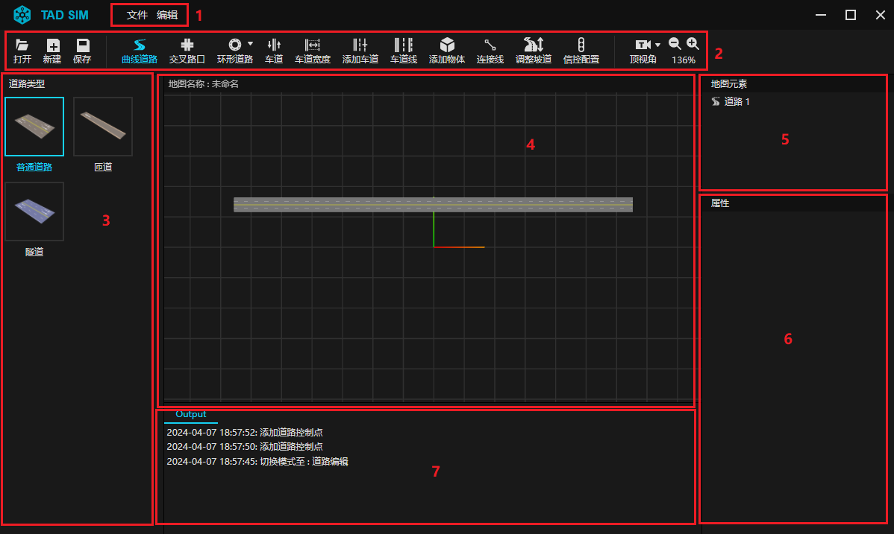</div><br>

| ID | 功能     | 说明                                                                                                                                                                                    |
|----|----------|---------------------------------------------------------------------------------------------------------------------------------------------------------------------------------------------------------------------------------------------------------------------------------------------------------------------------------------------------------------------------------------------------------------------------|
| 1  | 菜单栏   | 菜单栏提供各种编辑和查看操作.菜单栏包括以下顶级菜单及子菜单:  <br> - 文件: 新建、打开、保存、另存为、退出. <br> - 编辑: 撤销、重做、删除. <br> - 视图: 本地地图, 如编辑器操作台中已加载卫星 图片, 勾选显示卫星地图底图.取消勾选, 隐藏卫星地图底图 , 见介绍.. 了测设备覆盖范围.                                                                                                                                                                                                                                                                                                                 |
| 2  | 工具栏   | 工具栏用于选择当前编辑工具, 并进入下一步操作.工具栏包括以下项: <br> - 打开: 打开场地图操作, 具体流程见[打开页面](./304.地图编辑器.md#431-打开页面)介绍. <br> - 新建: 全新创建一个测地图, 新建流程具体见[新建页面](./304.地图编辑器.md#432-新建页面)介绍.  <br> - 保存: 保存正在编辑的地图流程具体见[保存页面](./304.地图编辑器.md#433-保存页面)介绍.  <br> - 曲线道路: 创建和布置道路的主要工具, 选中后绘制曲线道路, 见[曲线道路](./304.地图编辑器.md#434-曲线道路页面)介绍. <br> - 交叉路口: 选中后绘制曲线道路, 详情见[交叉路口页面](./304.地图编辑器.md#435-交叉路口页面)介绍. <br> - 环形道路: 选中后绘制环形道路, 详见[环形道路页面](./304.地图编辑器.md#436-环形道路页面)介绍 <br> - 车道: 对所选车道进行选择、查看信息和删除, 具体操作见[车道页面](./304.地图编辑器.md#437-车道页面)介绍. <br> - 车道宽度: 选中自定义车道宽度特征, 具体操作见[车道宽度页面](./304.地图编辑器.md#438-车道宽度页面)介绍. <br> - 添加车道: 选中道路, 可以对原有道路添加车道, 具体操作[添加车道页面](./304.地图编辑器.md#439-添加车道页面)介绍. <br> - 车道线: 编辑当前选中车道线的属性, 包括类型、颜色、宽度、虚线单位长度、间隔距离、相位移、双线间距等, 具体操作见[车道线页面](./304.地图编辑器.md#4310-车道线页面)介绍. <br> - 添加物体: 选中后界面左侧显示可添加的元素库, 点击添加相应物体元素, 详情见[添加物体页面](./304.地图编辑器.md#4311-添加物体页面)介绍. <br> - 连接线：用于编辑交叉路口的车道之间的连接方式，详情见[连接线](./304.地图编辑器.md#4312-连接线页面)   <br> - 调整坡道: 选中自定义坡道特征, 具体操作见[调整坡道页面](./304.地图编辑器.md#4313-调整坡道页面).  <br> - 信控配置:用于配置当前场景中包含的信控⽅案, 见[信控配置](./302.场景编辑器.md#245-信控配置页面)页面.      <br> - 视角切换: 地图编辑状态下可以切换视角效果, 目前支持: 顶视角及透视角, 具体操作见[视角切换页面](./304.地图编辑器.md#4314-视角切换页面)介绍. <br> - 视窗放大缩小: 支持放大缩小阈值(0.1%-1000%) (用户滚动鼠标中间滚轮亦有放大或缩小编辑器视图效果). |
| 3  | 元素库   | 提供地图编辑元素, 可鼠标点击元素, 长按将元素拖动至编辑界面中. <br> - 道路类型: 目前支持普通道路（4车道）、隧道、匝道.                                                                                                                              |
| 4  | 编辑界面 | 用于绘制路网.  <br> - 地图名称: 显示当前地图名称.                                                                                                                                                                                               |
| 5  | 地图元素 | - 曲线道路: 显示已绘制的各个曲线道路(编号为123...). <br> - 三维模型: 包括杆、牌、灯, 每一个模型有绑定的道路.                                                                                                                                                                                                                                  |
| 6  | 属性栏   | 选中地图元素后出现该元素的属性, 可对其进行编辑 <br> - 总长度: 当前道路的长度信息.  <br> - 位置: 当前选中元素的卫星信息.  <br> - 曲率: 包括选中控制点最大曲率半径和当前曲率半径, 曲率半径越大越圆滑, 默认最大曲率半径为1000m.                                                                                                                                                                                              |
| 7  | Output   | 记录绘制界面操作的信息.                                                                |


## 4.2. 菜单栏
- 支持文件新建、打开、保存、另存为, 具体见下述工具栏中的相关操作说明.

<div align="center">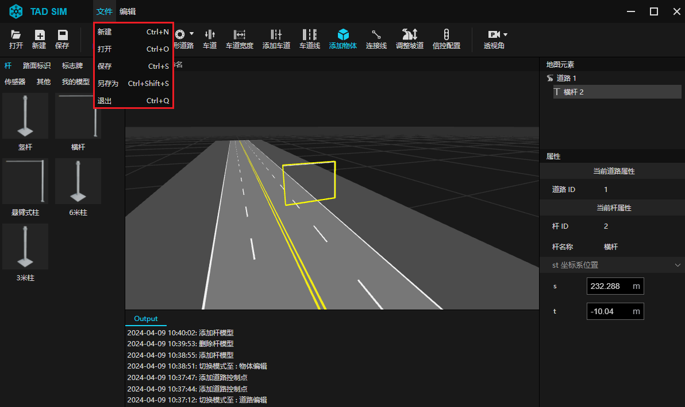</div><br>

- 同时支持对已完成的编辑进行撤销、重做及删除操作.

<div align="center">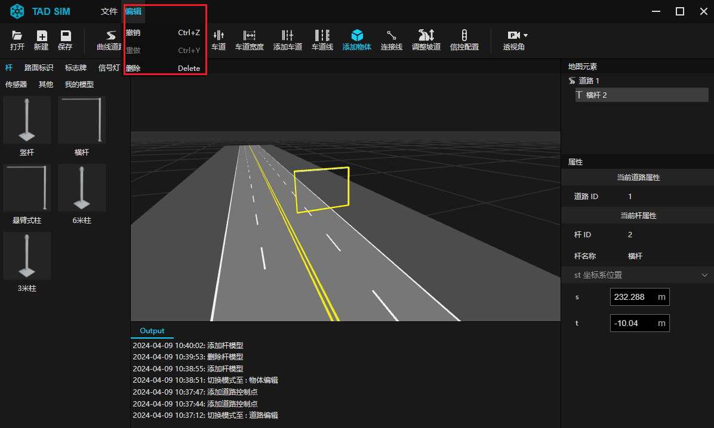</div><br>


## 4.3. 工具栏
### 4.3.1. 打开页面

- 在工具栏中单击 ``打开`` 按键, 出现 ``地图管理`` 弹窗.
- 同样, 在菜单栏中 ``文件`` 下拉框中, 点击 ``打开``, 出现相同弹窗.

<div align="center"></div><br>

- 在目标地图右侧, 点击 ``打开`` 按钮, 即可打开相应地图.

<div align="center">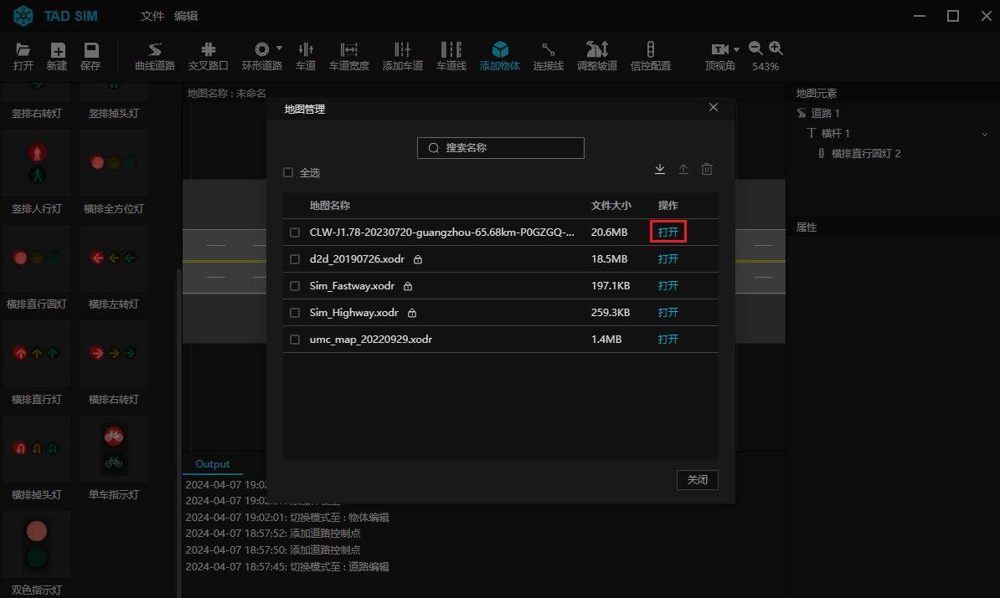</div><br>


### 4.3.2. 新建页面

- 在工具栏中单击 ``新建`` 图标, 或在菜单栏中 ``文件`` 下拉框中, 点击 ``新建``, 即可在提示弹框中选择是否保存当前编辑地图.

<div align="center">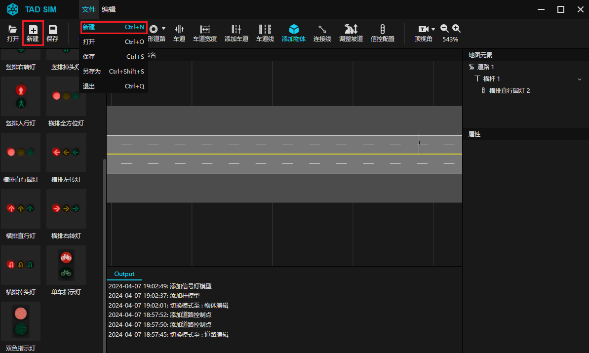</div><br>

- 选择后, 即可出现新的地图编辑窗口, 对新地图进行编辑.

<div align="center"></div><br>


### 4.3.3. 保存页面

- 在工具栏中单击 ``保存`` 图标, 或在菜单栏中 ``文件`` 下拉框中, 点击 ``保存``, 对当前地图进行命名及保存.

<div align="center">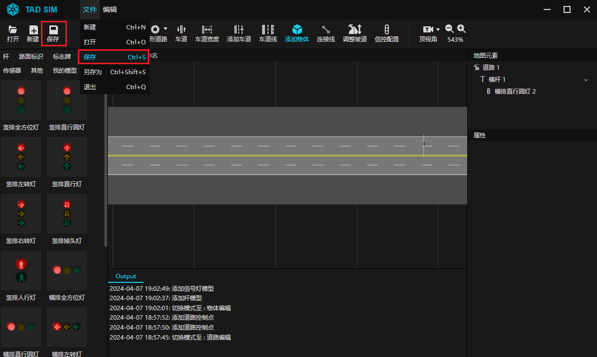</div><br>

- 支持 OpenDRIVE 1.4 和 1.5 格式保存.

<div align="center"></div><br>


### 4.3.4. 曲线道路页面

曲线道路工具是创建和布置道路的主要工具.

在工具栏选中 ``曲线道路`` 图标后, 用户可在编辑界面中, 绘制曲线道路. ``曲线道路`` 模式下包含2个配置项, 默认 ``普通道路`` (双向双车道), 点击 ``匝道`` 可切换 ``匝道`` 编辑模式.

<div align="center">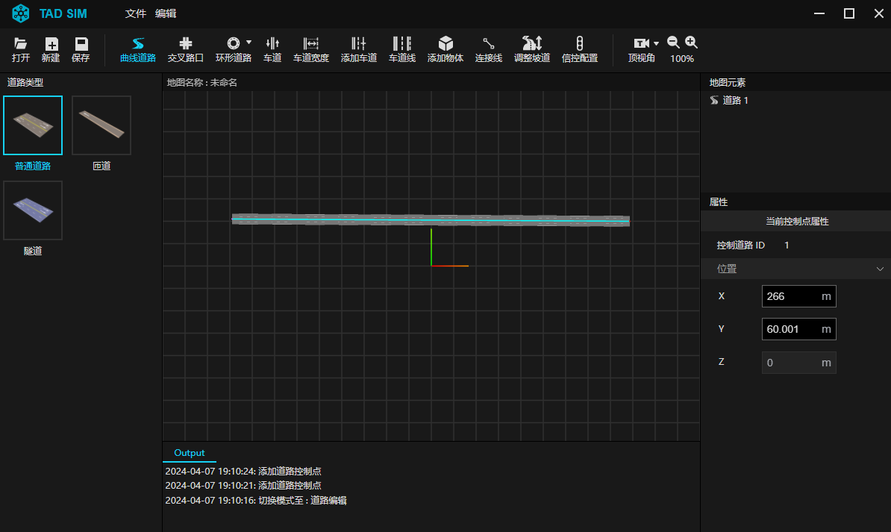</div><br>


- **界面大小调整**:
  - 滚动可放大或缩小界面视角大小.
- **绘制道路**:
  - 选择 ``曲线道路`` 工具, 右键连续单击其他位置, 创建道路控制点, 可绘制道路.
- **延长路段**:
  - 选中道路末端控制点, 拖动道路控制点可延长道路. 或选中道路端面, 鼠标右键单击其他位置, 可延长当前道路并增加控制点.
- **移动路段位置**:
  - 鼠标左键选中车道中心线, 长按拖动道路中心线, 可移动该路段位置.(目前仅支持单一路段的移动)
- **删除路段**:
  - 选中目标路段, 键盘点击 ``delete``. 或点击菜单栏中 ``编辑`` 下拉框 ``删除`` 即可.
- **创建道路控制点**:
  - 拾取曲线道路工具, 鼠标右键单击创建道路控制点.
- **选中道路控制点**:
  - 鼠标左键单击选中目标路段, 道路高亮显示, 并且控制点通过浅蓝色线显示和连接.
  - 左键单击选中目标路段后, 拖动鼠标左键框选, 可框选多个控制点.
- **移动道路控制点**:
  - 左键单击选中并拖动所需的控制点以将其移动, 同时改变道路形态.
- **插入道路控制点**:
  - 鼠标左键选中车道中心线, 右键添加道路控制点.
- **删除道路控制点**:
  - 选中道路控制点, 键盘点击 ``delete``, 或点击菜单栏-编辑-删除即可.
- **道路控制点坐标**:
  - 单击鼠标左键选中某道路控制点.
  - ``属性面板`` 中显示此控制点的精确位置, 可编辑


### 4.3.5. 交叉路口页面

在工具栏选中 ``交叉路口`` 图标后, 用户可在编辑界面中, 绘制交叉路口.

<div align="center"></div><br>

交叉路口工具具体交互说明如下:
- **绘制路口**
  - 点击交叉路口工具后, 鼠标左键依次点击需要连接的道路端面.如上图, 选中道路端面时应为橙色高亮状态.点击后连接四条道路形成交叉路口.
- **在已有路口上移除道路连接**
  - 选中路口后, 点击已连接的道路端面.
- **删除已有路口**
  - 选中路口后, 键盘点击 ``delete`` 或在菜单栏"编辑"下拉框中点击 ``删除``, 可删除当前路口.
- **结束编辑当前路口**
  - 按回车键或鼠标点击道路端面以外位置.


### 4.3.6. 环形道路页面

在工具栏选中 ``环形道路`` 图标后, 用户可在编辑界面中, 绘制环形道路.

<div align="center">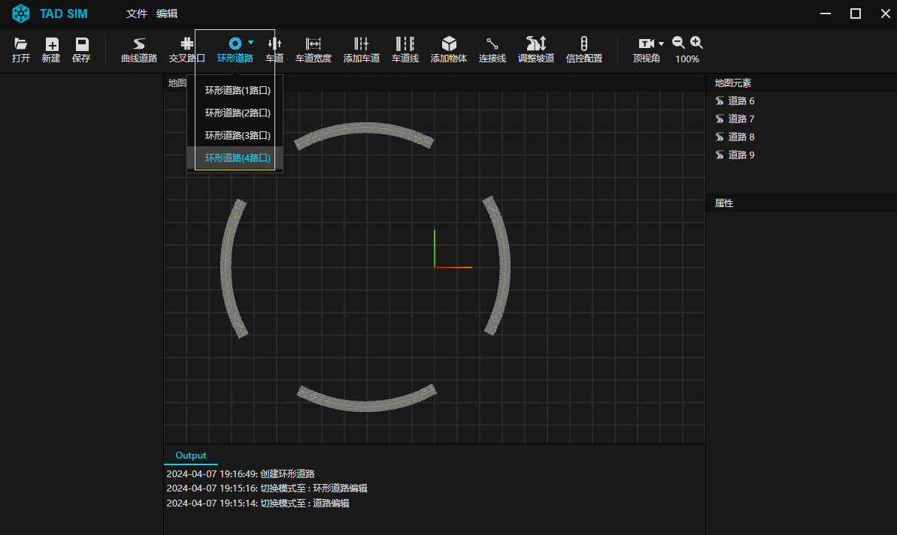</div><br>

环形道路工具具体交互说明如下:
- **绘制环形道路**
  - 鼠标左键点击目标位置, 随后出现设置弹窗, 输入环形道路的期望道路半径, 设定完成后即以目标位置为圆心, 出现相应半径的环形道路.
  - 或者在编辑界面中, 鼠标左键点中目标位置后长按拖动, 即可自动生成, 以该位置为圆心的相应半径环形道路.
- **扩展"环形道路"功能**
  - 支持1、2、3、4个出入口的环形道路创建、新建.
- **移动环形道路**
  - 选中环形道路, 鼠标左键长按拖动, 可平移环形道路.
- **删除环形道路**
  - 选中路口后, 键盘点击 ``delete`` 或在菜单栏 ``编辑`` 下拉框中点击 ``删除``, 可删除当前路口.(最少可以删除至四个控制点)
- **编辑环形道路形态**
  - 道路创建完成后, 点击 ``曲线道路`` 工具, 选中道路后, 即显示五个道路控制点, 包括道路起终点及环形道路四角点, 选中控制点后, 长按拖动, 可对环形道路形态进行编辑.
  - 选中某一控制点后, 属性栏中, 可以对该控制点的位置及该位置的道路曲率进行配置.
- **删除环形道路控制点**
  - 选中道路控制点后, 键盘点击 ``delete``, 或在菜单栏 ``编辑`` 下拉框中点击 ``删除``, 即删除控制点.
- **新增环形道路控制点**
  - 鼠标悬浮于控制点的连线上, 连线高亮显示后, 点击鼠标右键即可在鼠标位置新增控制点.

<div align="center">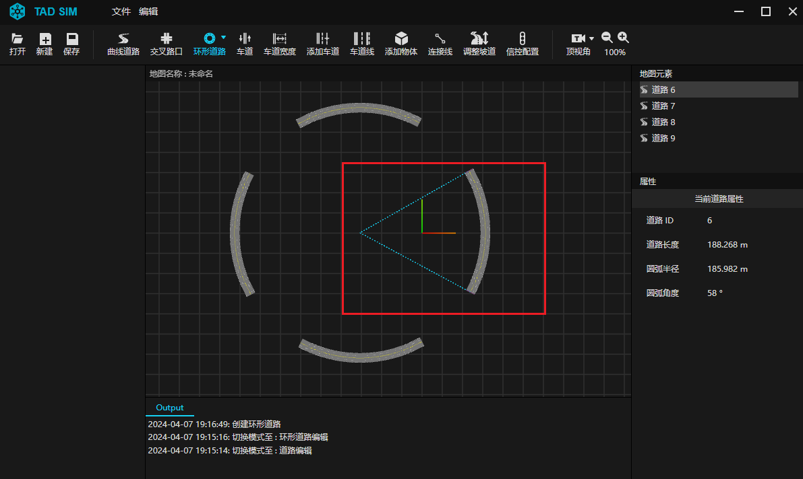</div><br>

<div align="center">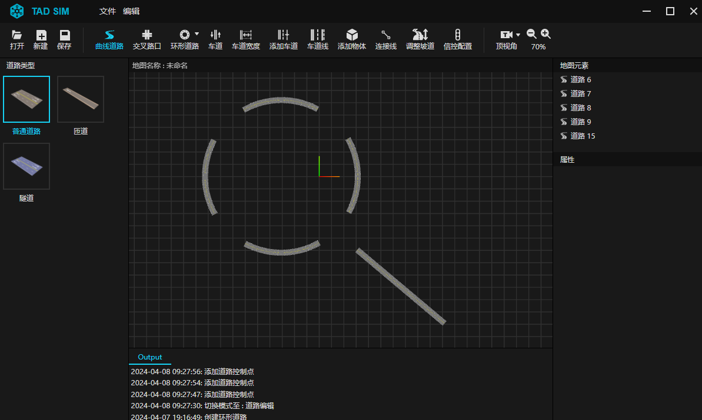</div><br>

<div align="center">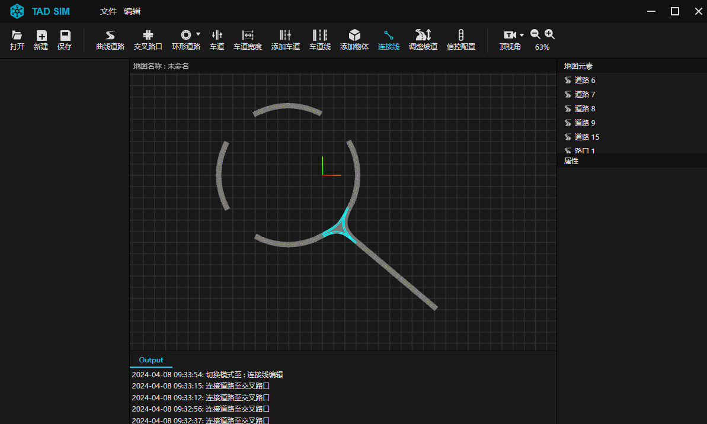</div><br>


### 4.3.7. 车道页面

在工具栏点击"车道"图标, 可对所选车道进行选择、查看信息和删除.

<div align="center">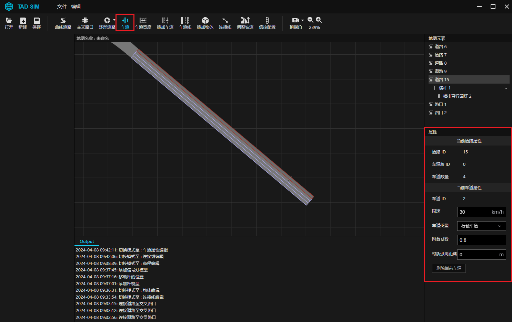</div><br>

车道工具具体交互说明如下:
- **选中道路**
  - 点击选中道路, 道路线呈淡紫色.
- **鼠标悬停在车道**
  - 车道两侧车道线呈青色.
- **选中车道**
  - 点击选中车道, 两侧车道线变成红色.
- **删除车道**
  - 选中车道后, 键盘点击 "delete" 键删除车道.
````{note}
注：无法删除道路或任意一侧道路的全部车道.
````
- **车道属性查看及编辑**
  - 选中道路后可以在右侧查看及编辑车道属性, 包括车道类型及车道限速.
  - 用户可以选择车道类型, 目前内设 19种车道类型. 同时, 可以对车道进行车辆限速, 最高车速范围在 5km/h～120km/h 之间, 默认情况下自动打开车道限速.

<div align="center">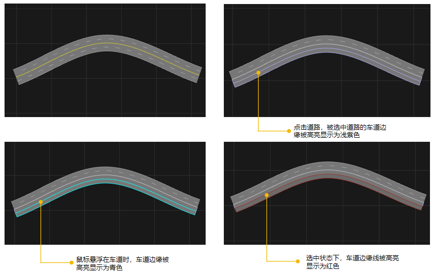</div><br>


<div align="center">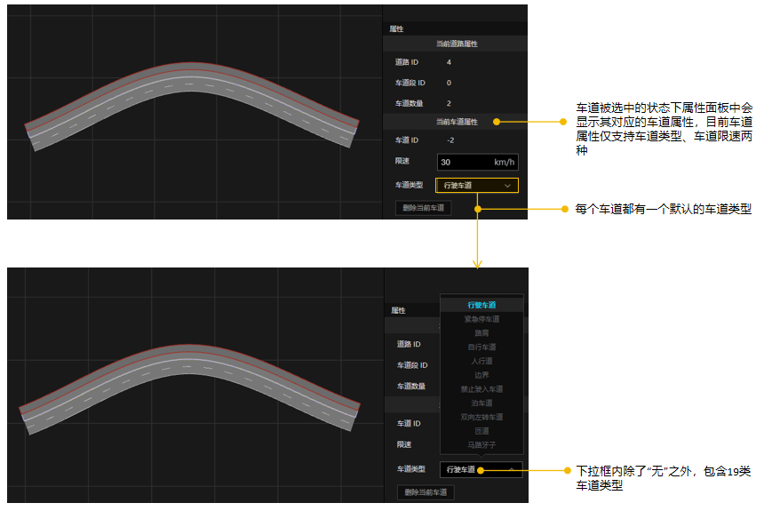</div><br>


### 4.3.8. 车道宽度页面

在工具栏点击 ``车道宽度`` 图标, 可对所选车道宽度进行调整.

<div align="center">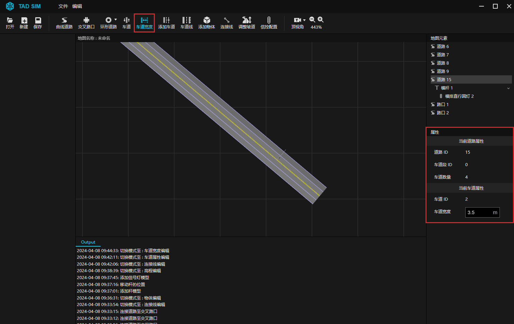</div><br>

车道宽度工具具体交互说明如下:
- **选中道路**
  - 点击道路任意一侧，则选择道路后的那一侧车道线会变成淡紫色, 表示选中状态.
- **选择车道边缘线**
  - 鼠标悬浮并点击所要改变的车道边缘线, 边缘线呈青色.
- **调整车道宽度**
  - 选中车道边缘线, 长按鼠标左键拖动车道边缘线调整宽度, 松开鼠标后即完成修改.
- **设定车道宽度属性**
  - 默认情况下选择堆叠状态 (车道边界在堆叠状态下, 调整某一车道线位置, 外侧车道线相对被调整车道线宽度不变).
  - 用户也可取消堆叠状态 (车道边界在非堆叠状态下, 调整某一车道线位置, 外侧车道线相对道路中心线宽度不变).
  - ``车道宽度`` 栏可以输入数值(0.4m～99m) 设定宽度数值.

<div align="center">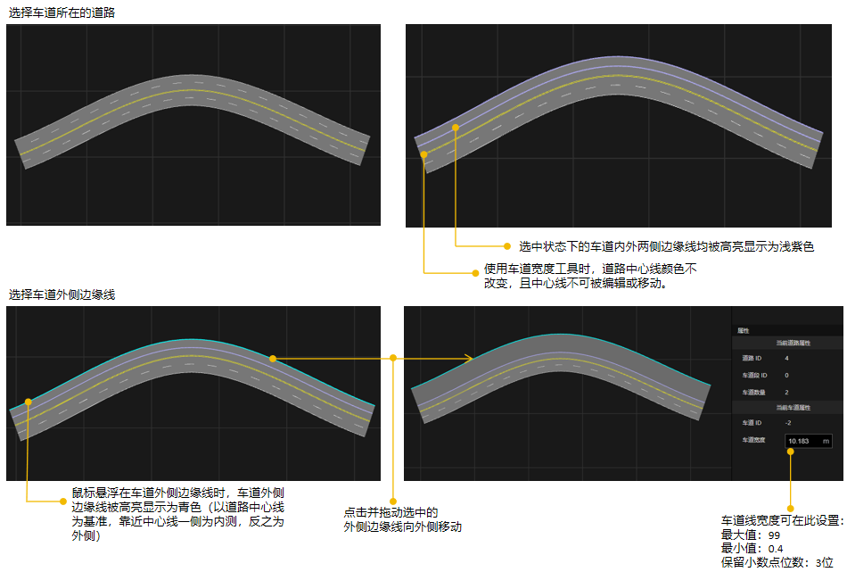</div><br>


### 4.3.9. 添加车道页面

在工具栏点击 ``添加车道`` 图标, 车道特征进行编辑.

<div align="center">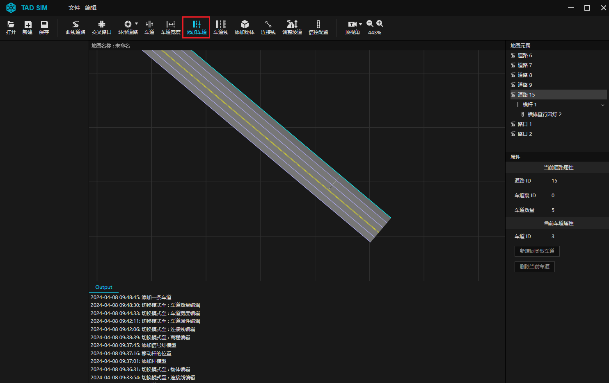</div><br>

添加车道工具具体交互说明如下:
- **选择车道**
  - 点击要选择的车道后所有车道边缘线会变成淡紫色, 表示选中状态.
- **鼠标悬停在车道**
  - 当鼠标悬停在所要改变的车道外侧边缘线时, 车道外侧边缘线时呈青色.
- **添加车道**
  - 点击车道外侧边缘线, 会在所点击的车道外侧邻位生成一个车道.

<div align="center"></div><br>


### 4.3.10. 车道线页面

在工具栏点击 ``车道线`` 图标, 车道线特征进行编辑.

<div align="center">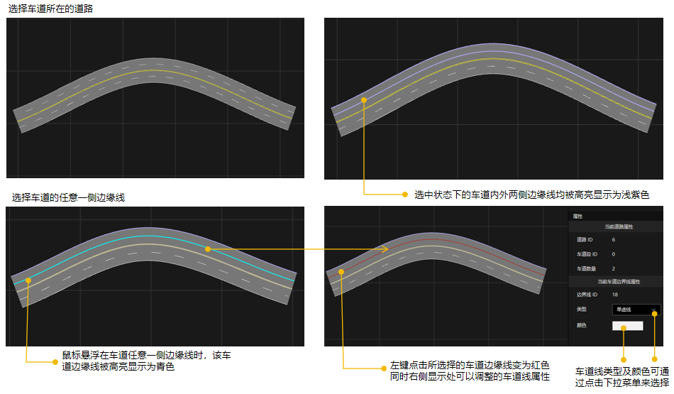</div><br>

车道线工具具体交互说明如下:
- **选择车道**
  - 点击车道后, 车道两侧边缘线均呈浅紫色.
- **鼠标悬停在要编辑的车道线**
  - 车道线呈青色.
- **编辑车道线特征**
  - 左键点击选择车道线后, 车道线变为红色，同时通过右侧的属性窗口可以编辑当前选中车道线的属性, 包括车道线类型、颜色等.


### 4.3.11. 添加物体页面

在工具栏点击 ``添加物体``, 可在地图中添加物体元素.

<div align="center">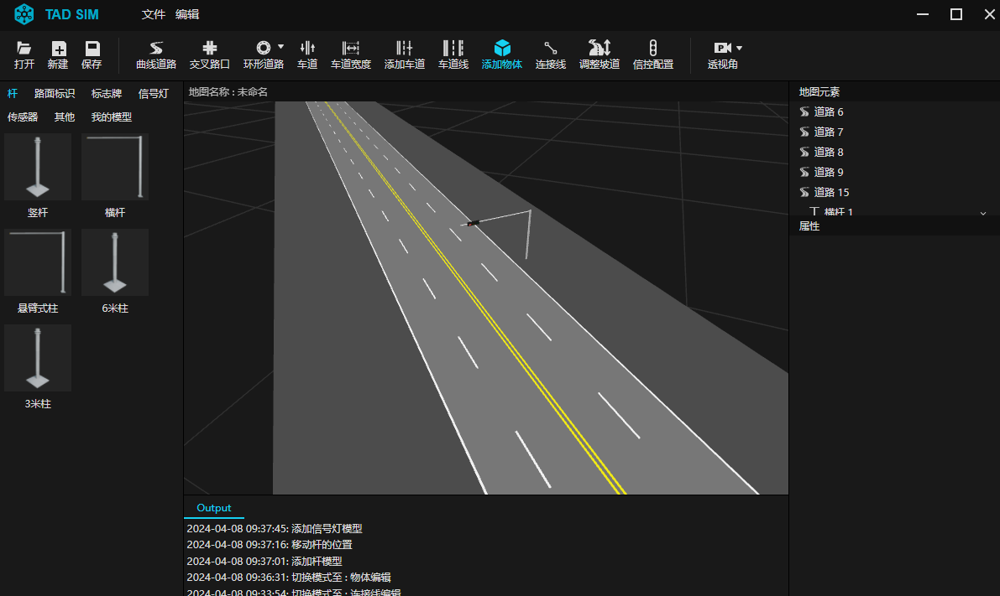</div><br>

添加物体工具具体交互说明如下:
- 在左侧元素库中, 显示所有可以添加的物体元素, 包括杆、牌、灯、线、路侧设备.可通过点击元素, 长按拖动至编辑界面中进行物体添加.
- 对于信号灯及标志牌的添加, 需先将杆元素添加至道路边缘可放置区域, 再添加牌或灯元素, 放置于杆元素上.
- 页面右侧, 展示出物体的属性, 用户可对其进行编辑设定.
- 另外, 路测设备的添加目前已支持包括摄像头、毫米波雷达、激光雷达以及RSU等在内的重要设备.
- 在 ``添加物体`` 一栏中，可点击选择导入自定义三维模型, 具体操作见 [自定义三维模型导入页面](./302.场景编辑器.md#2210-自定义三维模型导入).


### 4.3.12. 连接线页面

在工具栏点击 ``连接线``, 可对道路交叉口的车道连接线特征进行编辑.

<div align="center">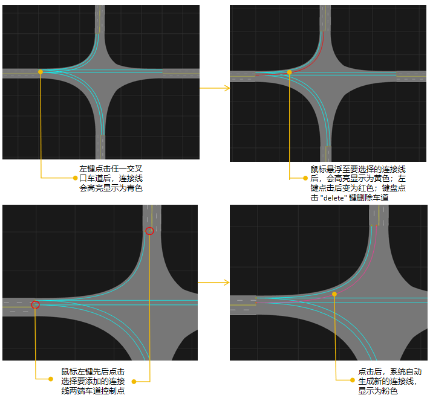</div><br>

添加或删减车道连接线具体交互说明如下:
- **删除连接线**
  - 鼠标左键点击选择任意交叉口连接道后，该道路的所有车道连接线会高亮显示为青色；
  - 鼠标点击选择要删除的车道线，键盘点击``delete``键删除车道.
- **添加连接线**
  - 鼠标左键先后点击要添加的连接线两端车道控制点；
  - 点击后，系统自动生成新的连接线，显示为粉色.


### 4.3.13. 调整坡道页面

在工具栏点击 ``调整坡道``, 可对道路坡道特征进行编辑.

<div align="center">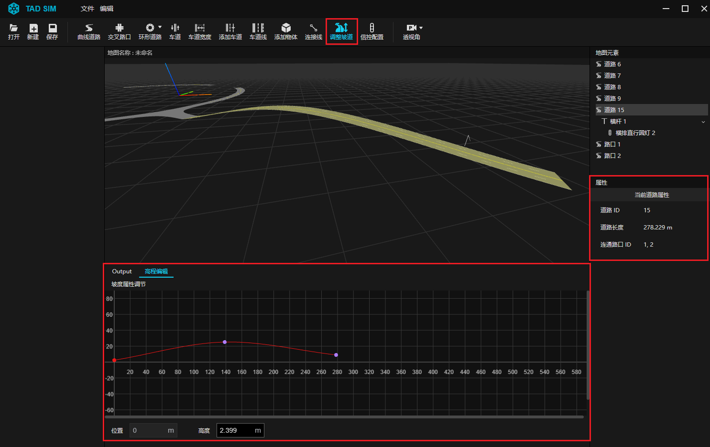</div><br>

调整坡道工具具体交互说明如下:
- **选中道路**
  - 鼠标悬停后所选道路的车道线变成青色, 点击后变成红色.
- **调整坡道属性**:
  - 界面下方出现 ``Height`` 栏, 即坡道调节属性, 包括可视化且可编辑的坡道调节图、角度及长度编辑框.
  - 横坐标表示道路投影在地平面上的道路中心线的长度(单位为m), 也就是道路绘制的起点至终点的投影总长度, 纵坐标表示道路离地面的高度(单位为cm, 负的表示在地平线之下).
  - 红线为道路投影在垂面的映射曲线, 且红线左右两端有两个控制点, 可以长按鼠标拖动控制点调整坡道形状, 同时, 出现控制点 ``位置``、``高度``信息, 可以对其进行数值设定.
- **添加控制点**
  - 右键曲线可以添加控制点.
- **位置**:
  - 控制点横坐标位置.
- **高度**:
  - 控制点纵坐标位置.


### 4.3.14. 视角切换页面

在工具栏点击 ``视角切换`` 图标, 支持编辑界面 ``顶视角`` 及 ``透视角`` 编辑.

<div align="center">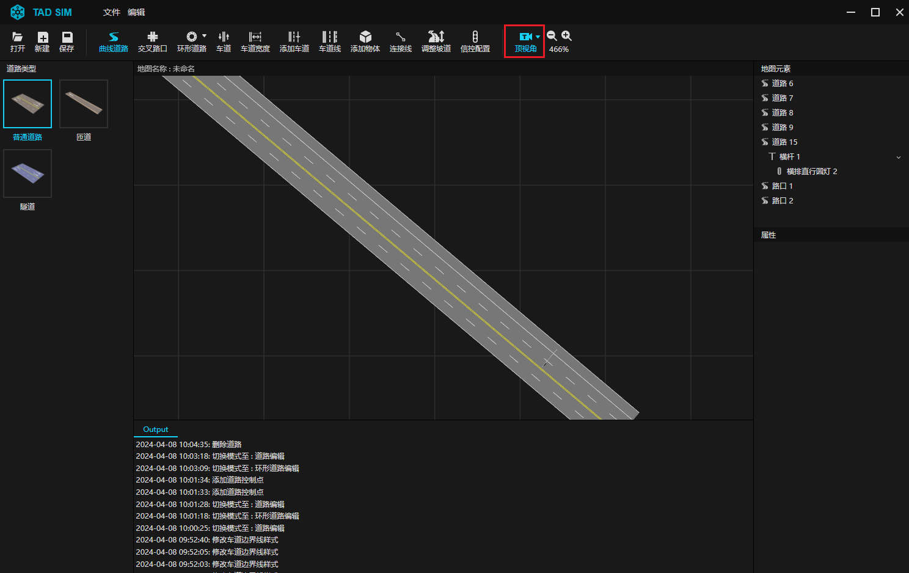</div><br>

<div align="center">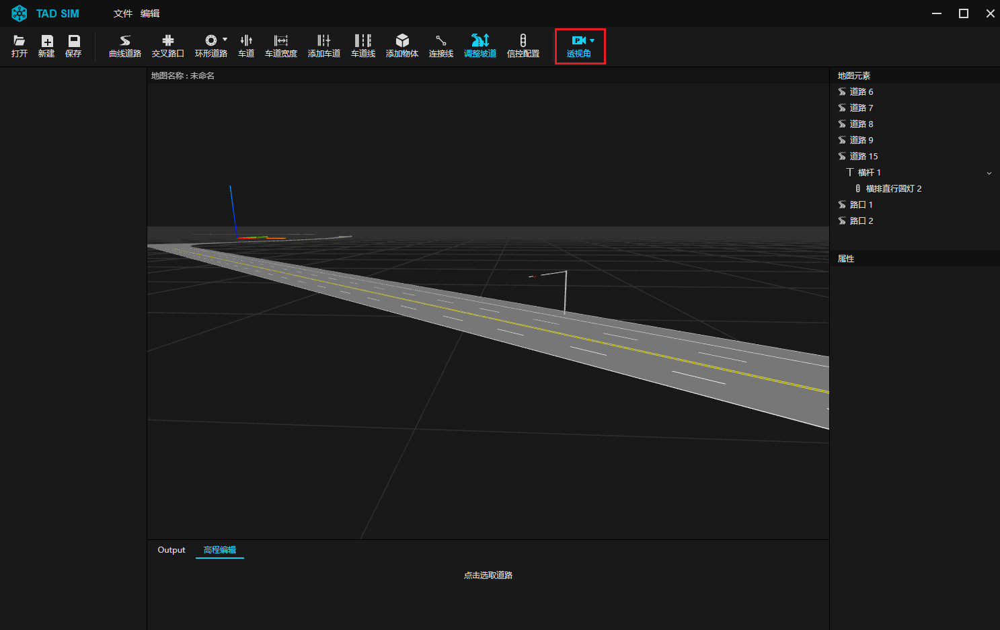</div><br>


### 4.3.15. 路面形貌页面

````{warning}
当前版本暂不提供该功能，敬请期待.
````

点击 ``路面形貌``, 后进入路面形貌配置页面, 选择特定一条道路时, 可配置当前道路与 OpenCRG 的关联关系, 支持添加、删除 OpenCRG 文件.

<div align="center">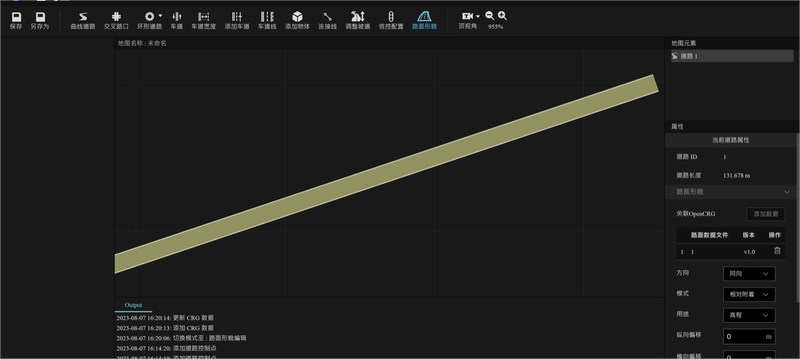</div><br>

路面形貌工具具体交互说明如下:
- **方向**
  - CRG 数据集相对道路的方向, 包括同向和反向.
- **附加模式**
  - 包括相对附着、绝对附着、真实、全局.
- **物理用途**
  - 包括高程、摩擦.
- **纵向偏移**
  - CRG 中心线与道路的参考线之间的 s 方向偏移.
- **横向偏移**
  - CRG 中心线与道路的参考线之间的 t 方向偏移.
- **高度**
  - CRG 中心线与道路的参考线之间的 z 方向偏移.
- **比例因子**
  - 用于道路表面描述z方向比例因子.
- **航偏角**
  - CRG 中心线与道路参考线之间的航向角/偏向角偏移 (只用于真实模式, 默认为0.0).


## 4.4 快捷键操作
| 操作                 | 说明                                 |
|----------------------|------------------------------------|
| 鼠标右键单击         | 绘制道路控制点, 在控制线上添加控制点 |
| 鼠标右键连续单击     | 快速绘制路网                         |
| 鼠标中键滚动         | 放大缩小视图                         |
| 鼠标右键长按拖动     | 平移视图                             |
| Alt+鼠标左键长按拖动 | 旋转视图                             |
| Delete               | 删除                                 |
| Ctrl+N               | 新建                                 |
| Ctrl+S               | 保存                                 |
| Ctrl+Q               | 退出                                 |
| Ctrl+Z               | 撤销上一步操作                       |
| P                    | 自由视角                             |
| T                    | 顶视角                               |
