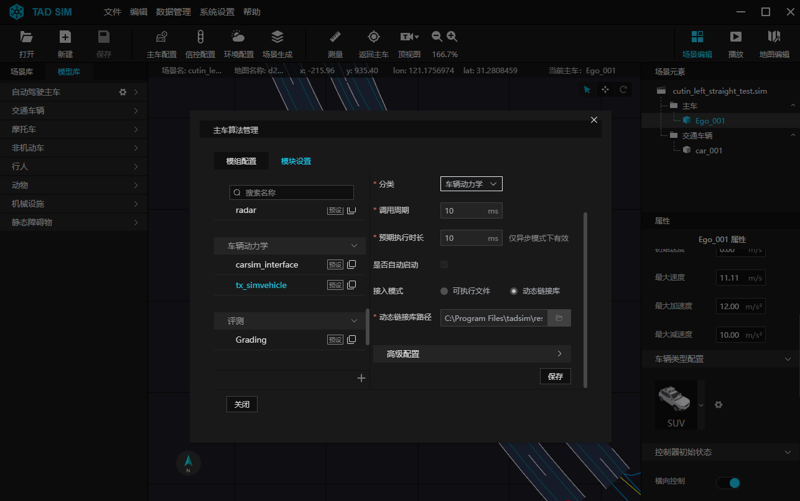
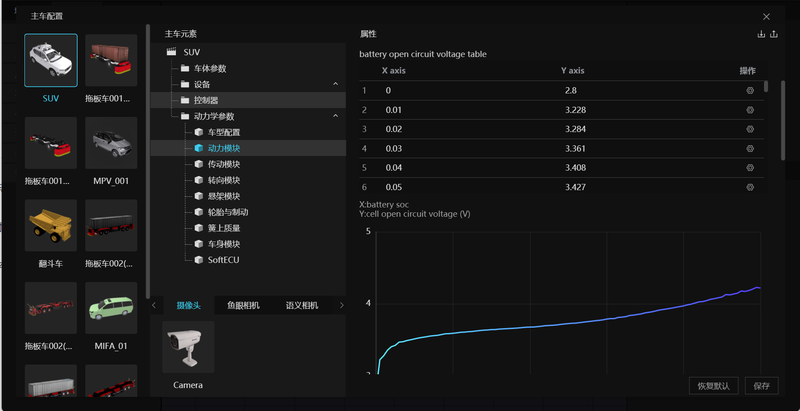
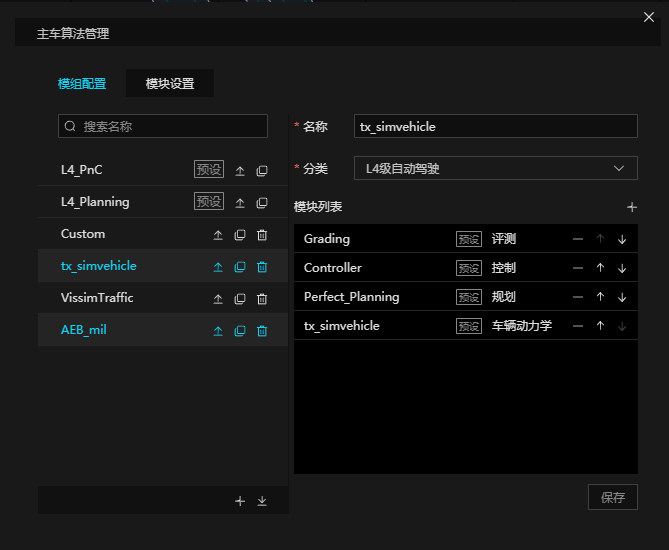
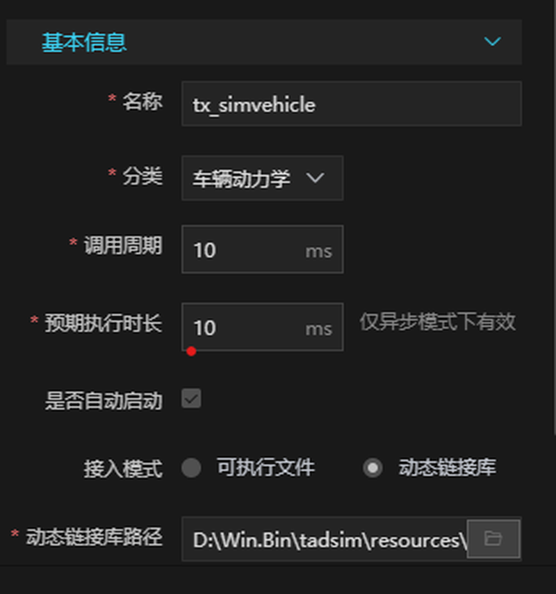
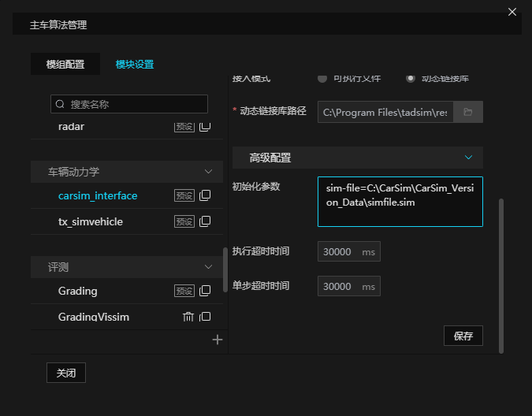
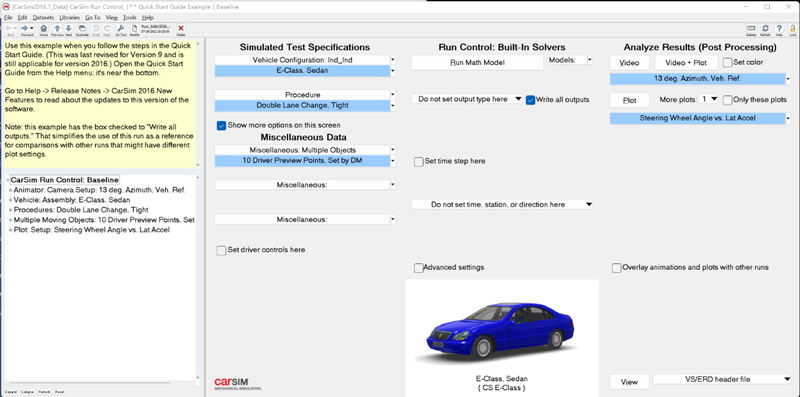
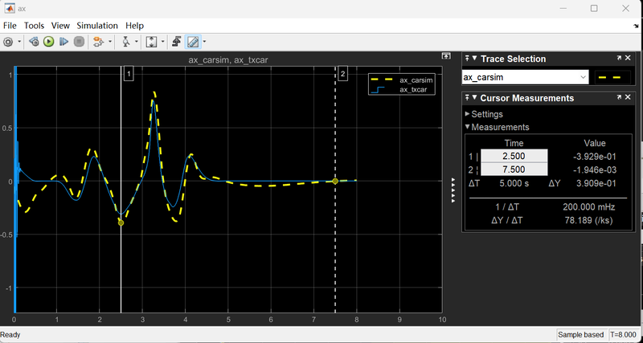
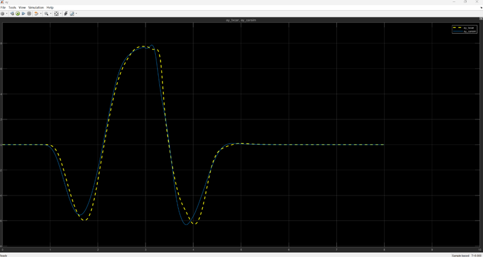

# 5. 动力学仿真

## 5.1 模块功能

TAD Sim 内置 27 自由度高精度动力学模型, Windows + Linux 不同系统部署, 支持使用独立的动力学参数集文件, 该动力学模型整体采用基于 grpc 的 client-server 模式设计, 动力学模型作为 server, client 可以设置动力学参数, 请求动力学运行, 获取动力学输出等.

## 5.2 动力学仿真模块配置

在 TAD Sim 的强大功能中, 主车算法管理界面是您实现精细化控制的关键. 通过以下简单而直观的步骤, 您可以轻松进入``主车算法管理`` 界面, 并对车辆动力学模块进行个性化设置.
- 启动 TAD Sim 单机版
- 访问数据管理菜单
- 选择主车算法管理
- 进入模块设置
- 配置车辆动力学模块

进入主车算法管理界面, 打开 TAD Sim 单机版, 在菜单栏 ``数据管理`` 下拉框中点击 ``主车算法管理`` 按钮, 进入 ``模块设置`` 界面, 点击 ``车辆动力学`` 模块, 设置动力学模块.

<div align="center"></div><br>

### 5.2.1 动力学模型介绍

TAD Sim 提供了 `tx_simvehicle` (乘用车动力学模型) 作为核心被控对象, 即 ``plant model`` , 它为仿真的真实性和有效性提供了坚实的基础.

``tx_simvehicle`` 模型的设计理念在于提供一个多功能、高适应性的动力学模拟平台. 它不仅支持传统燃油车辆, 也完美适配电动汽车, 无论是前驱、后驱还是四驱系统, ``tx_simvehicle`` 都能够精确模拟, 确保仿真结果的全面性和准确性.

此外, ``tx_simvehicle`` 模型的应用范围极为广泛, 它可以无缝集成于模型在环 (MIL)、软件在环 (SIL) 和硬件在环 (HIL) 等多种仿真环境中. 这种灵活性使得 ``tx_simvehicle`` 成为自动驾驶系统开发和测试的理想选择, 无论是在早期的概念验证阶段, 还是在后期的产品验证阶段, ``tx_simvehicle`` 都能够提供强大的支持.

通过 ``tx_simvehicle`` 模型, 系统能够模拟各种驾驶场景和条件, 为自动驾驶技术的研发和应用提供了一个可靠、高效和安全的平台.


### 5.2.2 动力学模型配置

在构建精确的车辆行为模型时, 动力学模型采用了先进的参数化建模技术. 这一方法允许您通过直观的前端界面轻松编辑和调整动力学参数集, 从而实现对车辆特性的高度定制化模拟.

通过加载生成的动力学参数集, 模型能够精确地反映车辆的动态响应和行为特性. 这不仅为车辆控制系统的设计和验证提供了坚实的基础, 也为仿真结果的真实性和可靠性提供了保证.

进一步地, 当动力学模型与 OpenDRIVE 高精度地图相结合时, 它能够自动生成路面高程数据, 细致模拟路面起伏对车辆行驶的影响. 这对于感知算法、规划控制算法等关键技术的研发至关重要, 因为它们需要在复杂多变的路面条件下进行精确的计算和决策.

通过这种高度集成和自动化的仿真环境, 系统不仅提高了仿真的效率, 还极大地增强了仿真结果的实用性和准确性. 无论您是在进行车辆动力学分析, 还是在开发自动驾驶算法, 动力学模型都将为您提供强有力的支持.


**动力学参数配置如下图所示:**

<div align="center"></div><br>

````{note}
注: 动力学模型中的轮胎模型支持 TNO MF 6.2文件(.tir), 动力学模型参数集 (txcar.json) 会引用该文件, 必须保证两者位于同一个目录下.
````

**典型的动力学模型初始化参数配置, 如下所示:**
- ``LicFile``=D:\\Win.Bin\\tadsim\\resources\\app\\service\\tx_simvehicle\\txcar.lic
- ``ParaFile``=D:\\Win.Bin\\tadsim\\resources\\app\\service\\tx_simvehicle\\txcar.json
- ``enableTerrain``=1
- ``cloudEnv``=0
- ``useCatalog``=1

其中:
- ``LicFile``: 表示动力学的 license 文件
- ``ParaFile``: 表示动力学的参数文件, 当 useCatalog=1 时, 忽略该参数, 并使用 catalog 中指定的动力学参数文件
- ``enableTerrain``: 表示是否启用地形功能, 目前仅支持从 OpenDrive 构建, 1: ON, 0: OFF
- ``cloudEnv``: 表示当前是否为云仿真环境, 1: ON, 0: OFF
- ``useCatalog``: 表示是否使用 catalog 中关联的动力学参数文件, 1: ON, 0: OFF

**典型的算法组合配置如下图所示:**

<div align="center"></div><br>


### 5.2.3 动力学模型运行

动力学模型设计为 ``1000Hz`` 的高更新频率, 为了实现这一高频率的更新, 动力学模型采用了 ``10steps/10ms`` 的运行周期. 也就是说, 在 TAD Sim 仿真环境中, 模型每 ``10ms`` 就会被调用一次, 并且在这短短的 10ms 内, 模型将完成 10次更新. 这样的设计不仅保证了仿真结果的精确度, 还确保了模型能够及时响应各种动态变化, 从而更好地模拟现实世界中的车辆行为.

<div align="center"></div><br>

动力学模型接收的消息:
- control_v2.proto 消息, 对应的 TOPIC 为 ``CONTROL_V2``

发送的消息包含:
- location.proto, 对应的 TOPIC 为 ``LOCATION``
- vehState.proto, 对应的 TOPIC 为 ``VEHICLE_STATE``

对应 protobuf 的详细字段参考 [403.仿真消息说明](./403.仿真消息说明.md#3-仿真消息说明) 的定义.


### 5.2.4 与 CarSim 联合仿真

在 TAD Sim 的 ``主车算法管理`` 功能中, 您可以轻松地配置和集成 carsim_interface 模块, 从而实现与 CarSim 软件的联合仿真. 通过充分利用 TAD Sim 与 CarSim 的强大联合仿真能力, 可以为您的交通模型和控制系统设计提供更加全面和深入的测试环境.

在 ``主车算法管理`` 中, 进入`` 模块设置`` 界面, 针对 carsim_interface 模块, 配置其初始参数中指定 CarmSim 的 simfile.sim 工程文件路径, 如图所示.

并在模组配置添加 carsim_interface 模块, 应用模组配置, 运行后即可进行 CarSim 联合仿真.

<div align="center"></div><br>


### 5.2.5 从 CarSim 自动转换参数

为了确保用户能够在不同仿真平台之间无缝转换和利用动力学参数, 简化 CarSim 动力学参数到腾讯自定义动力学参数文件的转换过程, TAD Sim 专门提供了一款强大的参数自动转换工具: ``par_converter.exe`` (支持 windows, Ubuntu), 用于将 CarSim 动力学 .par (Run_xxx_all.par) 参数转化为腾讯定义的动力学参数文件(txcar.json).


par_converter.exe 位于 TAD Sim 单机版安装路径下 ``\resources\app\service\tx_simvehicle\``

使用步骤:
- 准备 CarSim 参数 .par 文件, 通过运行 CarSim 仿真可生成 ``Run_xxx_all.par\LastRun_all.par`` 文件
- 准备腾讯动力学参数模版文件, 默认路径位为 TAD Sim 安装路径 ``\resources\app\service\tx_simvehicle\txcar_template.json``
- 打开terminal, 运行以下命令(确保txcar_template.json所在的文件夹有写入权限)
  - ``.\par_converter.exe``
  - ``.\param\Run_0069fcbf-ebe8-4178-88a8-a6af67aeeda5_all.par``
  - ``.\param\txcar_template.json``
- par_converter.exe 会自动解析 .par 文件, 并将参数提取出来, 保存到 ``.\param\txcar_template.json.converted.json``
  - (不破坏 ``.\param\txcar_template.json`` 文件)文件中.
- 目前支持的CarSim版本及转化的参数:
    - CarSim 2016.1( E-Sedan车型)
        - ``Engine``
        - ``Transmission``
        - ``Differential``
        - ``Aerodynamic``
        - ``SprungMass``
        - ``K&C Suspension``
        - ``Steer``
        - ``Brake``
    - CarSim 2019.1( E-Sedan车型)
        - ``Engine``
        - ``Transmission``
        - ``Differential``
        - ``Aerodynamic``
        - ``SprungMass``
        - ``K&C Suspension``
        - ``Steer``
        - ``Brake``


### 5.2.6 精度说明

在 TAD Sim 中, 我们致力于提供与行业标准相匹配的仿真精度. 针对 CarSim 中的 E-Sedan 车型, 我们的模型经过精心设计和调整, 以确保与 CarSim 的精度达到 90% 以上.


在对标过程中, 我们特别关注了两个主要的影响因素:

- 驾驶员模型的差异: 驾驶员模型在车辆动力学仿真中起着至关重要的作用. 尽管两个平台的驾驶员模型可能存在差异, 我们通过精确的调整和优化, 确保了驾驶员行为的一致性和仿真的真实性;

- 车辆轮胎模型参数的匹配: 轮胎是车辆与路面接触的唯一媒介, 其性能参数对车辆动力学有着显著的影响. 为了实现高精度的对标, 我们努力寻找并使用规格类似的轮胎参数(.tir文件), 以尽可能地减少两个模型之间的差异.

通过对这些关键因素的深入分析和精确调整, TAD Sim 成功地再现了 CarSim E-Sedan 车型的动力学特性, 为用户提供了一个可靠和精确的仿真环境.


**下面以双移线工况(有代表性) 说明:**

<div align="center"></div><br>

- **60km/h双移线 -- ax:**

<div align="center"></div><br>

- **60km/h双移线 -- ay:**

<div align="center"></div><br>

- **60km/h双移线 -- 4个轮胎受力:**

<div align="center"></div><br>
