# 6. 传感器仿真

TAD Sim 单机版支持多种类型传感器仿真, 包括摄像头仿真、激光雷达仿真及毫米波雷达仿真. 在测试任务中, 主车可搭载多台传感器, 用户可通过 TAD Sim 单机版, 在创建场景时完成传感器配置. 传感器配置支持多维度参数自定义, 包括位置、频率及分辨率等.

点击主车模型右侧的图标, 页面中间弹出详情窗口, 显示三维主车模型预览, 按住鼠标左键可转动模型, 鼠标滚轮可缩放模型.配置主车模型元素的相关参数, 包括传感器模型、控制器模型、动力学模型等. 点击保存, 配置主车模型完成.

<div align="center"></div><br>

支持设备从下方的设备列表中拖拽到主车上, 设备列表显示的传感器名称和下方的传感器列表需要一致. 鼠标选中后拖拽到车上, 自动吸附到松开时的车上相应装配位置, 可通过右侧参数调节调整位置. 列表中选中一个传感器, 左侧视图需要高亮定位, 右侧基本信息需要显示该传感器信息. 在列表选中后可右键删除和 delete 键删除传感器, 支持按住 shift 和 ctrl 多选. 多选后, 右侧信息列表显示为空.

<div align="center"></div><br>


## 6.1 摄像头仿真

TAD Sim 支持摄像头仿真, 基于真实摄像头模型仿真, 平台提供默认配置参数, 并支持各参数自定义配置功能, 摄像头仿真依赖 Display 模块.

<div align="center"></div><br>

### 6.1.1 参数说明

| 名称       | 默认值 | 范围          | 含义                                                           |
|----------|--------|---------------|----------------------------------------------------------------|
| 位置X(cm)  | 0      | [-1000, 1000] | 安装位置, 坐标原点位于四轮中心的地面垂点                       |
| 位置Y(cm)  | 0      | [-1000, 1000] | 安装位置, 坐标原点位于四轮中心的地面垂点                       |
| 位置Z(cm)  | 171    | [0, 1000]     | 安装位置, 坐标原点位于四轮中心的地面垂点                       |
| 旋转X(°)   | 0      | [-180, 180]   | 安装角度                                                       |
| 旋转Y(°)   | 0      | [-180, 180]   | 安装角度                                                       |
| 旋转Z(°)   | 0      | [-180, 180]   | 安装角度                                                       |
| 实例ID     | 0      | -             | 当配置了多个 display 时, 只有Display的实例ID一致时, 才会被处理 |
| 频率(Hz)   | 25     | [0, 1000]     | 拍照频率                                                       |
| 色彩模式   | 彩色   | 彩色/灰度     | -                                                              |
| 水平分辨率 | 1920   | 整数          | 图像尺寸, 像素                                                 |
| 垂直分辨率 | 1208   | 整数          | 图像尺寸, 像素                                                 |
| 细腻度     | 0      | [-5.0, 5.0]   | 正数细腻, 负数粗糙.细腻会增加渲染负担                          |
| 模糊       | 0      | [0, 1]        | \-                                                             |
| 运动模糊   | 0      | [0, 1]        | \-                                                             |
| 光晕强度   | 0      | [0, 1]        | \-                                                             |
| 噪声强度   | 0      | [0.0, 1.0]    | \-                                                             |
| 暗角       | 0.4    | [0.0, 1.0]    |                                                                |
| 泛光 bloom            | 0.675                                                                                                                                                             | [0.0, 1.0]                                                                             |                                                                                                                                                                                                              ||||
| 曝光模式        | 0                                                                                                                                                                 | 自动0 <br> 手动1(手动时:快门速度, ISO, 孔径参数有效)                                    |                                                                                                                                                                                                              |
| 曝光补偿        | 1                                                                                                                                                                 | -15.0～15.0                                                                             | 曝光的对数 2^n 调整, 负值变暗, 正值加亮                                                                                                                                                                        |
| 快门速度        | 60                                                                                                                                                                | 1.0\~200                                                                               | 像素亮度B=曝光 * 场景表面亮度L <br> 曝光=1/ (孔径^2/快门速度*100/ISO)                                                                                                                                           |
| ISO             | 100                                                                                                                                                               | 1.0\~无穷                                                                              | 1.0\~无穷                                                                                                                                                                                                    |
| 孔径(光阑、光圈) | 4                                                                                                                                                                 | 1.0\~32.0                                                                              | 1.0\~32.0                                                                                                                                                                                                    |
| 色温            | 6500                                                                                                                                                              | 1500～15000K                                                                            | 色温                                                                                                                                                                                                         |
| 白色调          | 0                                                                                                                                                                 | -1.0～1.0                                                                               |                                                                                                                                                                                                              |
| 镜头透镜率      | 98                                                                                                                                                                | 1.0～100.0%                                                                             |                                                                                                                                                                                                              |
| 畸变参数        | k1=-5.3336804278253547e-001, <br> k2=4.5773462092698042e-001, <br> k3=-4.8360765272003647e-001, <br> p1=-2.3929586859060227e-003, <br> p2=1.8364297357014352e-003 | -                                                                                      | 分布表示k1,k2,k3,p1,p2                                                                                                                                                                                       |
| 内参形式        | 0                                                                                                                                                                 | 0:矩阵, 1:FOV, 2:感光器                                                                | \-                                                                                                                                                                                                           |
| 内参矩阵        | 1.9451674168728503e+003, <br> 0, <br> 9.4611889604089231e+002; <br> 0,1.9381372280069070e+003, <br> 6.1970485474739780e+002; <br> 0,0,1                           | 长度为9的数组 <br> 给出默认值的位置readonly <br> 其余位置值依次为fx, skew, cx, fy, cy | 当内参形式为矩阵时                                                                                                                                                                                           |
| 水平FOV(°)      | 60                                                                                                                                                                | [0, 180]                                                                               | 当内参形式为fov时                                                                                                                                                                                            |
| 垂直FOV(°)      | 36.28                                                                                                                                                             | [0, 180]                                                                               | 当内参形式为fov时                                                                                                                                                                                            |
| 感光器宽度(mm)  | 10                                                                                                                                                                | (0, 10000]                                                                             | 当内参形式为感光器时                                                                                                                                                                                         |
| 感光器高度(mm)  | 10                                                                                                                                                                | (0, 10000]                                                                             | 当内参形式为感光器时                                                                                                                                                                                         |
| 镜头焦距(mm)    | 10                                                                                                                                                                | (0, 10000]                                                                             | 当内参形式为感光器时                                                                                                                                                                                         |


### 6.1.2 数据获取

#### 6.1.2.1 共享内存

摄像头仿真共享地址为 ``Tadsim_Camera_{cameraID}``, 其中 cameraID 从前端传感器配置界面上获取 (如 ``Tadsim_Camera_1``).
开关设置方法为, 首先打开 ``Game.ini`` 文件, 文件路径如下:

- Windows 下:
  - ``C:\Users\用户名\AppData\Roaming\tadsim\data\service_data\display\Saved\Config\WindowsNoEditor\Game.ini``
- Ubuntu 下:
  - ``/home/用户名/.config/tadsim/Display/Saved/Config/LinuxNoEditor/Game.ini``

在 Game.ini 中添加如下内容:
```ini
[Sensor]
CameraMemShare=true
```

数据格式为二进制流, 数据定位如下:

| 占位长度  | 数据类型 | 含义                 |
|-----------|----------|--------------------|
| 4         | int      | 固定为 123456        |
| 8         | int64    | 时间戳 (逻辑时间)    |
| 4         | int      | 图像大小 = 4 * w * h |
| 4 * w * h | BGRA     | 图像数据             |


<!-- 参考: https://myst-parser.readthedocs.io/en/latest/syntax/code_and_apis.html#including-code-from-files -->

代码示例:
```{literalinclude}  ../../../../simcore/framework/examples/camera/memory_io.cpp
:language: cpp
```

#### 6.1.2.2 磁盘保存

摄像头仿真同时支持磁盘保存方式, 但由于图像数据 IO 很大, 且图像 jpeg 压缩也会消耗性能, 暂不推荐此方式.

在 Game.ini 中添加如下内容:
```ini
[Sensor]
CameraSaved=true
```

重启仿真软件, 图像数据即保存于:
- Windows 下:
  - ``C:\Users\用户名\AppData\Roaming\tadsim\service_data\display\Saved\SensorData``
- Ubuntu 下:
  - ``/home/.config/tadsim/Display/Saved/SensorData``


#### 6.1.2.3 PB 消息

首先需要打开 Display 的 PB 广播功能, 在 Game.ini 中添加如下内容:
```ini
[Sensor]
PublicMsg=true
```

然后通过订阅系统的消息, 来获取传感器数据 .TOPIC 为 ``DISPLAYSENSOR_{id}``,  其中 id 是算法的 id, 通过 Display 模块的运行参数 -topicid 指定, 默认为 0.

SensorPose 详细定义:

| 字段      | 类型   | 单位 | 说明   |
|-----------|--------|------|------|
| longitude | double | deg  | 经度   |
| latitude  | double | deg  | 纬度   |
| altitude  | double | m    | 高程   |
| roll      | float  | rad  | 滚角   |
| pitch     | float  | rad  | 俯仰角 |
| yaw       | float  | rad  | 航向角 |

Camera详细数据定义:

| 字段       | 类型       | 单位   | 说明                             |
|------------|------------|--------|--------------------------------|
| id         | int32      |        | 传感器ID                         |
| timestamp  | double     | ms     | 时间戳                           |
| type       | string     | string | 图片编码类型JPEG, PNG, EXR, BGRA |
| image_data | bytes      | 二进制 | 图像数据                         |
| width      | int32      | 像素   | 图像宽                           |
| height     | int32      | 像素   | 图像高                           |
| pose       | SensorPose |        | 位姿                             |

<!-- 参考: https://myst-parser.readthedocs.io/en/latest/syntax/code_and_apis.html#including-code-from-files -->
代码示例:
```{literalinclude}  ../../../../simcore/framework/examples/sensor_pb/sensor.cpp
:language: cpp
```

#### 6.1.2.4 GPU 显存共享

**a. IPC 概念**

CUDA IPC 机制允许将设备内存分配从一个进程共享到另一个进程. 见[官方例子](https://github.com/NVIDIA/cuda-samples/tree/master/Samples/0_Introduction/simpleIPC).

所需的步骤大致如下:
- 进程 A 分配 GPU 显存.
- 进程 A 获取步骤 1 中分配的 CUDA IPC 句柄 (handle).
- 进程 A 创建一个共享内存, 以便可以将步骤 2 中的句柄传送给进程 B.
- 进程 A 将句柄放入共享内存.
- 进程 B 从共享内存中选取句柄.
- 进程 B 使用句柄访问 CUDA 共享显存.

图像数据, 通过 IPC 方式, 传递给感知算法, 要求感知算法和 Display 模块在同一显卡中, 避免了图像传输的延时.

````{note}
注: IPC 功能仅限 Linux. 上述步骤中, 进程 A 为 Display 程序, 进程 B 为用户的程序.
````


**b. IPC 信息交换**

Display 创建的共享内存 (非显存) 地址为: ``Tadsim_Camera_{ID}_GPU``, 用户程序从该地址获取 IPC 必要的信息, 创建显存访问权限.

例如 id 为 0 的 camera 为 ``Tadsim_Camera_0_GPU``, 该数据在 ``reset`` 和 ``step`` 阶段有效.

| 字段        | 偏移 | 类型                 | 长度 | 含义                 |
|-------------|------|----------------------|------|--------------------|
| tag=123456  | 0    | int                  | 4    | 标识                 |
| timestamp   | 4    | int64                | 8    | 时间戳               |
| size        | 12   | int                  | 4    | 后续buf的长度 = 1024 |
| imgWidth    | 16   | int                  | 4    | 图像宽               |
| imgHeight   | 20   | int                  | 4    | 图像高               |
| memHandle   | 24   | cudaIpcMemHandle_t   | 64   | 显存地址句柄         |
| eventHandle | 88   | cudaIpcEventHandle_t | 64   | 事件句柄             |
| reserved    | 152  |                      | 888  | 保留, 无意义         |

````{note}
注: 在 reset 阶段, timestamp 保存的是 Display 执行 reset 的当前 unix 时间, 在 step 阶段, timestamp 保存的是当前的 step 逻辑时间. 由于 Display reset 较慢, 用户模块务必要校验 timestamp 是否是当前时间, 否则拿到的共享数据可能是旧的. TAD Sim 自带的例子里实现了 reset 校验和同步.
````

**c. IPC 共享格式**

图像数据和内存共享一样, 格式为 ``BGRA BGRA BGRA``......一共 ``width * height * 4字节``

**d. JPEG 质量**

 [Sensor]分组下进行质量配置, 在 Game.ini 中添加如下内容:
```ini
[Sensor]
JpegQuality=85
```


## 6.2 激光雷达仿真

TAD Sim 激光雷达传感器仿真具有低延时、高保真、语义输出的特点.

基于实时光线追踪, 最高支持每帧600万点, 平均帧率不低于 60FPS.

激光仿真组件包含了能量衰减模型、雨雪雾天气模型和噪声模型, 使用实车数据标定模型参数, 有效模拟不同型号的激光雷达特性, 保证了仿真结果的真实性.

支持16线, 32线, 64线规格, 布线模型可配置.

采用显卡实时光追技术, 面对复杂场景也能实时仿真.目前已支持多种激光雷达型号的原生数据包模拟, 数据包通过 UDP 协议直接发送给用户, 无需额外适配数据格式.

支持语义点云输出, 可用于标注数据的生成, 帮助推理算法提示训练指标.

TAD Sim 支持激光雷达仿真, 平台提供默认配置参数, 并支持各参数自定义配置功能, 激光雷达依赖 Display 模块.


<div align="center">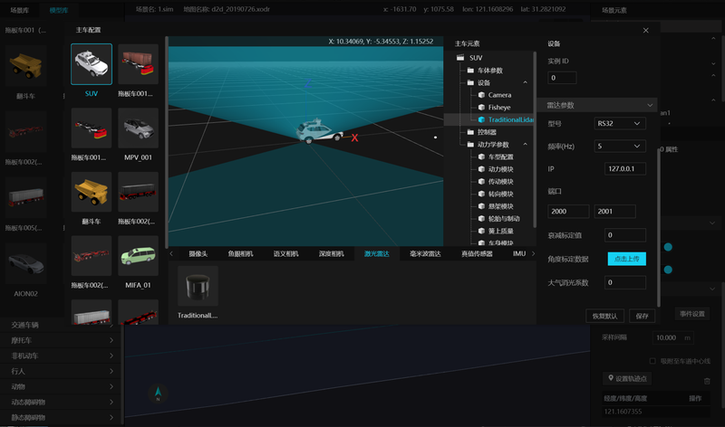</div><br>

下文列出了激光雷达仿真配置及数据获取详细信息.

### 6.2.1 参数说明

| 名称          | 默认值     | 范围                                          | 含义                                                                     |
|---------------|------------|-----------------------------------------------|--------------------------------------------------------------------------|
| 位置X(cm)     | 0          | [-1000, 1000]                                 | 安装位置                                                                 |
| 位置Y(cm)     | 0          | [-1000, 1000]                                 | 安装位置                                                                 |
| 位置Z(cm)     | 171        | [    0, 1000]                                 | 安装位置                                                                 |
| 旋转X(°)      | 0          | [-180,   180]                                 | 安装角度                                                                 |
| 旋转Y(°)      | 0          | [-180,   180]                                 | 安装角度                                                                 |
| 旋转Z(°)      | 0          | [-180,   180]                                 | 安装角度                                                                 |
| 实例ID        | 0          | -                                             | 当配置了多个 Display 时, 只有 Display 的实例 ID 一致时, 才会被处理       |
| 型号          | RS32       | RS32/RS16/HS40/Velodyne32/自定义              |                                                                          |
| 频率(Hz)      | 5          | 5/10/20 "Model = User 时此项可手动填 [1,128]" | 激光雷达旋转频率.具体特定型号时, 只能选择 5、10、20hz, User 型号时频率开放 |
| IP            | 127.0.0.1  |                                               | 接收者IP                                                                 |
| 端口          | 2000, 2001 | 1000～60000                                    | 端口, 速腾需要2个, 禾赛需要1个                                           |
| 衰减标定值    | 0          |                                               | 不同型号的标定值不一样, 填写后会覆盖默认值                               |
| 角度标定数据  |            |                                               | 角度定义文件, 填写后会覆盖默认值                                         |
| 大气消光系数  | 0          | [0.0,1.0]                                     | AtmosphericExtinctionCoefficient                                         |
| 线数          | 16         | [4, 1000]                                     | 型号为自定义时                                                           |
| 半径范围(m)   | 150        | (0, 1000]                                     | 型号为自定义时                                                           |
| 水平分辨率(°) | 1          | (0, 360]                                      | 型号为自定义时                                                           |
| 上仰角(°)     | 10         | (0, 90]                                       | 型号为自定义时                                                           |
| 下仰角(°)     | 10         | (0, 90]                                       | 型号为自定义时                                                           |
| 结束角度(°)   | 360        | (0, 360.0]                                    |                                                                          |

### 6.2.2 数据获取

#### 6.2.2.1 UDP 包

激光雷达仿真数据传输通过 UDP 传给可视化软件. 在传感器配置中设置 IP 和端口, 然后通过可视化软件显示点云.

以 RSView 为例: 首先打开传感器, 点击 ``Add`` 添加配置(首次需要), 在文件管理器中弹窗中选择目标地址. 设置成功后即可对传感器的 ``Type of Lidar`` 及 ``Intensity`` 进行设置.

<div align="center">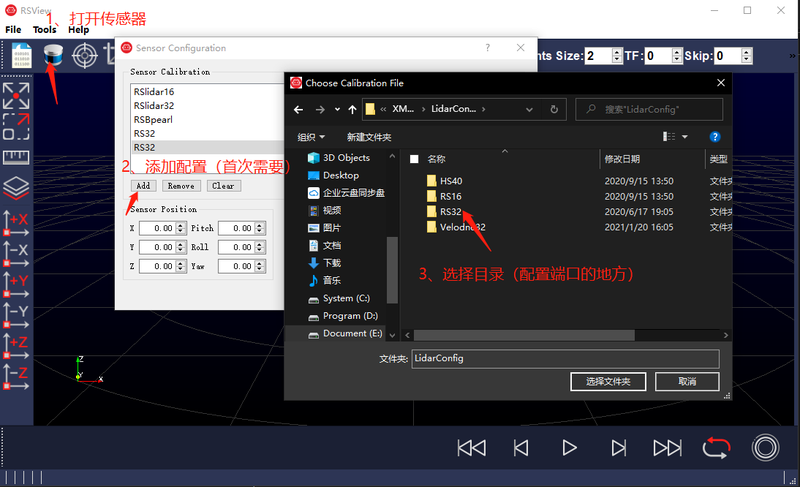</div><br>

<div align="center">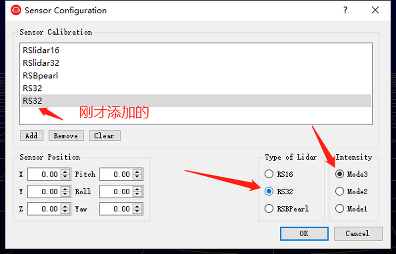</div><br>

也可通过工具栏进行端口配置, 右上角工具栏 ``Tool``, 在下拉框中选择 ``Data Port Setting``, 在弹出的设置窗口中修改相应信息即可. 需要修改为目录下 ``cfg+数字.ini`` 类型文件中对应的 ``msop_port`` 和 `difop_port` 值.

<div align="center">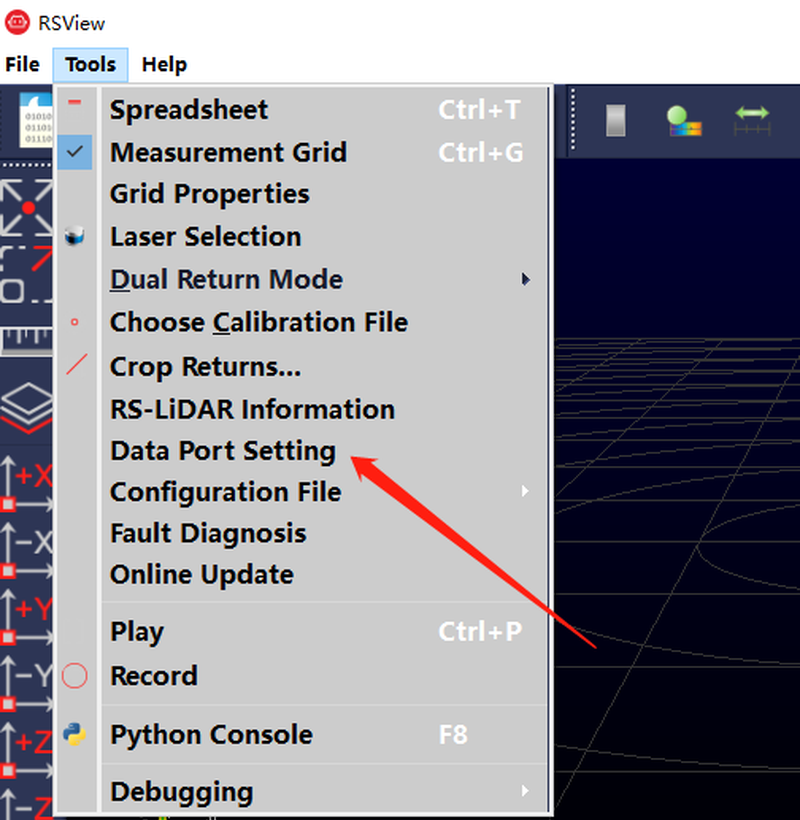</div><br>

<div align="center">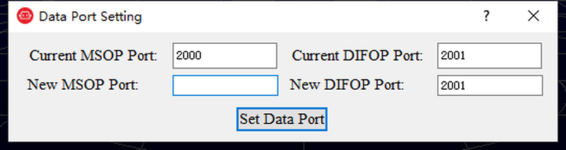</div><br>


#### 6.2.2.2 磁盘保存

激光仿真同时支持磁盘保存方式, 但由于点云数据IO很大, 不推荐此方式.

开关设置方法和图像类似, 在 Game.ini 中添加如下内容:
```ini
[Sensor]
LidarSaved=true
```

重启仿真软件, 点云数据即保存于:
- Windows 下:
  - ``C:\Users\用户名\AppData\Roaming\tadsim\service_data\display\Saved\SensorData``
- Ubuntu 下:
  - ``/home/.config/tadsim/Display/Saved/SensorData``


#### 6.2.2.3 PB 消息

首先需要打开 Display 的 PB 广播功能, 在 Game.ini 中添加如下内容:
```ini
[Sensor]
PublicMsg=true
```

然后通过订阅系统的消息, 来获取传感器数据. TOPIC 为 ``DISPLAYSENSOR_{id}``,  id 是算法 id, 通过 Display 模块的运行参数 -topicid 指定, 默认为 0.

**SensorPose 详细定义:**

| 字段      | 类型   | 单位 | 说明   |
|-----------|--------|------|------|
| longitude | double | deg  | 经度   |
| latitude  | double | deg  | 纬度   |
| altitude  | double | m    | 高程   |
| roll      | float  | rad  | 滚角   |
| pitch     | float  | rad  | 俯仰角 |
| yaw       | float  | rad  | 航向角 |


**LidarRaw 详细定义:**

| 字段            | 类型           | 单位 | 说明                                                                                                   |
|-----------------|----------------|------|--------------------------------------------------------------------------------------------------------|
| Point.x         | float          | m    | 单帧局部坐标x                                                                                          |
| Point.y         | float          | m    | 单帧局部坐标y                                                                                          |
| Point.z         | float          | m    | 单帧局部坐标z                                                                                          |
| Point.i         | float          |      | 反射率                                                                                                 |
| Point.t         | uint           |      | 类型,点云标签值                                                                                        |
| id              | int32          |      | 传感器ID                                                                                               |
| timestamp_begin | double         | ms   | 开始时间戳                                                                                             |
| timestamp_end   | double         | ms   | 结束时间戳                                                                                             |
| points          | repeated Point |      | 点云,(repeat序列化很慢, 基本不用)                                                                      |
| point_lists     | bytes          |      | 点云的二进制形式,(速度快, 按照float数组存储, 一个点按照Point里字段的顺序占用5个float, 反射率也是float) |
| count           | uint           |      | 点数                                                                                                   |
| pose_first      | SensorPose     |      | 初始pose                                                                                               |
| pose_last       | SensorPose     |      | 最后pose                                                                                               |
| coord_type      | CoordType枚举  |      | COORD_SENSOR =0;COORD_VEHICLE = 1;COORD_ENU = 2;                                                       |

代码参考图像示例 (9.1.2.3 章节).


#### 6.2.2.4 其他设置

Game.ini 中还有其他和 lidar 相关的设置:

- **LidarCoordType=[None,vehicle,enu]**
  - 设置点云坐标系.
  - None 表示传感器坐标系, vehicle 表示车辆坐标系, enu 表示世界坐标系
- **LidarMethod=[raytracing,depth,raycast]**
  - 设置 lidar 的扫描方式,
  - 默认情况下 linux 平台为 depth, 用图像深度模拟光线;
  - Windows 平台如果美术场景打开了光线追踪, 则默认支持 raytracing;
  - raycast 为 cpu 扫描方式, 速度较慢.
- **LidarDualReturn=[true,false]**
  - 设置激光雷达是否为双反射, 默认关闭
- **LidarFrameAlign=[true,false]**
  - 设置激光运动补偿.
  - 默认关闭, 当车辆运动时, 在 360 旋转型号上, 一帧点云会出现不对齐的现象, 如果设置 true, 则强制运动补偿.


## 6.3 毫米波雷达仿真

TAD Sim 支持毫米波雷达仿真, 基于真实毫米波雷达模型仿真, 平台提供默认配置参数, 并支持各参数自定义配置功能, 毫米波雷达依赖 Radar 模块.

<div align="center">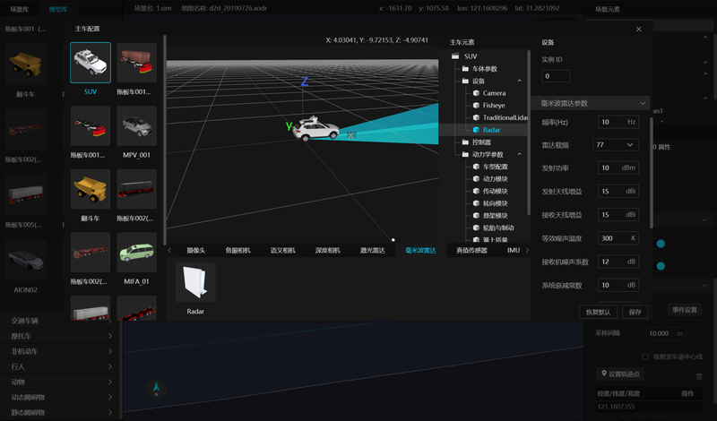</div><br>

### 6.3.1 参数说明
| 名称                 | 默认值 | 范围                                  | 含义                                                                                                                                                                  |
|--------------------|--------|---------------------------------------|-----------------------------------------------------------------------------------------------------------------------------------------------------------------------|
| 位置X(cm)            | 0      | [-1000, 1000]                         | 安装位置                                                                                                                                                              |
| 位置Y(cm)            | 0      | [-1000, 1000]                         | 安装位置                                                                                                                                                              |
| 位置Z(cm)            | 171    | [0, 1000]                             | 安装位置                                                                                                                                                              |
| 旋转X(°)             | 0      | [-180, 180]                           | 安装角度                                                                                                                                                              |
| 旋转Y(°)             | 0      | [-180, 180]                           | 安装角度                                                                                                                                                              |
| 旋转Z(°)             | 0      | [-180, 180]                           | 安装角度                                                                                                                                                              |
| 实例ID               | 0      | -                                     | 当配置了多个 Display 时, 只有 Display 的实例 ID 一致时, 才会被处理                                                                                                    |
| 频率(Hz)             | 10     | (0, 200]                              | 传感器频率                                                                                                                                                            |
| 雷达载频             | 77     | 77/24                                 | 雷达波形的中心频率, 影响雷达最大探测距离、距离分辨率、速度分辨率、测距精度、测速精度、测角精度                                                                             |
| 发射功率(dBm)        | 10     | [5, 10]                               | 雷达发射信号的功率值, 发射功率越大, 雷达威力越大, 最大探测距离越大.影响雷达最大探测距离、测距精度、测速精度、测角精度                                                    |
| 发射天线增益(dBi)    | 15     | [10, 15]                              | 最大探测距离随发射天线增益的增大而增大.影响雷达最大探测距离、测距精度、测速精度、测角精度                                                                                |
| 接收天线增益(dBi)    | 15     | [10, 15]                              | 最大探测距离随接收天线增益的增大而增大.影响雷达最大探测距离、测距精度、测速精度、测角精度                                                                                |
| 等效噪声温度(K)      | 300    | [290, 310]                            | 雷达所处环境的等效噪声温度, 最大探测距离随搭设天线增益的增大而减小.影响雷达最大探测距离、测距精度、测速精度、测角精度                                                    |
| 接收机噪声系数(dB)   | 12     | [0, 45]                               | 影响雷达最大探测距离、测距精度、测速精度、测角精度                                                                                                                       |
| 系统衰减常数(dB)     | 10     | 联动F0_GHz(77: [5, 10], 24: [15, 30]) | 77/79/24GHz的雷达系统衰减常数范围不同, 需注意, 影响雷达最大探测距离                                                                                                   |
| 最小可检测信噪比(dB) | 18     | [15, 22]                              | 影响目标是否可被检测到的参数, 同时影响最大探测距离.在其他参数一定的情况下, 最大探测距离随最小可检测信噪比的增大而减小.影响雷达最大探测距离、测距精度、测速精度、测角精度 |
| 目标延迟参数(ms)     | 0      | [0, 5000]                             |                                                                                                                                                                       |
| 垂直fov(°)           | 10     | [0, 160]                              |                                                                                                                                                                       |
| 水平fov(°)           | 0      | [0, 160]                              | 雷达天线水平探测范围, 请注意假设设置为10, 则代表探测范围为[-5, 5]                                                                                                     |
| 水平角度分辨率(°)    | 3      | [1, 10]                               | 雷达天线水平角分辨率, 即水平天线3dB波束宽度, 以1°为步进输入                                                                                                           |
| 垂直角度分辨率(°)    | 3      | [1, 10]                               | 雷达天线垂直角分辨率, 即水平天线3dB波束宽度, 以1°为步进输入                                                                                                           |
| 故障数据             |        |                                       | 故障注入文件, 包含类型, 关键帧, 故障值                                                                                                                                |


### 6.3.2 数据获取

#### 6.3.2.1 PB消息

采用 OSI 标准格式定义, 数据保存在 radar_sensor 中, 格式定义请参考:

[open_simulation_interface: osi3::FeatureData Struct Reference](https://opensimulationinterface.github.io/open-simulation-interface/structosi3_1_1FeatureData.html)

#### 6.3.2.2 磁盘保存

如果模块中的初始化参数指定了 DebugDir=xxx 路径, 则会在设置的路径目录中保存每一帧的OSI消息, 保存为 JSON 格式.


## 6.4 超声波雷达仿真

TAD Sim 支持超声波雷达仿真, 平台提供默认配置参数, 并支持各参数自定义配置功能, 超声波雷达依赖 Display 模块.

<div align="center">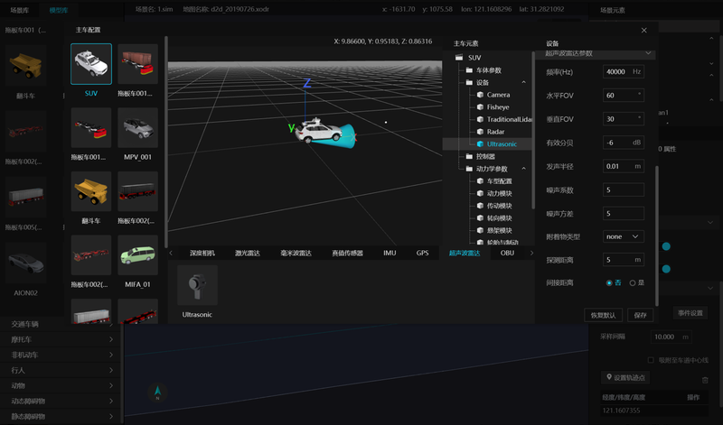</div><br>

### 6.4.1 参数说明

| 名称           | 英文             | 默认值 | 范围                   | 含义                                                             |
|--------------|------------------|--------|------------------------|----------------------------------------------------------------|
| 位置X(cm)      |                  | -37    | [-1000, 1000]          | 安装位置                                                         |
| 位置Y(cm)      |                  | 25     | [-1000, 1000]          | 安装位置                                                         |
| 位置Z(cm)      |                  | 171    | [0, 1000]              | 安装位置                                                         |
| 旋转X(°)       |                  | 0      | [-180, 180]            | 安装角度                                                         |
| 旋转Y(°)       |                  | 0      | [-180, 180]            | 安装角度                                                         |
| 旋转Z(°)       |                  | 0      | [-180, 180]            | 安装角度                                                         |
| 实例ID         |                  | 0      | -                      | 当配置了多个 display 时, 只有Display的实例ID一致时, 才会被处理   |
| 频率(Hz)       | Frequency        | 40000  | [4, 250K]              | 声波频率                                                         |
| 垂直fov(°)     | FovVertical      | 30     | [0.0,160.0]            | 雷达天线垂直探测范围, 请注意假设设置为10, 则代表探测范围为[-5,5] |
| 水平fov(°)     | FovHorizontal    | 60     | [0.0,160.0]            | 雷达天线水平探测范围, 请注意假设设置为10, 则代表探测范围为[-5,5] |
| 有效分贝(dB)   | dBmin            | -6     | [-1000.0,0.0]          | 能量分贝                                                         |
| 发声半径(m)    | Radius           | 0.01   | [0.001,0.3]            | 发声半径                                                         |
| 噪声系数       | NoiseFactor      | 5      | [0.2, 10.0]            | 综合噪声系数                                                     |
| 噪声方差       | NoiseStd         | 5      | [0.1, 10.0]            | 高斯噪声方差                                                     |
| 附着物类型     | AttachmentType   | Water  | Mud                    | 外部附着物类型, 会影响探测距离                                   |
| 探测距离(m)    | Distance         | 5      | [0.001,100.0]          | 最大的探测距离                                                   |
| 间接距离       | IndirectDistance | false  |                        | 是否打开间接距离                                                 |
| 脉冲时刻(毫秒) | PulseMoment      | 0      | [0.0, 100.0]           | 发声脉冲的起始时刻                                               |
| 脉冲周期(毫秒) | PulsePeriod      | 100    | [0.1, 100.0]           | 发声脉冲的周期                                                   |
| 轮询           | PollTurn         | 空     | "01SR" 4个字符任意组合 | 脉冲发声时的工作方式                                             |


### 6.4.2 数据获取

#### 6.4.2.1 磁盘保存

开关设置方法和图像类似, 在 Game.ini 中添加如下内容:
```ini
[Sensor]
UltrasonicSaved=true
```

重启仿真软件, 点云数据即保存于:
- Windows 下:
  - ``C:\Users\用户名\AppData\Roaming\tadsim\service_data\display\Saved\SensorData``
- Ubuntu 下:
  - ``/home/.config/tadsim/Display/Saved/SensorData``


#### 6.4.2.2 PB 消息

首先需要打开 Display 的 PB 广播功能, 在 Game.ini 中添加如下内容:
```ini
[Sensor]
PublicMsg=true
```

然后通过订阅系统的消息, 来获取传感器数据 .TOPIC 为 DISPLAYSENSOR_{id},  id 是算法 id, 通过 Display 模块的运行参数 -topicid 指定, 默认为 0.

参考图像示例代码, 从 PB 中获取到超声波的二进制 raw 数据, 然后再对 raw 数据进行反序列化.具体的 proto 定义格式采用 OSI 标准格式定义, 格式定义请参考:

[open_simulation_interface: osi3::UltrasonicDetectionData Struct Reference](https://opensimulationinterface.github.io/open-simulation-interface/structosi3_1_1UltrasonicDetectionData.html)

| 变量                    | 类型                    | 含义                                |
|-------------------------|-------------------------|-----------------------------------|
| ultrasonic_sensor       | UltrasonicDetectionData | 每个传感器对应一个ultrasonic_sensor |
| header.measurement_time | Timestamp               | radar时间戳                         |
| detection               | UltrasonicDetection     | 仿真数据                            |
| detection[i].distance   | double                  | 距离                                |

detection 的 size, 直接距离时为 1, 间接距离为 2.

### 6.4.3 轮询模式

- 轮询模式下, 原有的间接距离失效关闭
- 参与轮询的超声波, 将按照相同频率, 相同节拍计算.

| 字符 | 含义               |
|------|------------------|
| 0    | 关闭               |
| 1    | 正常工作, 能发能收 |
| s    | send只发声         |
| r    | receive只接收      |


## 6.5 真值传感器仿真

TAD Sim 支持真值传感器仿真, 平台提供默认配置参数, 并支持各参数自定义配置功能, 真值传感器依赖 SensorTruth 模块.

<div align="center">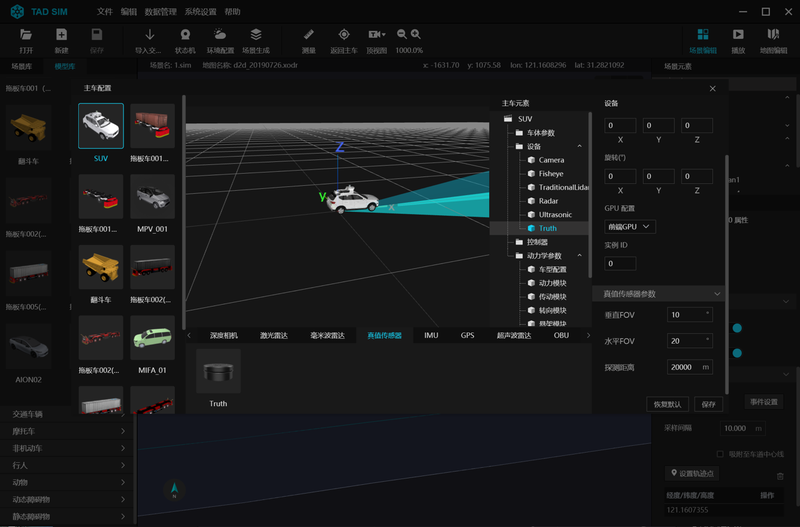</div><br>

下文列出了真值传感器仿真配置及数据获取详细信息.

### 6.5.1 参数说明

| 名称        | 默认值 | 范围          | 含义                                                             |
|-----------|--------|---------------|----------------------------------------------------------------|
| 位置X(cm)   | 0      | [-1000, 1000] | 安装位置                                                         |
| 位置Y(cm)   | 0      | [-1000, 1000] | 安装位置                                                         |
| 位置Z(cm)   | 171    | [0, 1000]     | 安装位置                                                         |
| 旋转X(°)    | 0      | [-180, 180]   | 安装角度                                                         |
| 旋转Y(°)    | 0      | [-180, 180]   | 安装角度                                                         |
| 旋转Z(°)    | 0      | [-180, 180]   | 安装角度                                                         |
| 实例ID      | 0      | -             | 当配置了多个SensorTruth时, 只有实例ID一致时, 才会被处理          |
| 垂直fov(°)  | 10     | [0, 160]      | 雷达天线水平过滤范围, 请注意假设设置为10, 则代表探测范围为[-5,5] |
| 水平fov(°)  | 20     | [0, 160]      | 雷达天线水平过滤范围, 请注意假设设置为10, 则代表探测范围为[-5,5] |
| 探测距离(m) | 200    | (0, 1000]     | 过滤半径                                                         |

### 6.5.2 数据获取

打开 SensotTruth 模块, 模块将广播过滤后的 traffic 消息 .Topic: ``TXSIM_SENSOR_OBJECT``, 依赖camera、lidar、ultrasonic 传感器, 如果指定了 -device, topic 为 ``TXSIM_SENSOR_OBJECT_{id}``.
详细信息见 [403.仿真消息说明](./403.仿真消息说明.md#3-仿真消息说明) 的定义.


## 6.6 IMU 仿真

TAD Sim 支持 IMU 仿真, 平台提供默认配置参数, 并支持各参数自定义配置功能.

<div align="center">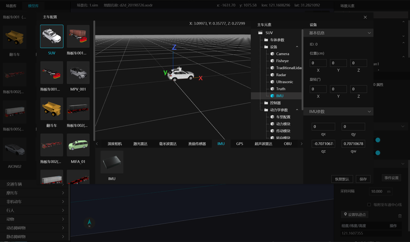</div><br>

### 6.6.1 参数说明

| 名称      | 默认值                                                       | 范围          | 含义                                     |
|---------|--------------------------------------------------------------|---------------|----------------------------------------|
| 位置X(cm) | -154.1                                                       | [-1000, 1000] | 安装位置, 坐标原点位于四轮中心的地面垂点 |
| 位置Y(cm) | 0                                                            | [-1000, 1000] | 安装位置, 坐标原点位于四轮中心的地面垂点 |
| 位置Z(cm) | 58                                                           | [0, 1000]     | 安装位置, 坐标原点位于四轮中心的地面垂点 |
| 四元数    | qx:0 <br> qy:0, <br> qz:-0.70710678118 <br> qw:0.70710678118 | [-1, 1]       | 传感器姿态, Euler角按照zyx顺序计算生成   |

### 6.6.2 数据获取

IMU 仿真数据的 topic 是 IMU_SIM, 对应的 proto 是 osi_imu.proto. 依赖 osi_version.proto 和 osi_common.proto.

用户可以通过以下方式获取数据:
- 实时 subscribe IMU_SIM topic 可以获取 IMU 数据
- 使用数据记录及后处理功能可以生成 xlsx 格式的 IMU 数据, 详见"[仿真数据的记录和回放](#12. 仿真数据的记录和回放)"章节, 其中 post_process 需要加上 -i 选项.


## 6.7 鱼眼相机仿真

TAD Sim 支持鱼眼摄像头仿真, 平台提供默认配置参数, 并支持各参数自定义配置功能, 鱼眼相机仿真依赖 Display 模块.

<div align="center">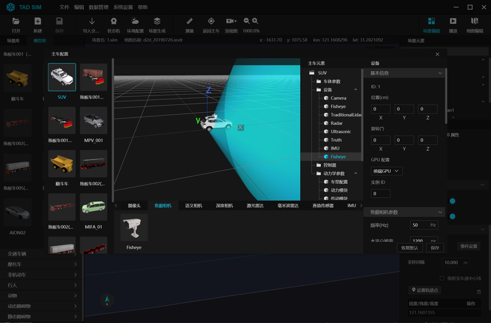</div><br>

### 6.7.1 参数说明

| 名称       | 默认值       | 范围                                                                           | 含义                                                           |
|----------|--------------|--------------------------------------------------------------------------------|----------------------------------------------------------------|
| 位置X(cm)  | 0            | [-1000, 1000]                                                                  | 安装位置, 坐标原点位于四轮中心的地面垂点                       |
| 位置Y(cm)  | 0            | [-1000, 1000]                                                                  | 安装位置, 坐标原点位于四轮中心的地面垂点                       |
| 位置Z(cm)  | 171          | [0, 1000]                                                                      | 安装位置, 坐标原点位于四轮中心的地面垂点                       |
| 旋转X(°)   | 0            | [-180, 180]                                                                    | 安装角度                                                       |
| 旋转Y(°)   | 0            | [-180, 180]                                                                    | 安装角度                                                       |
| 旋转Z(°)   | 0            | [-180, 180]                                                                    | 安装角度                                                       |
| 实例ID     | 0            | -                                                                              | 当配置了多个 display 时, 只有Display的实例ID一致时, 才会被处理 |
| 频率(Hz)   | 50           | [0, 1000]                                                                      | 拍照频率                                                       |
| 水平分辨率 | 1200         | 整数                                                                           | 图像尺寸, 像素                                                 |
| 垂直分辨率 | 1080         | 整数                                                                           | 图像尺寸, 像素                                                 |
| 细腻度     | 0            | [-5.0, 5.0]                                                                    | 正数细腻, 负数粗糙.细腻会增加渲染负担                          |
| 颜色模式   | 0            | 0彩色, 1黑白                                                                   |                                                                |
| 模糊       | 0            | [0, 1]                                                                         | -                                                              |
| 运动模糊   | 0            | [0, 1]                                                                         | -                                                              |
| 光晕强度   | 0            | [0, 1]                                                                         | -                                                              |
| 噪声强度   | 低           | 低/中/高/无                                                                    | -                                                              |
| 暗角       | 0.4          | [0.0, 1.0]                                                                     |                                                                |
| 泛光bloom  | 0.675        | [0.0, 1.0]                                                                     |                                                                |
| 曝光模式   | 0            | 自动0/手动1 (手动时:快门速度, ISO, 孔径参数有效)                               |                                                                |
| 曝光补偿   | 1            | -15.0～15.0                                                                     | 曝光的对数2^n调整, 负值变暗, 正值加亮                          |
| 色温       | 6500         | 1500～15000K                                                                    | 色温                                                           |
| 白色调     | 0            | -1.0～1.0                                                                       |                                                                |
| 镜头透镜率 | 98           | 1.0～100.0%                                                                     |                                                                |
| 畸变参数   | 0,0,0,0      | 分布表示k1,k2,k3,k4                                                            |                                                                |
| 内参矩阵   | ,,,0,,,0,0,1 | 长度为9的数组, 给出默认值的位置readonly, 其余位置值依次为fx, skew, cx, fy, cy. | 内参形式只能为矩阵                                             |


### 6.7.2 数据获取

#### 6.7.2.1 内存共享

和 Camera 方法一致, 共享内存地址为 Tadsim_Fisheye_{cameraID}

#### 6.7.2.2 磁盘保存

Game.ini 中添加如下内容:
```ini
[Sensor]
FisheyeSaved=true
```

#### 6.7.2.3 PB 消息

同图像方法 (9.1.2.3 章节)


## 6.8 语义相机仿真

TAD Sim 支持语义相机仿真, 语义相机是在普通相机的基础上添加了 alpha 通道, 用于标记像素的类别.

平台提供默认配置参数, 并支持各参数自定义配置功能, 语义相机依赖 Display 模块.

<div align="center">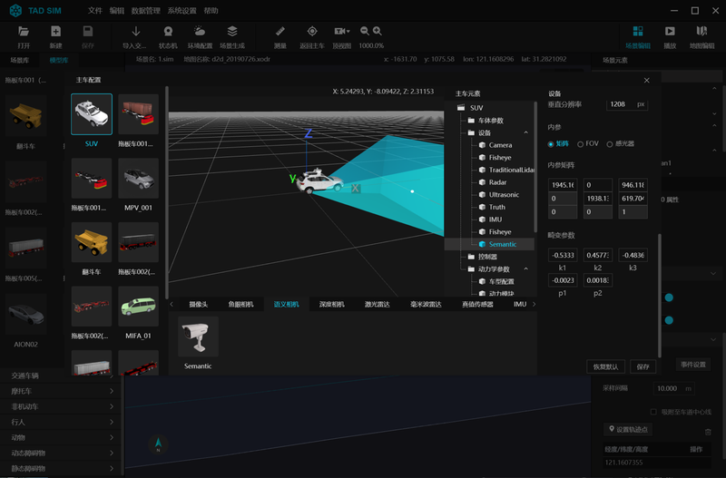</div><br>

### 6.8.1 参数说明

| 名称           | 默认值                                                                                                                                                            | 范围                                                                                       | 含义                                                           |
|--------------|-------------------------------------------------------------------------------------------------------------------------------------------------------------------|--------------------------------------------------------------------------------------------|----------------------------------------------------------------|
| 位置X(cm)      | 0                                                                                                                                                                 | [-1000, 1000]                                                                              | 安装位置, 坐标原点位于四轮中心的地面垂点                       |
| 位置Y(cm)      | 0                                                                                                                                                                 | [-1000, 1000]                                                                              | 安装位置, 坐标原点位于四轮中心的地面垂点                       |
| 位置Z(cm)      | 171                                                                                                                                                               | [0, 1000]                                                                                  | 安装位置, 坐标原点位于四轮中心的地面垂点                       |
| 旋转X(°)       | 0                                                                                                                                                                 | [-180, 180]                                                                                | 安装角度                                                       |
| 旋转Y(°)       | 0                                                                                                                                                                 | [-180, 180]                                                                                | 安装角度                                                       |
| 旋转Z(°)       | 0                                                                                                                                                                 | [-180, 180]                                                                                | 安装角度                                                       |
| 实例ID         | 0                                                                                                                                                                 | -                                                                                          | 当配置了多个 display 时, 只有Display的实例ID一致时, 才会被处理 |
| 频率(Hz)       | 25                                                                                                                                                                | [0, 1000]                                                                                  | 拍照频率                                                       |
| 水平分辨率     | 1920                                                                                                                                                              | 整数                                                                                       | 图像尺寸, 像素                                                 |
| 垂直分辨率     | 1208                                                                                                                                                              | 整数                                                                                       | 图像尺寸, 像素                                                 |
| 畸变参数       | k1=-5.3336804278253547e-001, <br> k2=4.5773462092698042e-001, <br> k3=-4.8360765272003647e-001, <br> p1=-2.3929586859060227e-003, <br> p2=1.8364297357014352e-003 |                                                                                            | 分布表示k1, k2, k3, p1, p2                                     |
| 内参形式       | 0                                                                                                                                                                 | 0:矩阵, 1:FOV, 2:感光器                                                                    | -                                                              |
| 内参矩阵       | 1.9451674168728503e+003,0, 9.4611889604089231e+002; <br> 0,1.9381372280069070e+003, 6.1970485474739780e+002; <br> 0,0,1                                           | 长度为9的数组,  <br> 给出默认值的位置readonly, <br>  其余位置值依次为fx, skew, cx, fy, cy. | 当内参形式为矩阵时                                             |
| 水平FOV(°)     | 60                                                                                                                                                                | [0, 180]                                                                                   | 当内参形式为fov时                                              |
| 垂直FOV(°)     | 36.28                                                                                                                                                             | [0, 180]                                                                                   | 当内参形式为fov时                                              |
| 感光器宽度(mm) | 10                                                                                                                                                                | (0, 10000]                                                                                 | 当内参形式为感光器时                                           |
| 感光器高度(mm) | 10                                                                                                                                                                | (0, 10000]                                                                                 | 当内参形式为感光器时                                           |
| 镜头焦距(mm)   | 10                                                                                                                                                                | (0, 10000]                                                                                 | 当内参形式为感光器时                                           |

### 6.8.2 数据获取

#### 6.8.2.1 内存共享

和 Camera 方法一致, 共享内存地址为 ``Tadsim_Semantic_{cameraID}``.

#### 6.8.2.2 磁盘保存

Game.ini中添加如下内容:
```ini
[Sensor]
SemanticSaved=true
```

#### 6.8.2.3 PB 消息

同图像方法 (9.1.2.3 章节)


## 6.9 深度相机仿真

TAD Sim 支持深度相机仿真, 平台提供默认配置参数, 并支持各参数自定义配置功能, 深度相机依赖 Display 模块.

<div align="center">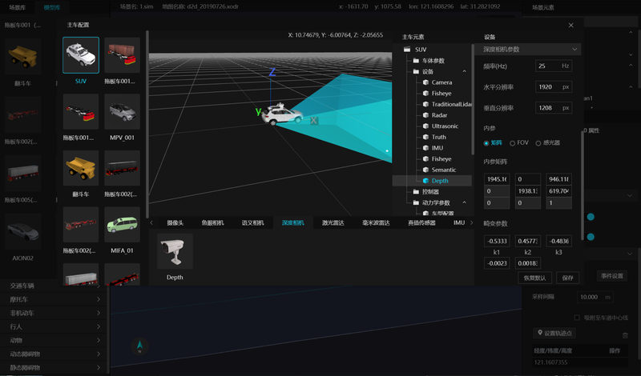</div><br>

### 6.9.1 参数说明

| 名称           | 默认值                                                                                                                                                            | 范围                                                                          | 含义                                                           |
|--------------|-------------------------------------------------------------------------------------------------------------------------------------------------------------------|-------------------------------------------------------------------------------|----------------------------------------------------------------|
| 位置X(cm)      | 0                                                                                                                                                                 | [-1000, 1000]                                                                 | 安装位置, 坐标原点位于四轮中心的地面垂点                       |
| 位置Y(cm)      | 0                                                                                                                                                                 | [-1000, 1000]                                                                 | 安装位置, 坐标原点位于四轮中心的地面垂点                       |
| 位置Z(cm)      | 171                                                                                                                                                               | [0, 1000]                                                                     | 安装位置, 坐标原点位于四轮中心的地面垂点                       |
| 旋转X(°)       | 0                                                                                                                                                                 | [-180, 180]                                                                   | 安装角度                                                       |
| 旋转Y(°)       | 0                                                                                                                                                                 | [-180, 180]                                                                   | 安装角度                                                       |
| 旋转Z(°)       | 0                                                                                                                                                                 | [-180, 180]                                                                   | 安装角度                                                       |
| 实例ID         | 0                                                                                                                                                                 | -                                                                             | 当配置了多个 display 时, 只有Display的实例ID一致时, 才会被处理 |
| 频率(Hz)       | 25                                                                                                                                                                | [0, 1000]                                                                     | 拍照频率                                                       |
| 水平分辨率     | 1920                                                                                                                                                              | 整数                                                                          | 图像尺寸, 像素                                                 |
| 垂直分辨率     | 1208                                                                                                                                                              | 整数                                                                          | 图像尺寸, 像素                                                 |
| 畸变参数       | k1=-5.3336804278253547e-001, <br> k2=4.5773462092698042e-001, <br> k3=-4.8360765272003647e-001, <br> p1=-2.3929586859060227e-003, <br> p2=1.8364297357014352e-003 |                                                                               | 分布表示k1,k2,k3,p1,p2                                         |
| 内参形式       | 0                                                                                                                                                                 | 0:矩阵, 1:FOV, 2:感光器                                                       | \-                                                             |
| 内参矩阵       | 1.9451674168728503e+003, 0, 9.4611889604089231e+002; <br> 0,1.9381372280069070e+003, 6.1970485474739780e+002; <br> 0,0,1                                          | 长度为9的数组,给出默认值的位置 readonly,其余位置值依次为fx, skew, cx, fy, cy. | 当内参形式为矩阵时                                             |
| 水平FOV(°)     | 60                                                                                                                                                                | [0, 180]                                                                      | 当内参形式为 fov时                                             |
| 垂直FOV(°)     | 36.28                                                                                                                                                             | [0, 180]                                                                      | 当内参形式为fov时                                              |
| 感光器宽度(mm) | 10                                                                                                                                                                | (0, 10000]                                                                    | 当内参形式为感光器时                                           |
| 感光器高度(mm) | 10                                                                                                                                                                | (0, 10000]                                                                    | 当内参形式为感光器时                                           |
| 镜头焦距(mm)   | 10                                                                                                                                                                | (0, 10000]                                                                    | 当内参形式为感光器时                                           |

### 6.9.2 数据获取

#### 6.9.2.1 内存共享

和 Camera 方法一致, 共享内存地址为 Tadsim_Depth_{cameraID}

#### 6.9.2.1 磁盘保存

Game.ini中添加如下内容:
```ini
[Sensor]
DepthSaved=true
```

#### 6.9.2.3 PB 消息

同图像方法 (9.1.2.3 章节)


## 6.10 GPS 仿真

TAD Sim 支持 GPS 仿真, 平台提供默认配置参数, 并支持各参数自定义配置功能.

<div align="center"></div><br>

下文列出了 GPS 仿真配置及数据获取详细信息.

### 6.10.1. 参数说明

| 名称      | 默认值 | 范围          | 含义                                     |
|---------|--------|---------------|----------------------------------------|
| 位置X(cm) | 0      | [-1000, 1000] | 安装位置, 坐标原点位于四轮中心的地面垂点 |
| 位置Y(cm) | 15.8   | [-1000, 1000] | 安装位置, 坐标原点位于四轮中心的地面垂点 |
| 位置Z(cm) | 112.6  | [0, 1000]     | 安装位置, 坐标原点位于四轮中心的地面垂点 |

### 6.10.2. 数据获取

GPS 仿真数据的 topic 是 GPS_SIM, proto 文件为 osi_gps.proto. 依赖 osi_version.proto 和 osi_common.proto.

用户可以通过以下方式获取数据:
- 实时 subscribe GPS_SIM topic 可以获取 GPS 数据
- 使用数据记录及后处理功能可以生成 xlsx 格式的 GPS 数据, 详见 "[仿真数据的记录和回放](#12. 仿真数据的记录和回放)" 章节, 其中 post_process 需要加上 ``-i`` 选项.


## 6.11 V2X 仿真

TAD Sim 通过地图编辑器配置 RSU, 场景编辑器配置 OBU 进行 V2X 仿真, 平台提供默认配置参数, 并支持各参数自定义配置功能.


详细信息请查看 [10. V2X 仿真](./307.V2X仿真.md)


## 6.12 仿真合成数据生成

在仿真过程中 TAD Sim 可为模拟对象(如车辆、行人、传感器数据等) 添加描述性信息, 实现该功能的模块为 simlabel, 其主要完成仿真数据的标注转换 (即将仿真数据转换为标注数据).

仿真系统可以用于生成自动驾驶标注数据, 这些数据对于训练和验证自动驾驶算法至关重要. 通过在仿真环境中创建各种交通场景, 可以收集大量有关车辆、行人、自行车等交通参与者的信息, 从而为自动驾驶系统提供丰富的训练数据.


详细信息请查看 [11. 仿真合成数据生成](./308.仿真合成数据生成.md)


## 6.13 传感器依赖模块

### 6.13.1 Display 模块

**可执行参数说明**

| 参数             | 取值                   | 含义                                                                                                                             | 举例                       |
|------------------|------------------------|--------------------------------------------------------------------------------------------------------------------------------|----------------------------|
| -name            | 模块名字, 默认 Display | 模块名字                                                                                                                         | -name=Display              |
| -mode            | FrameAsync、FrameSync   | 同步和异步模式,同步模式: 帧率和 step 保持同步, 但在 Step 暂停时, 以极低帧率运行, 异步模式: 帧率和 step 无关, 画面以最大帧率渲染. | -mode=FrameAsync           |
| UserDir          | 本地目录               | 日志目录                                                                                                                         | UserDir=xx/xx/x/           |
| -address         | TadsimServer           | tadsim 地址, 缺省值为 127.0.0.1:21302                                                                                            | -address=192.168.0.1:21302 |
| -device          | 数字或all(默认)        | 指定实例 id, 只有绑定到该id的传感器才被读取, 可以指定all, 表示所有传感器                                                         | -device=all                |
| -topicId         | 数字                   | 指定 Topicid, 设置传感器广播的topic为DISPLAYSENSOR_{id}, 如果没有设置, 等同于 -device                                            | -topicId=3                 |
| -hil             | 屏幕像素坐标           | 设置 HIL 方式, 指定(所有屏幕组合的全局)坐标点, 即可在当前位置的屏幕内全屏                                                        | -hil=100x500               |
| -graphicsadapter | 自然数                 | 指定特定 GPU, 从 0 开始, 即 0 表示 GPU0, Linux 平台的该参数需要打开息屏                                                          | -graphicsadapter=1         |
| -RenderOffscreen |                        | 息屏渲染                                                                                                                         | -RenderOffscreen           |
| -LocalLogTimes   |                        | 日志时间使用当前时区                                                                                                             | -LocalLogTimes             |
| -log LOG         | 文件名                 | 指定日志名称                                                                                                                     | -log LOG=Display.log       |

### 6.13.2 SensorTruth 模块

**初始化参数说明**

| 参数            | 取值            | 含义                                                                     | 举例                 |
|-----------------|-----------------|------------------------------------------------------------------------|----------------------|
| CameraTruth     | ON, OFF         | 开启图像真值子模块                                                       | CameraTruth=ON       |
| LidarTruth      | ON, OFF         | 开启lidar真值子模块                                                      | LidarTruth=ON        |
| UltrasonicTruth | ON, OFF         | 开启超声波真值子模块                                                     | UltrasonicTruth=ON   |
| SensorTruth     | ON, OFF         | 开启目标真值子模块                                                       | SensorTruth=ON       |
| DebugDir        | 路径            | 指定调试输出目录                                                         | DebugDir=XXX/XXX     |
| -device         | 数字或all(默认) | 指定实例 id, 只有绑定到该id的传感器才被读取, 可以指定all, 表示所有传感器 | -device=all          |
| CT_MaxDistance  | 米              | 相机目标最大距离                                                         | CT_MaxDistance=100.0 |
| CT_Completeness | 0~1             | 相机目标完整度, 被遮挡的面积比例不能小于该值                             | CT_Completeness=0.5  |
| CT_MinArea      | 像素            | 相机目标的像素面积                                                       | CT_MinArea=20        |
| LT_Completeness | 0~1             | Lidar 目标完整度, 被遮挡的激光数比例不能小于该值                         | LT_Completeness=0.5  |
| LT_MinHitNum    | 大于0的整数     | 最小激光个数, 小于它的目标被丢弃                                         | LT_MinHitNum=5       |


### 6.13.3 Radar 模块

TAD Sim 支持 Radar 仿真, 平台提供默认配置参数, 并支持各参数自定义配置功能.

**初始化参数说明**

| 参数     | 取值                    | 含义                                                                        | 举例             |
|----------|-------------------------|---------------------------------------------------------------------------|------------------|
| DebugDir | 路径                    | 调试输出目录                                                                | DebugDir=/XX/XX/ |
| IgnoreZ  | ON, OFF                 | 忽略高程                                                                    | IgnoreZ=ON       |
| -device  | 数字<br>或<br>all(默认) | 指定实例 id, 只有绑定到该 id 的传感器才被读取, 可以指定 all, 表示所有传感器 | -device=all      |


### 6.13.4 imu_gps 模块

TAD Sim 支持 GPS IMU 仿真, 平台提供默认配置参数, 并支持各参数自定义配置功能.

**初始化参数说明**

| 参数 | 取值       | 含义                        | 举例     |
|------|-----------|---------------------------|----------|
| mode | imu 或 gps | 分别表示 imu only, gps only | mode=imu |


### 6.13.5 synthetic_data 模块

TAD Sim 支持仿真标注数据生成, 平台提供默认配置参数, 并支持各参数自定义配置功能.

**初始化参数说明**

| 参数              | 取值                    | 含义                                                                    | 举例                                            |
|-------------------|-------------------------|-----------------------------------------------------------------------|-------------------------------------------------|
| -device           | 数字<br>或<br>all(默认) | 指定实例id, 只有绑定到该id的传感器才被读取, 可以指定all, 表示所有传感器 | -device=all                                     |
| CreateScenarioDir | true, false             | 是否创建场景目录, 默认 true, 在多个场景连续播放时, 防止数据被覆盖       | CreateScenarioDir=false                         |
| NumOfDisplay      | 整数                    | Display 的个数, 用于分布式多个渲染引擎所有传感器的接收.                 | NumOfDisplay=30                                 |
| DataSavePath      | 路径                    | 保存目录路径                                                            | DataSavePath=<br>/home/sim/data/display_pic_dir |

````{note}
注: NumOfDisplay 一定要覆盖 Display 的 topic, simlabel 会订阅 DISPLAYSENSOR_{id}, 保证接收完整.
````
