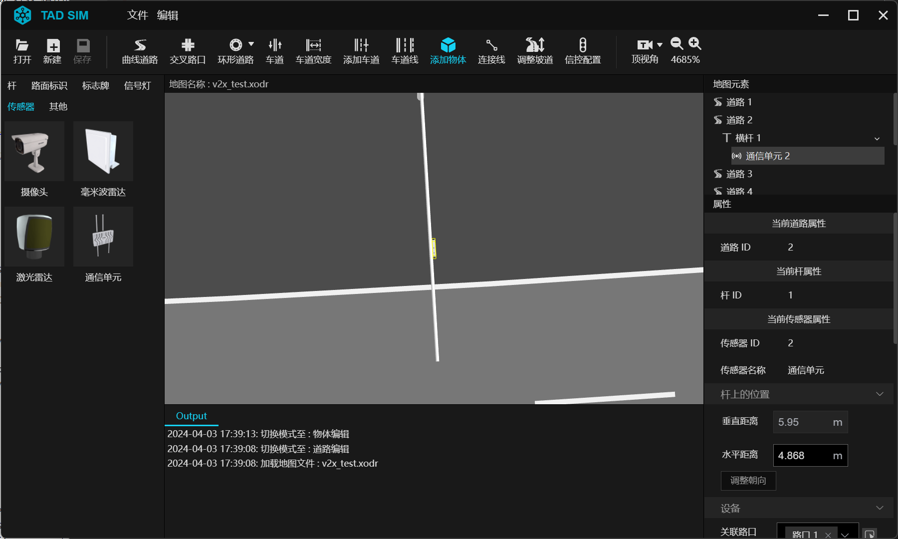
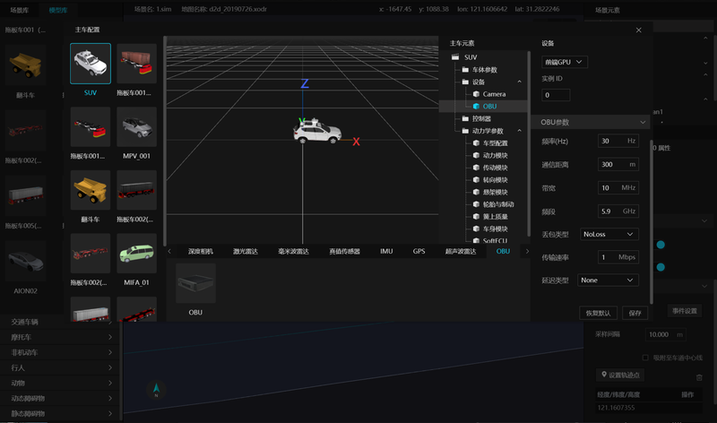

# 7. V2X仿真

在构建未来交通系统的征途上, TAD Sim 系统搭载先进的 V2X(Vehicle-to-Everything) 技术, 为您提供一种高效且直观的方法, 以实现车辆与周边环境的全面互联互通.

借助地图编辑器, 您可以在道路的任何位置精准放置关键设施, 如杆位、路侧传感器以及 RSU(Road Side Units) 设备. 这些设备不仅为您的模拟场景增添了真实感, 更是实现智能交通管理的基础.

更进一步, 我们的系统允许您为主车添加 OBU(On-Board Units) 模块, 这是 V2X 通信的核心组件. 通过 OBU 模块, 车辆能够接收并发送信息, 与周围的交通基础设施进行实时交互, 从而构建一个真实且全面的交通模拟场景.

在这个场景中, 车辆不再是孤立的个体, 而是成为了一个智能交通网络的一部分.每一辆车都能够感知周围环境, 做出更加智能的决策, 从而提高道路安全, 减少拥堵, 优化交通流.

## 7.1 配置方式

**Step 1. 路侧传感器及设备参数配置**

- 通过地图编辑器 ``添加物体`` 工具在道路相应位置放置杆位,  路侧传感器 和 RSU 设备. 在属性栏设置设备参数, 参数说明见传感器仿真章节.
- 保存当前地图.

 

初始化参数说明:

| 名称             | Name          | 默认值 | 范围        | 含义                  |
|----------------|---------------|--------|-------------|---------------------|
| SPAT 发送频率 | FrequencySPAT | 10     | [0~100]     | 发送频率, 0表示不发送 |
| RSM 发送频率  | FrequencyRSM  | 10     | [0~100]     | 发送频率, 0表示不发送 |
| RSI 发送频率  | FrequencyRSI  | 10     | [0~100]     | 发送频率, 0表示不发送 |
| MAP 发送频率  | FrequencyMAP  | 10     | [0~100]     | 发送频率, 0表示不发送 |
| 通信距离         | DistanceCommu | 300    | [10~2000米] | 通信距离              |
| 频段             | Band                 | 5905-5925 | (5905-5915/5915-5925/5905-5925三选一) |
| 传输速率         | Mbps                 | 100       | [0.1~1000Mbps]                             | 带宽, 会影响拥堵时的延时                                        |
| 最大延时         | MaxDelay             | 100       | [0~1000ms]                                 | 最大延时, 和拥堵调节配合使用, 超过最大延时则考虑拥堵调节        |
| 地图半径         | MapRadius            | 1000      | [10~2000米]                                | MAP消息中地图范围                                               |
| 路口 ID           | JunctionIDs          |           | 可多选                                     | MAP消息中的路口数据, 如果不指定, 则按照地图半径内包括的路口发送 |
| 关键事件 立即触发 | TriggerImmediately   | True      | True, False                                | 打开时, 不遵守频率, 立即发送关键事件                            |
| 拥堵调节         | CongestionRegulation | True      | True, False                                | 打开是, 如果车辆太多, 造成拥堵, 会降低发送频率, 保证低延时 |
| 云协同 (V2N)      | V2N                  | False     | True, False                                | rsu联网, 提升数据预警能力范围, 比如关键事件                     |
| 车路协同 (V2I)    | V2I                  | False     | True, False                                | 禁用BSM, 不接收obu数据                                          |
| 消息预设         | PreMSG               |           |                                            | 导入外部文件, 用于消息体的预定义                                |

**Step 2. 场景主车和交通车配置**

通过该地图创建场景, 添加主车、交通车. 在主车传感器配置窗口中添加 OBU 模块, 参数说明见  [传感器仿真](./306.传感器仿真.md) 章节.

 

初始化参数说明:

| 名称             | Name         | 默认值 | 范围         | 含义         |
|----------------|--------------|--------|--------------|------------|
| BSM 发送频率  | FrequencyBSM | 10     | [0~100]      | 0表示关闭    |
| 空旷 通信距离 | DistanceOpen | 800    | [100~1000米] | 空旷通信距离 |
| 城市 通信距离 | DistanceCity | 300    | [10~500米]   | 城市通信距离 |
| 频段             | Band               | 5905-5925 | 5905-5915, 5915-5925, 5905-5925三选一 |
| 传输速率         | Mbps               | 10        | [0.1~100Mbps]                         | 带宽, 会影响拥堵时的延时             |
| 系统延时         | SystemDelay        | 10        | [0~1000ms]                            | 系统固定延时                         |
| 通信延时         | CommuDelay         | 20        | [0~1000ms]                            |
| 关键事件 立即触发 | TriggerImmediately | True      | True, False                           | 打开时, 不遵守频率, 立即发送         |
| 定位精度         | PosAccuracy        | 0.5       | [0.1~10米]                            | 按照布朗运动规则, 对定位精度添加偏移 |
| 禁止组队         | NoTeam             | False     | True, False                           | 禁用时, 不接受其他车发送的BSM        |
| 关闭通信 RSU      | DisableRSU         | False     | True, False                           | 禁用时, 不接受RSU的消息              |
| BSM 预设          | PreBSM             |           |                                       | 导入外部文件, 用于消息体的预定义     |

**Step 3. 模块配置和场景运行**

V2X 仿真数据对应的模块是 ``V2X``, topic 是 ``V2XASN1``.

用户可以通过实时 subscribe V2XASN1 topic 的方式获取 V2X2020 标准数据.
