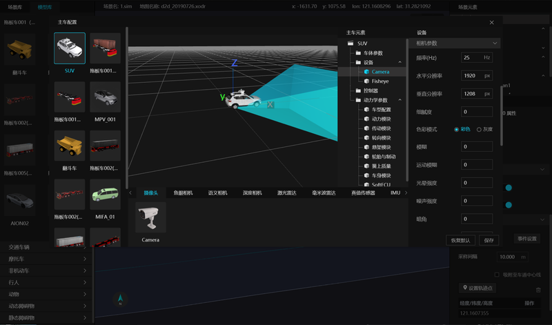

# 8. 仿真合成数据生成

TAD Sim 中负责仿真合成数据生成的模块为 ``sim_synthetic_data`` , 该模块专门设计用于仿真合成数据生成, 输出高质量的标注数据, 确保数据的准确性和可用性, 在仿真过程中的各种模拟对象提供标注数据, 从而为感知算法提供海量训练数据, 降低人工标注成本.

仿真系统可以用于生成自动驾驶标注数据, 这些数据对于训练和验证自动驾驶算法至关重要, 通过在仿真环境中创建各种交通场景, 可以收集大量有关车辆、行人、自行车等交通参与者的信息, 从而为自动驾驶系统提供丰富的训练数据.

## 8.1 核心功能

利用仿真系统的强大功能, 可以模拟各种复杂的交通场景, 包括城市街道、高速公路、乡村道路等类型道路；

在这些场景中, 模块会标注车辆、行人、自行车、摩托车、三轮车等交通参与者, 为自动驾驶系统提供全面的训练数据;

通过精确的数据处理流程, 为车辆、行人、自行车、摩托车、三轮车等模拟对象添加描述性信息, 生成高质量的标注数据;


## 8.2 仿真合成数据的生成方法

<figure class="center-video">
  <video controls width="700">
    <source src="./_static/videos/TAD Sim-仿真合成数据生成.mp4" type="video/mp4">
    Your browser does not support the video tag.
  </video>
  <figcaption>仿真合成数据生成操作示例</figcaption>
</figure>


**Step 1. 模块配置**

在主车配置中添加模块, 默认参数即可, 合成数据保存在 ``用户目录/sim_data/synthetic_data``, 具体参数描述如下：

| 参数              | 默认值                                   | 含义                                                                        | 举例                         |
|-------------------|------------------------------------------|---------------------------------------------------------------------------|------------------------------|
| -device           | all                                      | 指定实例id, 只有绑定到<br>该id的传感器才被读取, 可以指定all, 表示所有传感器 | -device=0                    |
| NumOfDisplay      | 30                                       | 表示 Display 的个数, 用于分布式<br>多个渲染引擎所有传感器的接收              | NumOfDisplay=30              |
| DataSavePath      | 用户目录/<br>``sim_data/synthetic_data`` | 保存目录路径 (**必填**)                                                       | DataSavePath=/home/sim/data/ |
| CreateScenarioDir | true                                     | 是否创建场景目录, 默认 true, 在多个场景连续播放时, 防止数据被覆盖           | CreateScenarioDir=false      |

**Step 2. 配置传感器**

根据项目需求配置传感器, 目前本软件版本仅支持摄像头、语义相机、鱼眼相机及激光雷达四种传感器的标注, 相应传感器配置方式详见 [传感器仿真](./306.传感器仿真.md#6-传感器仿真).

<div align="center"></div><br>

````{note}
其中激光雷达暂时只支持 ``禾赛 128AT`` 和 ``速腾聚创 M1``.
````


**Step 3. 配置 Display**

该功能依赖 Display 的广播功能, 才能接收到图像点云数据，开关设置方法为, 首先打开 ``Game.ini`` 文件, 文件路径如下:

- Windows 下:
  - ``C:\Users\用户名\AppData\Roaming\tadsim\data\service_data\display\Saved\Config\WindowsNoEditor\Game.ini``
- Ubuntu 下:
  - ``/home/用户名/.config/tadsim/Display/Saved/Config/LinuxNoEditor/Game.ini``

在 Game.ini 中添加如下内容:
```ini
[Sensor]
PublicMsg=true
```


**Step 4. 查看标注数据**

本模块的数据包含图像及点云标注两部分:
- 图像标注：
  - 包含鱼眼图像、针孔相机图像和语义图像, 均可以生成对应的 Open Label 文件, 包含了每个目标的 2D 多边形.
- 点云标注：
  - 生成每个目标的 3D 包围框.

合成数据目录结构如下:
```markdown
scene_name
│
├── camera
│   ├── jpg
│   │   └── 0000000060_1.jpg
│   └── 0000000060_1.json
│
├── lidar
│   ├── pcd
│   │   └── 0000000100_1.pcd
│   └── 00000000100_1.json
│
└── semantic
    ├── png
    │   └── 0000000060_1.png
    └── 0000000060_1.json
```


标注文件详细参考 [ASAM](https://www.asam.net/) (Association for Standardization of Automation and Measuring Systems) [OpenLABEL](https://www.asam.net/index.php?eID=dumpFile&t=f&f=4566&token=9d976f840af04adee33b9f85aa3c22f2de4968dd#sec-0c3aa8d0-0340-439f-a45e-4e63c1124b41), 它是一个开源的数据标注和语义描述规范, 用于自动驾驶和智能交通系统领域.

它提供了一种通用、灵活且可扩展的数据标注和描述方法, 以便在不同的应用程序、工具和算法之间实现互操作性, 结构如下:

```json
{
    "openlabel": {
        "coordinate_systems": {
            "camera1": {
                "children": [],
                "parent": "geospatial-wgs84",
                "pose_wrt_parent": {
                    "euler_angles": [
                        0.02362162247300148,
                        0.032431244850158691,
                        -4.0072531700134277
                    ],
                    "sequence": "zyx",
                    "translation": [
                        121.17319430917146,
                        31.264391873975356,
                        14.931379369460046
                    ]
                },
                "type": "geo"
            },
            "geospatial-wgs84": {
                "children": [
                    "camera1"
                ],
                "parent": "",
                "type": "geo"
            }
        },
        "metadata": {
            "schema_version": "1.0.0"
        },
        "objects": {
            "10001": {
                "coordinate_system": "camera1",
                "name": "static obstacle",
                "object_data": {
                    "poly2d": [
                        {
                            "closed": true,
                            "mode": "",
                            "name": "",
                            "val": [
                                1869.9042510157674,
                                816.44006113256864,
                                1883.1925027238617,
                                823.4215599404456,
                                1904.1553282032924,
                                821.62681394146512,
                                1917.5725686391868,
                                816.37856523613607,
                                1919.4521194348272,
                                786.00369242379645,
                                1915.3122297402197,
                                722.40998510224335,
                                1873.9195983798361,
                                724.70326965525828,
                                1869.9042510157674,
                                816.44006113256864
                            ]
                        }
                    ]
                },
                "type": "cone"
            }
        },
        "streams": {
            "camera1": {
                "description": "camera1",
                "type": "camera",
                "uri": "camera/jpg/0000000060_1.jpg"
            }
        }
    }
}
```


````{note}
注: Open Label 中的 pose 为传感器的坐标系姿态, 并非外参.
- Camera: 世界坐标系下相机的安装位置 (经纬度) 和姿态 (X轴朝东)
- Lidar: 世界坐标系下点云数据原点的位置 (经纬度) 和X轴朝向
````

点云的 Pose 和 Lidar 坐标系定义有关, 详见 [6.2 激光雷达仿真](./306.传感器仿真.md#62-激光雷达仿真);

- 传感器坐标时, 点云原点为传感器安装位置, 和 Camera 类似
- 车辆坐标系时, 点云原点为主车坐标原点, 姿态为主车的姿态
- 全局坐标系时, 点云的原点为固定点, 一般为预设的 ENU 参考点
