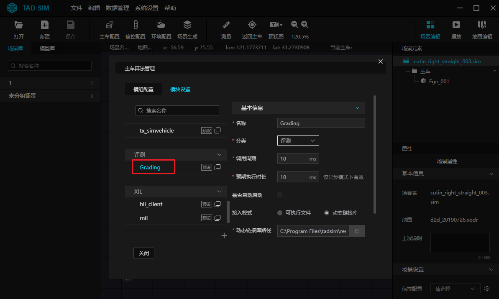
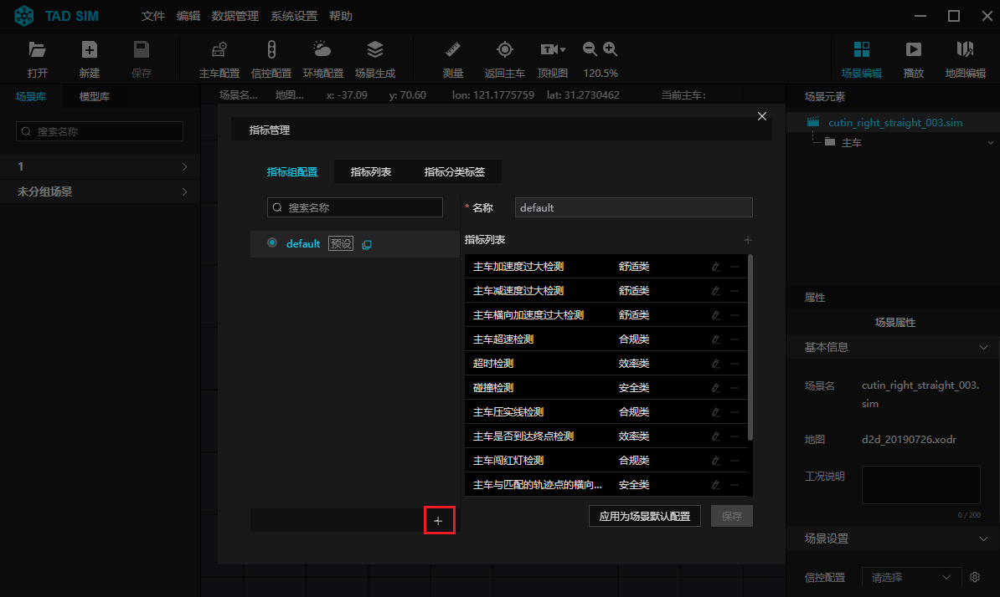
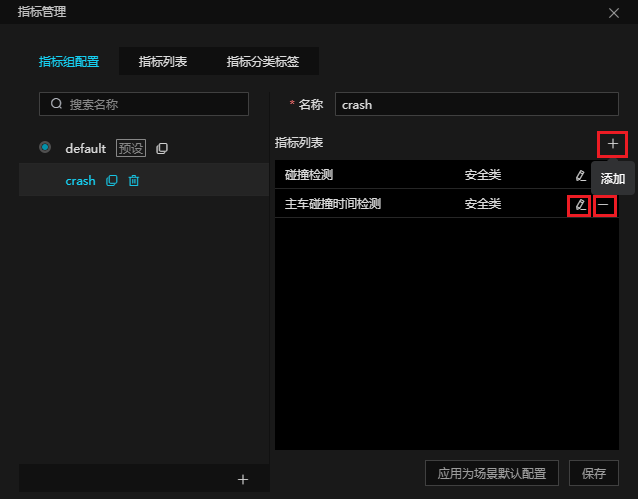
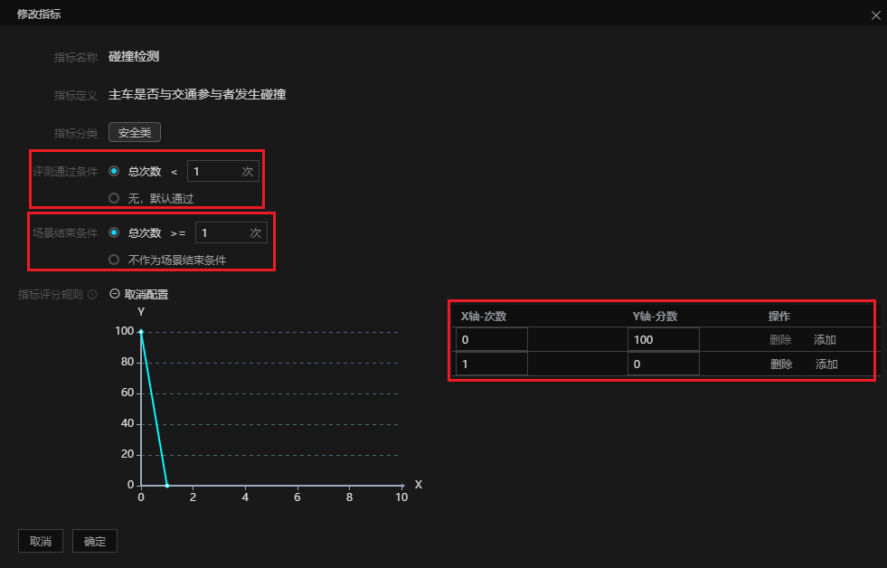
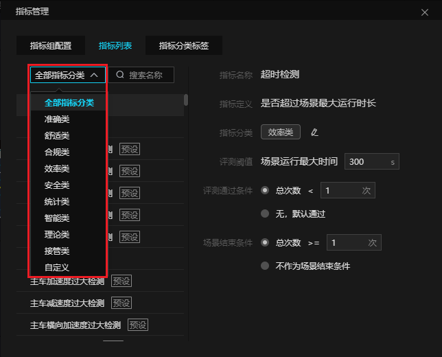
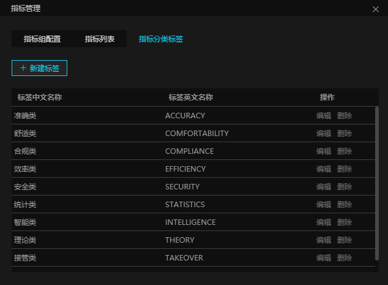

# 9. 场景评测

## 9.1 评测模块功能

评测模块, 主要用于辅助/自动驾驶车辆的仿真测试评测.模块从 TAD Sim 仿真系统中获取特定的消息, 如主车定位消息, 交通参与者感知消息, 高精度地图, 红绿灯状态, 规划轨迹等, 通过对客户选择的特定指标进行监测及评测, 并给出对应的详细评测数据, 并支持测评报告自动生成.

## 9.2 评测指标集

评测模块使用 KPI 作为基本组成单元, 一个 KPI 对应一个用户关心的评测指标.

**KPI 的基本组成如下所示:**

| 参数名称        | 描述           |
|-----------------|--------------|
| name            | 评测指标名称   |
| Category        | 关联的算法名称 |
| Parameters      | 存放评测阈值   |
| passCondition   | 评测条件       |
| finishCondition | 结束场景条件   |

````{note}
注: 需要特别说明, passCondition 多数情况下可以理解为最多出现几次即判定为 Fail, 但也有例外, 如是否到达终点的 KPI 中 passCondition 为 1, 应当理解为至少到达终点 1 次, 才能判定为 Pass. <br>
finishCondition 理解为最多出现几次即判定结束场景.
````

**目前支持的评测指标集定义如下:**

| 指标定义               | 字段名               | 注释                                         |
|------------------------|--------------------|--------------------------------------------|
| TotalTime              | 总时长               | 场景始末时间差                               |
| MinAveragerTimeHeadway | 跟车时距过小次数     | 碰撞交通车所花费的时长小于时距阈值的次数     |
| MinDistanceFromCar     | 跟车距离过小次数     | 与交通车距离小于阈值的次数                   |
| MaxAcceleration_V      | 加速度过大次数       | 纵向加速度过大次数                           |
| MaxDeceleration_V      | 减速度过大次数       | 纵向刹车过大次数                             |
| MaxTurningAccelerate   | 横向加速度过大次数   | 横向转向过猛次数                             |
| MaxSpeed_V             | 超速次数             | 超过道路限速次数                             |
| Collision              | 碰撞                 | 主车是否发生碰撞                             |
| CrossSolidLine         | 压实线次数           | 车轮接触道路实线的次数                       |
| EndPoint               | 是否到达终点         | 主车是否到达终点                             |
| MaxPosError_H          | 横向偏移距离过大次数 | 与规划路径的横向偏移绝对值与阈值的对比       |
| MaxAveragePosError_H   | 平均横向偏移距离     | 规划路径的横向偏移值, 左右偏移的平均值       |
| MaxPosError_H_L        | 左侧最大横向偏移距离 | 通过规划路径的横向偏移值, 向左偏移的最大值   |
| MaxPosError_H_R        | 右侧最大横向偏移距离 | 通过与规划路径的横向偏移值, 向右偏移的最大值 |
| RunTrafficLight        | 闯红灯次数           | 主车通过路口时信号灯为红灯的次数             |

## 9.3 评测模块配置

用户可根据自己的需求设定相应评测指标. 在 TAD Sim 单机版界面菜单栏中, 点击 ``数据管理`` 下拉框中 ``主车算法管理``, 进入 ``模块设置`` 栏, 选中 ``Grading`` 模块, 进行设置.

<div align="center"></div><br>

- ``通道设置`` 栏勾选用户想要记录的数据的 topic 类型, 用于生成详细评测数据.

- ``导出路径设置`` 指定 pblog 存放的目录, Grading 模块默认路径为:
    ``${tadsim_data_dir}/service_data/sim_data/pblog``
    Grading 模块会自动在该目录下生成 ``场景名称-年-月-日-时-分秒.pblog`` 的文件

- ``后处理脚本``: 用来生成详细评测数据
    Grading 模块会自动调用, 需要特殊说明,
    ``-f`` 选项已经由 Grading 模块填写好, 用户只需要选填 ``-p/i/s``

- post_process 使用方式:
  ```
  -f xxx.pblog  // 处理的 pblog 文件(必填项)
  -p            // 处理 trajectory、control, vehState.proto
  -i            // 处理 osi_imu.proto, osi_gps.proto
  -s            // 处理客户定制的消息
  ```

## 9.4 评测指标配置方法

<div align="center"></div><br>

<div align="center"></div><br>

<div align="center"></div><br>

通过点击 菜单栏- ``数据管理`` 下拉列表中的 ``指标管理``, 可以在展开的 ``指标管理`` 界面, 对已有的指标组进行名称搜索, 并支持创建、删除或克隆新的指标组, 以及对新指标组内的指标进行增加、删减和编辑.在编辑指标时, 可以对阈值、评分、指标通过条件以及是否作为场景结束条件进行编辑, 以满足评测指标的个性化要求.

<div align="center"></div><br>

<div align="center"></div><br>

同时, 指标管理支持对各评测指标进行分类 (如系统内置准确类、合规类、安全类等标签) 及基于名称的搜索, 并支持自行添加新的指标分类标签, 方便后续评测指标的组合.
