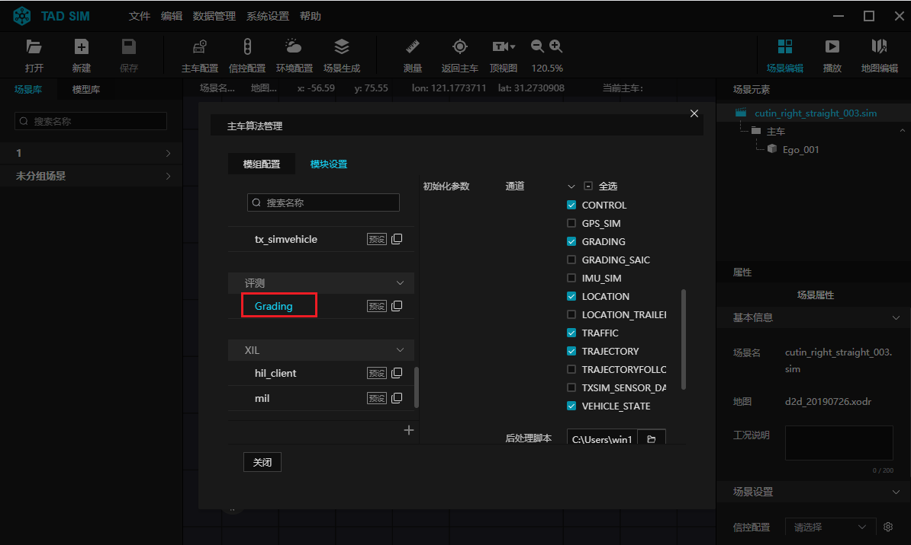
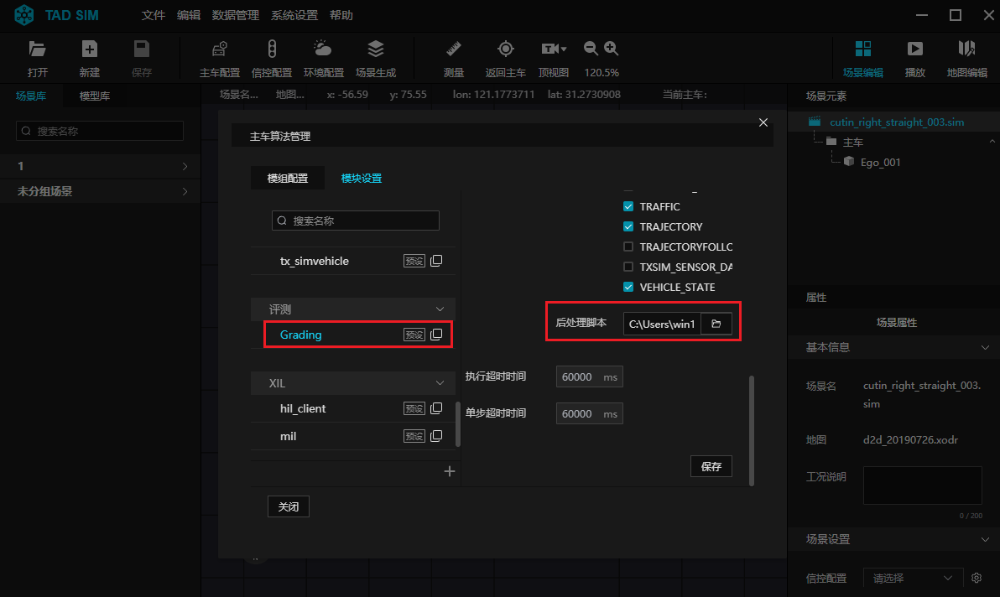
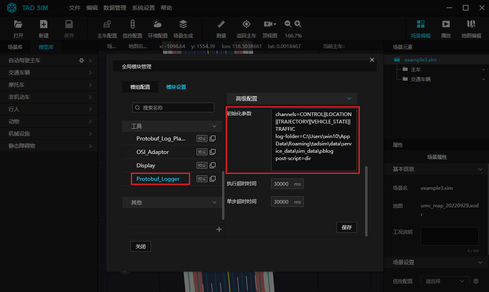
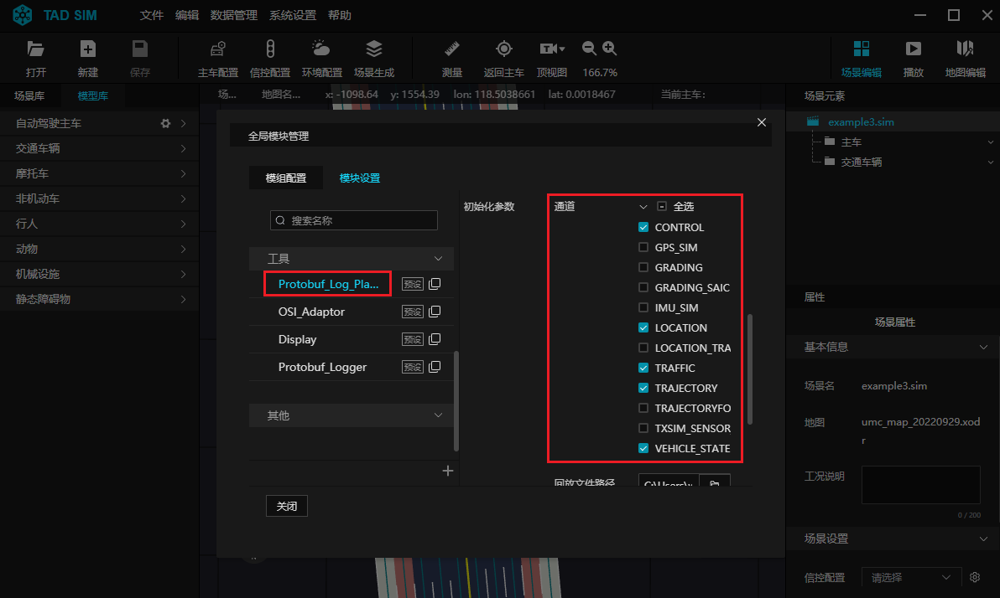
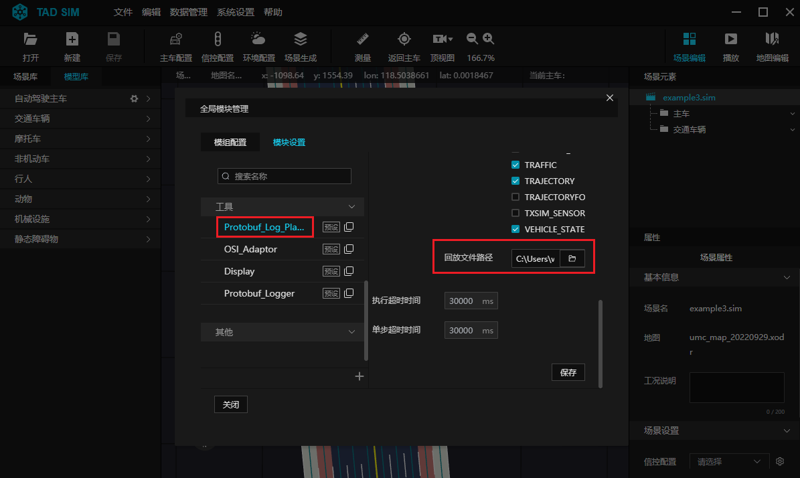

# 10. 仿真数据的记录和回放

TAD Sim 各个模块之间数据交互基于 google protobuf, 即: [Topic, Serialized Protobuf Object]

其中可用的 TOPIC 和 protobuf 消息为各个模块自定义(包括腾讯预定义的部分, 当然用户有新的 TOPIC 和 proto 也可以直接在数据记录模块的 channels 选项中填写 TOPIC 即可记录数据), 目前已经包含以下 TOPIC 及消息:

| TOPIC             | proto 文件              |
|-------------------|-------------------------|
| TRAJECTORY        | trajectory.proto        |
| CONTROL           | control.proto           |
| VEHICLE_STATE     | vehState.proto          |
| LOCATION          | location.proto          |
| LOCAL_LOCATION    | localLocation.proto     |
| IMU_SIM           | osi_imu.proto           |
| GPS_SIM           | osi_gps.proto           |
| TRAFFIC           | traffic.proto           |
| TXSIM_SENSOR_DATA | osi_datarecording.proto |


TAD Sim 提供一个后处理脚本, 存放在: ``${tadsim_data_dir}/service_data/script/post_process``,  这个脚本能够将 pblog 中的数据导出为 xlsx 和 json 格式, 其中 xlsx 文件生成在../${Data}目录下, json 文件生成在当前路径下.

使用方式:
- post_process
  ```
  -f xxx.pblog  // 处理的pblog文件(必填项)
  -p            // 处理trajectory、control, vehState.proto
  -i            // 处理osi_imu.proto,  osi_gps.proto
  -s            // 处理客户定制的消息
  ```


TAD Sim 提供两个模块用于交互数据的存储和回放:
- Grading 和 Protobuf_logger
  - Grading 和 Protobuf_logger 两个模块都可以实现仿真数据记录的功能, 且功能完全一致.
  - Grading 这个功能是为了方便生成评测报告, 如果用户不需要用 grading, 只需要记录数据, 则可以使用 Protobuf_logger 模块.
  - 因为两者功能一致, 使用时两个模块二选一.


## 10.1 记录仿真数据设置

### 10.1.1. Grading 模块

在 ``主车算法管理`` 弹窗中, 进入 ``模块设置`` 栏, 添加 Grading 模块, 通常 Grading 模块作为最后一个模块.

对 Grading 模块, 进行配置. 详情可见 [评测模块配置](./309.场景评测.md#93-评测模块配置).

<div align="center"></div><br>

<div align="center"></div><br>

### 10.1.2. Protobuf_Logger 模块

在 ``主车算法管理`` 弹窗中, 进入 ``模块设置`` 栏, 添加 ``Protobuf_Logger`` 模块, 并对 ``Protobuf_Logger`` 模块, 进行以下配置:

- ``初始化参数``栏:
  - 进行通道、导出路径及后处理脚本设置
- 通道:
  - 填入用户想要记录的数据的 TOPIC 类型
  - ``channels=CONTROL||LOCATION||TRAJECTORY||VEHICLE_STATE||TRAFFIC``
- 导出路径设置:
  - 指定pblog存放的目录, 默认路径为:
  - ``log-folder=\${tadsim_data_dir}/service_data/sim_data/pblog``
- 后处理脚本:
  - 用来生成详细评测数据.
  - 默认路径为 ``post-script=${tadsim_data_dir}/service_data/script/post_process``
  - [-p/i/s]. 需要特殊说明, "-f" 选项已经填写好, 用户只需要选填 "-p/i/s".

<div align="center"></div><br>


##  13.2 回放仿真数据设置

### 10.2.1.Protobuf_Log_Player 模块

在 ``主车算法管理`` 弹窗中, 进入 ``模块设置`` 栏, 添加 ``Protobuf_Log_Player`` 模块, 并对 ``Protobuf_Log_Player`` 模块, 进行以下配置:
- ``通道设置`` 栏勾选要回放数据的 TOPIC 类型.
- ``回放文件路径`` 设置为要回放的 pblog 数据文件路径.

使用 ``Protobuf_Log_Player`` 模块时, 要注意回放的 TOPIC 跟模块正在发送的 TOPIC 避免冲突, 例如, ``Protobuf_Log_Player`` 模块在回放 TRAJECTORY, 那么就不应该运行 planning 模块.

<div align="center"></div><br>

<div align="center"></div><br>
