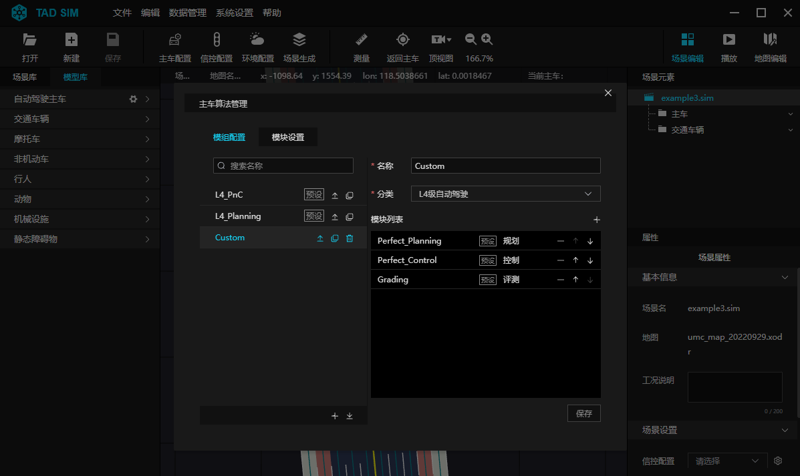
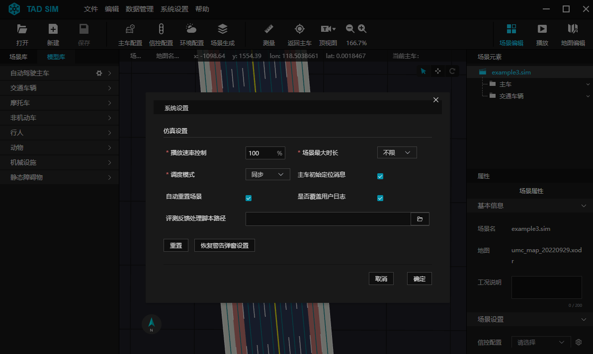
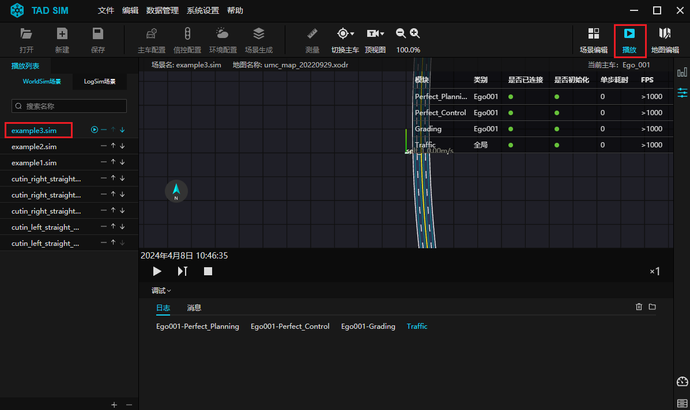
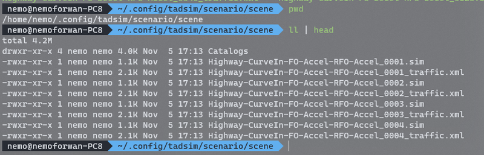
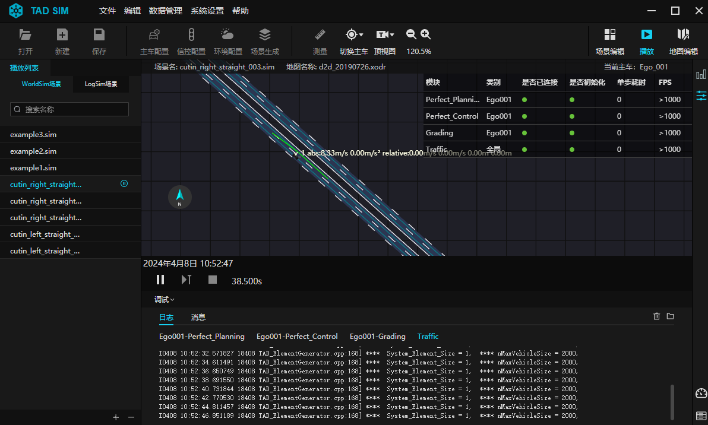
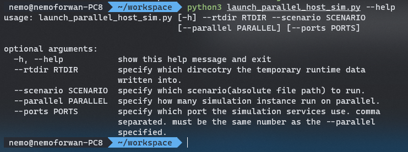
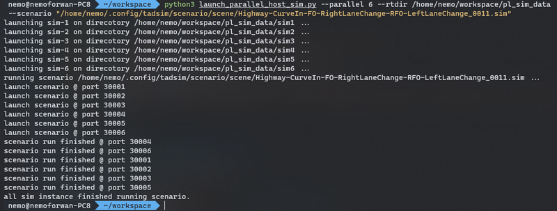
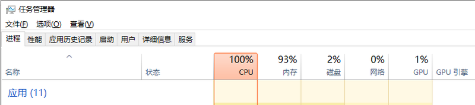
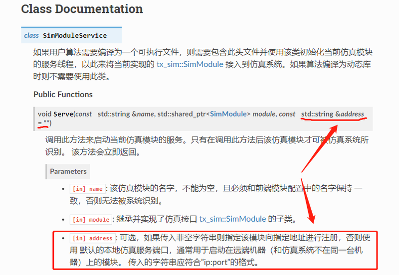

# 11. 单机多进程并行仿真

在 2.42 之后的版本中, TAD Sim 单机版支持基于本机的多进程并行仿真.

单机并行仿真会在后台启动多个仿真引擎实例, 这些实例所使用的仿真配置与当前 TAD Sim 前端界面所配置相同, 因此在运行并行仿真之前需要先通过 TAD Sim 单机版 UI 将所需要运行的场景和模块设置好, 同时需要先通过前端界面验证当前配置是所期望的状态.

**Step 1. 场景、模块和系统配置确认**

- 确认 ``模组配置`` 是否符合用户需求

<div align="center"></div><br>

- 确认 ``系统设置`` 是否符合用户需求

<div align="center"></div><br>

- 确认需要运行的场景文件路径

<div align="center"></div><br>

<div align="center"></div><br>

- 先通过前端界面运行场景, 确认当前的场景和算法配置都可以正常运行

<div align="center"></div><br>

- 完成上述步骤确认各个配置没有问题后, 可以将 TAD Sim 关闭后运行单机并行仿真启动脚本 (不关闭也可以运行脚本, 但会多占用较多资源)


**Step 2. 运行并行仿真启动脚本**

- 需先确保本地有 Python 3.0 以上的运行环境, 启动脚本参数如下:

<div align="center"></div><br>

- Example:
```bash
python3 launch_parallel_host_sim.py \
  --parallel 6 \
  --rtdir /home/nemo/workspace/pl_sim_data \
  --scenario /home/nemo/.config/tadsim/scenario/scene/Highway-CurveIn-FO-RightLaneChange-RFO-LeftLaneChange_0011.sim"
```

- 其中 --rtdir 和 --scenario 是必填参数:
  - ``--rtdir``
    - 是指定并行仿真时后台所需的一些运行时数据的存放目录, 这个目录最好是指定一个不存在的目录或者一个单独的空的目录, 其中包含了运行时引擎和各模块的日志文件.
  - ``--scenario``
    - 指定需要运行的场景文件的绝对路径, 可以是上面通过前端界面已经验证没有问题的场景.
    - 一般存放在 ``~/.config/tadsim/scenario/scene`` 目录下, 注意需要填写完整的绝对路径.
  - ``--parallel``
    - 指定并行仿真的实例个数, 默认是 2.
  - ``--ports``
    - 是指定每个仿真引擎实例服务监听的端口号.
    - 如果不指定则根据 ``--parallel`` 个数默认从 30001 端口开始占用, 比如实例个数是 2 时, 则会尝试将仿真服务依次占用 30001、30002 两个端口.
    - 如果有任何一个端口当前正在被其他程序使用, 则会启动失败.
    - 如果需要手动指定其他固定端口号的话, 则可以用逗号分隔的字符串传入, 比如 --parallel 3 时, 可以指定 --ports "12345,23456,34567", 注意端口数量需要和 --parallel 个数相同, 否则会报错.

- Python 脚本启动后如果没有报错将看到如下打印:

<div align="center"></div><br>

- Python 脚本启动后如果场景成功运行, 会一直等到所有仿真实例运行完场景才会结束退出, 并将所有仿真实例进程(包括自动启动的模块进程) 终止 (SIGTERM).


**注意事项:**

- 单机并行仿真根据所运行算法会非常耗费计算资源, 所以可能场景仿真时长会相应增大(仿真运行速率变慢).

<div align="center"></div><br>

- 使用并行仿真时需要将单机版先关闭, 并行仿真运行结束后(python脚本退出后) 才可以再打开单机版使用.

- 如果单机版模块配置中有模块需要手动启动(模块配置中未勾选 ``是否自动启动``), 则在启动模块时需要显式指定模块连接引擎的地址, 规则如下:
  - 并行仿真时每个引擎实例会分配一个实例ID, 从1开始, 可以从 \--rtdir 指定的目录下的子目录看出, 比如指定 \--parallel 3 时, 则实例 ID 依次为 1、2、3, \--rtdir 指定目录下会分别对应出现sim1、sim2、sim3 这 3 个实例子目录, 对应模块需要连接的引擎端口号分别为 21302+ID , 上述例子中即分别为 21303、21304、21305, ip地址即本地回环 127.0.0.1.
  - 模块显式指定连接引擎地址的方式按模块接入 txSimSDK 方式分为如下 2 种方式 (txSimSDK API文档中有接口详细描述, 此处简略介绍):
    - 方式1. 模块作为动态库时:

    ```bash
    # 手动启动命令行为
    /path/to/tadsim_install_dir/txsim-module-launcher module_name /path/to/module.so sim_addr:port

    # 例如
    /opt/tadsim/resource/app/service/txsim-module-launcher planning /home/nemo/workspace/planning/libsim_planning.so 127.0.0.1:21303
    ```
  - 方式2. 模块作为可执行文件时:
    - 通过 SimModuleService 类 Serve 方法中的第三个参数传入.

<div align="center"></div><br>
