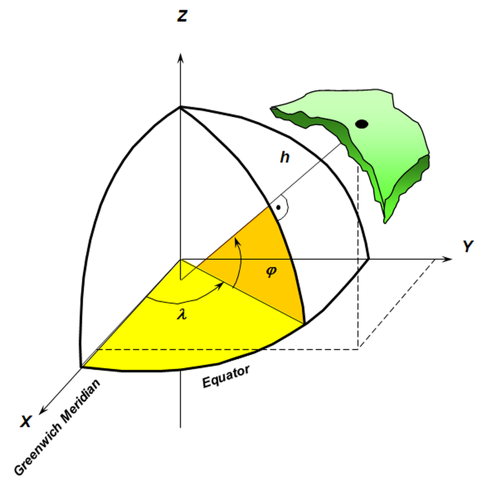
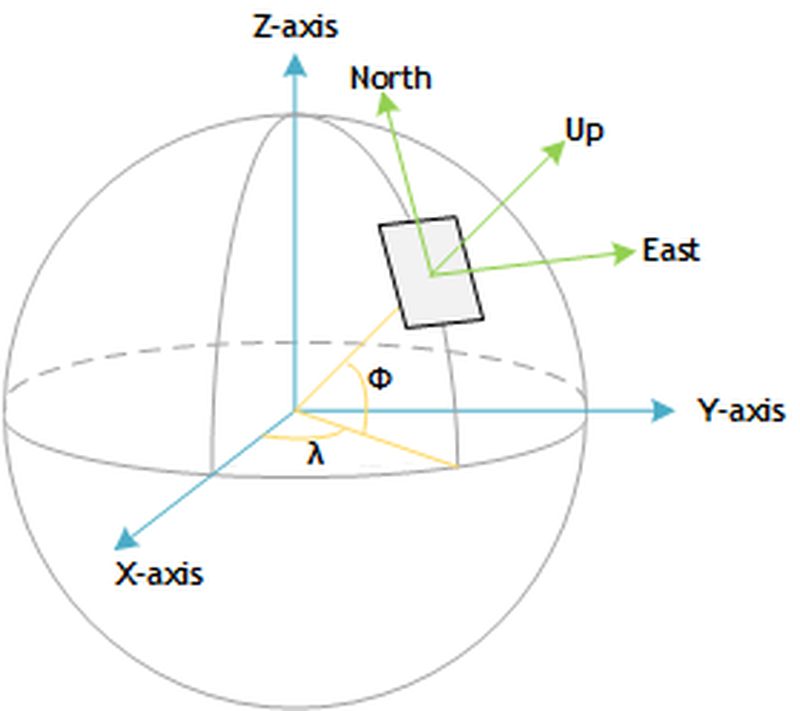
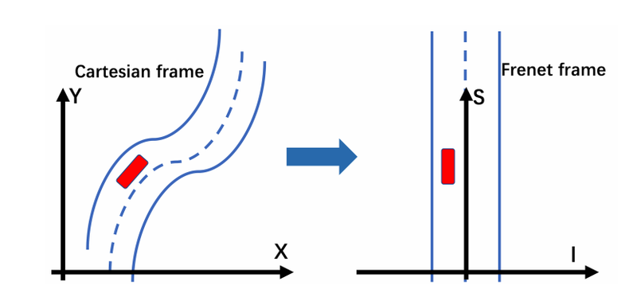

# 1. 系统约定

## 1.1 单位

| 单位   | 约定单位 | 符号  | 含义                         |
|------|---------|-------|----------------------------|
| 时间   | 秒       | s     | 用于表达主车定位时间戳       |
| 时间   | 毫秒     | ms    | 用于表达当前帧对应的场景时间 |
| 长度   | 米       | m     | 用于表达位置信息             |
| 速度   | 米/秒    | m/s   | 用于表达速度信息             |
| 加速度 | 米/秒²   | m/s²  | 用于表达加速度信息           |
| 弧度   | 弧度角   | rad   | 描述车辆定位角度信息         |
| 角速度 | 弧度每秒 | rad/s | 描述车辆定位角速度信息       |

## 1.2 坐标系

TAD Sim 所支持的各种功能涉及多个不同的坐标系, 以下各节介绍每个坐标系的约定.

### 1.2.1. 世界坐标系

世界坐标系通过经度、纬度、高程表示来自高精度地图、定位/感知等设备的物体位置. TAD Sim 采用 World Geodetic System - WGS84 坐标系来表示物体的经度和纬度, 其中经度表示东西方向 (东经为正数, 西经为负数), 纬度表示北南方向 (北纬为正数, 南纬为负数), 高程定义为所对应的椭球体高度[1].

 

### 1.2.2. 局部坐标系

TAD Sim 采用 ISO-8855 Earth-Fixed System (或 ENU: East-North-Up) 来表示场景局部坐标系. 原点 (Origin) 可以定义在地球表面的任意点上, 一般定义为场景的起点.

 

* N轴:即北向坐标轴, 垂直于重力方向, 延地球表面指向北极方向.
* E轴:即东向坐标轴, 垂直于重力方向、垂直于北向坐标轴.
* U轴:即向上坐标轴, 与重力方向相反.
* 原点与 E、N、U 三轴定义了原点处的切平面, 构成了场景的局部坐标系.

### 1.2.3. 弗莱纳坐标系

TAD Sim 场景中车辆通过所属车道(Lane) 的距离(S) 及其相对于中心线的横向距离(T) 来表示自身位置以及周围车辆的相对位置. [2]

 

## 1.3 参考资料来源

[1] [World Geodetic System](https://en.wikipedia.org/wiki/World_Geodetic_System)  
[2] [Frenet–Serret formulas](https://en.wikipedia.org/wiki/Frenet%E2%80%93Serret_formulas)
