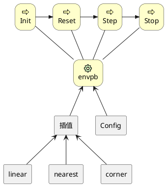
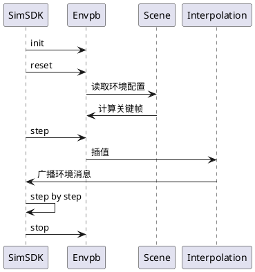

# envpb 环境模块

## 1. 背景

envpb 模块主要完成环境天气数据的广播，它作为全局模块，被后台自动启用，用户无需配置。

## 2. 系统结构



环境处理模块（envpb）及其与其他组件之间的关系：

1. 环境处理模块（envpb）与四个行为（Init、Reset、Step、Stop）相关联。这些行为分别表示初始化、重置、步进和停止环境处理模块的操作。

2. 配置模块（Config）与环境处理模块（envpb）相关联，表示配置信息会影响环境处理模块的行为。

3. 插值模块（Interpolation）与环境处理模块（envpb）相关联，表示插值算法会影响环境处理模块的行为。

4. 线性插值（linear）、最近邻插值（nearest）和圆角插值（corner）模块与插值模块（Interpolation）相关联，表示这些插值算法是插值模块的子组件。

## 3. 核心机制

### 3.1 线性插值

线性插值（Linear Interpolation）用于在已知的数据点之间估计未知值。线性插值假设数据点之间的变化是线性的，即在两个已知数据点之间，未知值可以通过直线方程来估计。

线性插值的基本公式如下：

$$
y = y1 + (x - x1) * (y2 - y1) / (x2 - x1)
$$

其中，(x1, y1)和(x2, y2)是已知的数据点，x是未知值的横坐标，y是未知值的纵坐标。


### 3.2 最近邻插值

最近邻插值（Nearest Neighbor Interpolation）是一种简单的插值方法，用于在已知数据点之间估计未知值。最近邻插值的基本思想是将未知值的估计值设置为距离它最近的已知数据点的值。换句话说，最近邻插值假设相邻数据点之间的变化是离散的，而不是连续的。

### 3.2 圆角插值

圆角插值是以上两种方法的结合，在关键点两侧一定距离内采用线性插值，而超过这个范围则使用最近邻插值。

## 4. 数据库存储设计

无

## 5. 核心接口

### 5.1. 环境参数

| 参数举例 | 默认值     | 单位            | 含义                                |
| -------- | ---------- | --------------- | ----------------------------------- |
| 日期     | 2023-03-20 |                 | 日期                                |
| 时间     | 14:30:00   |                 | 时间                                |
| 能见度   | 30         | km              | 大雾天气的能见度                    |
| 风速     | 2          | km              | 风速                                |
| 云密度   | 晴         | 晴-密云-多云-阴 | 云密度                              |
| 降水     | 干燥       | 干燥-降雨-降雪  | 打开降雨和降雪时，新增强度填写，0~1 |

### 5.2. 广播输出

| 名称                          | 单位 | 范围    | 含义                   |
| ----------------------------- | ---- | ------- | ---------------------- |
| TimeOfDay                     | 秒   |         | 当天时间秒             |
| unix_timestamp                | 毫秒 |         | unix时间               |
| fog.visibility                | 米   | 0~30000 | 能见度                 |
| clouds.fractional_cloud_cover | enum | 0~11    | 云密度                 |
| Wind.speed                    | m/s  | 0~      | 风速                   |
| precipitation.type            | enum | 0~5     | 天气类型               |
| precipitation.intensity       | mm/h | 0~      | 天气（降雨降雪等）强度 |

## 6. 主要业务时序

时序主要包括初始化、重置、逐步执行和停止操作：首先，SimSDK要求Radar组件进行初始化、重置、逐步执行和停止操作；然后，Radar组件要求Sensor组件读取数据并与RarLib组件进行信号传输；最后，Radar组件将OSI数据发布给SimSDK，SimSDK按照逐步执行的方式处理操作。



SimSDK与环境处理模块（Envpb）之间的交互过程。以下是对这个序列图的解释：

1. SimSDK向环境处理模块（Envpb）发送初始化（init）请求。

2. SimSDK向环境处理模块（Envpb）发送重置（reset）请求。

3. 环境处理模块（Envpb）读取环境配置信息（Scene）。

4. 计算环境参数的关键帧。

5. SimSDK向环境处理模块（Envpb）发送步进（step）请求。

6. 环境处理模块（Envpb）进行插值（Interpolation）。

7. 插值后（Interpolation）将环境数据发布给SimSDK。

8. SimSDK重复step过程。

9. SimSDK向环境处理模块（Envpb）发送停止（stop）请求。

这个序列图展示了一个模拟软件与环境处理模块之间的交互过程。

## 7. 数据埋点

无

## 8. 日志格式

>[***timestamp***]:  wind=***wind***, fog=***fog***, cloud=***cloud***, unix=***unix***, precipitation=***precipitation***

* timestamp：当前时间戳
* wind: 风速
* fog：能见度
* unix：时间戳
* precipitation：天气类型

## 9. 业务状态

无

## 10. 代码结构

| FILE      | Describe  |
| --------- | --------- |
| envpb.cpp | 服务入口  |
| envpb.cc  | envpb模块 |

## 11. 开发调试与发布

确保安装cmake，执行以下编译步骤：

1. mkdir build
2. cd build
3. cmake ..
4. make

推荐使用vscode调试代码：

1. 用vscode打开目录
2. cmake工具编译代码
3. 配置launch.json:

    ```json
    {
        "version": "0.2.0",
        "configurations": [
            {
                "type": "lldb",
                "request": "launch",
                "name": "Debug",
                "program": "/修改为你的路径/txsim-module-launcher",
                "args": [
                    "envpb(Tadsim配置的模块名字)",
                    "${workspaceFolder}/build/lib/libtxsim-radar.so",
                    "127.0.0.1:21302"
                ],
                "env": {
                    "LD_LIBRARY_PATH": "/home/root/TAD_Sim/buildin/simdeps/:$LD_LIBRARY_PATH"
                },
                "cwd": "${workspaceFolder}"
            }
        ]
    }
    ```

4. 配置Tadsim，添加一个非自动启动的模块
5. Debug and enjoy.
