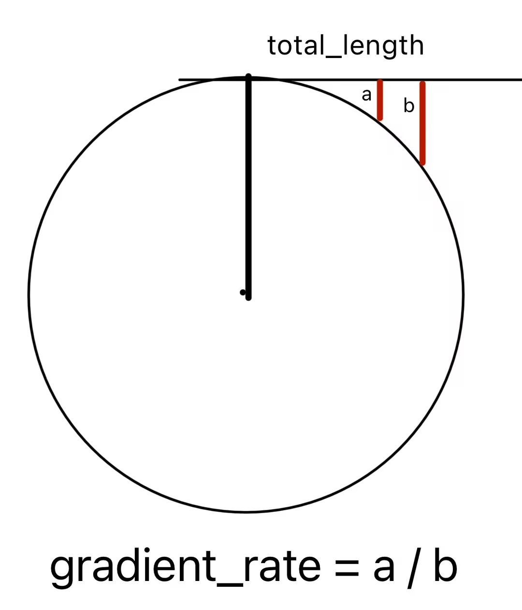
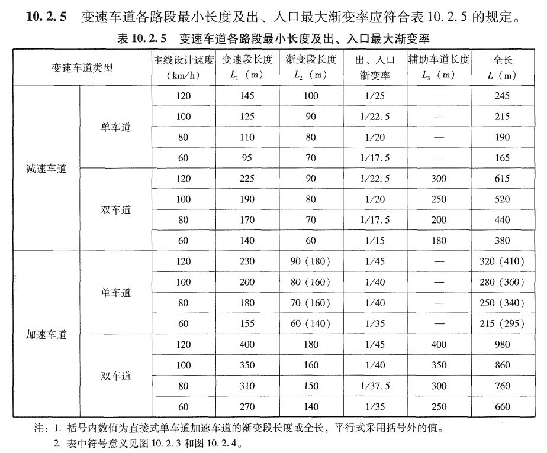
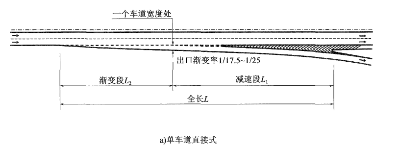
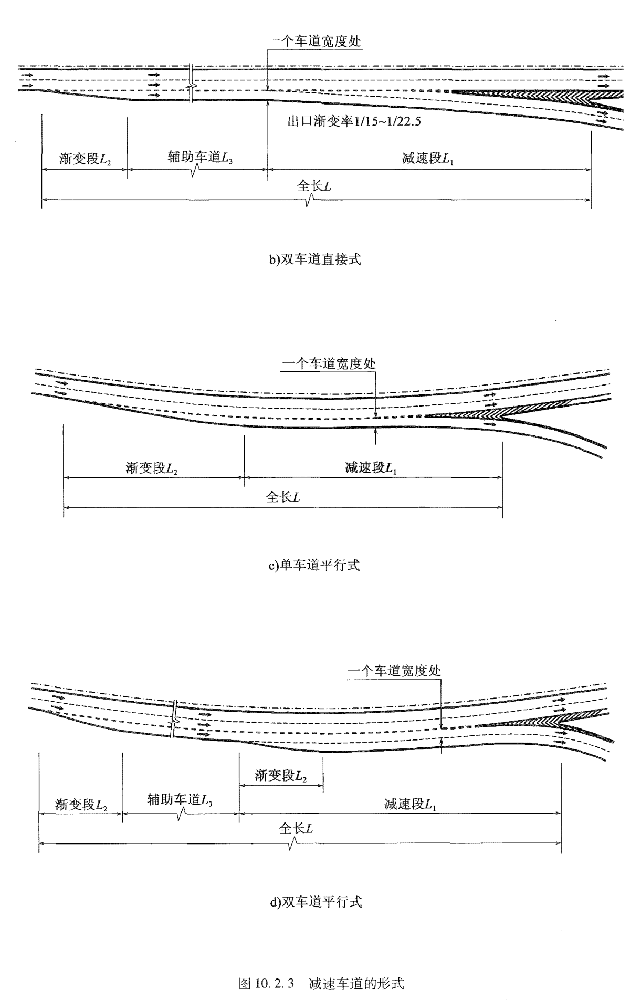
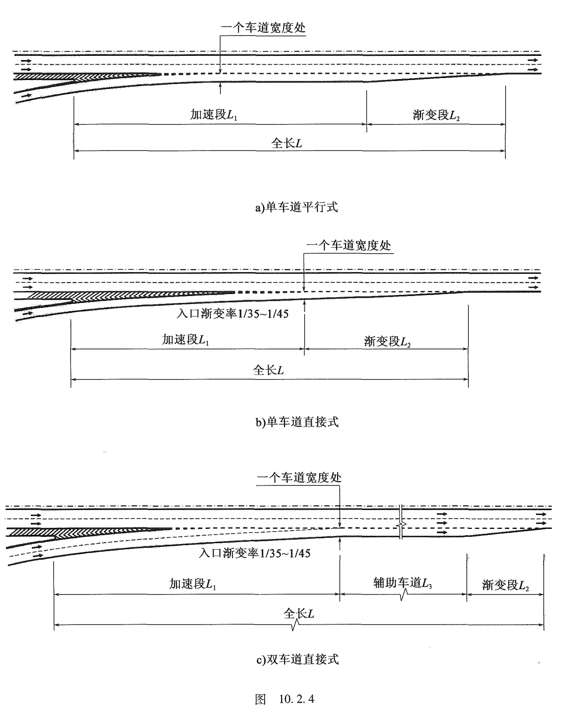
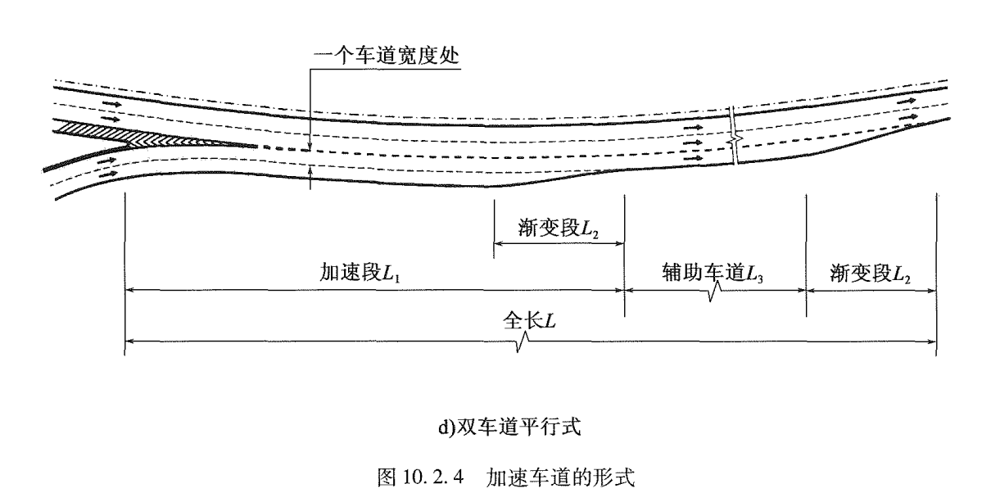

#
## road id
|   | W    | E    | N    | S    |
|---|------|------|------|------|
| W | 0, 0 | 0, 3 | 0, 2 | 0, 1 |
| E | 3, 0 | 3, 3 | 3, 2 | 3, 1 |
| N | 2, 0 | 2, 3 | 2, 2 | 2, 1 |
| S | 1, 0 | 1, 3 | 1, 2 | 1, 1 |

## lane_id
> 注: 目前支持 ≤ 4车道

> 98: 车道最大数量 n
> 99: 4条车道不同规则
>   1车道 = 1, 1;
>   2车道 = 1, 1;
>   3车道 = 2, 2;
>   4车道 = 2, 2;

|   | W      | E        | N       | S        |
|---|--------|----------|---------|----------|
| W | -1, 1  | -99, -99 | -1, -1  | -98, -98 |
| E | 99, 99 | 1, -1    | 98, 98  | 1, -1    |
| N | 98, 98 | 1, -1    | 1, -1   | 99, -99  |
| S | 1, 1   | 98, -98  | 99, -99 | 1, -1    |

## s
|   | W      | E     | N     | S     |
|---|--------|-------|-------|-------|
| W | -1, -1 | -1, 0 | -1, 0 | -1, 0 |
| E | 0, -1  | 0, 0  | 0, 0  | 0, 0  |
| N | 0, -1  | 0, 0  | 0, 0  | 0, 0  |
| S | 0, -1  | 0, 0  | 0, 0  | 0, 0  |

# 车道入口出口设计规范
## 规范说明
https://mp.pdnews.cn/Pc/ArtInfoApi/article?id=32246559

## 规范原文
https://zc.chd.edu.cn/_mediafile/zhangchi/2018/06/29/1ydea0hjxb.pdf

<!-- ## 曲率计算规则
radius = ((a * a) + (gradient_rate * gradient_rate * total_len * total_len)) / (2 * a * gradient_rate)
clockwise_curvature = -1 / radius

 
 -->

## 目前使用内容

 

 

 

 

 
