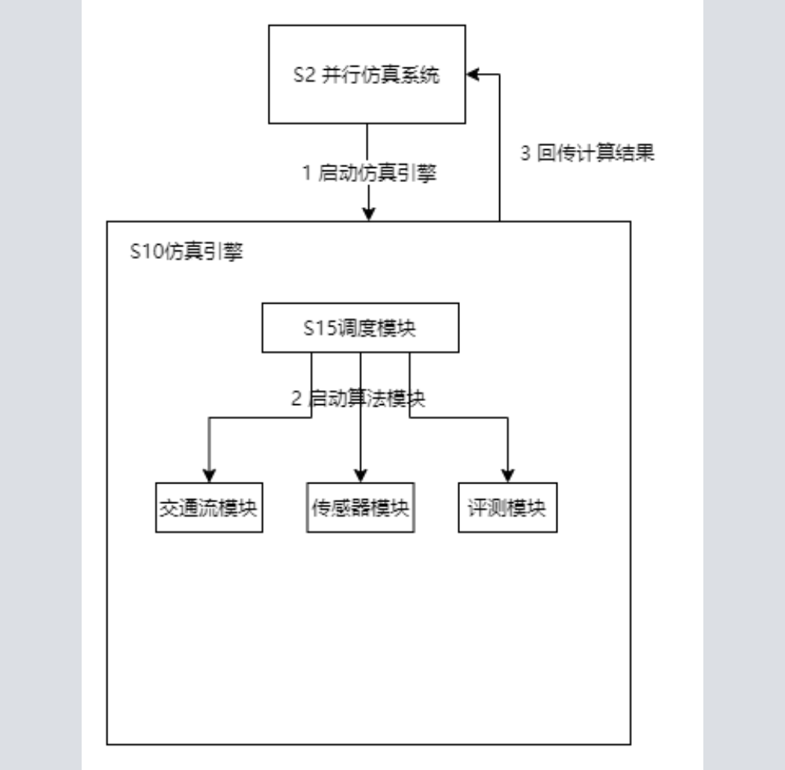
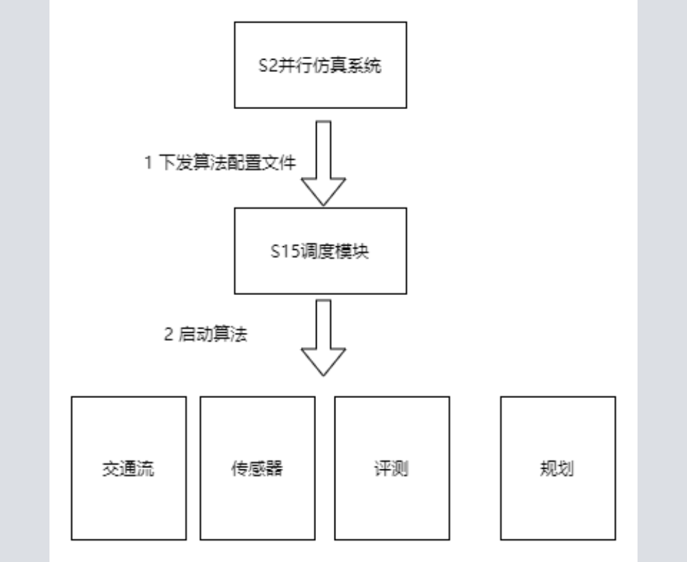
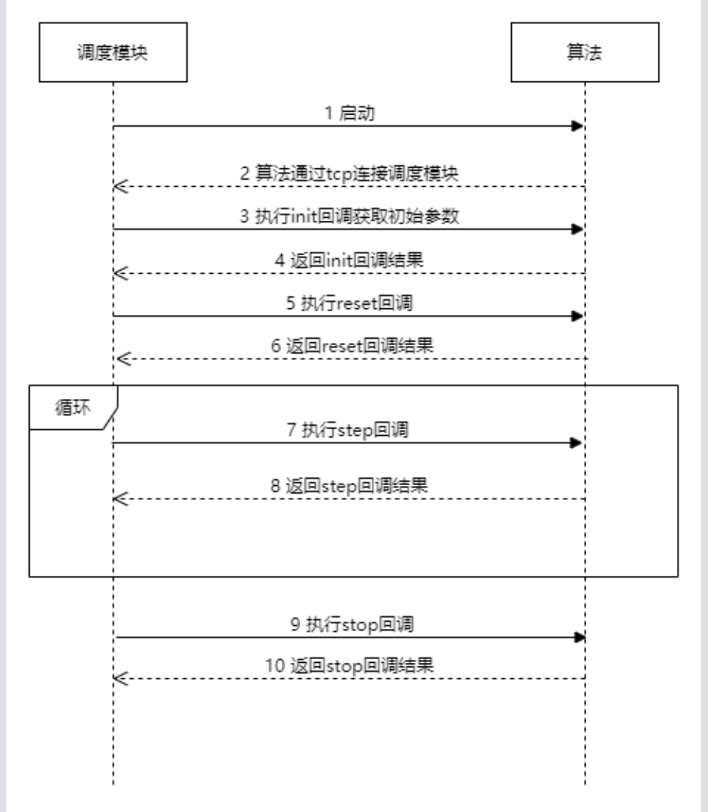
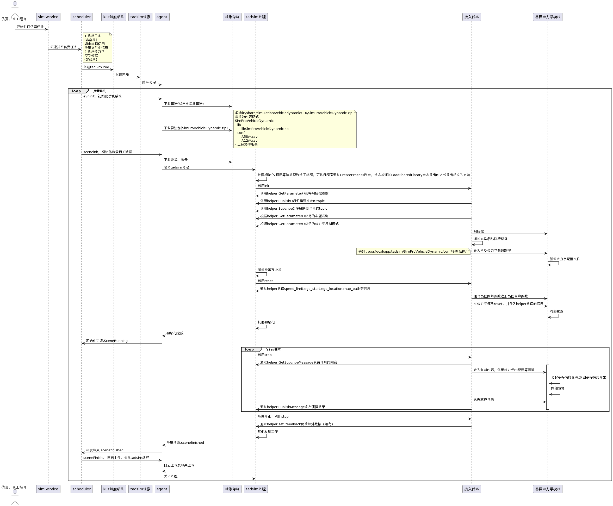

# 仿真引擎调度和算法接入

## 1.背景

该模块为调度模块，属于仿真引擎，用于实现与虚拟城市和并行仿真系统的数据交互和通信。仿真引擎启动之后，调度模块接收从并行仿真系统发送的启动参数比如主车类型、算法配置、场景文件和地图文件路径，启动相应的算法模块，如交通流模块和评测模块，计算结束后把主车位置、轨迹信息和评测数据回传给虚拟城市系统和并行仿真系统。

## 2.系统结构
<div align="center"></div><br>

- 并行仿真系统下发任务将启动参数如算法配置，地图路径，场景文件路径等传给仿真引擎。
- 调度模块启动，根据算法配置启动相应的算法模块。
- 调度模块根据算法配置的调度周期调度算法模块，同时路由每个模块订阅和发布的消息。
- 仿真结束后调度模将计算结果返回给并行仿真系统。

## 3.功能概述

### 3.1 任务启动

并行仿真系统启动仿真引擎，跟调度模块直接通过 grpc 进行通信。
```json
message RunArgs {
  string scenario_path = 1;     // 场景文件路径
  int32 job_id = 2;             // 任务id, 用于标识一个任务的执行情况。 一个任务只能执行一次。
  int32 scene_id = 3;           // 场景id
  string log2world_params = 4;  // log2world参数
}
```

### 3.2 启动算法

<div align="center"></div><br>

仿真引擎启动后会收到算法配置文件，调度引擎根据算法配置文件启动各个算法，模块加载顺序按照 schemes 模组配置里面的 modules 顺序加载模块，下面配置文件的模块加载顺序就是 Perfect_Planning，Perfect_Control，Grading. 并根据算法配置调度周期进行调度, 算法配置文件如下：
```json
{
  "configs": [{
    "name": "Perfect_Planning", // 算法名称
    "execPeriod": 100,          // 执行周期，单位：ms.
    "responseTime": 100,        // 异步模式下接收算法返回结果时间
    "endpoint": "",
    "initArgs": {},             // 初始化参数
    "cmdTimeout": 60000,        // 命令超时时间，单位：ms
    "stepTimeout": 30000,       // 单步超时时间，单位：ms
    "autoLaunch": true,         // 是否自动启动
    "depPaths": [ "@{SimRoot}/deps" ],   // 依赖路径
    "soPath": "@{SimRoot}/bin/libtx_perfect_planning.so", // 动态库路径
    "binPath": "",                                        // 可执行程序路径
    "binArgs": [],                                        // 动态库参数列表 （可选） （在动态库中不起任何意义，只供参考)
    "category": 103                                       // 算法类型
  },{
    "name": "Perfect_Control",
    "execPeriod": 100,
    "responseTime": 100,
    "endpoint": "",
    "initArgs": { "option": "global", "stepTime": 100 },
    "cmdTimeout": 30000,
    "stepTimeout": 30000,
    "autoLaunch": true,
    "depPaths": [ "@{SimRoot}/deps" ],
    "soPath": "@{SimRoot}/bin/libtxSimPerfectControl.so",
    "binPath": "",
    "binArgs": [],
    "category": 104
  },{
    "name": "Grading",
    "execPeriod": 100,
    "responseTime": 100,
    "endpoint": "",
    "initArgs": { "ReportDir": "@{SimRoot}/data/grading/", "DataDir": "@{SimRoot}/data", "simcity":1 },
    "cmdTimeout": 30000,
    "stepTimeout": 1000,
    "autoLaunch": true,
    "depPaths": [ "@{SimRoot}/deps" ],
    "soPath": "@{SimRoot}/bin/libtxSimGrading.so",
    "binPath": "",
    "binArgs": [],
    "category": 51
  }],
  "scheme": {
    "active": 0,
    "schemes": [{  // 模组配置
      "id": 0,     // 模组ID
      "name": "CityCloudEgo", // 模组名称
      "modules": [ {"name": "Perfect_Planning", "priority": 50}, {"name": "Perfect_Control", "priority": 50}, {"name": "Grading", "priority": 50}]
    }]
  },
  "playControlRate": 100, // 仿真加速频率
  "scenarioTimeLimit": 0, // 仿真时间限制，单位：毫秒。0表示不限制。
  "coordinationMode": 1, // 调度模式 1：同步 2：异步
  "autoStop": false,     // 是否自动停止
  "gradingKpiDirectory": "./data/scene", // 评测配置目录
  "defaultLaunch": [{   // 默认启动程序配置
    "name": "Enviroment",
    "execPeriod": 500,
    "responseTime": 500,
    "endpoint": "",
    "initArgs": {},
    "cmdTimeout": 60000,
    "stepTimeout": 30000,
    "autoLaunch": true,
    "depPaths": [ "@{InstallDirectory}/simdeps" ],
    "soPath": "@{InstallDirectory}/libenvpb.so",
    "binPath": "",
    "binArgs": [],
    "category": 1
  }]
}

```

### 3.3 开始仿真

<div align="center"></div><br>

1. 调度模块根据算法配置文件启动算法，根据算法类型是动态库还是可执行程序启动子进程。
2. 算法启动后通过 tcp 连接调度模块
3. 调度模块执行 init 命令并将初始化参数发送给算法
4. 算法执行init回调并将结果返回给调度模块
5. 调度模块执行reset命令
6. 算法执行reset回调并将结果返回给调度模块
7. 开始仿真后循环执行step命令，并将算法订阅的topic发送给算法模块，云端调度服务会把算法结果发送给kakfa。
8. 算法执行将step回调，接收step输入并将结果返回给调度模块
9. 仿真结果后调度模块发送stop命令
10. 算法执行stop回调并将结果返回给调度模块，程序终止。


### 3.4 仿真结束

```json
message ModuleStatus {
  string name = 1; // 算法名称
  ModuleStatusCode sc = 2; // 算法退出状态
  string msg = 3; // 算法退出消息描述（可选）
}

message RunResult {
  ErrorCode ec = 1; // 仿真任务结果状态
  repeated ModuleStatus module_status = 2;  // 当前场景结束时各个模块的状态信息
}
```

<div align="center"></div><br>

仿真结束后调度将结果返回给并行仿真系统。


## 4.子模块

### 4.1 算法接入

用户算法(C/C++)接入TAD Sim仿真系统只需要实现四个C++的接口函数(回调函 数/Callback)即可，支持编译的产出为：
1. 将自己的算法编译为动态库(so/dll)，然后通过仿真系统进行加载，并在运行时调用用户实现的对应的接口函数以执行相应的用户算法逻辑。该方式只需要用户的代码工程添加仿真的头文件即可，无需额外链接任何仿真的依赖库；
2. 将自己的算法编译为可执行文件(binary/exe)，该方式除了添加仿真相关的头文件外，还需再额外链接仿真系统的动态库。
算法接入本身无需依赖任何其他第三方库，但是由于仿真系统内置的消息定义采用了谷歌开源的 Protocol Buffers 格式，所以为了解析仿真系统发出的消息，需要额外依赖 protobuf 库，任意版本均可(推荐3.0 以上任意版本) 。另外本文档使用的example工程使用cmake 生成工程文件， 如果需要编译示例工程则需要再安装 cmake (Ubuntu 下直接 sudo apt install cmake 即可，Windows 下可直接去官网下载安装包)。

算法接入本身无需依赖任何其他第三方库，但是由于仿真系统内置的消息定义采用了谷歌开源的 Protocol Buffers 格式，所以为了解析仿真系统发出的消息，需要额外依赖 protobuf 库，任意版本均可(推荐3.0 以上任意版本) 。另外本文档使用的example工程使用cmake 生成工程文件， 如果需要编译示例工程则需要再安装 cmake (Ubuntu 下直接 sudo apt install cmake 即可，Windows 下可直接去官网下载安装包)。
以 Ubuntu 16.04 下编译 example 为例：

第一步，  解压 txSimSDK.tar.gz，在解压出的txSim目录中包含以下子目录：

examples : 示例工程源码；

inc : 算法接入仿真系统所需要的头文件；

lib : 编译为可执行文件时需要额外链接的仿真系统动态库；

msgs : 仿真系统内消息的 protocol buffers 定义；

doc : 本文档内容。

第二步，  进入 examples 目录执行如下命令：

mkdir build && cd build

cmake ..

Make

编译后产物在 examples/build/lib/libmy-module.so（动态库）和 examples/build/bin/my-module-main（可执行程序）


详细接入方式请参考txSimSDK里面的doc文档。

### 3.2 消息转发
将输入的指令（Command）进行解析并根据当前内部的状态对各个模块（Sim Module）进行调度以及消息的转发。仿真系统中的消息系统基于类似与ROS中的topic机制，即某种类型的消息对应于一个指定的topic，各个模块之间通过对topic的订阅和发布来确定消息的流转路径。需要指出的是为了满足可复现性质（确定性），多个模块publish同一个topic在framework v2的设计中是不允许的，另一方面，为了支持模块之间依赖关系的解耦，一个模块subscribe一个不存在的topic（没有模块publish这个topic）却是允许的。

### 3.3 调度方式
算法分为同步、异步以及优先级调度方式，同步、异步和优先级的调度方式在实现方式上都是基于有优先级的事件队列，当前系统对每个模块定义了2个有关调度的属性：
•	execution period: 当前模块计划的执行周期，即每隔多久时间会被调用执行一次；
•	response time: 当前模块每次执行时预期的执行耗时。
仿真系统为了实现可复现性会在系统中采用虚拟时间，无论模块每次执行的实际耗时是多少，对于仿真系统中其他模块来说，该模块的执行时长永远都是其预期耗时。模块的执行耗时影响着其输出的计算结果在系统内对其他模块的可见性，即在执行结束之前模块的输出在系统内对其他模块是不可见的，而在执行结束之后会立即被之后执行的模块所见，更进一步，仿真系统定义如果在同一时刻既有开始执行的模块，又有执行刚结束的模块时，开始执行的模块总是能看见刚执行结束模块的输出结果。
在实现上，对于模块实际执行时间小于预期耗时的情况，仿真系统会将模块发出的最新的计算结果进行缓存，并在预期耗时结束之前仍用上一次计算的结果对其他订阅模块进行转发，在预期耗时结束之后再在系统中正式更新最新的计算结果；而对于实际执行时间超过预期耗时的情况，系统会block住其他模块的执行并一直等待该模块即算完成获取最新的计算结果，来保证原本预期会在该模块预期执行完成之后执行的其他模块可以按照预期拿到最新的计算结果，这就要求了接入仿真的各模块需要通过仿真的虚拟授时获取当前系统时间而不是直接通过调用系统函数获取。
同步调度方式就是相对于异步调度方式中response time为0的一种特例。有一点需要注意的是由于执行时间变为了0，也就是视为瞬间完成，这种情况下会将原本在基于topic系统中解耦的各个模块重新引入相互之间的依赖关系，所以此时用户需要显式的指定各个模块的执行顺序。

### 3.4 加速仿真
仿真系统支持加速仿真，仿真系统为了将模块的仿真时间接近真实世界的时间，两个调度周期之间会sleep一段时间， 所谓加速仿真是缩短模块之间的sleep时间，加速仿真需要用户在执行仿真时指定加速倍数，加速倍数越大，模块的sleep时间越短，模块的执行速度越快，如果算法模块使用的是仿真系统的仿真时间，加速后对仿真一致性没有影响，如果不是用仿真系统的仿真时间，加速后会出现不可预知的结果。

### 3.5 调度服务如何选择
引擎对外提供三种服务，单机版，场景仿真，虚拟城市服务，部署的时候根据三种服务选择不同的部署方式，单机版部署在单机上，场景仿真和虚拟城市服务部署在分布式集群上。


### 3.4 时序图

<div align="center"></div><br>


## 4 编译 调试
### windows环境准备
1. vcpkg
2. 安装node.js
3. 设置全局node_modules路径到PATH
4. 安装cmake

### window编译
1. 进入framework_v2,
2. 创建build文件夹并进去
3. 执行命令：cmake -T v140 .. 或者直接执行build_sln.bat
4. cmake --build .或者打开sln工程编译

### ubuntu编译
ubuntu已经配置了编译镜像，下载即可。
1. 挂载docker镜像：docker run -u dev --rm -it -w /home/dev -v /mnt/d/workspace/:/home/dev  csighub.tencentyun.com/simcloud/simcore_dev:tag-ubuntu1604-v2.2 bash
2. cd framework_v2
3. mkdir build;
4. cd build;
5. cmake ..;make -j 12

## 5 代码结构
    --cli                                   调度模块客户端调试程序
    --docs                                  调度模块doxy文档生成工具
    --example                               算法接入例子
    --images                                README.md引用的图片目录
    --src                                   调度模块源码
       --api                                python api接入源码
       --cli                                c++ api接入tcp通信源码
       --coordinator                        调度模块源码
       --module                             算法接入源码
       --node_addon                         c++封装node源码
       --service                            调度服务
         --cloud_city_service.cc            虚拟城市城市调度服务
         --cloud_service.cc                 场景仿真调度服务
         --local_service.cc                 单机版调度服务
       --utils                              通用工具封装
    --tests                                 单元测试代码
    --tools                                 数据库升级模块
    --CMakeList.txt                         编译时生成的CMakeLists.txt文件
