# Grading

# 1. 背景

​  Grading 评测模块主要用于辅助/自动驾驶车辆的仿真测试评测。模块从 TAD Sim 仿真系统中获取特定的消息, 如主车定位消息, 交通参与者感知消息, 高精度地图, 红绿灯状态, 规划轨迹等, 通过对客户选择的特定指标进行监测及评测, 并给出对应的详细评测数据。

# 2. 系统结构

## 2.1. 架构

<div align="center">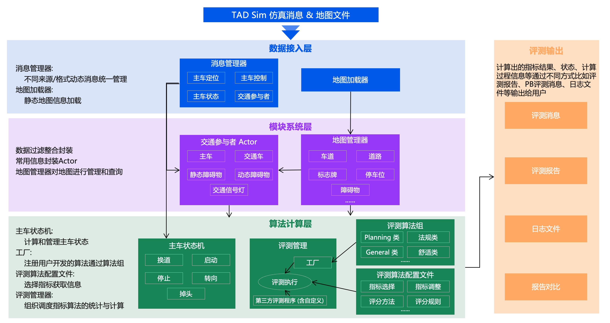</div><br>

**Grading系统分为四层**:

- **数据接入层**
  - Grading的数据输入包括动态数据比如**TAD Sim 实时的仿真消息**, 包含主车定位信息、控制信息、状态信息、交通车信息等等;
  - 静态数据包含各种**地图文件**。
  - 在该层会将不同来源、不同格式的动态消息通过**消息管理器**统一管理;
  - 将静态地图信息通过**地图加载器** 加载到Grading模块中。
- **模块系统层**
  - 该层将接入的数据进行过滤、整合、封装。常用信息会封装成**交通参与者Actor**, 比如主车Actor、交通车Actor等等;
  - 地图数据由**地图管理器**进行管理和查询。
- **算法计算层**
  - 该层由**主车状态机**来计算和管理主车在每时刻的状态信息;
  - 将用户开发的算法通过**评测算法组**的方式注册到评测指标工厂中;
  - 依据用户配置的**评测算法配置文件**选择需要评测的指标、获取相应的指标信息;
  - 最终在**评测管理器**的组织和调度下进行指标算法的统计与计算。
- **数据输出层**
  - 该层会将计算出的指标结果、状态、计算过程信息等通过不同方式比如**评测报告**、**PB评测消息**、**日志文件**等输出给用户。

## 2.2. 要点概述

- **TADSim 仿真数据**

  - [TAD Sim 系统消息定义-主线](https://doc.weixin.qq.com/sheet/e3_AYIAKQZaABoSjqd81bFQWODMbOrxX?scode=AJEAIQdfAAogVn3mUpAYIAKQZaABo&tab=njdi31)
- **评测指标**

  - 评测模块使用 KPI 作为基本组成单元, 一个 KPI 对应一个用户关心的评测指标.
  - KPI 的基本组成由 grading_kpi.proto 决定, 如下所示:
    - name:评测指标名称
    - category:关联的算法名称和分类标签
    - parameters:存放评测阈值、定义、方法等相关参数
    - passCondition:评测通过条件
    - finishCondition:结束场景条件

  ```json
  {
        "name": "TotalTime",
        "category": {
          "labels": [
            "EFFICIENCY"
          ],
          "features": [
            "General"
          ]
        },
        "parameters": {
          "thresholds": [
            {
              "threshold": "300",
              "thresholdName": "场景运行最大时间",
              "thresholdUnit": "s",
              "thresholdID": "Default_Thresh_ID",
              "thresholdType": "ThresholdType_DOUBLE"
            }
          ],
          "indicatorName": "超时检测",
          "definition": "是否超过场景最大运行时长",
          "calculationMethod": "累计时长与最大时长阈值比较",
          "indicatorNameEng": "TotalTime",
          "additional": {}
        },
        "passCondition": {
          "relation": "<",
          "value": 1,
          "desc": "超时次数"
        },
        "finishCondition": {
          "relation": ">=",
          "value": 1,
          "desc": "超时次数"
        }
      }
  ```

  - ​需要特别说明，passCondition 多数情况下可以理解为最多出现几次即判定为Fail，但也有例外，如是否到达终点的 KPI 中 passCondition 为 1，应当理解为至少到达终点 1 次，才能判定为 Pass;
  - finishCondition 理解为最多出现几次即判定结束场景。
- **评测指标集**

  - 目前支持的评测指标集的定义见文档:[评测指标汇总](https://doc.weixin.qq.com/sheet/e3_AGsAaAaDACc8k2R7KS2RNW8rAzwta?scode=AJEAIQdfAAoG3u5OqWAc4ANAaJAFk&tab=ay9dcq)
  - 注意:评测支持的所有指标以及相应参数的配置，都以 all_grading_kpi.json 为准, 以上目标 json 皆可以使用 tools/transfer.py 工具生成，详见 py 内部。
- **评测指标配置**

  - 单机版用户可以通过TADSim单机版软件“数据管理”-->“指标管理”进行配置;云仿真用户需要通过”指标管理“入口进行配置，也可以上传自定义的指标配置文件。
- **评测报告**

  - 评测报告主要输出场景的信息以及具体评测指标信息:
    - 场景信息。主要说明当前仿真场景的相关信息。
    - 全局模块列表。 主要包含当前场景仿真任务的全局算法模块以及其在仿真中的耗时等信息。
    - 主车评测评测信息。 主要说明当前仿真场景主车的ID、模块及控制器。
    - 配置列表。 展示该主车在当前场景仿真任务的算法模块以及其在仿真中的耗时等信息。
    - 指标列表。 展示当前仿真任务该主车需要评测的指标列表、指标信息及指标评测结果。
    - 指标详情。 展示该主车指标说明及评测的详细结果。
    - 元数据。 展示该主车一些基本且关键的指标详细结果。
  - 其中 a、b 是全局部分，一份报告只出现一次;
  - c、d、e、f、g 是主车部分，出现的次数和主车数量一致。

<div align="center">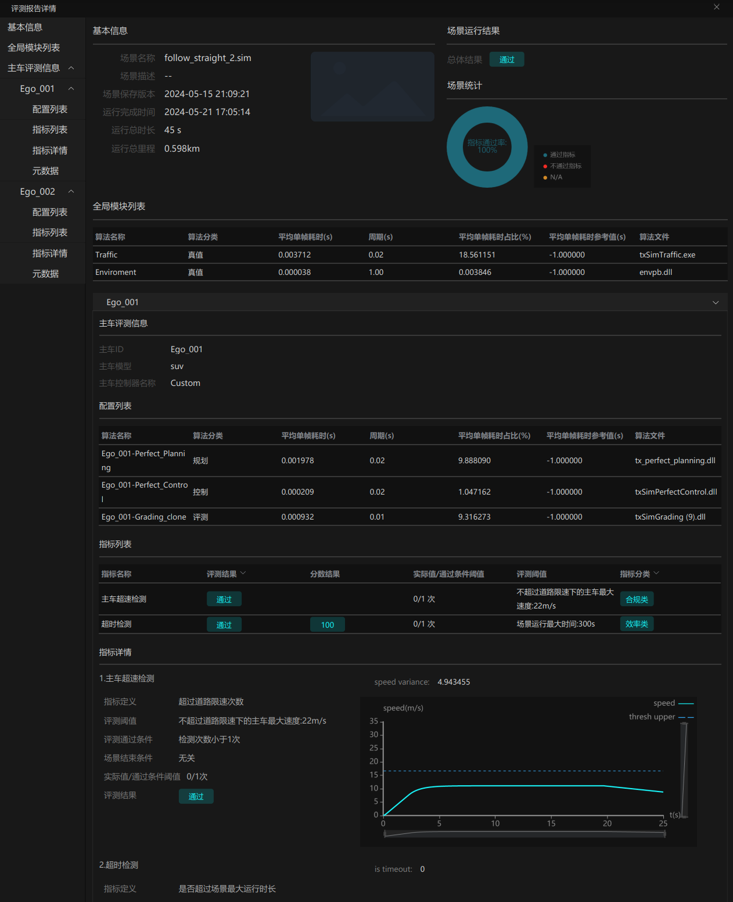</div><br>

# 3. 核心接口

## 3.1. 实现方式

​  实现是按照 txSimSDK 的标准流程实现.

## 3.2. 接口内容

### 3.2.1. 输入

| 信号说明                             | TOPIC               | 具体文件或库         | 通信方式                                                          |
| ------------------------------------ | ------------------- | -------------------- | ----------------------------------------------------------------- |
| 交通车信息                           | TRAFFIC             | traffic.proto        | TCP                                                               |
| 主车当前定位信息                     | LOCATION            | location.proto       | TCP                                                               |
| 主车控制指令信息                     | CONTROL_V2          | control_v2.proto     | TCP                                                               |
| 规划算法以离散点形式输出的期望轨迹线 | TRAJECTORY          | trajectory.proto     | TCP                                                               |
| 主车车辆状态信息                     | VEHICLE_STATE       | vehState.proto       | TCP                                                               |
| 车位信息                             | TXSIM_PARKING_SPACE | parking_space.proto  | TCP                                                               |
| 主车泊车状态                         | PARKING_STATE       | parking_state.proto  | TCP                                                               |
| 高精地图信息查询/获取                | -                   | common/map_sdk | grading 进程中启动多线程调用 map_sdk 的库，通过函数调用方式调用函数 |

### 3.2.2. 输出

| 信号说明     | TOPIC   | 具体文件或库         | 通信方式                              |
| ------------ | ------- | -------------------- | ------------------------------------- |
| 评测输出信息 | GRADING | grading.proto        | TCP                                   |
| 评测报告     | -       | grading_report.proto | 在stop阶段向特定路径写入.dict报告文件 |

# 4. 主要业务时

## 4.1. Grading 仿真评测时

<div align="center"></div><br>

​  txSimSDK 规定了模块的实现流程，如上图左侧所示，需要实现四个函数 init -> reset -> step -> stop. 图右侧是每一步对应的具体实现, 消息协议的转换需要在 step 中完成.
Grading 评测模块由 TAD Sim 默认集成, 受调度模块 (Coordinator) 的调度。

- **Init:**

  - 引擎会传递给Grading 模块对应的参数。Grading 根据获取到的参数进行初始化操作。所有处理和具体的地图、场景无关。
- **Reset:**

  - TAD Sim 引擎根据当前任务选择的指标组生成 json 配置文件, Grading 模块直接使用的KPI配置均在该json文件中。配置文件中包含多个2.2.3中说明的KPI。同时会读取当前仿真场景的地图文件和场景文件。
- **Step:**

  - Grading 模块会根据KPI及对应的仿真系统消息, 进行评测。同时记录下来关注的仿真数据, 用于生成详细评测报告
- **Stop:**

  - Grading 模块会开启一个线程, 该线程调用 post_process 处理记录的仿真数据, 生成 xlsx 和 json 详细评测文件, 两者内容相同, 均包含评测结果及仿真过程中每个step的数据。
  - xlsx 和 json 文件名格式为 scene name+date(y-m-d-h-m-s)。
  - json 文件用于单机版 TAD Sim 生成pdf格式的评测报告, xlsx用于辅助用户分析定位问题。
  - json 文件在 log-folder 目录下, xlsx 文件存放在 log-folder/../date(y-m-d) 的目录下。

## 4.2 KPI 执行时序

#### 4.2.1 以指标压实线举例:

EvalCrossSolidLine (压实线指标) 包含 _kpi_name (指标名称)和 s_on_solidline_plot (折线图数据结构)。

- _kpi_name  是指标名称, 是系统内该指标的唯一主键, 通过该主键进行指标的查询和操作。需要和指标源文件的_kpi_name一一对应。
- s_on_solidline_plot 是用于报告的 折线图数据对象, 用于记录车辆是否越过压实线的数据。

EvalCrossSolidLine 还包含了一些变量, 并在构造函数中进行了统一初始化, 用于计算指标和记录状态。

**关键步骤:**

- 指标通过  Init 函数进行算法的初始化工作, 其中根据指定名称获取指标相关定义及属性, 并进行报告信息的配置。
- 指标通过 Step 函数进行逐步执行的, 通过获取仿真消息计算和记录指标的结果。在该指标中会先获取车辆的前车和拖车的轮廓和位置信息、以及地图的车道线信息;接着判断前车和拖车是否越过压实线, 并根据检测结果记录指标的状态。最后将数据添加到报告的 XY 图中, 并记录相关日志信息。
- 指标通过 Stop 函数停止计算, 并在报告中添加指标计算的结果信息。
- 指标通过 IsEvalPass 函数判断评估是否通过, 根据评分指标的配置和检测结果返回相应的通过与否状态。
- 指标通过 ShouldStopScenario 函数判断是否需要停止场景模拟, 根据指标的完成条件和检测结果进行判断, 并在需要停止时设置相应的原因信息。

## 4.3 主车状态机

主车状态机用于记录当前帧的主车状态和主车行为。在每帧计算处理各个指标前, 会先计算当前主车的状态和行为, 方便各个指标直接使用。目前定义的主车状态和行为如下图所示, 具体实现请看 stateflow 下的代码。

<div align="center">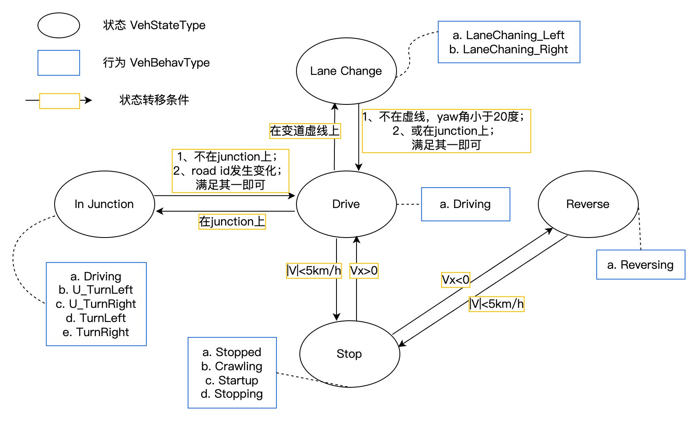</div><br>

# 5. 数据埋点

无

# 6. 日志格式

Grading 模块默认支持 INFO WARNING ERROR 级别日志

```cpp
#define LOG_INFO
#define LOG_WARNING
#define LOG_ERROR
```

同时支持 [0,3] 级的用户自定义日志

```cpp
#define VLOG_0    VLOG(0)<<"eval | "
#define VLOG_1    VLOG(1)<<"eval | "
#define VLOG_2    VLOG(2)<<"eval | "
#define VLOG_3    VLOG(3)<<"eval | "
```

目前推荐使用VLOG_0记录重要日志, 使用VLOG_2记录一般调试类日志。

# 7. 代码结构

## 7.1. 主模块

## 7.2. 外部评测指标开发

<div align="center">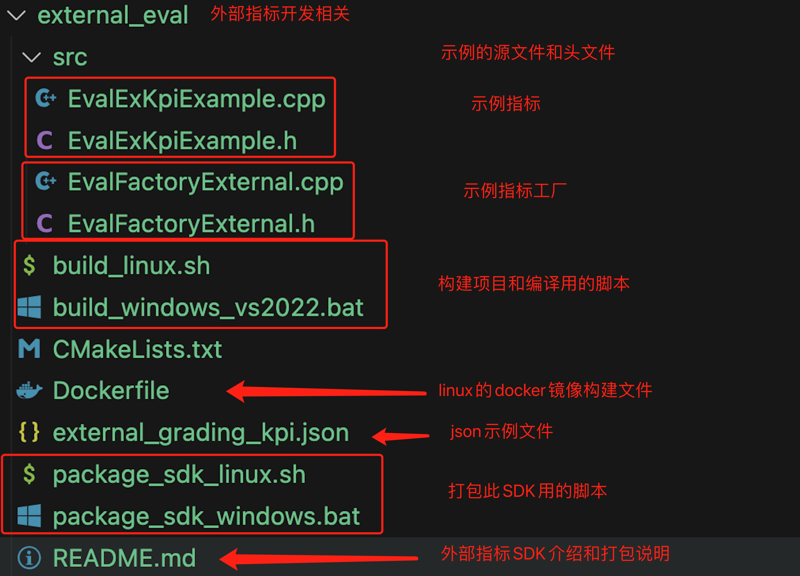</div><br>

# 8. 开发调试与发布

## 8.1. 代码拉取

```powershell
# step 1: 获得远程仓库地址及权限
# tadsim (包含构建单机版tadsim的所有代码)

# step 2: 获取代码并进入根目录
# 获得远程仓库地址及权限 (下述以 xxx 代替)
git clone xxx.git
# 进入根目录
cd tadsim/simcore/grading
```

## 8.2. 调试环境创建

本演示为 windows 环境, cmake, Visual Studio(推荐2022+)

## 8.3. 编译代码

### 8.3.1. Windows

#### 8.3.1.1. 前置准备

- **打包代码**

  - tar zcvf TAD_Sim.tar.gz --exclude=TAD_Sim/.git TAD_Sim/
  - 将 TAD_Sim.tar.gz 拷贝到 windows 环境自己的目录下, 解压
  - 又或者直接在 windows 环境 git clone 此 TAD_Sim 项目亦可
- **vcpkg安装和相关依赖库安装**

  - 请先安装好 vcpkg 软件, 并在系统中配置好系统变量 %VCPKG_ROOT, 用于指示VCPKG的安装位置, 接着使用此命令安装相关依赖库:
  - ./vcpkg.exe install zlib boost eigen3 flann gflags glm glog protobuf grpc gtest curl proj libspatialite sqlite3 libxml2 jsoncpp log4cpp-log4cpp pugixml soci tbb uriparser xerces-c grpc tinyxml2 cppzmq  --triplet x64-windows
- **生成sim_msg的源代码**

  - 进入 TAD_Sim/common/message 里, 点击运行 generate_cpp.bat

#### 8.3.1.2. 创建 Visual Studio 工程文件

- **默认 VS 2022**

  - 对于 VS 2022 版本, 工具集版本是 MSVC v143。
- **执行过程**

  ```powershell
  # 进入待编译代码目录下(用户定义)
  cd TAD_Sim/simcore/grading
  # 创建 VS 工程文件, 和直接编译
  ./build.bat
  ```

#### 8.3.1.3. 打开工程文件进行编译

- **左键双击打开工程文件**

<div align="center">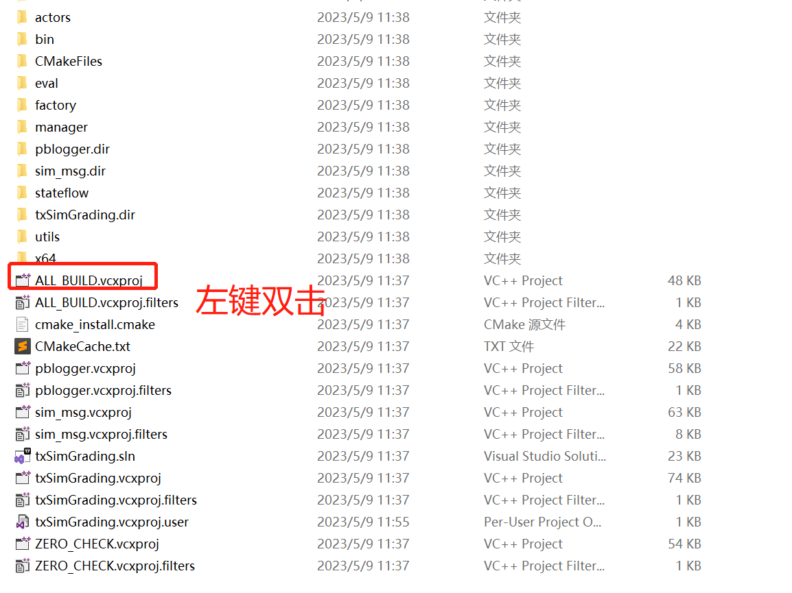</div><br>

- **利用VS编译**

<div align="center">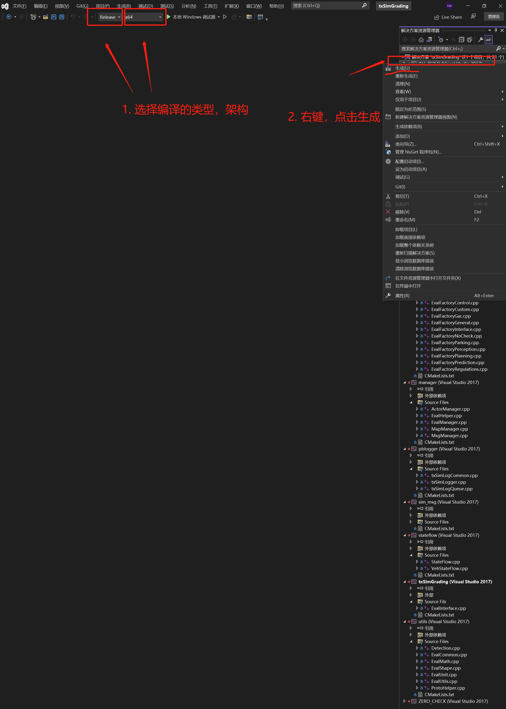</div><br>

- **产物查看**

<div align="center">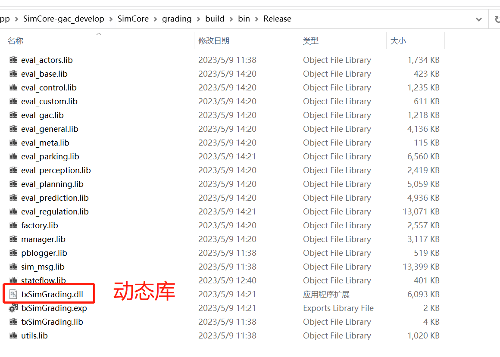</div><br>

### 8.3.2. Ubuntu

#### 8.3.2.1. 前置准备

- **打包代码**

  - tar zcvf TAD_Sim.tar.gz --exclude=TAD_Sim/.git TAD_Sim/
  - 将 TAD_Sim.tar.gz 拷贝到 ubuntu 环境自己的目录下, 解压
- **镜像拉取和容器生成**

  - 请使用最新镜像 TAD_Sim 根目录下的 Dockerfile 构建镜像, 之后参考这个命令run起来

  ```bash
  # 以交互方式运行 docker 容器, 将其设置为工作目录, 并启动 Bash shell
  docker run -it --rm -v "$(pwd)":/build -w /build desktop:tag /bin/bash
  ```
- **生成sim_msg的源代码**

  - 进入 TAD_Sim/common/message 里, 运行命令 sh ./generate_cpp.sh, 编译

#### 8.3.2.2. 编译 grading

来到 TAD_Sim/simcore/grading 目录, 直接运行命令sh ./build.sh 编译。

## 8.4. 运行调试

### 8.4.1. 配置模块

<div align="center">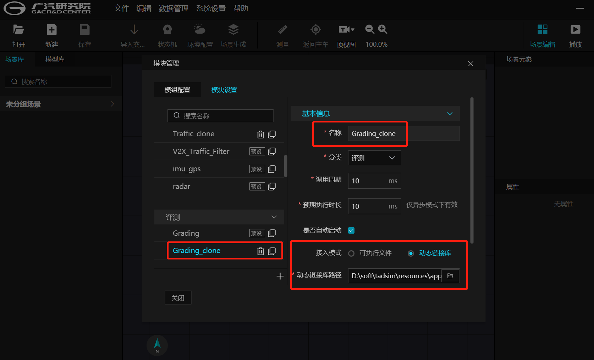</div><br>

### 8.4.2. 模组配置

<div align="center">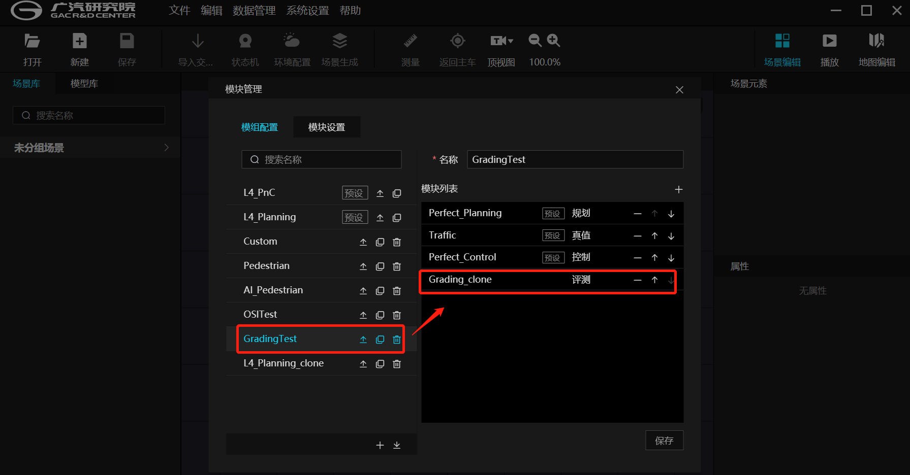</div><br>

### 8.4.3. 运行场景查看调试信息

<div align="center">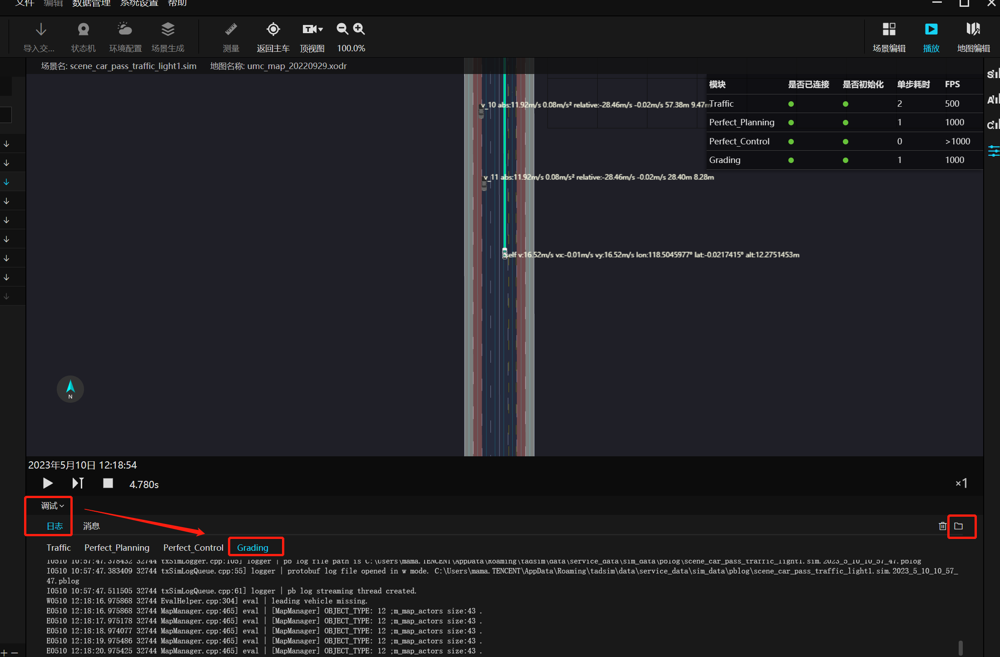</div><br>

## 8.5. 评测配置文件修改

### 8.5.1. 评测配置文件详细说明 (以windows为例)

- 路径

  - AppData\Roaming\tadsim\sys\default_grading_kpi.json

  <div align="center">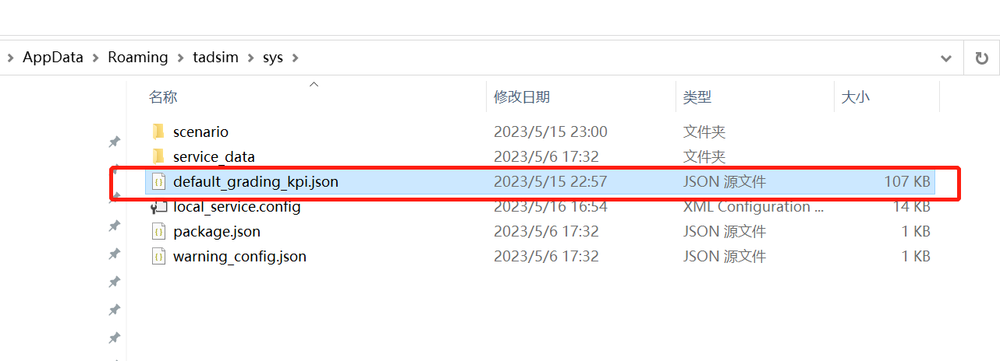</div><br>

- 文件 json 分为 kpi 和 kpiGroup

  <div align="center">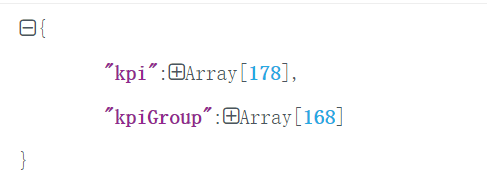</div><br>

- kpi 是Array结构, 包含所有指标的配置信息。

  - kpiGroup 是 Array 结构, 包含 default 指标组显示的指标。
  - 对于 kpi:

    <div align="center">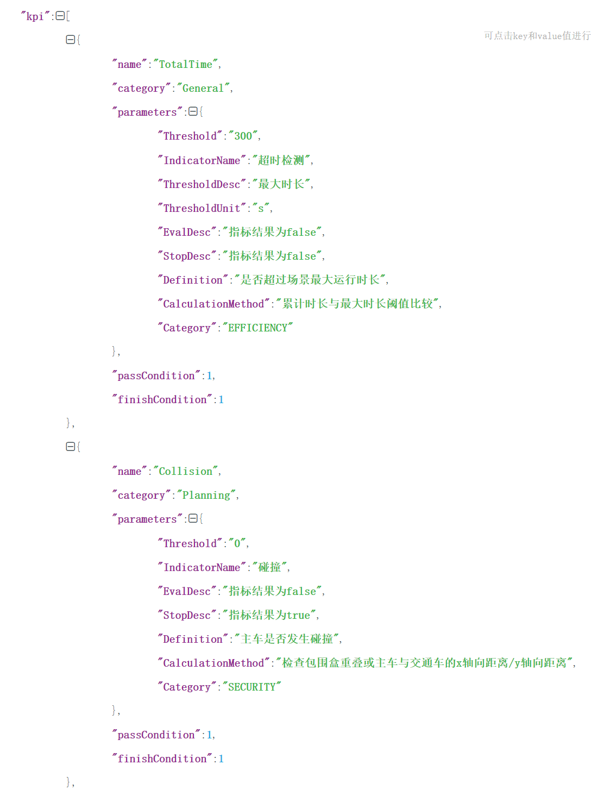</div><br>

    - 数组中每个元素对应一个指标, 其中包含name(指标名), category(分类), parameters(指标参数), passCondition(通过条件, 默认是1, 代表仿真值不符合阈值范围的次数, 超过1次即为不通过), finishCondition(场景结束条件, 默认是0, 表示不结束场景;设置为1时表示, 不通过时结束场景。)
    - 其中parameters(指标参数) 结构体内可以根据需求修改该指标阈值, 如下:

      <div align="center">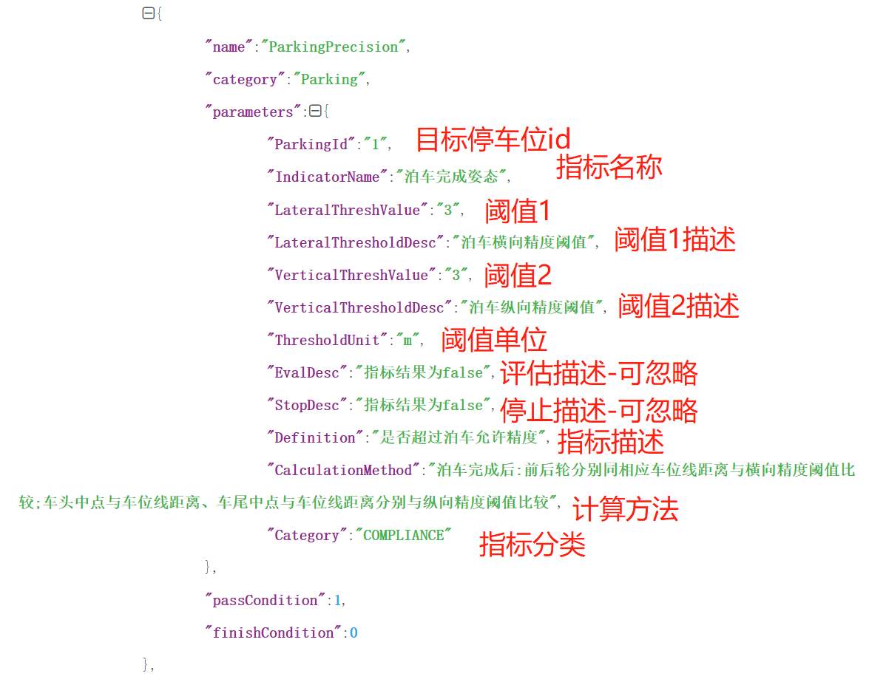</div><br>
  - 对于 kpiGroup

    - kpiGroup 包含 default 指标组内显示的指标, 其中数组内每个元素对应 default 指标组内的指标。
    - 通过增删 kpiGroup 内的元素, 即可修改 default 指标组包含的指标。

      <div align="center"></div><br>

      <div align="center">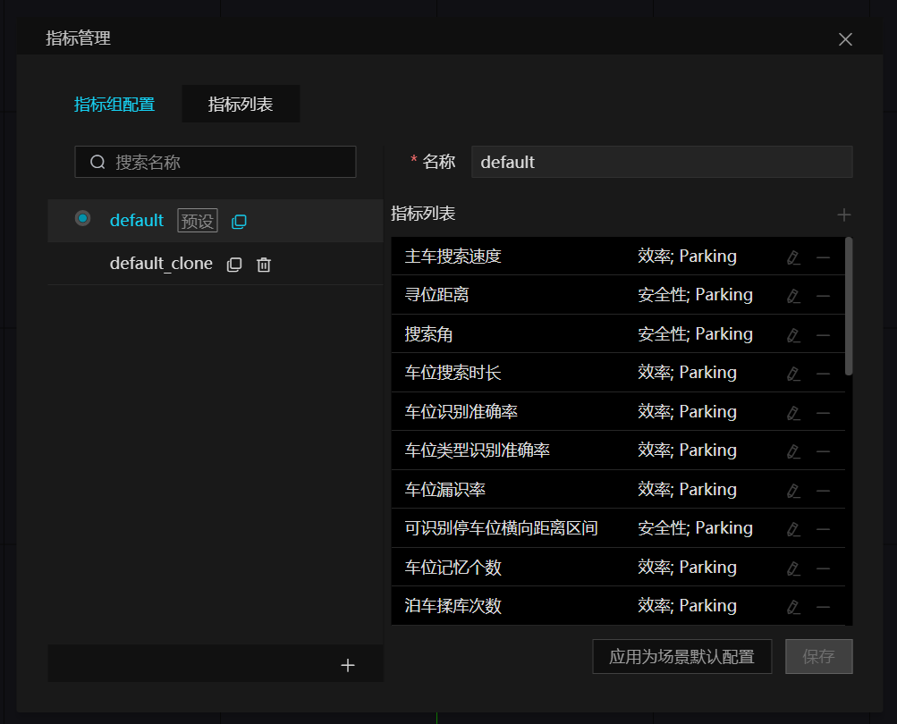</div><br>

