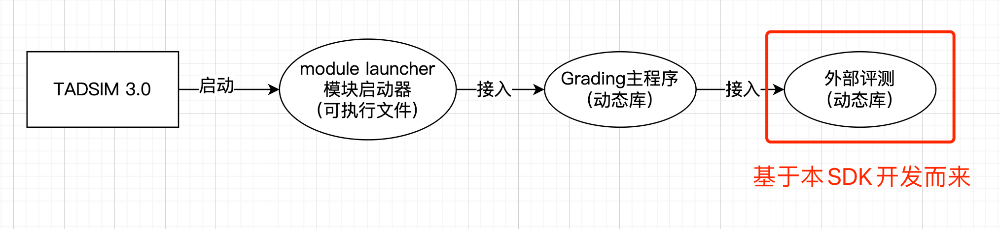
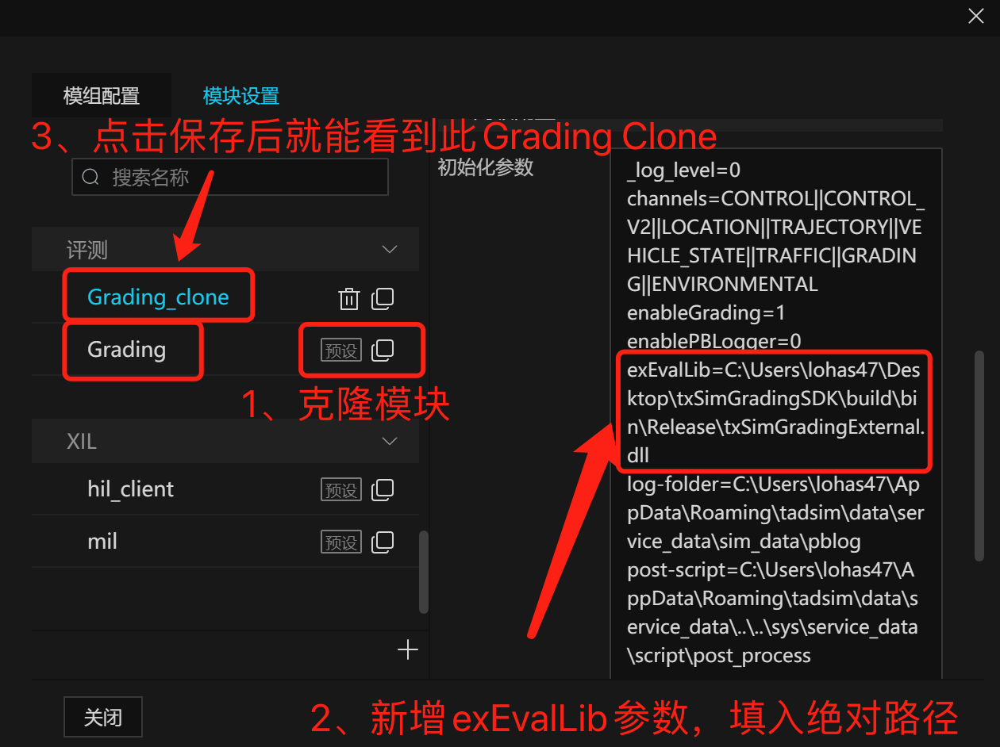
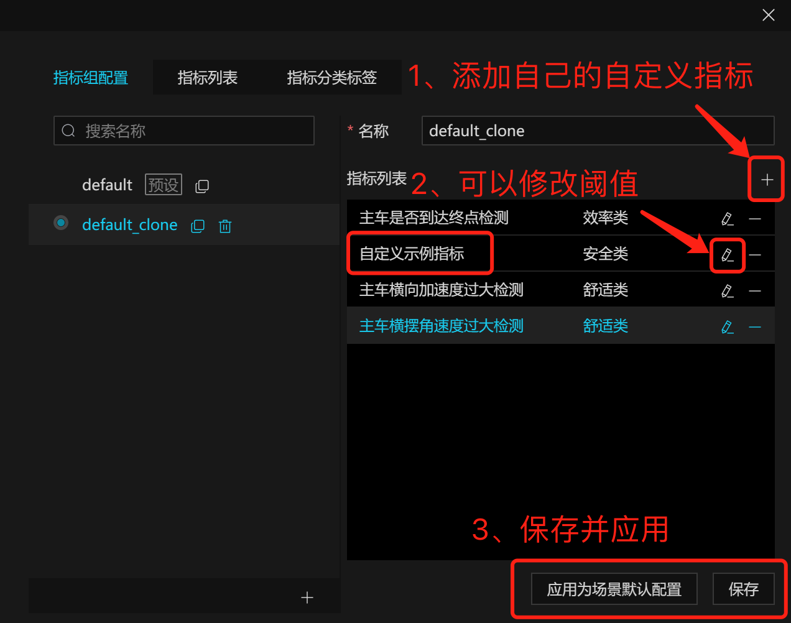
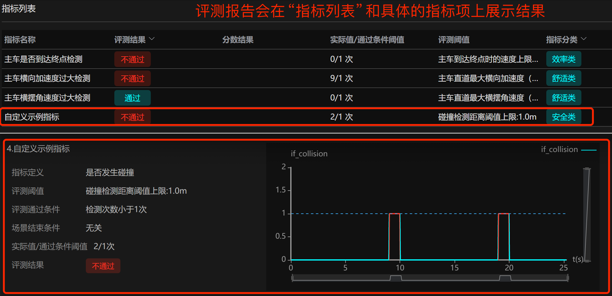

# **Grading External Eval SDK**
"外部评测指标SDK" 

# 1. **背景**

Grading External Eval SDK，主要是为了向tadsim的外部开发者提供一种方式，实现了在不修改Grading主程序的代码的前提下，设计、开发和接入自定义指标。

# 2. **系统结构**

外部自定义评测指标程序，即图中的“外部评测”，将基于本文的SDK开发而来，并且将会被编译为动态库的形式，再接入到评测Grading模块主程序当中。

# 3. **重要提醒**

1、对于本文件夹内的内容的修改，不会影响外层的开发、使用。**但外层（包括grading、framework调度引擎、hadmap地图引擎等）的修改可能会影响到本文件夹的SDK打包、开发，因此需要根据修改的内容及时调整本文件夹的内容，并及时地向外部开发者提供新的SDK压缩包。**

2、**先要保证grading本身的主模块能够编译成功，才能打包本项目的SDK。**

# 4. **代码结构**

## 4.1. src

文件夹内向外部开发者展示外部指标开发所涉及的代码文件，主要就是外部评测指标工厂和外部评测指标两部分。

### 4.1.1. 外部评测指标工厂

“外部评测指标工厂”的作用是管理所有的外部评测指标，并向主程序提供了外部指标注册的接口，如EvalFactoryExternal.h和EvalFactoryExternal.cpp所示。

**一般来说，外部开发者需要在EvalFactoryExternal.cpp注册所有的外部评测指标（详见里面的注释）**。

### 4.1.2. 外部评测指标

“外部评测指标”即外部开发者开发的自定义指标的代码文件，包含了其对指标内容的所有实现。评测指标的类都是从EvalBase类派生，**最主要就是要重载实现构造函数、Init()、Step()、Stop()、SetGradingMsg()、IsEvalPass()、ShouldStopScenario()这几个方法**，具体如EvalExKpiExample.h和EvalExKpiExample.cpp所示。一般来说，一个评测指标对应一对头文件和源文件。

**评测指标代码的数量，应和评测指标工厂EvalFactoryExternal.cpp的注册数，以及external_grading_kpi.json的kpi的数组大小保持一致。**

## 4.2. CMakeLists.txt

管理外部评测指标项目的构建配置文件，可同时支持linux和windows的构造。

## 4.3. external_grading_kpi.json

指标配置文件，展示了所有的外部指标清单和各个指标的具体参数，**格式需要与上层的all_grading_kpi.json保持一致**。

## 4.4. Dockerfile

**给Linux开发者构建Docker开发环境使用，使用步骤请参考里面前几行的注释即可**。相比Windows环境的SDK压缩包已经包含了所有的静态依赖库，linux的依赖库和编译相对较复杂，SDK包无法包含所有的静态依赖库，因此需要额外构建一个独立的容器环境进行本项目的开发和编译。

如果不想打镜像和容器，亦可让开发者参考里面的内容直接在原系统编译和安装相关软件（不推荐）。

## 4.5. package_sdk_**脚本（面向内部维护者）

打包sdk的脚本文件，分成linux和windows平台的两个不同文件。

打包的结果是生成本项目的SDK压缩包，包含了所有开发的必要文件，包括各种依赖库、代码文件等，如脚本最后所示。

## 4.6. build_**脚本（面向外部开发者）

构建和编译项目的脚本文件，分成linux和windows平台的两个不同文件。

一般由外部开发者在完成外部指标开发和要编译动态库时执行。

# 5. **SDK打包流程（面向内部维护者）**

1、完成上一层grading程序的编译，请参考上一层./grading下的README.md，根据linux或Windows完成编译，即能正常得到build/bin/libtxSimGrading.dll(或.so)；

2、本目录下执行package_sdk_**的脚本，自动完成打包，并得到txSimGradingSDK_windows.tar.gz或txSimGradingSDK_linux.tar.gz。

# 6. **开发和使用流程（面向外部开发者）**

1、解压SDK压缩包到想要的位置，路径不要带中文名；

2、若是Linux开发者，请先构造Docker镜像和容器，准备好环境；若是Windows开发者，也请先安装好Visual Studio（必须2017或以上），vcpkg及相应的**静态**依赖库、CMake工具和v141编译工具需要一并添加与安装。

3、开发者根据示例代码，在src内完成自定义指标的代码开发，并在EvalFactoryExternal.cpp内注册；

4、对应地，在external_grading_kpi.json完整地填写指标和参数相关内容。

5、使用build_**的脚本完成编译，顺利的话会在build/bin/下得到libtxSimGradingExternal.dll(或.so)的动态库文件；

6、将external_grading_kpi.json的kpi数组的指标（除了示例），拷贝到C:\Users\（用户名）\AppData\Roaming\tadsim\sys\default_grading_kpi.json文件的kpi数组里，注意增删逗号和保证json格式正确。（linux路径是是/home/(用户名)/.config/tadsim/sys/default_grading_kpi.json）

7、从这一步开始操作tadsim软件。配置grading模块，先克隆得到一个Grading_clone模块，**再填入exEvalLib参数，参数填写libtxSimGradingExternal.dll(或.so)的绝对路径（不要带中文名）**。

8、配置自定义指标，先搜索自定义指标的中文名并添加到列表里（若搜索不到请检查第6步是否正确操作），然后可以选择修改指标的一些参数和阈值，最后分别点击保存和应用即可。

9、开始仿真，如果在日志里看到正确的路径，并且看到自定义指标的英文名（_kpi_name）正确，说明指标已正确接入。

10、评测报告可以看到自定义指标的结果。

11、更进一步的使用说明，请参考《Tadsim3.0外部自定义指标评测开发和接入指南》
https://doc.weixin.qq.com/doc/w3_Ac4ANAaJAFk1Hhjn1rfT46kdW430d?scode=AJEAIQdfAAo5t1uQM7Ac4ANAaJAFk
