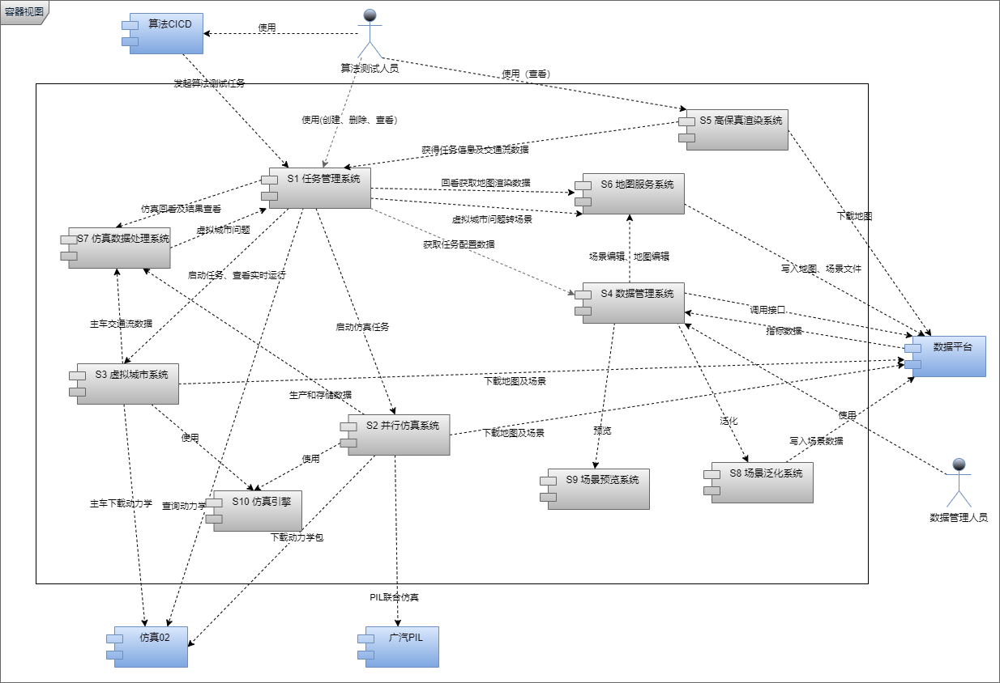
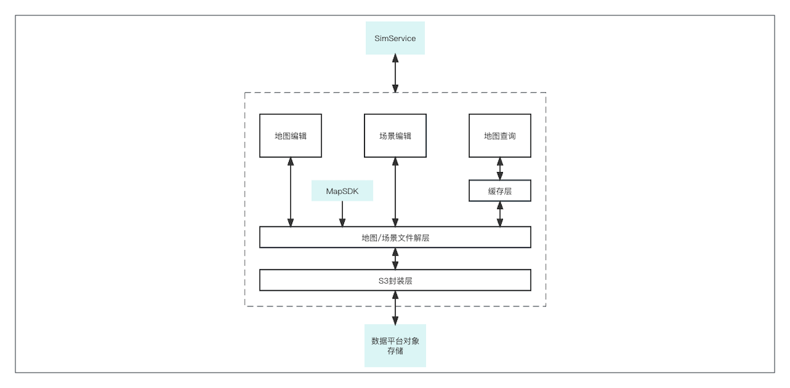
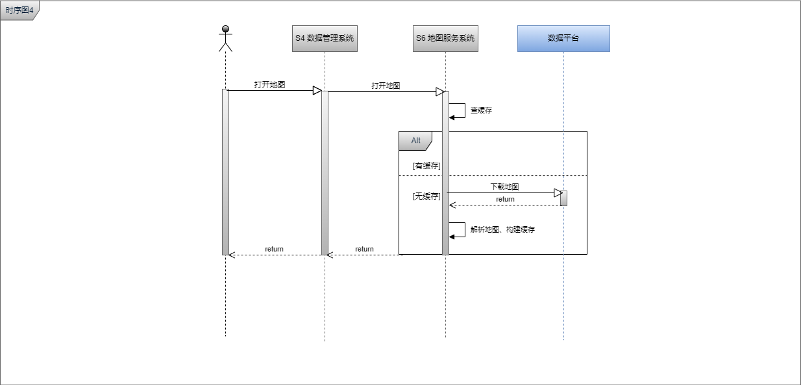
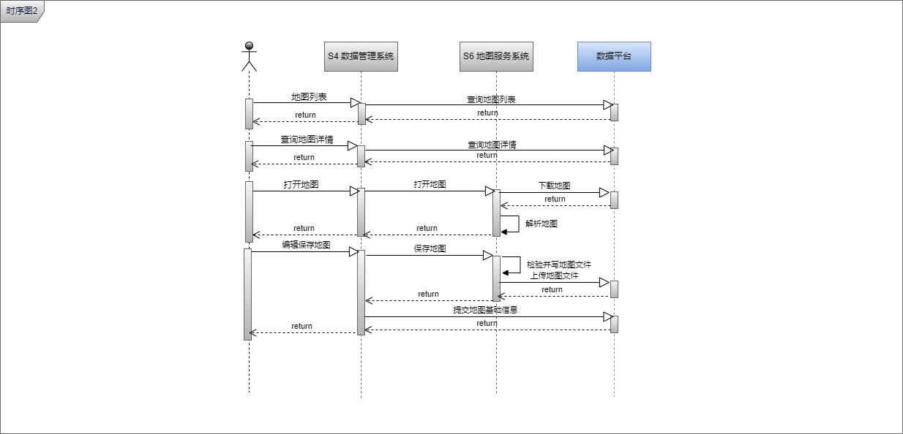
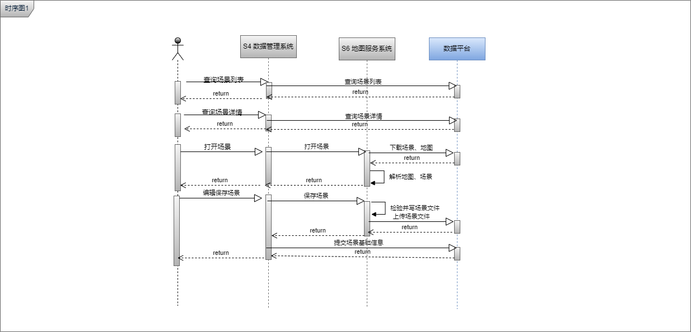
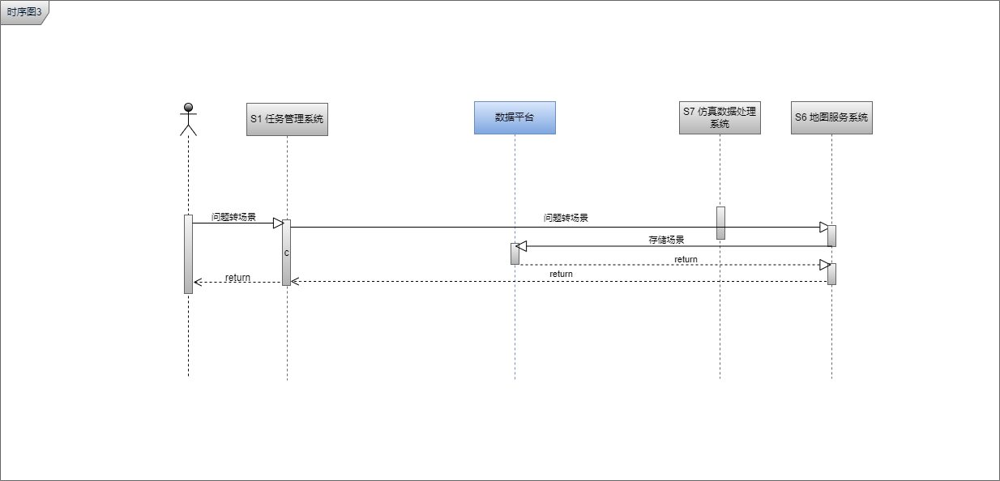
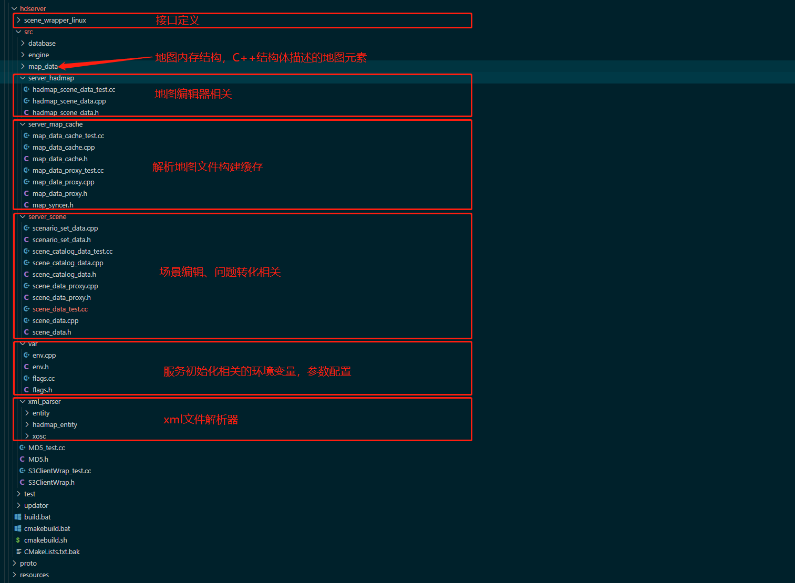

# 1. 概述


解析地图文件（支持XODR地图），提供地图道路、车道、路口、对象等元素插叙服务，及支持地图、场景编辑功能。

# 2. 系统结构



# 3. 数据库存储设计

# 4. 核心接口
详见[API.md](./API.md)

# 5. 主要业务时序
## 5.1. 地图查询时序


## 5.2. 地图编辑时序


## 5.3. 场景编辑时序


## 5.4. 问题转化时序


# 6. 数据埋点
无

# 7. 日志格式
同其他

# 8. 业务状态
无

# 9. 代码结构
```
.  
├── CMakeLists.txt  
├── common              单机、云版复用部分  
├── deps                依赖  
├── hdserver            云版代码  
├── map_parser          单机代码  
├── qci_hdserver.yml  
├── README.md  
├── resources  
├── src                 单机代码  
├── test
├── third_party         第三方依赖  
├── tools               工具  
└── traffic             单机代码  
```


# 10. 代码规范
基于GoogleStyle C++  
* VS配置方法：  
```
Tools > Extensions And Updates > Online > Search and install: Format On Save, ClangFormat

Tools > Options > LLVM/Clang > ClangFormat > Enabld Format On Save
```

# 11. 编译发布
* Linux  
```sh
# HADMAP_SVR_BUILD_ONLY="cloud"
# HADMAP_SVR_BUILD_ONLY="map_parser"
cmake -S . -B build -DCMAKE_BUILD_TYPE=Release -DHADMAP_SVR_BUILD_ONLY="cloud"

make -C build -j 12
```
* Windows  
```sh
cmake -S . -B build -G "Visual Studio 15 2017 Win64" -DCMAKE_BUILD_TYPE=Release -DHADMAP_SVR_BUILD_ONLY="cloud"

"C:\Program Files (x86)\Microsoft Visual Studio\2017\Professional\Common7\IDE\devenv.com" scene_wrapper.sln /build Release
```
