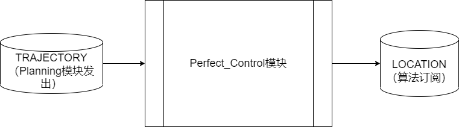
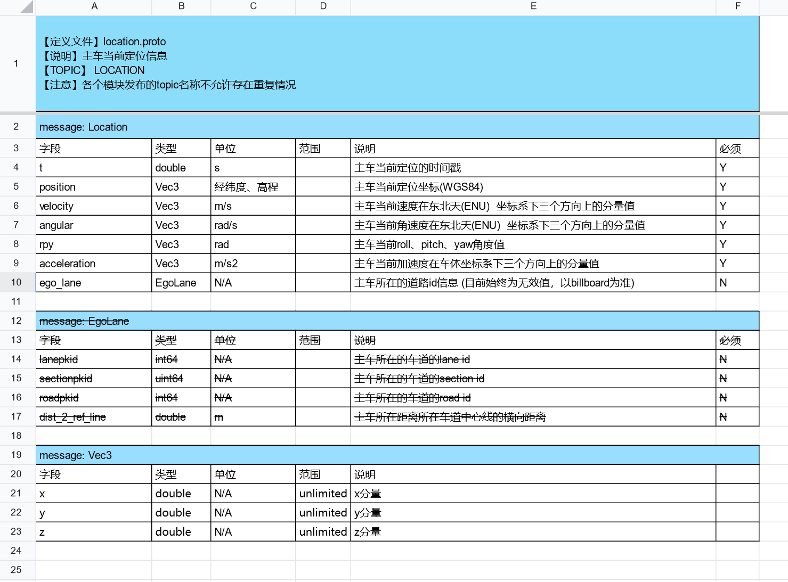
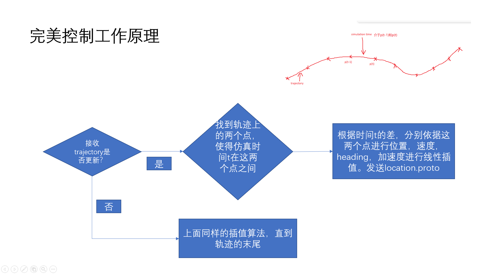
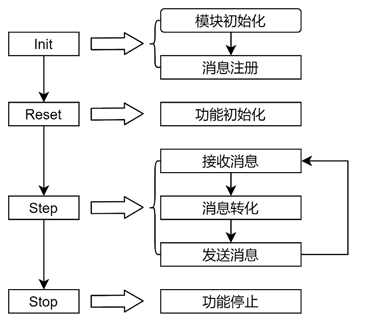
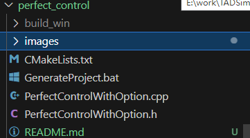
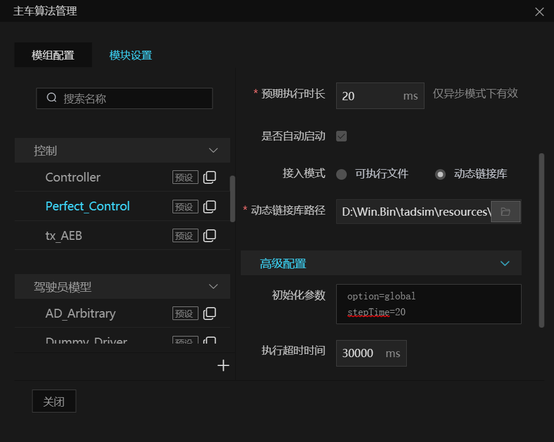
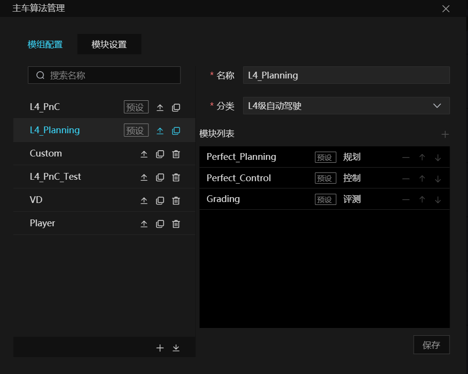
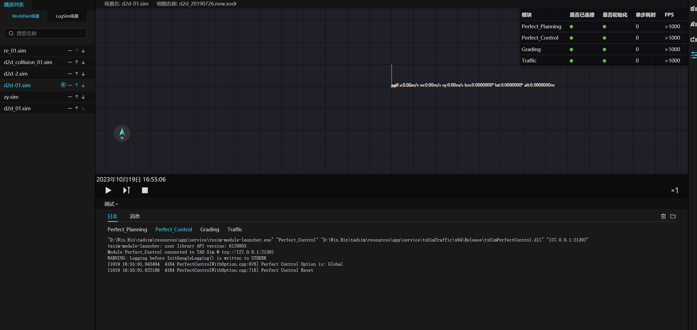

# perfect_control 完美控制模块

# 1. 背景

系统内置完美规划模块。
在自动驾驶解决方案中，Planning模块会依据当前主车状态和周围环境，规划出一条期望的车辆运行轨迹。
在自动驾驶Planning模块仿真测试中，Perfect_Control（完美控制）能够基于 Planning 模块规划出期望的车辆运行轨迹，生成车辆当前的运动信息。包含位置，速度，朝向，横摆角速度，加速度等。满足 Planning 闭环仿真测试的需求。极大的提高Planning算法研发效率。

# 2. 系统结构

## 2.1 架构

<div align="center"></div><br>

## 2.2 要点概述

### 2.2.1 工作流程

#### 2.2.1.1 初始化参数

- 在模型“初始化参数”中填入 stepTime=20，则模块仿真步长为 20ms，用户可以自定义改步长值。
- 注意，stepTime如果缺失，则默认为模块设置的“调用周期”。

#### 2.2.1.2 与仿真系统的数据交互

- ​[TAD Sim 系统消息定义-主线](https://doc.weixin.qq.com/sheet/e3_AYIAKQZaABoSjqd81bFQWODMbOrxX?scode=AJEAIQdfAAoZD6H544Ac4ANAaJAFk&tab=njdi31)
- Perfect_Control模块订阅 TRAJECTORY 消息. 并输出 LOCATION 消息。
- 输入仿真消息

  - TRAJECTORY 消息参考 trajectory.proto
- 输出仿真消息

  - LOCATION 消息参考 location.proto

  <div align="center"></div><br>

# 3. 核心机制

- 完美控制模块，根据接收到的轨迹信息和当前仿真时间，进行线性插值，计算出主车的定位信息。

<div align="center"></div><br>

# 4. 数据库存储设计

无

# 5. 核心接口

## 5.1 实现方式

​	实现是按照 txSimSDK 的标准流程实现.

## 5.2 接口内容

### 5.2.1 输入

​[TAD Sim 系统消息定义-主线](https://doc.weixin.qq.com/sheet/e3_AYIAKQZaABoSjqd81bFQWODMbOrxX?scode=AJEAIQdfAAoZD6H544Ac4ANAaJAFk&tab=njdi31)

| 信号说明     | TOPIC      | 具体文件或库     | 通信方式 |
| ------------ | ---------- | ---------------- | -------- |
| 期望轨迹信息 | TRAJECTORY | trajectory.proto | TCP      |

### 5.2.2 输出

​[TAD Sim 系统消息定义-主线](https://doc.weixin.qq.com/sheet/e3_AYIAKQZaABoSjqd81bFQWODMbOrxX?scode=AJEAIQdfAAoZD6H544Ac4ANAaJAFk&tab=njdi31)

| 信号说明         | TOPIC    | 具体文件或库   | 通信方式 |
| ---------------- | -------- | -------------- | -------- |
| 主车当前定位信息 | LOCATION | location.proto | TCP      |

# 6. 主要业务时序

## 6.1 Perfect_Control 仿真时序图

<div align="center"></div><br>

​  txSimSDK规定了模块的实现流程，如上图左侧所示，需要实现四个函数 init -> reset -> step -> stop。图右侧是每一步对应的具体实现，消息协议的转换需要在step中完成。

Perfect_Control模块由 TAD Sim 默认集成，受调度模块 (Coordinator) 的调度。

- **Init:**

  - 引擎会传递给Perfect_Control模块对应的参数。如stepTime参数
- **Reset:**

  - 调度模块会给Perfect_Control主车初始定位信息。
- **Step:**

  - Perfect_Control模块会根据收到的轨迹信息，生成主车定位数据并发布到仿真系统。
- **Stop:**

  - Perfect_Control模块停止仿真。

# 7. 数据埋点

无

# 8. 日志格式

Perfect_Control 模块默认支持 INFO/WARNING/ERROR 级别日志

```cpp
LOG(INFO)
LOG(WARNING)
LOG(ERROR)
```

# 9. 代码结构

<div align="center"></div><br>

- Perfect_Control目录结构:

  - perfect_control_with_option.h --> 模块接入TADSim类头文件
- Perfect_Control目录结构:

  - perfect_control_with_option.cc --> 模块接入TADSim类源文件

# 10. 运行调试

### 10.1 配置模块

<div align="center"></div><br>

### 10.2 模组配置

<div align="center"></div><br>

### 10.3  运行场景查看调试信息

<div align="center"></div><br>

