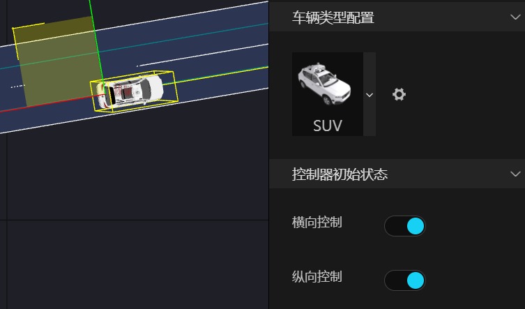
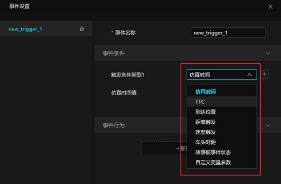
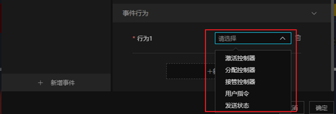

# 1 完美规划

  系统内置规划模块

# 2 驾驶员模型

## 2.1 概述
驾驶员模型提供基本的规划控制器功能，如：路由、跟驰、换道、交规等，具备横向控制器、纵向控制器独立配置，具备轨迹追踪能力。能够设置用户自定义事件，配合用户特定规划算法及上下游模块实现用户特定算法的开发调试。驾驶员模型主要用于场景型仿真（WorldSim），(其路由、跟驰、换道、交规类似于AI交通车，其详细说明可见3核心机制)，其区别于交通车，主要包括：
a）场景中包含横向和纵向控制的初始化；
b）场景事件中包含激活控制器、分配控制器、接管控制器、用户指令、发送状态；（主车除用户指令中的向左变道和向右变道主车直接响应，其他都通过interaction pb发送）；

时序图如下：

 

其详细描述主要包括：
1） 驾驶员模型会获取到主车初始TOPIC:LOCATION信息（车辆动力学），并根据静态路网信息、场景中主车航点信息、周车环境信息Traffic，计算出预测轨迹信息，发布TOPIC:TRAJECTORY，并根据车头和车速以及轨迹信息，预测出主车的方向盘信息，发布TOPIC: TOPIC:Control_V2。
2） 车辆动力学会获取主车预测轨迹信息TOPIC:TRAJECTORY、主车方向盘信息TOPIC:Control_V2（来源于驾驶员模型）、主车加速度信息TOPIC：CONTROL_ALGORITHM（来源于ADAS算法）。计算并发布主车定位信息TOPIC:LOCATION、车座底盘信息TOPIC:VEHICLE_STATE。
3） ADAS算法获取到主车的底盘信息TOPIC:VEHICLE_STATE和主车定位信息TOPIC:LOCATION，计算并发布主车的加速度信息TOPIC：CONTROL_ALGORITHM；
4） 在主车不停重复更新位置后，重复上述操作，直到满足主车停止条件。

## 2.2 参数定义
| 序号 | 接口名称                      | 接口                                  |
|:----:|:------------------------------|:------------------------------------|
|  1   | ego_rnd_seed                  | 主车随机种子                          |
|  2   | ego_pubilc_location           | 是否订阅Location消息                  |
|  3   | dummy_ignore_perception       | 是否忽略障碍车                        |
|  4   | ego_location_closed_loop      | 是否启用Location进行轨迹的重新规划    |
|  5   | route_end_behavior_force_stop | 是否根据轨迹进行                      |
|  6   | looking_distance_factor       | 描点距离调节因子，默认为1.0            |
|  7   | wheel2steer                   | 车轮角与方向盘的转换值，默认为18.0     |
|  8   | Use_Control_Debug_Object      | 用于显示描点和预测点（调试用）          |
|  9   | use_ego_lanechange            | 主车是否根据交通流进行变道，默认为true |

## 2.3 配置说明

 

 

 
