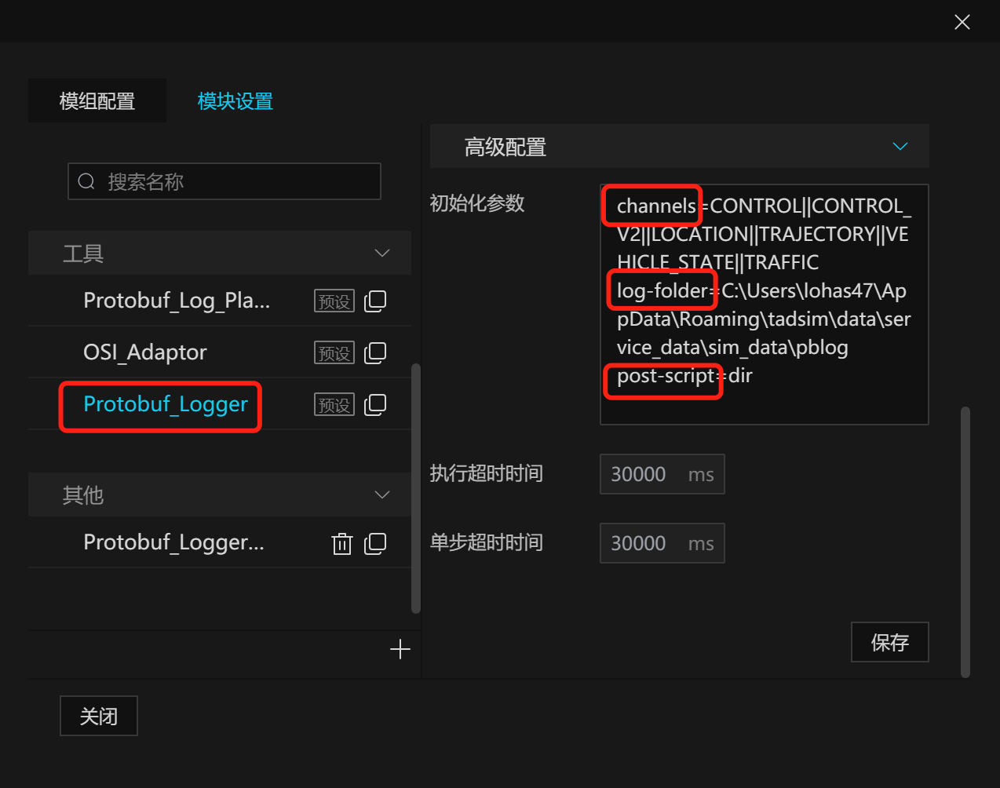
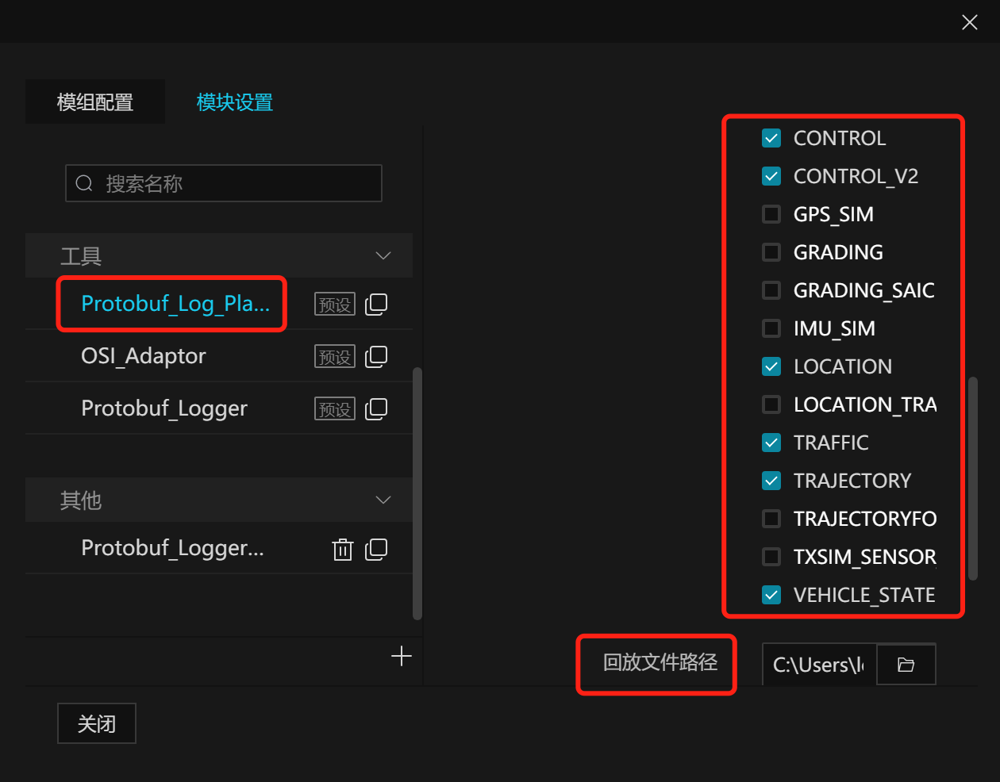

# Protobuf_log

# 1. 背景

Protobuf_log 数据录制与回放模块主要用于自动驾驶车辆的仿真测试数据的记录和多次重跑。其中，Protobuf_Logger是数据录制模块，负责仿真系统中特定消息的录制，如主车规划算法消息、主车定位消息等，并以特定的数据格式保存为文件；Protobuf_Log_Player是数据回放模块，负责读取录保存的数据文件的全部消息或特定消息，并发布到调度引擎上进行回放。

# 2. 核心机制

## 2.1. 数据格式

- protobuf_log文件以**二进制格式**写入；

- 二进制格式（对应src/txSimLogCommon.h的**PBLogEvent**结构体）:
  - 4  bytes(uint32_t, channel string length, n1)
  - 4  bytes(uint32_t, protobuf string msg length, n2)
  - 8  bytes(long, timestamp microseconds)
  - n1 bytes(char *, channel string)
  - n2 bytes(char *, protobuf string msg)

## 2.2. 初始化参数配置

### 2.2.1. 录制模块

- **log-folder**
  - 含义：录制的数据文件的保存位置
  - 示例：log-folder=/home/hdy/Documents/vdTestData

- **channels**
  - 含义：要录制的topic列表
  - 示例：channels=LOCATION||TRAFFIC

- **post-script**
  - 含义：如有需要，填写后处理程序的绝对路径。
  - 示例：post-script=${tadsim_data_dir}/service_data/script/post_process [-p/i/s]

- **sync**
  - 含义：后处理程序是否同步执行。1表示thread join执行，0表示thread detach执行。
  - 示例：sync=1

### 2.2.2. 回放模块

- **log-file**
  - 含义：回放的数据文件的位置
  - 示例：log-file=/home/hdy/work/work/2019-10-23-6-36-48.pblog

- **channels**
  - 含义：要录制的topic列表。如果是空的，将回放数据包内所有topic
  - 示例：channels=LOCATION||TRAFFIC

# 3. 编译代码

### 3.1. Windows

#### 3.1.1. 前置准备

- **打包代码**
  - tar zcvf TAD_Sim.tar.gz --exclude=TAD_Sim/.git TAD_Sim/
  - 将 TAD_Sim.tar.gz 拷贝到 windows 环境自己的目录下, 解压
  - 又或者直接在 windows 环境 git clone 此 TAD_Sim 项目亦可

- **vcpkg安装和相关依赖库安装**
  - 请先安装好 vcpkg 软件, 并在系统中配置好系统变量 %VCPKG_ROOT, 用于指示VCPKG的安装位置, 接着使用此命令安装相关依赖库:
  - ./vcpkg.exe install zlib boost eigen3 flann gflags glm glog protobuf grpc gtest curl proj libspatialite sqlite3 libxml2 jsoncpp log4cpp-log4cpp pugixml soci tbb uriparser xerces-c grpc tinyxml2 cppzmq  --triplet x64-windows

#### 3.1.2. 创建 Visual Studio 工程文件和编译

- **默认 VS 2022**
  - 对于 VS 2022 版本, 工具集版本是 MSVC v143。

- **执行过程**

  ```powershell
  # 进入待编译代码目录下(用户定义)
  cd TAD_Sim/simcore/protobuf_log
  # 创建 VS 工程文件, 和直接编译
  ./build.bat
  ```

- **也可以用vs打开工程文件进行编译**


### 3.2. Ubuntu

#### 3.2.1. 前置准备

- **打包代码**
  - tar zcvf TAD_Sim.tar.gz --exclude=TAD_Sim/.git TAD_Sim/
  - 将 TAD_Sim.tar.gz 拷贝到 ubuntu 环境自己的目录下, 解压

- **镜像拉取和容器生成**
  - 请使用最新镜像 TAD_Sim 根目录下的 Dockerfile 构建镜像, 之后参考这个命令run起来
  ```bash
  # 以交互方式运行 docker 容器, 将其设置为工作目录, 并启动 Bash shell
  docker run -it --rm -v "$(pwd)":/build -w /build desktop:tag /bin/bash
  ```

#### 3.2.2. 编译 protobuf_log

 来到tadsim/simcore/protobuf_log目录，直接运行命令sh ./build.sh编译。


# 4. 使用说明

# 4.1. 录制模块使用

<div align="center"></div><br>

在“**全局模块管理**”弹窗中，进入“**模组配置**”栏，添加Protobuf_Logger模块，通常Protobuf_Logger模块作为最后一个模块。对Protobuf_Logger模块，进行以下配置：

“**channels**”栏勾选用户想要记录的数据的topic类型；

“**log-folder**”指定pblog存放的目录，grading模块默认路径为：${tadsim_data_dir}/service_data/sim_data/pblog, grading模块会自动在	该目录下生成“场景名称-年-月-日-时-分秒.pblog”的文件。

“**post-script**”后处理脚本可以按照前面的post_process说明进行配置，grading模块会自动调用，需要特殊说明，“-f”选项已经由grading模块填写好，用户只需要选填“-p/i/s”，详细请看下方“后处理脚本”章节。

另外，**Grading**和**Protobuf_logger**两个模块都可以实现仿真数据记录的功能，且功能完全一致。Grading带有这个功能是为了方便评测和录制一起，如果用户不需要用grading，只需要记录数据，请只使用Protobuf_logger模块。

**在场景只有单主车的情况下**，才能用grading模块录制数据。如果需要用，请将grading模块的初始化参数的enable_pblogger设为1，并从“全局模组配置”里删除Protobuf_logger模块。


# 4.2. 回放模块使用

<div align="center"></div><br>

- 在“**全局模块管理**”弹窗中，进入“**模组配置**”栏，添加“Protobuf_Log_Player”模块。对Protobuf_Log_Player模块，进行以下配置：

- “**通道**”设置栏勾选要回放数据的topic类型；

- “**回放文件路径**”设置为要回放的pblog数据文件路径。

- 使用“Protobuf_Log_Player”模块时，要**注意回放的topic跟模块正在发送的topic避免冲突**，例如，“Protobuf_Log_Player”模块在回放TRAJECTORY，那么就不应该运行planning模块。

# 5. 后处理脚本

- TAD Sim提供一个后处理脚本，存放在：${tadsim_data_dir}/service_data/script/post_process

- 这个脚本能够将pblog中的数据**导出为xlsx和json格式**，其中xlsx文件生成在../${Data}目录下，json文件生成在当前路径下。

## 5.1. 使用命令
**post_process** -f xxx.pblog // 处理的pblog文件（必填项）
                 -p           // 处理trajectory、control，vehState.proto
                 -i           // 处理osi_imu.proto, osi_gps.proto
                 -s           // 处理客户定制的消息
