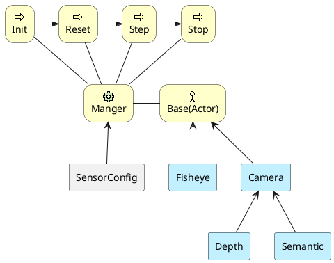
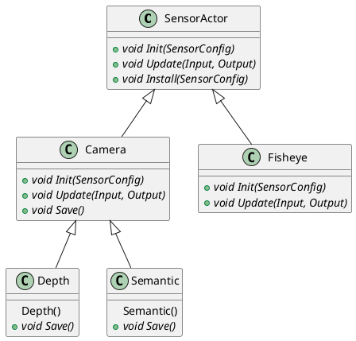
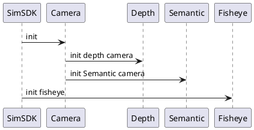
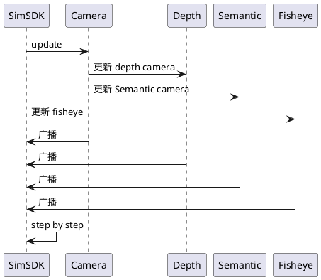

# Display-Camera

## 1. 背景

Camera传感器仿真主要负责图像相关的传感器仿真：

* Camera：针孔相机
* Depth：深度相机
* Fisheye：鱼眼相机
* Semantic：语义相机

## 2. 系统结构

整体的传感器框架如下，详细参考上一级的README。

Actor类是一个基本类，定义了通用的属性和方法。Camera类和Fisheye类分别继承了Actor类，并实现了针孔相机和鱼眼相机的渲染功能。Depth类和Semantic类则进一步继承了Camera类，分别实现了深度图和语义图的渲染功能。



1. Actor类：这是一个基类，定义了基本的接口。它是其他类的父类，包含了一些通用的属性和方法，如设置安装位置、姿态、挂载方式等。接口包括：

   * init：传感器的初始化工作，包括建立相机模型、参数设置、加载后处理材质
   * update：每一帧的更新工作，包括图像数据获取，数据处理、发布。
   * save：可选借口，支持派生类重写保存数据。

2. Camera类：这是一个派生自Actor类的子类，主要完成针孔相机的渲染。它继承了Actor类的基本属性和方法，并添加了针孔相机相关的属性和方法，如焦距、视场角、渲染方法等。

3. Fisheye类：这是一个派生自Actor类的子类，主要完成鱼眼相机的渲染。它继承了Actor类的基本属性和方法，并添加了鱼眼相机相关的属性和方法，如鱼眼相机的参数、渲染方法等。

4. Depth类：这是一个派生自Camera类的子类，主要完成深度图的渲染。它继承了Camera类的属性和方法，并添加了深度图相关的属性和方法，如深度图的保存等。

   * 构造函数中设置了后处理材质的路径，进而导致输出的RGBA 数据是不一样的。
   * init 和 update 和 camera 没有任何差异
   * 落盘的数据处理上有差异，所以重载了 save

5. Semantic类：这是一个派生自Camera类的子类，主要完成语义图的渲染。它继承了Camera类的属性和方法，并添加了语义图相关的属性和方法，如语义保存方法等。
   * 同 depth

详细的接口定义如下，



## 3. 核心机制

### 3.1 Post-processing

所谓后处理（Post-processing)，是指在正常渲染管线结束后，对最终渲染图像进行的后期加工，如滤镜等。以此来模拟物理摄像机和电影特效。
Display使用了以下后处理：

* 畸变：自定义蓝图，包含了畸变处理代码
* 特效：曝光、光晕、模糊等，使用的是UE自带的接口
* 数据封装：对于深度和语义相机，不使用RGB，而是用其他数值

### 3.2 FOV

鱼眼的fov分为两种情况：

* 超大FOV，通常在180°，甚至超过180°
* 广角FOV，通常在120°左右

针对不同的FOV，最佳的选择了两种渲染方式：

* SceneCaptureComponent2D：针孔模型获取环境照片
* SceneCaptureComponentCube：全景（正方体6个面）图像获取环境照片

  **相比2D，Cube会消耗更多的硬件资源，所以只有大畸变才会使用它。**

## 4. 数据库存储设计

无

## 5. 核心接口

### 5.1 配置输入

|名称|Name|默认值|范围|含义
|---|---|---|---|---|
频率(Hz)|Frequency|25|[0,1000]|拍照频率
水平分辨率|ResHorizontal|1920|[10,10000]|图像尺寸，像素
垂直分辨率|ResVertical|1208|[10,10000]|图像尺寸，像素
细腻度|Exquisite|0|[-5.0,5.0]|正数细腻，负数粗糙。细腻会增加渲染负担
颜色模式|ColorMode|0|0彩色，1黑白|
模糊|Blur|0|[0.0,1.0]|-
运动模糊|MotionBlur|0|[0.0,1.0]|-
光晕强度|LensFlares|0|[0.0,1.0]|
噪声强度|GrainIntensity|0|[0.0,1.0]|-
暗角|Vignette|0.4|[0.0,1.0]|
泛光bloom|Bloom|0.675|[0.0,1.0]|
曝光模式|ExposureMode|0|自动0 ｜ 手动1（手动时：快门速度，ISO，孔径参数有效）|
曝光补偿|Compensation|1|-15.0～15.0|曝光的对数2^n调整，负值变暗，正值加亮
快门速度|ShutterSpeed|60|1.0~2000.0，单位 1/s|像素亮度B = 曝光*场景表面亮度L,曝光 = 1 /（孔径^2/快门速度*100/ISO）
ISO|ISO|100|1.0~400000|
孔径（光阑、光圈）|Aperture|4|1.0~32.0|
色温|ColorTemperature|6500|1500～15000K|色温
白色调|WhiteHint|0|-1.0～1.0|
镜头透镜率|Transmittance|98|1.0～100.0%|
畸变参数|Distortion|0,0,0,0,0|k1,k2,k3,p1,p2，double|分别表示k1,k2,k3,p1,p2
内参形式|IntrinsicType|0|0：矩阵，1：FOV，2：感光器|-
内参矩阵|IntrinsicMat|1945,0, 946,0,1938, 619,0,0,1|长度为9的数组，给出默认值的位置readonly，其余位置值依次为fx, skew, cx, fy, cy。double|当内参形式为矩阵时
水平FOV(°)|FovHorizontal|60|[0.0,170.0]|当内参形式为fov时
垂直FOV(°)|FovVertical|36.28|[0.0,170.0]|当内参形式为fov时
感光器宽度(mm)|CcdWidth|10|(0.0,10000.0]|当内参形式为感光器时
感光器高度(mm)|CcdHeight|10|(0.0,10000.0]|当内参形式为感光器时
镜头焦距(mm)|CcdFocal|10|(0.0,10000.0]|当内参形式为感光器时

### 5.2 数据输出

``` proto

// 当前图像位置和姿态（外参）
message SensorPose {
  double longitude = 1;
  double latitude = 2;
  double altitude = 3;
  float roll = 4;
  float pitch = 5;
  float yaw = 6;
}


// 图像数据
message CameraRaw {
  int32 id = 1;  
  double timestamp =2;
  string type = 3; // data type: JPEG, PNG, BGRA
  bytes image_data = 4;
  int32 width = 5;
  int32 height = 6;
  SensorPose pose = 7;
}
```

SensorPose 详细定义：

|字段|类型|单位|说明|
|----|----|----|----|
|longitude|double|角度|经度|
latitude|double|角度|纬度
altitude|double|米|高程
roll|float|弧度|滚角
pitch|float|弧度|俯仰角
yaw|float|弧度|航向角

Camera详细数据定义：

字段|类型|单位|说明|
|----|----|----|----|
id|int32|||传感器ID|
timestamp|double|毫秒|时间戳|
type|string|字符串|图片编码类型JPEG，PNG，EXR，BGRA|
image_data|bytes|二进制|图像数据|
width|int32|像素|图像宽|
height|int32|像素|图像高|
pose|SensorPose||位姿|

## 6. 主要业务时序

业务时序较为简单，主要分为初始化和 setp 更新。

1. init：按照继承派生的执行顺序执行
2. update：函数调用按照继承的顺序执行，结束后会将数据 publih 出去

### 6.1 初始化

初始化流程：首先，SimSDK要求Camera组件进行初始化；然后，Camera组件分别要求Depth组件和Semantic组件进行深度相机和语义相机的初始化；最后，SimSDK要求Fisheye组件进行鱼眼相机的初始化。



1. 有四个组件：SimSDK、Camera、Depth和Semantic。
2. SimSDK组件向Camera组件发送init消息：SimSDK要求Camera进行初始化。
3. Camera组件收到init消息后，向Depth组件发送init depth camera消息：Camera要求Depth组件进行深度相机的初始化。
4. Camera组件还向Semantic组件发送init Semantic camera消息：Camera要求Semantic组件进行语义相机的初始化。
5. SimSDK组件向Fisheye组件发送init fisheye消息：SimSDK要求Fisheye组件进行鱼眼相机的初始化。

### 6.2 Step更新

数据的更新和发布流程：首先，SimSDK要求Camera、Depth、Semantic和Fisheye组件进行更新；然后，各组件完成更新后，将结果发布给SimSDK；最后，SimSDK按照逐步执行的方式处理更新和发布的结果。



该过程描述了一个系统中不同组件之间的更新和发布关系以及SimSDK的逐步执行过程。

1. 有四个组件：SimSDK、Camera、Depth和Semantic。
2. SimSDK组件向Camera组件发送update消息：SimSDK要求Camera进行更新。
3. Camera组件收到update消息后，向Depth组件发送update depth camera消息：Camera要求Depth组件更新深度相机。
4. Camera组件还向Semantic组件发送update Semantic camera消息：Camera要求Semantic组件更新语义相机。
5. SimSDK组件向Fisheye组件发送update fisheye消息：SimSDK要求Fisheye组件更新鱼眼相机。
6. Camera、Depth、Semantic和Fisheye组件分别向SimSDK发送publish消息：各自完成更新后，将结果发布给SimSDK。
7. SimSDK组件step by step重复执行以上过程

## 7. 数据埋点

无

## 8. 日志格式

无，只有异常情况下才会输出警告或错误信息。

## 9. 业务状态

无

## 10. 代码结构

```
CameraSensors 
|    CameraSensor.cpp         普通相机
|    CameraSensor.h           
|    DepthSensor.cpp          深度相机
|    DepthSensor.h       
|    FisheyeSensor.cpp        鱼眼相机
|    FisheyeSensor.h     
|    SemanticCamera.cpp       语义相机
|    SemanticCamera.h

```

## 11. 开发调试与发布

### 11.1 安装UE

参考官网[安装虚幻引擎](https://docs.unrealengine.com/4.27/zh-CN/Basics/InstallingUnrealEngine/)

### 11.2 安装Visual Studio（推荐2022、2019）

参考官网[安装 Visual Studio](https://learn.microsoft.com/zh-cn/visualstudio/install/install-visual-studio?view=vs-2019)，选择c++桌面开发

可选设置：[设置虚幻引擎的Visual Studio](https://docs.unrealengine.com/4.27/zh-CN/ProductionPipelines/DevelopmentSetup/VisualStudioSetup/)

### 11.3 构建Display工程

* 方法1：右键Display.uproject，选择Generate Visual Studio Project Files
* 方法2：C:\Program Files\Epic Games\UE_4.27\Engine\Binaries\DotNET\UnrealBuildTool.exe Display.uproject
* 方法3：执行GenerateProjectFiles.bat
  
### 11.4 编译

有4种type可选：

* Debug Game：调试运行，用于调试c++代码
* Debug Editor：调试运行Editor，用Editor打开工程，用于调试Editor工具
* Development Game：发布运行，无调试信息
* Development Editor：运行Editor，用Editor打开工程。等同于直接打开Display.uproject后提示的编译过程。
  
### 11.5 调试

1. 执行PakMapsConfig.exe 三维地图id，如PakMapsConfig.exe 44+1001，设置当前场景
2. 编译Editor
3. 用Editor打开工程：直接打开Display.uproject
4. 选择菜单-文件-cook for windows，等待结束
5. tadsim克隆一个Display模块，取消勾选自动启动
6. 切换到Debug Game，右键Display工程属性，设置调试参数-name=Display_clone
7. tadsim运行场景
8. 调试运行Display工程，等待连接成功

### 11.6 发布

执行Build.bat，参数为地图编号，例如Build.bat 44+1001，表示构建44号和1001号的美术场景。
