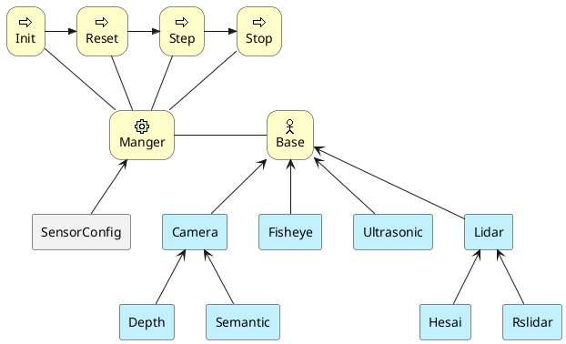
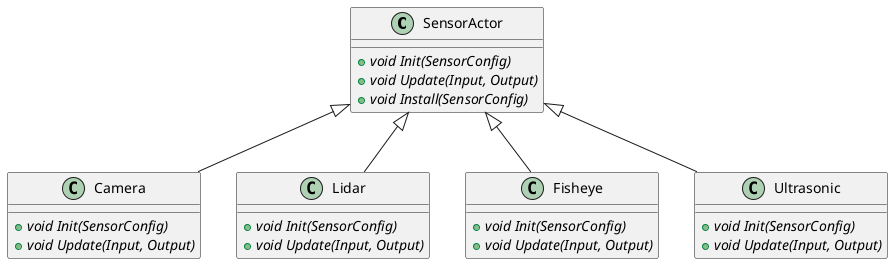
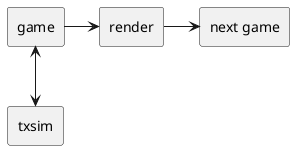
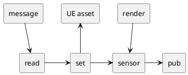

# Display

* Camera：针孔相机
* Depth：深度相机
* Fisheye：鱼眼相机
* Ring：环视相机
* Semantic：语义相机
* Ultrasonic: 超声波传感器
* Lidar: 激光lidar

## 1. 系统结构

代码接口

## 2 主要线程

* game线程：UE中主要处理数据的线程，比如设置车辆位置，获取传感器数据，代码在CPU上运行。
* render线程：3D渲染线程，负责场景的渲染，GPU（CPU预处理）运行。
* txsim调度线程：txSimSDK接入线程，与其他模块交换数据。实现step接口

### 2.1 线程关系

* game和render是同步的，交替运行，UE已经做好同步。
* txsim和game都是CPU代码，需要相互传输数据，比如车辆位置、传感器数据，

game线程中对于业务数据分成了read、set、sensor，pub4个步骤：

* read：从txsimSDK中读取车辆位置，主要调用GetSubscribedMessage
* set：将车辆环境数据设置到游戏中
* sensor：计算传感器数据
* pub：发布传感器数据，主要调用PublishMessage

### 2.2 同步模式

step函数中，严格遵守**获取数据，pub传感器之后**再跳出函数

### 2.3 异步模式

pub数据之前不会验证渲染完成，如果渲染较慢，则不会pub任何数据

### 2.4 此帧完成

表示当前step获取的传感器数据是否是本次位置渲染的结果。按照game和render的关系，step读取位置信息并传给game后，game设置到ue中，必须渲染后才能拿到新位置的渲染结果，否则是上一帧的结果。

此帧完成的耗时包含game+reader耗时。

## 3. CUDA插件

* CUDA是可选的
* 提升CPU-GPU数据的传输性能
* 拓展AI能力：风格迁移

## 4. 传感器建模方法

UE（Unreal Engine）是一款非常强大的实时渲染引擎，可以用于创建高质量的虚拟现实、游戏和仿真环境。要在UE中搭建摄像头仿真，需要创建一个摄像头Actor。这是一个包含摄像头组件的游戏对象，可以在场景中放置并调整其位置和方向。摄像头组件可以捕捉场景中的图像，并将其作为纹理输出。

核心原理： 摄像头仿真的核心原理是使用虚拟摄像头捕捉3D场景中的图像，然后将这些图像作为输入提供给计算机视觉算法或其他图像处理流程。这可以帮助开发者在虚拟环境中测试和优化算法，而无需在现实世界中进行试验。

以下是搭建摄像头仿真的主要步骤：

a. 创建摄像头Actor： 在UE中，它继承自AActor，并添加一个UCameraComponent作为摄像头组件。在构造函数中，将摄像头组件添加到Actor的RootComponent上。

b. 设置摄像头参数： 接受Manger传入的传感器参数，设置分辨率、视场角、焦距、内参、等。

c. 捕捉场景图像： 摄像头组件可以捕捉场景中的图像，并将其作为纹理输出。为了实现这一点，需要创建一个URenderTarget2D对象，并将其指定为摄像头组件的RenderTarget。然后，可以使用ReadPixels方法从渲染目标中读取像素数据。或者使用CUDA插件读取图像。

d. 传回数据： 将捕捉到的图像数据作为OUT参数，由Manger publish给txsim
