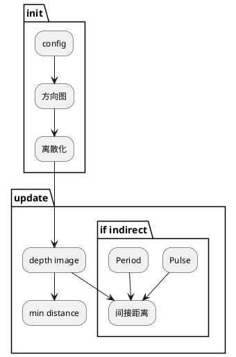
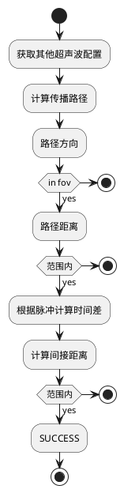
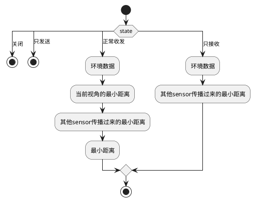
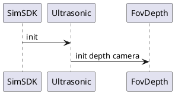
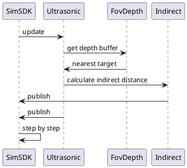

# Display-Ultrasonic

## 1. 背景

Ultrasonic传感器仿真主要负责超声传感器仿真。它是一种利用超声波来测量距离的设备。它通过发射超声波信号并接收反射回来的信号来确定目标物体的距离。超声波雷达产生间接距离测量的原理如下：

1. 发射超声波信号：超声波雷达中的发射器会产生一定频率的超声波信号，这些信号以机械波的形式通过空气等介质向外传播。

2. 信号反射：当超声波信号遇到障碍物（如墙壁、物体等）时，它们会被反射回来。反射信号的强度和形状与障碍物的形状、材料等因素有关。

3. 接收反射信号：超声波雷达中的接收器会接收到反射回来的超声波信号并将其转换为电信号。

4. 计算时间差：通过计算发射超声波信号和接收反射信号之间的时间差，可以进一步计算出超声波在空气中传播的时间。

5. 计算距离：已知超声波在空气中的传播速度（通常为340米/秒），通过测量的传播时间可以计算出超声波信号传播的总距离。这个距离是超声波从发射器到障碍物再返回到接收器的间接距离。

6. 计算目标物体距离：因为超声波信号在传播过程中是往返的，所以实际的目标物体距离是总距离的一半。

通过以上过程，超声波雷达可以间接地测量出距离目标物体的距离。这种非接触式的距离测量方法被广泛应用于机器人导航、自动驾驶汽车、物体测距、避障系统等领域。

## 2. 系统结构

按照SIMSDK的要求，接入模块需要满足4大接口：init、reset、step和stop。映射到display工程内，

* reset：初始化场景和传感器，**init**
* step：更新传感器数据，**update**



组件分为两个部分：init和update。

1. init：

* 超声波配置向内参组件发送消息，要求antenna（方向图）进行初始化。

* antenna组件收到消息后，向scatter ray（探测离散化）组件发送消息，要求scatter ray进行初始化，主要对超声波的探测范围做离散化。

2. update：

* scatter ray组件向depth image（深度探测图）组件发送消息，要求depth image进行更新，获取当前深度图，用于计算当前环境中的距离分布。
  
* depth image组件收到消息后，向min distance（最小距离）组件发送消息，要求min distance进行更新。
  
* 如果打开了间接距离，则执行以下操作：

  - depth image组件向indirect（间接距离）组件发送消息，要求indirect进行更新，计算当前的间接距离。

  - Pulse（脉冲）Period（间隔）定义了超声波的发射过程，用于计算超声波是否可以产生回波信号，并更新间接距离。

## 3. 核心机制

### 3.1 间接距离

每个超声波按照一段一段发声的方式向前传播，而接受也是一段一段的收到信号。首先获取其他超声波配置，然后计算传播路径并判断路径方向，接着判断路径是否在视场角（FOV）内以及路径距离是否在有效范围内，最后根据脉冲计算时间差并计算间接距离，判断是否成功。



该过程描述了一个超声波配置的获取、传播路径计算、方向判断、距离计算以及判断是否成功的过程。

1. 开始。

2. 获取其他超声波配置。

3. 计算传播路径。

4. 判断路径方向。

5. 如果路径在视场角（FOV）内，执行以下操作：

   a. 计算路径距离。

   b. 如果路径距离在有效范围内，执行以下操作：

      i. 根据脉冲计算时间差。

      ii. 计算间接距离。

      iii. 如果间接距离在有效范围内，表示成功。执行SUCCESS操作。

      iv. 如果间接距离不在有效范围内，停止。

   c. 如果路径距离不在有效范围内，停止。

6. 如果路径不在视场角（FOV）内，停止。

7. 结束。

### 3.2 轮询

* 轮询模式下，原有的间接距离失效关闭
* 参与轮询的超声波，将按照相同频率，相同节拍计算。

|字符|含义|
|----|----|
|0|关闭|
|1|正常工作，能发能收|
|s|send只发声|
|r|receive只接收|



轮训的过程，首先判断state变量的值，然后根据state的值选择相应的操作，如停止、获取环境数据、计算当前视角的最小距离、计算其他sensor传播过来的最小距离等。：

1. 开始。

2. 根据state变量的值，执行相应的操作：

   a. 如果state为关闭，停止。

   b. 如果state为只发送，停止。

   c. 如果state为正常收发，执行以下操作：

   * 获取环境数据。

   * 计算当前视角的最小距离。

   * 计算其他sensor传播过来的最小距离。

   * 计算最小距离。

   d. 如果state为只接收，执行以下操作：

   * 获取环境数据。

   * 计算其他sensor传播过来的最小距离。

3. 结束。

## 4. 数据库存储设计

无

## 5. 核心接口

### 5.1 配置输入

名称|Name|默认值|范围|含义
|---|---|---|---|---|
频率(Hz)|Frequency|40000|[4, 250K]|声波频率
垂直fov(°)|FovVertical|30|[0.0,160.0]|雷达天线垂直探测范围，请注意假设设置为10，则代表探测范围为[-5,5]
水平fov(°)|FovHorizontal|60|[0.0,160.0]|雷达天线水平探测范围，请注意假设设置为10，则代表探测范围为[-5,5]
有效分贝(dB)|dBmin|-6|[-1000.0,0.0]|能量分贝
发声半径(m)|Radius|0.01|[0.001,0.3]|发声半径
噪声系数|NoiseFactor|5|[0.2, 10.0]|综合噪声系数
噪声方差|NoiseStd|5|[0.1, 10.0]|高斯噪声方差
附着物类型|AttachmentType|None|None | Water |Mud|外部附着物类型，会影响探测距离
探测距离(m)|Distance|5|[0.001,100.0]|最大的探测距离
间接距离|IndirectDistance|false||是否打开间接距离
脉冲时刻（毫秒）|PulseMoment|0|[0.0, 100.0]|发声脉冲的起始时刻
脉冲周期（毫秒）|PulsePeriod|100|[0.1, 100.0]|发声脉冲的周期
轮询|PollTurn|空|‘01SR’4个字符任意组合|脉冲发声时的工作方式

### 5.2 结果输出

标准OSI消息，见官方文档[UltrasonicDetectionData](https://opensimulationinterface.github.io/open-simulation-interface/structosi3_1_1FeatureData.html)

|变量|类型|含义|
|--|--|--|
|ultrasonic_sensor|UltrasonicDetectionData|每个传感器对应一个ultrasonic_sensor|
|header.measurement_time|Timestamp|radar时间戳|
|detection|UltrasonicDetection|仿真数据|
|detection[i].distance|double|距离|

detection的size，直接距离时为1，间接距离为2。

## 6. 主要业务时序

### 6.1 初始化

初始化的流程：首先，SimSDK要求Ultrasonic组件进行初始化；然后，Ultrasonic组件要求FovDepth组件进行深度相机的初始化。



1. 两个组件：SimSDK和Ultrasonic。

2. SimSDK组件向Ultrasonic组件发送init消息，要求Ultrasonic进行初始化。

3. Ultrasonic组件收到init消息后，向FovDepth组件发送init depth camera消息，要求FovDepth组件进行深度相机的初始化。

### 6.2 Step更新

Step 过程包含数据更新、计算、获取缓冲区数据和发布流程：首先，SimSDK要求Ultrasonic组件进行更新；然后，Ultrasonic组件要求FovDepth获取深度缓冲区数据并返回最近的目标信息；接着，Ultrasonic要求Indirect计算间接距离；最后，Indirect和Ultrasonic将计算结果发布给SimSDK。并重复以上过程，处理更新和发布。



1. 有三个组件：SimSDK、Ultrasonic和FovDepth。

2. SimSDK组件向Ultrasonic组件发送update消息，要求Ultrasonic进行更新。

3. Ultrasonic组件收到update消息后，向FovDepth组件发送get depth buffer消息，要求FovDepth获取深度缓冲区数据。

4. FovDepth组件向Ultrasonic组件发送nearest target消息，将最近的目标信息返回给Ultrasonic组件。

5. Ultrasonic组件收到nearest target消息后，向Indirect组件发送calculate indirect distance消息，要求Indirect计算间接距离。

6. Indirect组件向SimSDK组件发送publish消息，将计算结果发布给SimSDK。

7. Ultrasonic组件向SimSDK组件发送publish消息，将结果发布给SimSDK。

8. SimSDK组件重复以上步骤，连续的更新和发布数据。

## 7. 数据埋点

无

## 8. 日志格式

无，只有异常情况下才会输出警告或错误信息。

## 9. 业务状态

无

## 10. 代码结构

```
Ultrasonic 
|    FovDepthBuffer.cpp         获取环境信息
|    FovDepthBuffer.h           
|    UltrasonicSensor.cpp       超声波主要业务代码
|    UltrasonicSensor.h       

```

## 11. 开发调试与发布

### 11.1 安装UE

参考官网[安装虚幻引擎](https://docs.unrealengine.com/4.27/zh-CN/Basics/InstallingUnrealEngine/)

### 11.2 安装Visual Studio（推荐2019）

参考官网[安装 Visual Studio](https://learn.microsoft.com/zh-cn/visualstudio/install/install-visual-studio?view=vs-2019)，选择c++桌面开发

可选设置：[设置虚幻引擎的Visual Studio](https://docs.unrealengine.com/4.27/zh-CN/ProductionPipelines/DevelopmentSetup/VisualStudioSetup/)

### 11.3 构建Display工程

* 方法1：右键Display.uproject，选择Generate Visual Studio Project Files
* 方法2：C:\Program Files\Epic Games\UE_4.27\Engine\Binaries\DotNET\UnrealBuildTool.exe Display.uproject
* 方法3：执行GenerateProjectFiles.bat
  
### 11.4 编译

有4种type可选：

* Debug Game：调试运行，用于调试c++代码
* Debug Editor：调试运行Editor，用Editor打开工程，用于调试Editor工具
* Development Game：发布运行，无调试信息
* Development Editor：运行Editor，用Editor打开工程。等同于直接打开Display.uproject后提示的编译过程。
  
### 11.5 调试

1. 执行PakMapsConfig.exe 三维地图id，如PakMapsConfig.exe 44+1001，设置当前场景
2. 编译Editor
3. 用Editor打开工程：直接打开Display.uproject
4. 选择菜单-文件-cook for windows，等待结束
5. tadsim克隆一个Display模块，取消勾选自动启动
6. 切换到Debug Game，右键Display工程属性，设置调试参数-name=Display_clone
7. tadsim运行场景
8. 调试运行Display工程，等待连接成功

### 11.6 发布

执行Build.bat，参数为地图编号，例如Build.bat 44+1001，表示构建44号和1001号的美术场景。
