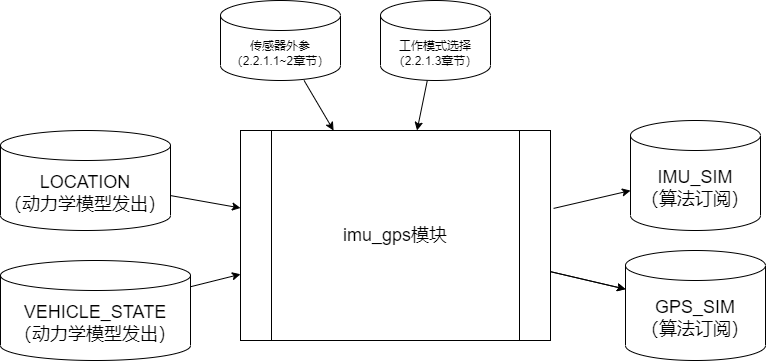
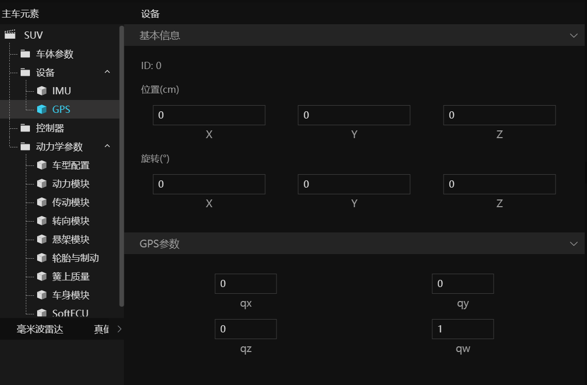
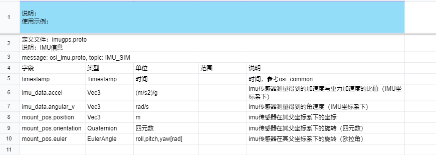
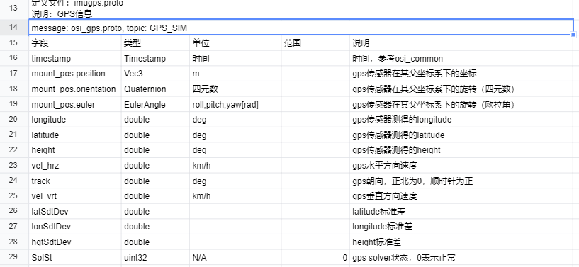

# IMU/GPS

# 1. 背景
​  IMU、GPS传感器是自动驾驶中常见的用于车辆定位的传感器。仿真IMU/GPS传感器对于定位算法的仿真有着重要意义。
本方案中IMU/GPS传感器为真值传感器建模，能够结合传感器的外参（用户输入）和车辆运行状态，输出对应的信号，包括角速度，加速度，GPS坐标，航向角，水平/垂直速度等。

# 2. 系统结构

## 2.1 架构

<div align="center"></div><br>

## 2.2 要点概述

### 2.2.1 工作流程

#### 2.2.1.1 IMU传感器外参配置

IMU传感器外参需要配置相对于主车参考点的偏移和旋转，其中偏移单位为厘米，旋转为四元数

<div align="center"></div><br>


#### 2.2.1.2 GPS传感器外参配置

GPS传感器外参需要配置相对于主车参考点的偏移和旋转，其中偏移单位为厘米，旋转为四元数(默认参数无旋转)

<div align="center"></div><br>

#### 2.2.1.3 工作模式选择

  - 在模型“初始化参数”中不填任何模式信息，则模块同时开启IMU和GPS仿真功能；
  - 在模型“初始化参数”中填入mode=imu，则模块只开启IMU仿真功能；
  - 在模型“初始化参数”中填入mode=gps，则模块只开启GPS仿真功能；


#### 2.2.1.4 与仿真系统的数据交互

- ​[TAD Sim 系统消息定义-主线](https://doc.weixin.qq.com/sheet/e3_AYIAKQZaABoSjqd81bFQWODMbOrxX?scode=AJEAIQdfAAoZD6H544Ac4ANAaJAFk&tab=njdi31)

- imu_gps模块结构LOCATION和VEHICLE_STATE消息. 并根据工作模式输出IMU_SIM和GPS_SIM消息。

- 输入仿真消息
  - LOCATION 消息参考 location.proto
  - VEHICLE_STATE 消息参考 vehState.proto

- 输出仿真消息
  - IMU_SIM 消息参考 osi_imu.proto
  - GPS_SIM 消息参考 osi_gps.proto
  <div align="center"></div><br>

  <div align="center"></div><br>


# 3. 核心机制
  无


# 4. 数据库存储设计
  无


# 5. 核心接口

## 5.1 接口内容

### 5.1.1 输入

- ​[TAD Sim 系统消息定义-主线](https://doc.weixin.qq.com/sheet/e3_AYIAKQZaABoSjqd81bFQWODMbOrxX?scode=AJEAIQdfAAoZD6H544Ac4ANAaJAFk&tab=njdi31)

| 信号说明         | TOPIC         | 具体文件或库   | 通信方式 |
| ---------------- | ------------- | -------------- | -------- |
| 主车当前定位信息 | LOCATION      | location.proto | TCP      |
| 主车车辆状态信息 | VEHICLE_STATE | vehState.proto | TCP      |


### 5.1.2 输出

- ​[TAD Sim 系统消息定义-主线](https://doc.weixin.qq.com/sheet/e3_AYIAKQZaABoSjqd81bFQWODMbOrxX?scode=AJEAIQdfAAoZD6H544Ac4ANAaJAFk&tab=njdi31)

| 信号说明      | TOPIC   | 具体文件或库  | 通信方式 |
| ------------- | ------- | ------------- | -------- |
| imu传感器信息 | IMU_SIM | imu_gps.proto | tcp      |
| gps传感器信息 | GPS_SIM | imu_gps.proto | tcp      |


# 6. 主要业务时序

## 6.1 imu_gps 仿真时序图

  <div align="center"></div><br>

​		txSimSDK规定了模块的实现流程，如上图左侧所示，需要实现四个函数 init -> reset -> step -> stop。图右侧是每一步对应的具体实现，消息协议的转换需要在step中完成。

imu_gps评测模块由 TAD Sim 默认集成，受调度模块 (Coordinator) 的调度。

- **Init:**
  - 引擎会传递给 imu_gps 模块对应的参数。如 mode 参数

- **Reset:**
  - 调度模块会给 imu_gps 传送一个 xosc 文件，该文件内部有用户配置的传感器外参数据。

- **Step:**
  - imu_gps 模块会根据的仿真系统消息，及传感器外参计算IMU/GPS传感器数据并发布到仿真系统。

- **Stop:**
  - imu_gps 模块停止仿真。


# 7. 数据埋点

无

# 8. 日志格式

imu_gps 模块默认支持 INFO/WARNING/ERROR 级别日志


```cpp
  LOG(INFO)
  LOG(WARNING)
  LOG(ERROR)
```
