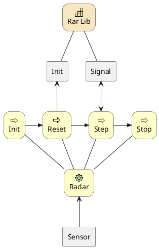
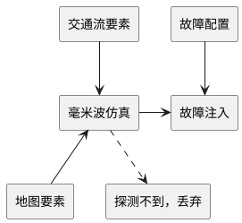
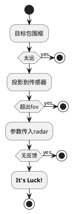
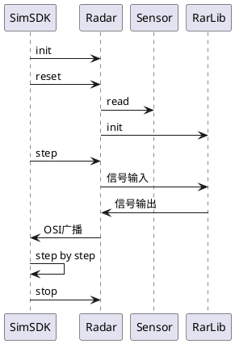

# Radar模块

## 1. 背景

Radar模块主要负责一些毫米波传感器的计算，它的输入包括一些基本数据：比如主车信息、交通车数据、传感器数据；输出毫米波约束下的目标级数据。

## 2. 系统结构

radar 的初始化、重置、逐步执行和停止操作：首先，Init、Reset、Step和Stop组件控制模块的整体操作流程；然后，Radar组件与相应的传感器行为相互作用；最后，Rar Lib组件为模块提供核心仿真支持。例如，Init、Reset、Step和Stop组件分别与Radar组件进行交互，同时，Sensor组件与Radar组件相互作用。Rar Lib组件通过Init和Signal组件进行初始化和信号处理操作。



描述了 radar 的初始化、重置、逐步执行和停止操作。sdk 和 radar 被分为不同的层次和类型。

1. sdk层：包括Init、Reset、Step、Stop和Radar步骤。

   a. Init、Reset、Step和Stop组件分别表示系统的初始化、重置、逐步执行和停止操作。

   b. Radar组件表示毫米波雷达模块。

2. 传感器层：包括Sensor组件。

   a. Sensor组件表示传感器的配置加载、fov计算。

3. 工具层：包括Rar Lib的Init和Signal操作。

   a. Rar Lib组件表示雷达库。

   b. Init和Signal组件表示库中的初始化和信号处理操作。

## 3. 核心机制

### 3.1 目标输入

目标包括交通流要素和地图要素，他们分别将数据提供给毫米波仿真组件；毫米波仿真组件与故障注入组件相互作用，并受到故障配置组件的影响；最后，目标可能会有探测不到，丢弃组件的行为。



有六个组件：交通流要素、地图要素、毫米波仿真、故障注入、故障配置和无效丢弃。

1. 交通流要素将数据提供给毫米波仿真组件。

2. 地图要素组件将数据提供给毫米波仿真组件。

3. 毫米波仿真的结果发送给故障注入组件。

4. 故障配置将故障数据提供给故障注入组件。

5. 毫米波仿真组件如果探测不到，会将结果丢弃。

6. 最终，仿真结果和注入数据融合后，发送出来。

### 3.2 目标输出

1. 首先用fov过滤一些非视野范围内的目标
2. 然后再使用radar库进行目标仿真



雷达探测到的过程如下：

1. 开始。

2. 获取Object BBox（物体的边界框）。

3. 判断物体距离是否过远。

   a. 如果距离过远，则停止。

   b. 如果距离不过远，执行以下操作：

      * 将物体映射到传感器中。

      * 判断物体是否在视场角（FOV）之外。

         * 如果物体在视场角之外，则停止。

         * 如果物体在视场角之内，执行以下操作：

            * 将物体设置为雷达模型。

            * 判断雷达是否返回信号。

               * 如果雷达没有返回信号，则停止。

               * 如果雷达返回信号，表示物体被探测到。

4. 结束。

判断物体是否被雷达探测到的过程：首先获取物体的边界框，然后判断物体距离是否过远；接着将物体映射到传感器中并判断物体是否在视场角（FOV）之外；最后，将物体设置为雷达模型并判断雷达是否返回信号，从而判断物体是否被探测到。

## 4. 数据库存储设计

无

## 5. 核心接口

### 5.1. Init（模块初始化）参数

| 参数举例          | 默认值 | 含义                                                                    |
| ----------------- | ------ | ----------------------------------------------------------------------- |
| IgnoreZ=ON        | OFF    | 是否忽略z值，解决某些情况下location和traffic的z值不一致的问题           |
| DebugDir=XXX/XXX  | 关闭   | 指定调试输出目录                                                        |
| -device=0         | all    | 指定算法id，只有绑定到该id的传感器才被读取，可以指定all，表示所有传感器 |
| tadsim_path=XX/XX | 关闭   | 重定向tadsim目录                                                        |

### 5.2. 传感器配置

| 名称                 | Name        | 默认值 | 范围                                        | 含义                                                                                                                                                                       |
| -------------------- | ----------- | ------ | ------------------------------------------- | -------------------------------------------------------------------------------------------------------------------------------------------------------------------------- |
| 频率(Hz)             | Frequency   | 10     | (0,200]                                     | 传感器频率                                                                                                                                                                 |
| 雷达载频             | F0_GHz      | 77     | 77 / 24                                                                                                                                                                        | 雷达波形的中心频率，影响雷达最大探测距离、距离分辨率、速度分辨率、测距精度、测速精度、测角精度 |
| 发射功率(dBm)        | Pt_dBm      | 10     | [5.0,10.0]                                  | 雷达发射信号的功率值，发射功率越大，雷达威力越大，最大探测距离越大。影响雷达最大探测距离、测距精度、测速精度、测角精度                                                     |
| 发射天线增益(dBi)    | Gt_dBi      | 15     | [10.0,15.0]                                 | 最大探测距离随发射天线增益的增大而增大。影响雷达最大探测距离、测距精度、测速精度、测角精度                                                                                 |
| 接收天线增益(dBi)    | Gr_dBi      | 15     | [10.0,15.0]                                 | 最大探测距离随接收天线增益的增大而增大。影响雷达最大探测距离、测距精度、测速精度、测角精度                                                                                 |
| 等效噪声温度(K)      | Ts_K        | 300    | [290.0,310.0]                               | 雷达所处环境的等效噪声温度，最大探测距离随搭设天线增益的增大而减小。影响雷达最大探测距离、测距精度、测速精度、测角精度                                                     |
| 接收机噪声系数(dB)   | Fn_dB       | 12     | [0.0,45.0]                                  | 影响雷达最大探测距离、测距精度、测速精度、测角精度                                                                                                                         |
| 系统衰减常数(dB)     | L0_dB       | 10     | 联动F0_GHz(77: [5.0,10.0], 24: [15.0,30.0]) | 77、79/24GHz的雷达系统衰减常数范围不同，需注意，影响雷达最大探测距离                                                                                                       |
| 最小可检测信噪比(dB) | SNR_min_dB  | 18     | [15.0,22.0]                                 | 影响目标是否可被检测到的参数，同时影响最大探测距离。在其他参数一定的情况下，最大探测距离随最小可检测信噪比的增大而减小。影响雷达最大探测距离、测距精度、测速精度、测角精度 |
| 目标延迟参数(ms)     | delay       | 0      | [0.0,5000.0]                                |
| 垂直fov(°)           | vfov        | 10     | [0.0,160.0]                                 |
| 水平fov(°)           | hfov        | 20     | [0.0,160.0]                                 | 雷达天线水平探测范围，请注意假设设置为10，则代表探测范围为[-5,5]                                                                                                           |
| 水平角度分辨率(°)    | hwidth      | 3      | [1.0,10.0]                                  | 雷达天线水平角分辨率，即水平天线3dB波束宽度，以1°为步进输入                                                                                                                |
| 垂直角度分辨率(°)    | vwidth      | 3      | [1.0,10.0]                                  | 雷达天线垂直角分辨率，即水平天线3dB波束宽度，以1°为步进输入                                                                                                                |
| 故障数据             | CustomFault |        |                                             | 故障注入文件，包含类型，关键帧，故障值，文件读取为字符串保存在xosc中，包含换行符                                                                                           |

故障文件的规则：
首行为title，一行一条数据，逗号隔开，或者以csv格式保存，不需要的故障类型留空，例子如下：

```text

time(秒),id,distance,speed(径向),angle,rcs
1.0,2,23.5,,,
1.2,2,28.9,,,
1.2,3,,3,,

```

### 5.3. 输出

定义文件：osi_featuredata.proto，Topic：OSI_RADAR

详细信息见: [TAD Sim系统消息定义](https://doc.weixin.qq.com/sheet/e3_AYIAKQZaABoLqLUV4KmRMeXIjEXUu?scode=AJEAIQdfAAoRpj2akxAYIAKQZaABo&tab=ytsm38)

标准OSI消息，见[官方文档](https://opensimulationinterface.github.io/open-simulation-interface/structosi3_1_1FeatureData.html)

## 6. 主要业务时序

时序主要包括初始化、重置、逐步执行和停止操作：首先，SimSDK要求Radar组件进行初始化、重置、逐步执行和停止操作；然后，Radar组件要求Sensor组件读取数据并与RarLib组件进行信号传输；最后，Radar组件将OSI数据发布给SimSDK，SimSDK按照逐步执行的方式处理操作。



1. 有三个主要组件：SimSDK、Radar和RarLib。

2. SimSDK组件向Radar组件发送init、reset消息，要求Radar进行初始化和场景重置。

3. Radar组件向Sensor组件发送read消息，要求Sensor读取数据。

4. Radar组件向RarLib组件发送init消息，要求RarLib进行初始化。

5. SimSDK组件向Radar组件发送step消息，要求Radar进行逐步执行。

6. Radar组件向RarLib组件发送signal in消息，将目标信号传入RarLib组件。

7. RarLib组件向Radar组件发送signal return消息，将目标结果返回给Radar组件。

8. Radar组件向SimSDK组件发送OSI Publish消息，将OSI数据发布给SimSDK。

9. SimSDK组件重复执行 step 过程。

10. SimSDK组件向Radar组件发送stop消息，Radar停止。

## 7. 数据埋点

无

## 8. 日志格式

>[***timestamp***]: radar(***id***)= ***N***/***M*** ...

* timestamp：当前时间戳
* id：毫米波id
* M：当前fov输入的目标个数
* N：过滤后的目标个数
*

## 9. 代码结构

| FILE            | Describe                    |
| --------------- | --------------------------- |
| coord_trans.cpp | 坐标转换                    |
| kdtree_flann.h  | knn搜索库                   |
| ObjectSize.cpp  | 计算目标的BBox              |
| radar.cpp       | 毫米波模块                  |
| sensor.cpp      | 毫米波传感器的读取和fov计算 |

## 10. 开发调试与发布

首先确保Simcore有足够的依赖库

* Windows：上层目录中确保存在deps（基础依赖库）、hadmap（mapsdk库文件，非代码）
* Linux：Eigen, Boost, Protobuf, Gtest, fftw3f, glog, Flann, hadmap（mapsdk库文件，非代码）

确保安装cmake，执行以下编译步骤：

1. mkdir build
2. cd build
3. cmake ..
4. make

推荐使用vscode调试代码：

1. 用vscode打开目录
2. cmake工具编译代码
3. 配置launch.json:

    ```json
    {
        "version": "0.2.0",
        "configurations": [
            {
                "type": "lldb",
                "request": "launch",
                "name": "Debug",
                "program": "/修改为你的路径/txsim-module-launcher",
                "args": [
                    "radar_clone(Tadsim配置的模块名字)",
                    "${workspaceFolder}/build/lib/libtxsim-radar.so",
                    "127.0.0.1:21302"
                ],
                "env": {
                    "LD_LIBRARY_PATH": "/home/root/TAD_Sim/buildin/simdeps/:$LD_LIBRARY_PATH"
                },
                "cwd": "${workspaceFolder}"
            }
        ]
    }
    ```

4. 配置Tadsim，添加一个非自动启动的模块
5. Debug and enjoy.
