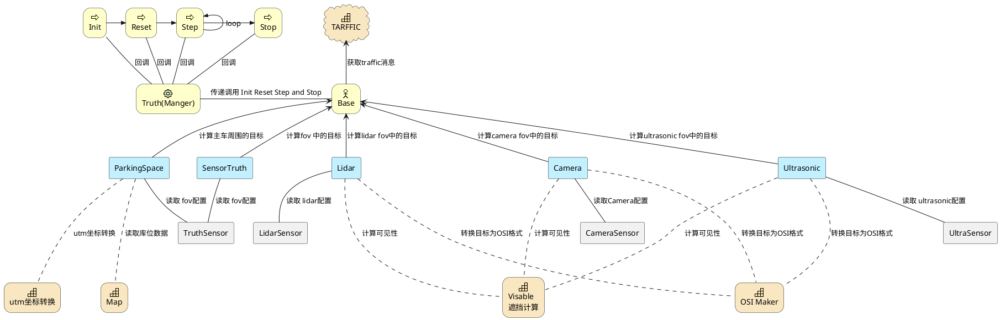
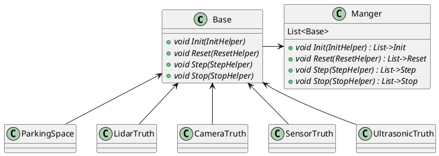
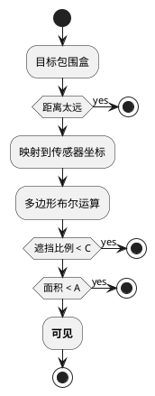
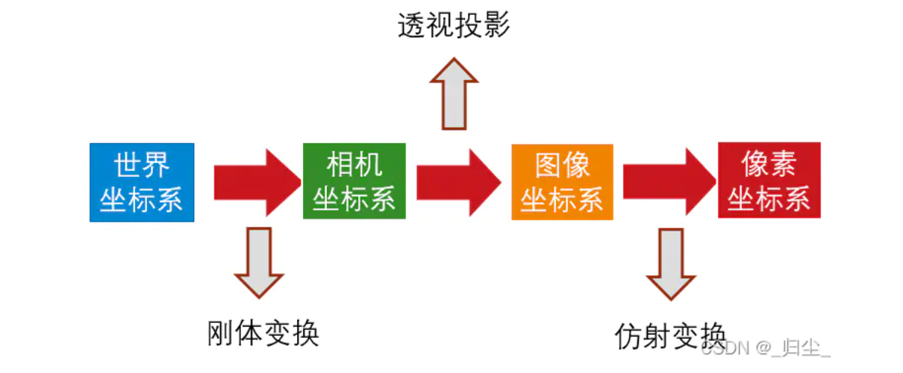
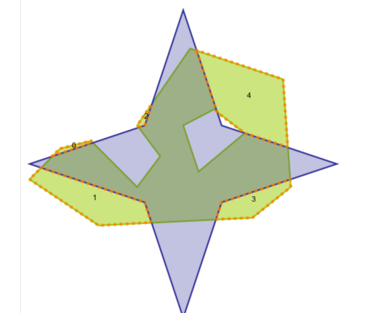
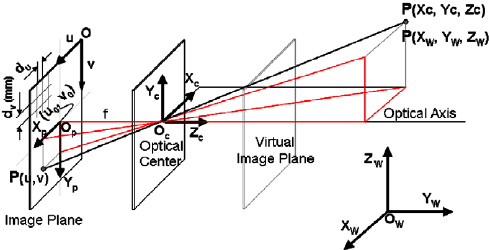
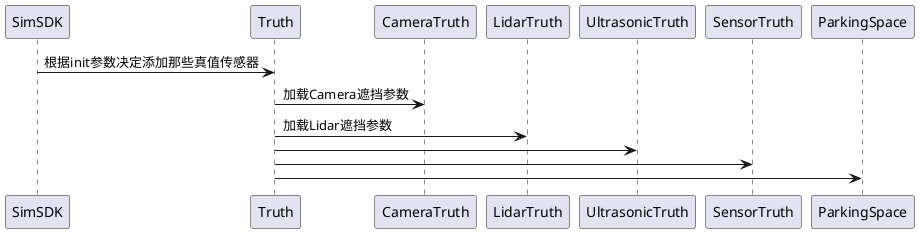
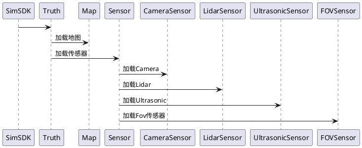
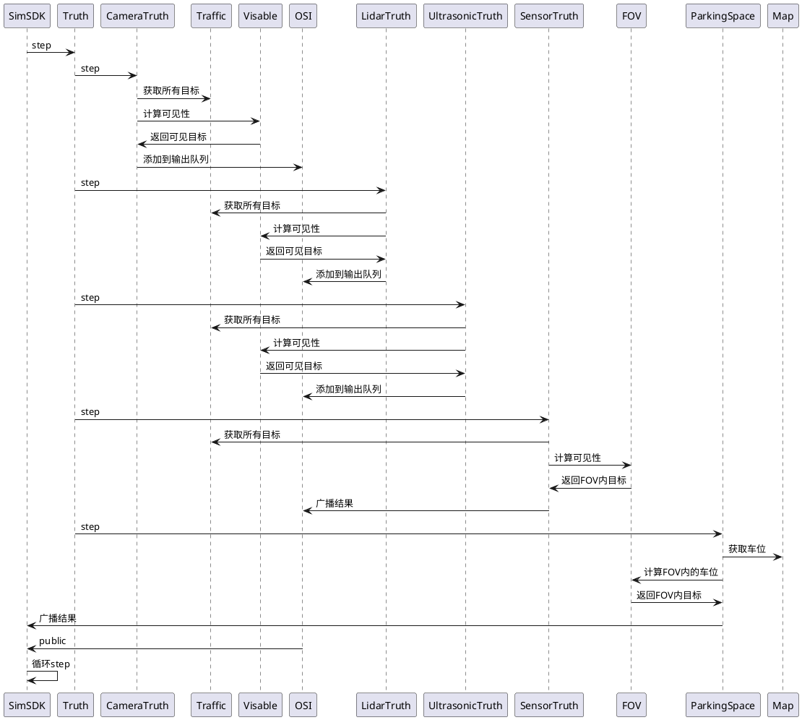

# SensorTruth模块

SensorTruth模块主要负责一些真值的计算，它的输入包括一些基本数据：比如主车信息、交通车数据、传感器数据；输出特定约束下的目标级数据。

## 1. 背景

目标级仿真方法是指在虚拟环境中对各种传感器的测量特性进行建模和模拟的方法。这种仿真方法可以为传感器系统的研究、开发和测试提供有价值的数据。以下是对Camera、Lidar和超声波传感器的详细描述：

### 1.1 相机（Camera）

相机主要用于捕捉视觉信息。在仿真环境中，可以使用计算机图形学（Computer Graphics）方法和技术来模拟场景和相机的成像。

1. 获取交通流：通过读取交通车的几何形状、位置、朝向等信息，获取目标真值。
2. 透视投影：根据相机内参和外参，将场景中的三维点投影到虚拟相机平面上，以生成二维图像。
3. 遮挡计算：使用多边形求交运算，获取最终露出来的目标。

### 1.2 激光雷达（Lidar）

激光雷达通过发射激光脉冲并接收反射回来的激光脉冲来测量目标物体的距离。仿真激光雷达主要包括以下步骤：

1. 获取交通流：通过读取交通车的几何形状、位置、朝向等信息，获取目标真值。
2. 激光投影：根据激光雷达的参数（如激光束角度分辨率、扫描范围等），将目标投影影到激光环形平面上。
3. 遮挡计算：使用多边形求交运算，获取最终露出来的目标。

### 1.3 超声波传感器（Ultrasonic Sensor）

超声波传感器的仿真需要模拟超声波在空气中的传播特性、与物体的相互作用以及接收部分的处理等方面。

1. 获取交通流：通过读取交通车的几何形状、位置、朝向等信息，获取目标真值。
2. 超声波fov计算：根据传感器的参数（如波形、频率、发射角度等），计算fov
3. 碰撞计算：计算fov和目标box的碰撞关系，计算最近的点。

## 2. 系统结构

Init、Reset、Step和Stop组件控制系统的整体操作流程；Camera、Lidar和Ultrasonic组件与相应的传感器行为相互作用；OSI Maker、Visable遮挡计算、utm坐标转换和Map组件为系统提供策略和工具支持。



1. **sdk层**(黄色）：包括Init、Reset、Step、Stop、Base和Truth(Manger)组件。

   a. Init、Reset、Step和Stop组件分别表示SDK的初始化、重置、单步执行和停止操作。

   b. Base组件表示功能业务的基础接口，包含了Init、Reset、Step、Stop等4个接口，

   c. Truth(Manger)组件表示真值模块的实现，它转发了4个接口。

2. **真值业务层**（蓝色）：包括Camera、Lidar、Ultrasonic、ParkingSpace和SensorTruth组件。

   a. Camera、Lidar和Ultrasonic组件分别表示相机、激光雷达和超声波传感器的目标仿真。

   b. ParkingSpace组件表示泊车真值仿真。

   c. SensorTruth组件表示 FOV 传感器的真值数据。

3. **传感器层**（灰色）：包括CameraSensor、LidarSensor、UltraSensor和TruthSensor组件。

   a. CameraSensor、LidarSensor和UltraSensor组件分别表示相机、激光雷达和超声波传感器的配置和计算。

   b. TruthSensor组件表示 FOV 传感器的配置与计算。

4. **工具层**（橘色）：包括OSI Maker、Visable遮挡计算、utm坐标转换和Map组件。

   a. OSI Maker组件表示OSI标准数据的打包。

   b. Visable遮挡计算组件表示可见性遮挡计算。

   c. utm坐标转换组件表示UTM坐标系转换。

   d. Map组件表示高精地图相关操作。

## 3. 核心机制

### 3.1 可插拔

该目录代码是按照simsdk形式接入的，主要覆盖Init、Reset、Step和Stop四个接口，而SensorTruth提供了4种不同的可插拔的功能，所以主模块使用了一个Base类，中转了这4个接口，实现了ParkingSpace、LidarTruth、CameraTruth、SensorTruth和UltrasonicTruth相同形式的模块接入。



### 3.2 遮挡计算

遮挡计算在传感器目标级仿真中被使用，主要判断车辆在传感器视角下的遮挡情况，主要思路是将目标（车辆、行人、障碍物等）投影到传感器视角的平面上，按照多边形求交方法，计算露出的面积或比例，据此判断可见性。



1. 开始。

2. 获取Object BBox（物体的边界框）。

3. 判断物体距离是否太远。

   a. 如果距离过远，则停止。

   b. 如果距离不过远，执行以下操作：

      * 将物体映射到传感器中。

      * 计算多边形布尔运算。

      * 判断物体的完整性是否小于阈值C。

         * 如果完整性小于阈值C，则停止。

         * 如果完整性不小于阈值C，执行以下操作：

            * 判断物体的面积是否小于阈值A。

               * 如果面积小于阈值A，则停止。

               * 如果面积不小于阈值A，表示物体是可见的。

4. 结束。

判断物体是否可见的过程总结为：首先获取物体的边界框，然后判断物体距离是否过远；接着将物体映射到传感器中并计算多边形布尔运算；最后根据物体的完整性和面积判断物体是否可见。

1. 目标几何化：车辆或行人目标的三维模型，拆分成三角面片，甚至可简化方盒子；

2. 相机投影：三维坐标，经过外参-内参投影后，计算出图像像素坐标。该过程可参考图像内参、外参、针孔成像原理。
  <div align="center"></div><br>

刚体变换：
$$
\left[\begin{array}{c}
X_c \\
Y_c \\
Z_c \\
1
\end{array}\right]=\left[\begin{array}{cccc}
r_{11} & r_{12} & r_{13} & t_x \\
r_{21} & r_{22} & r_{23} & t_y \\
r_{31} & r_{32} & r_{33} & t_z \\
0 & 0 & 0 & 1
\end{array}\right]\left[\begin{array}{c}
X_w \\
Y_w \\
Z_w \\
1
\end{array}\right]
$$

仿射变换:
$$
s\left[\begin{array}{c}
u \\
v \\
1
\end{array}\right]=\left[\begin{array}{ccc}
f_x & 0 & c_x \\
0 & f_y & c_y \\
0 & 0 & 1
\end{array}\right]\left[\begin{array}{c}
X_c \\
Y_c \\
Z_c
\end{array}\right]
$$

1. 目标凸包：计算多个三角面片的凸包，合并为一个多边形，简化计算量

2. 多边形差异（different）运算：近处的目标(蓝色)遮挡远处目标（绿色），只有部分露出来（黄色虚线）

  <div align="center"></div><br>

### 3.3 相机投影

相机投影过程（Camera Projection Process）指的是将 3D 场景中的三维点投影到成像设备（例如相机）所捕获的二维平面上。这一过程可以使用相关的矩阵和方程来进行数学建模，在计算机视觉、图形学以及影像处理等领域具有广泛的应用。

  <div align="center"></div><br>

相机投影过程可以分为以下几个核心步骤：

1. 物体坐标系与世界坐标系

    将物体坐标系（Object Coordinate System）中的三维点转换到世界坐标系（World Coordinate System）中。这可以通过使用物体的变换矩阵（Transformation Matrix）来实现：

    $$
    X_w = T * X_o
    $$
    其中，$X_w$表示世界坐标系中的 3D 点， $X_o$表示物体坐标系中的 3D 点， $T$ 为物体的变换矩阵。

2. 世界坐标系与相机坐标系

    将世界坐标系中的三维点转换到相机坐标系（Camera Coordinate System）。这可以通过使用相机的外参（Extrinsic Parameters）来实现：

    $$
    X_c = R * X_w + t
    $$

    其中，$X_c$表示相机坐标系中的 3D 点， $X_w$表示世界坐标系中的 3D 点，$R$为相机的旋转矩阵,$t$为平移向量。

3. 相机坐标系与像素坐标系

    将相机坐标系中的三维点投影到成像设备上。这里我们需要使用到相机的内参（Intrinsic Parameters）：

    $$
    x_p' = K * X_c
    $$

    其中，$x_p'$表示投影坐标的齐次坐标， $K$ 为相机内参矩阵。

    将 $x_p'$ 转换为像素坐标：

    $$
    x_p = (x_p'.X / x_p'.Z, x_p'.Y / x_p'.Z)'
    $$

    得到了最终的二维像素坐标 $x_p$。

### 3.4 目标级噪声

在FOV过滤、Camera过滤和Lidar过滤的模块的输出目标级信号上添加噪声。噪声种类包括：
| 噪声     | 含义             | 参数               | 解释（ x为目标距离）                            |
| -------- | ---------------- | ------------------ | ----------------------------------------------- |
| 漏检率   | 被丢弃的概率     | a,b,c,d,σ=1,pmax=1 | p=ax^3+bx^2+cx+d，G(μ=0, σ),pmax：限定最大概率  |
| 停留率   | 延续上一帧的概率 | a,b,c,d,σ=1,pmax=1 | p=ax^3+bx^2+cx+d，G(μ=0, σ)，pmax：限定最大概率 |
| 位置抖动 | 坐标位置随机偏移 | a,b,c,d,rmax=999   | 高斯量σ=ax^3+bx^2+cx+d，rmax：限定最大抖动半径  |
| 尺寸抖动 | 长宽高添加随机量 | a,b,c,d,smax=999   | 高斯量σ=ax^3+bx^2+cx+d，smax：限定最大抖动量    |
| 速度抖动 | 速度添加随机量   | a,b,c,d,vmax=999   | 高斯量σ=ax^3+bx^2+cx+d，vmax：限定最大抖动速度  |

漏检概率计算方法：

1. 计算目标距离x
2. 计算概率p=ax^3+bx^2+cx+d，abcd为配置参数，表示该距离对应的概率
3. p=p+0.01*G(μ=0, σ)，将p添加高斯噪声
4. 对p做合理性处理，
5. 在[0, 1]内随机一个数，如果小于p，表示该目标漏检

停留概率计算方法：

1. 同上
2. 如果停留该对象，则发送上一帧结果（如果可用）

抖动计算方法：

1. 计算目标距离x
2. σ=ax^3+bx^2+cx+d，abcd为配置参数，表示该距离对应的高斯方差参数
3. 计算高斯噪声s=G(μ=0, σ)
4. 约束s∈[-max, max]
5. 约束合法性：比如速度不能小于0，尺寸不能小于0

## 4. 数据库存储设计

无

## 5. 核心接口

### 5.1. Init（模块初始化）参数

#### 5.1.1. 通用的

| 参数举例              | 默认值 | 含义                                                                    |
| --------------------- | ------ | ----------------------------------------------------------------------- |
| CameraTruth=ON        | OFF    | 开启图像真值子模块                                                      |
| LidarTruth=ON         | OFF    | 开启lidar真值子模块                                                     |
| UltrasonicTruth=ON    | OFF    | 开启超声波真值子模块                                                    |
| SensorTruth=ON        | OFF    | 开启目标真值子模块                                                      |
| ParkingSpace=ON       | OFF    | 开启ParkingSpace                                                        |
| DebugDir=XXX/XXX      | 关闭   | 指定调试输出目录                                                        |
| -device=0             | all    | 指定算法id，只有绑定到该id的传感器才被读取，可以指定all，表示所有传感器 |
| tadsim_path=XX/XX     | 关闭   | 重定向tadsim目录                                                        |
| NoiseDrop=a,b,c,d,σ   | 关闭   | 设置漏检率参数                                                          |
| NoiseStay=a,b,c,d,σ   | 关闭   | 设置滞留率参数                                                          |
| NoisePosition=a,b,c,d | 关闭   | 设置位置抖动参数                                                        |
| NoiseSize=a,b,c,d     | 关闭   | 设置尺寸抖动参数                                                        |
| NoiseVeolity=a,b,c,d  | 关闭   | 设置速度抖动参数                                                        |

#### 5.1.2. 子模块

##### 5.1.2.1. CameraTruth

| 参数举例             | 默认值 | 含义                                     |
| -------------------- | ------ | ---------------------------------------- |
| CT_MaxDistance=100.0 | 100    | 目标最大距离                             |
| CT_Completeness=0.5  | 0.5    | 目标完整度，被遮挡的面积比例不能小于该值 |
| CT_MinArea=20        | 20     | 像素平方，在图像上的最小面积             |

##### 5.1.2.2. LidarTruth

| 参数举例            | 默认值 | 含义                                       |
| ------------------- | ------ | ------------------------------------------ |
| LT_Completeness=0.5 | 0.3    | 目标完整度，被遮挡的激光数比例不能小于该值 |
| LT_MinHitNum        | 5      | 最小激光个数，小于它的目标被丢弃           |

### 5.2. 传感器依赖项

传感器的参数将被用于目标计算、筛选的重要输入依据，例如，真值传感器定义了fov和距离，它们将用于SensorTruth和ParkingSpace的范围筛选，Camera的内参用于CameraTruth的视窗计算。

| 子模块          | 传感器   | 说明         |
| --------------- | -------- | ------------ |
| CameraTruth     | 摄像头   |              |
| LidarTruth      | 激光雷达 |              |
| UltrasonicTruth | 超声波   |              |
| SensorTruth     | 真值     | 定义主车原点 |
| ParkingSpace    | 真值     | 定义主车原点 |

### 5.3. 输出

详细信息见 ​[TAD Sim 系统消息定义-主线](https://doc.weixin.qq.com/sheet/e3_AYIAKQZaABoSjqd81bFQWODMbOrxX?scode=AJEAIQdfAAoZD6H544Ac4ANAaJAFk&tab=njdi31)

| Topic               | proto                   | 子模块                                   | 说明                                               |
| ------------------- | ----------------------- | ---------------------------------------- | -------------------------------------------------- |
| TXSIM_SENSOR_DATA   | osi_datarecording.proto | SensorTruth                              | 如果指定了-device，topic为TXSIM_SENSOR_DATA_{id}   |
| TXSIM_SENSOR_OBJECT | osi_datarecording.proto | CameraTruth，LidarTruth，UltrasonicTruth | 如果指定了-device，topic为TXSIM_SENSOR_OBJECT_{id} |
| TXSIM_PARKING_SPACE | parking_space.proto     | ParkingSpace                             |                                                    |

## 6. 主要业务时序

真值传感器采用了可插拔的设计，不同的真值之间互不影响，再时序上体现了并行的特点。重复执行初始化、重置、单步和停止的过程。首先，SimSDK要求Truth组件进行初始化、重置、逐步执行和停止操作；然后，Truth组件要求CameraTruth、LidarTruth、UltrasonicTruth、SensorTruth和ParkingSpace组件进行相应的操作。

### 6.1 Init



Truth组件收到init消息后，分别向CameraTruth、LidarTruth、UltrasonicTruth、SensorTruth和ParkingSpace组件发送init消息，要求这些组件进行初始化。这些truth对象同样拥有InitHelper，可以从前端获取必要的初始化参数

### 6.2 Reset



Truth组件收到reset消息后，分别加载地图和传感器配置。

### 6.3 Step



1. 摄像头真值从Traffic获取目标级信号，然后进行遮挡计算，可见的目标传给OSI模块

2. 激光雷达真值从Traffic获取目标级信号，然后进行遮挡计算，可见的目标传给OSI模块

3. 超声波真值从Traffic获取目标级信号，然后进行遮挡计算，可见的目标传给OSI模块

4. OSI模块收到了以上三个模块的目标信号，去重后，按照osi标准格式发布出去

5. SensorTruth比较简单，从Traffic获取目标级信号后，按照fov过滤后，发布出去

6. ParkingSpace和SensorTruth类似，但它处理的是库位数据。

## 7. 数据埋点

无

## 8. 日志格式

### 8.1. CameraTruth

[CameraTruth(***timestamp***)]: camera[***id***] with ***X*** car, ***Y*** dyn_objects, ***Z*** stationary_objects...

### 8.2. LidarTruth

[LidarTruth(***timestamp***)]: lidar[***id***] with ***X*** car, ***Y*** dyn_objects, ***Z*** stationary_objects...

### 8.3. UltrasonicTruth

[UltrasonicTruth(***timestamp***)]: lidar[***id***] with ***detected type*** ...

### 8.4. ParkingSpace

[ParkingSpace(***timestamp***)]: ***N*** parkingspace

### 8.5. SensorTruth

[SensorTruth(***timestamp***)]: fov[***id***] with ***M*** move_objects, ***N*** stationary_objects, ...


## 9. 代码结构

<table>
    <tr>
        <td>Classify</td>
        <td>FILE</td>
        <td>Describe</td>
    </tr>
    <tr>
        <td rowspan="2">中转</td>
        <td>Truth.cpp</td>
        <td>管理类</td>
    </tr>
    <tr>
        <td>TruthBase.cpp</td>
        <td>接口类</td>
    </tr>
    <tr>
        <td rowspan="2">Camera</td>
        <td>CameraSensor.cpp</td>
        <td>负责Camera配置解析和内外参计算</td>
    </tr>
    <tr>
        <td>CameraTruth.cpp</td>
        <td>Camera真值计算逻辑</td>
    </tr>
    <tr>
        <td rowspan="2">Fov</td>
        <td>FovFilterSensor.cpp</td>
        <td>负责真值传感器配置解析和fov计算</td>
    </tr>
    <tr>
        <td>SensorTruth.cpp</td>
        <td>真值计算逻辑</td>
    </tr>
    <tr>
        <td rowspan="2">Lidar</td>
        <td>LidarSensor.cpp</td>
        <td>负责Lidar配置解析和激光扫描计算</td>
    </tr>
    <tr>
        <td>LidarTruth.cpp</td>
        <td>Lidar真值计算逻辑</td>
    </tr>
    <tr>
        <td>ParkingSpace</td>
        <td>ParkingSpace.cpp</td>
        <td>负责泊车库位线相关计算</td>
    </tr>
    <tr>
        <td rowspan="2">Ultrasonic</td>
        <td>UltrasonicSensor.cpp</td>
        <td>负责超声波传感器配置解析和探测碰撞计算</td>
    </tr>
    <tr>
        <td>UltrasonicTruth.cpp</td>
        <td>Ultrasonic真值计算逻辑</td>
    </tr>
    <tr>
        <td rowspan="7">Tools</td>
        <td>utm.cpp</td>
        <td>utm计算</td>
    </tr>
    <tr>
        <td>Age.cpp</td>
        <td>生命周期计算</td>
    </tr>
    <tr>
        <td>Hmap.cpp</td>
        <td>地图信息加载</td>
    </tr>
    <tr>
        <td>OsiUtil.cpp</td>
        <td>OSI封装接口</td>
    </tr>
    <tr>
        <td>ObjectSize.cpp</td>
        <td>计算物体的BBox</td>
    </tr>
    <tr>
        <td>kdtree_flann.h</td>
        <td>快速搜索</td>
    </tr>
    <tr>
        <td>VisableCalculate.cpp</td>
        <td>遮挡计算</td>
    </tr>
</table>

## 10. 开发调试与发布

首先确保Simcore有足够的依赖库

* Windows：上层目录中确保存在deps（基础依赖库）、hadmap（mapsdk库文件，非代码）
* Linux：Eigen, Boost, Protobuf, Gtest, Proj, glog, Flann, hadmap（mapsdk库文件，非代码）

确保安装cmake，执行以下编译步骤：

1. mkdir build
2. cd build
3. cmake ..
4. make

推荐使用vscode调试代码：

1. 用vscode打开目录
2. cmake工具编译代码
3. 配置launch.json:

    ```json
    {
        "version": "0.2.0",
        "configurations": [
            {
                "type": "lldb",
                "request": "launch",
                "name": "Debug",
                "program": "/修改为你的路径/txsim-module-launcher",
                "args": [
                    "Sensor_Truth_docker(Tadsim配置的模块名字)",
                    "${workspaceFolder}/build/lib/libtxsimSensorTruth.so",
                    "127.0.0.1:21302"
                ],
                "env": {
                    "LD_LIBRARY_PATH": "/home/root/TAD_Sim/buildin/simdeps/:$LD_LIBRARY_PATH"
                },
                "cwd": "${workspaceFolder}"
            }
        ]
    }
    ```

4. 配置Tadsim，添加一个非自动启动的模块
5. Debug and enjoy
