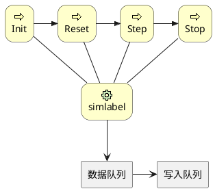
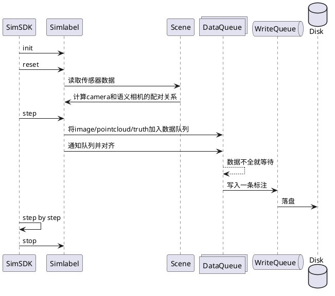

# simlabel模块

## 1. 背景

simlabel模块主要完成仿真数据的标注转换：将仿真数据转换为标注数据。在仿真过程中为模拟对象（如车辆、行人、传感器数据等）添加描述性信息。

仿真系统可以用于生成自动驾驶标注数据，这些数据对于训练和验证自动驾驶算法至关重要。通过在仿真环境中创建各种交通场景，可以收集大量有关车辆、行人、自行车等交通参与者的信息，从而为自动驾驶系统提供丰富的训练数据。

## 2. 系统结构



simlabel仿真标注模块及其与其他组件之间的关系：

1. 仿真标注模块（simlabel）继承于Simsdk，重写了Init、Reset、Step、Stop，分别表示初始化、重置、步进和停止仿真标注模块的操作。

2. 数据队列（data queue）用于存储和管理收集到的仿真数据，对队列中的仿真数据做时间戳对齐，一旦形成一组标注数据，则调用写入队列，将数据写入磁盘。

3. 写入队列（write queue）用于落盘写入图像点云文件或标签数据。

## 3. 核心机制

### 3.1 主要步骤

以下是使用仿真系统生成自动驾驶标注数据的基本步骤：

1. 创建仿真环境：根据实际道路网络和交通需求，创建一个包含道路、车辆、行人、自行车等交通参与者的仿真环境。这通常包括导入地图数据、设置交通流量、定义交通规则等。

2. 设计交通场景：在仿真环境中设计各种交通场景，如车辆跟随、变道、超车、行人穿越道路等。这些场景可以帮助自动驾驶系统学习如何在不同情况下做出正确的决策。

3. 配置传感器，添加Display模块和simlabel模块。**Display需要打开传感器数据广播（PublicMsg=true）**。

4. 运行仿真：运行仿真过程，并在过程中收集车辆、行人、自行车等交通参与者的信息。

5. 生成标注数据：将收集到的交通参与者信息转换为自动驾驶标注数据格式。

   a. 首先，每个交通参与者都有唯一的ID。

   b. 获取传感器数据，真值数据。

   c. 将交通参与者的位置、速度、方向等信息转换为标注数据中的相应字段。

   d. 添加其他必要的标注数据字段，如类别（车辆、行人、自行车等）、边界框、遮挡情况等。

6. 存储标注数据：将生成的标注数据存储在磁盘上，。

### 3.2 时间戳对齐

时间戳是仿真数据中最重要的数据，在仿真系统中，真知数据和传感器数据都包含了数据的真实时间戳，一般情况下，它要比单步时间戳要小，主要取决于仿真的触发机制（同步、异步、优先级触发）。

为了保证时间戳可以对齐：

1. 传感器的频率能被1000整除，保证触发的时间戳可以是10ms的倍数，这样可以从Display接收完整。

2. Display高级选项中（game.ini)打开LidarFrameAlign，表示lidar整帧同时渲染，相当于做好了运动补偿。

## 4. 数据库存储设计

无

## 5. 核心接口

### 5.1. 模块初始化参数：

| 参数              | 默认值                         | 含义                                                                    |
| ----------------- | ------------------------------ | ----------------------------------------------------------------------- |
| NumOfDisplay      | 30                             | 表示 Display 的个数，用于分布式多个渲染引擎所有传感器的接收             |
| DataSavePath      | /home/sim/data/display_pic_dir | 数据保存路径                                                            |
| CreateScenarioDir | true                           | 是否创建场景目录，在多个场景连续播放时，防止数据被覆盖。                |
| -device           | all                            | 指定算法id，只有绑定到该id的传感器才被读取，可以指定all，表示所有传感器 |

说明：

1. NumOfDisplay一定要覆盖Display的topic，simlabel会订阅DISPLAYSENSOR_{id}，保证接收完整

### 5.2 标注格式

[ASAM](https://www.asam.net/) (Association for Standardization of Automation and Measuring Systems) [OpenLABEL](https://www.asam.net/index.php?eID=dumpFile&t=f&f=4566&token=9d976f840af04adee33b9f85aa3c22f2de4968dd#sec-0c3aa8d0-0340-439f-a45e-4e63c1124b41) 是一个开源的数据标注和语义描述规范，用于自动驾驶和智能交通系统领域。它提供了一种通用、灵活且可扩展的数据标注和描述方法，以便在不同的应用程序、工具和算法之间实现互操作性。

ASAM OpenLABEL 的主要特点和优势包括：

1. 通用性：适用于各种自动驾驶和智能交通系统相关的传感器数据，如激光雷达、雷达、摄像头等。
2. 灵活性：支持多种数据类型和标注方法，如目标检测、目标跟踪、图像分割、语义分割等。
3. 可扩展性：允许用户定义自己的标签和属性，以满足特定需求。
4. 易于集成：与其他ASAM标准（如ASAM OpenDRIVE、ASAM OpenSCENARIO等）兼容，便于在不同工具和系统之间共享数据。
5. 易于使用：提供易于理解的数据结构和格式，便于用户创建、编辑和共享标注数据。

ASAM OpenLABEL 标准的目标是促进自动驾驶和智能交通系统领域的创新和协作，提高数据标注和描述的效率和质量。通过采用这一标准，研究人员、开发人员和工程师可以更容易地共享和重用数据，从而加速自动驾驶技术的发展。

本模块的数据包含图像和点云标注两部分：

1. 图像标注：包含普通相机图像和语义图像，均可以生成对应的OPenLabel文件，包含了每个目标的2D多边形。
2. 点云标注：生成每个目标的3D包围框

## 6. 主要业务时序



SimSDK与仿真标注模块（Simlabel）之间的交互过程：

1. SimSDK向仿真标注模块（Simlabel）发送初始化（init）请求。

2. SimSDK向仿真标注模块（Simlabel）发送重置（reset）请求。

3. 仿真标注模块（Simlabel）读取传感器配置（Scene）。

4. 场景（Scene）计算相机和语义的配对关系，并返回给仿真标注模块（Simlabel）。

5. SimSDK向仿真标注模块（Simlabel）发送步进（step）请求。

6. 仿真标注模块（Simlabel）将图像、点云和真实数据推送到数据队列（DataQueue）中，并通知并整理数据。

7. 如果数据队列（DataQueue）无法合成数据，则等待。

8. 数据队列（DataQueue）将标签写入写入队列（WriteQueue）。

9. 写入队列（WriteQueue）将标签数据保存为文件（Disk）。

10. SimSDK逐步执行以上过程（step by step）。

11. SimSDK向仿真标注模块（Simlabel）发送停止（stop）请求。

这个序列图展示了仿真标注模块内部数据处理过程以及队列的交互过程。

## 7. 数据埋点

无

## 8. 日志格式

>***timestamp***: [***display_id***, ***sensor timestamp***：***buffer size***, ......],[......]

* timestamp：当前时间戳
* display_id: Display topic id
* sensor timestamp：传感器的时间戳
* buffer size：传感器数据长度


## 9. 代码结构

| FILE            | Describe       |
| --------------- | -------------- |
| label.cpp       | label模块      |
| data_queue.cc   | 数据队列及线程 |
| thread_queue.cc | 落盘队列及线程 |

## 10. 开发调试与发布

确保安装cmake，执行以下编译步骤：

1. mkdir build
2. cd build
3. cmake ..
4. make

推荐使用vscode调试代码：

1. 用vscode打开目录
2. cmake工具编译代码
3. 配置launch.json:

    ```json
    {
        "version": "0.2.0",
        "configurations": [
            {
                "type": "lldb",
                "request": "launch",
                "name": "Debug",
                "program": "/修改为你的路径/txsim-module-launcher",
                "args": [
                    "simlabel(Tadsim配置的模块名字)",
                    "${workspaceFolder}/build/lib/sim-label.so",
                    "127.0.0.1:21302"
                ],
                "env": {
                    "LD_LIBRARY_PATH": "/home/root/TAD_Sim/buildin/simdeps/:$LD_LIBRARY_PATH"
                },
                "cwd": "${workspaceFolder}"
            }
        ]
    }
    ```

4. 配置Tadsim，添加一个非自动启动的模块
5. Debug and enjoy.
