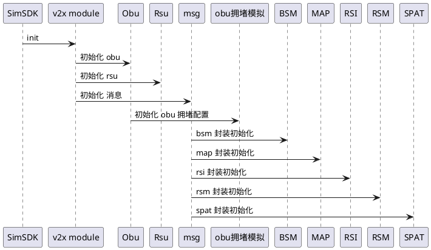
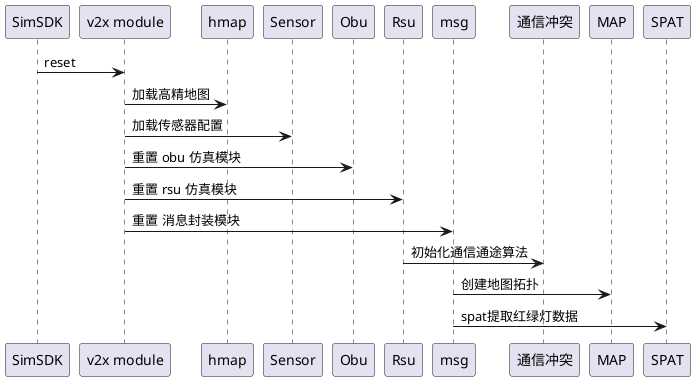
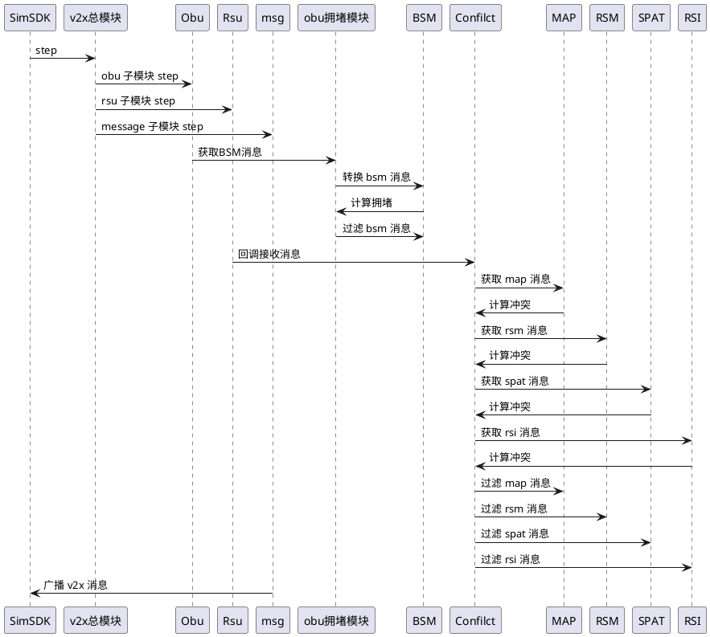

# V2X模块

## 1. 背景

车辆自动驾驶和车联网技术是其重要组成部分。车辆自动驾驶需要实时获取周围环境信息，以便做出正确决策。车联网技术通过车辆之间（Vehicle-to-Vehicle, V2V）和车辆与基础设施之间（Vehicle-to-Infrastructure, V2I）的通信，实现信息的实时共享，从而提高道路交通安全和效率。这两者结合形成了车辆通信（Vehicle-to-Everything, V2X）技术。

V2X技术的发展和应用具有重要意义：

1. 提高交通安全：V2X通信可以帮助车辆获取更多的周围环境信息，提前发现潜在危险，从而降低交通事故发生的概率。

2. 提高道路利用效率：V2X通信可以实现车辆与交通信号灯等基础设施的信息互通，提高道路通行效率，减少拥堵现象。

3. 减少能源消耗和环境污染：V2X技术有助于车辆实现更加节能环保的驾驶，从而降低能源消耗和减少环境污染。

4. 促进智能交通系统的发展：V2X技术是实现智能交通系统的关键技术之一，对于智能交通系统的发展具有推动作用。

V2X仿真模块主要包括以下内容，用于验证V2X技术的有效性和可靠性：

1. 交通流仿真：再交通流仿真的基础上，模拟交通车量的 v2x 消息的通信。

2. 通信仿真：通过模拟V2X通信过程，分析通信性能，例如通信延时、丢包率等，以验证V2X通信的可靠性和稳定性。

3. 消息预设：支持用户自定义消息注入。


总之，V2X仿真可以帮助用户更好地理解V2X技术的性能和实际应用效果，为V2X技术的进一步发展提供有力支持。

## 2. 系统结构

<div align="center"></div><br>

目前系统主要的消息为V2X最常用的5种：BSM、RSM、RSI、SPAT和MAP消息。

系统包含多个数据流：

* 交通车-->BSM
* 交通灯-->SPAT
* 高精地图-->MAP
* 消息注入-->RSI/BSM/SPAT/MAP/RSM
* 交通车-->RSM

1. BSM（Basic Safety Message）：BSM是一种用于传递车辆基本安全信息（如车速、位置和方向）的消息。这种消息通常用于广播车辆状态和行驶信息，以帮助其他道路用户了解周围车辆的情况，从而提高道路安全。
Tadsim中交通流，可以配置交通车位置、类型、速度、驾驶行为、交通信号等配置，也可以打开它的OBU配置，表示该车辆具有V2X功能，可以发送BSM消息。

    a. 首先，每辆车具有唯一的ID。

    b. 将车辆的位置、速度、加速度等信息转换为BSM消息中的相应字段。例如，将车辆的经纬度坐标转换为BSM消息中的位置字段，将车辆的速度转换为BSM消息中的速度字段等。

    c. 添加其他必要的BSM消息字段，如消息发送时间、车辆尺寸等。

1. RSM（Roadside Sensor Message）：RSM是一种用于车辆与基础设施通信（V2I）的消息格式，用于传输路侧感知设备（如雷达、摄像头、激光雷达等）检测到的车辆和非机动车信息。RSM消息可以帮助车辆了解周围环境中其他车辆和非机动车的位置、速度等信息，从而做出更加智能和安全的驾驶决策。

    a. 首先，每辆车具有唯一的ID。

    b. 根据路测设备的配置，筛选出该视野范围内车辆。

    c. 根据RSU配置，融合多个感知设备的车辆数据。

    d. 将车辆和非机动车的位置、速度等信息转换为RSM消息中的相应字段。例如，将车辆的经纬度坐标转换为RSM消息中的位置字段，将车辆的速度转换为RSM消息中的速度字段等。

    e. 添加其他必要的RSM消息字段，如消息发送时间、设备类型等。

2. RSI（Roadside Information）：RSI是一种路侧信息消息，用于车辆与基础设施通信（V2I）。RSI消息包含道路状况、交通事件、天气信息等，用于提供实时的道路信息，帮助车辆做出更加智能和安全的驾驶决策。向周围车辆发送安全停车消息的消息。当车辆检测到前方有停车需求时，如交通拥堵、事故等，SPAT信息可以立即传递给附近的车辆，提醒他们减速或绕行。

3. SPAT（Signal Phase and Timing）：SPAT是一种信号相位与定时消息，用于车辆与基础设施通信（V2I）。SPAT消息包含交通信号灯的状态和定时信息，用于帮助车辆了解即将发生的信号相位变化，从而做出更加智能和安全的驾驶决策。

    a. 为每个交通信号灯分配一个唯一的ID。

    b. 将信号相位和定时信息转换为SPAT消息中的相应字段。例如，将信号灯的红绿灯状态转换为SPAT消息中的信号状态字段，将信号灯的剩余时间转换为SPAT消息中的剩余时间字段等。

    c. 添加其他必要的SPAT消息字段，如消息发送时间、信号控制策略等。

4. MAP（Map Data）：MAP是一种地图数据消息，用于车辆与基础设施通信（V2I）。MAP消息包含道路网络的几何信息、车道信息、交通信号灯位置等，用于提供精确的道路信息，支持车辆导航和自动驾驶等应用。

    a. 提取高精地图数据中的关键信息，如道路几何形状、车道标线、交通信号灯位置等。这些信息将用于生成MAP消息。

    b. 将每个section转换为node数据。

    c. 转换lane、link、geometry等数据。

    d. 建立拓扑结构。

    e. 将道路几何形状、车道标线等信息转换为MAP消息中的相应字段。

## 3. 核心机制

### 3.1 通信仿真

二进制指数退避是目前应用最广泛的物理层通信协议，在V2X场景中也不例外。当多个设备同时尝试访问同一网络资源时，可能会发生冲突，导致数据包丢失。为了避免这种情况，二进制指数退避算法可以让设备等待一段随机时间再尝试发送数据包，从而减少冲突的概率。

具体来说，当一个设备发现发送的数据包发生了冲突（即发送失败），它会等待一个随机的时间段，然后再次尝试发送。如果这次发送仍然失败，设备会等待一个更长的时间段，这个时间段是前一个时间段的两倍。每次发送失败后，设备会根据一定的规则计算下一个等待的时间段，直到发送成功为止。

这个算法中的退避时间是根据二进制指数增长的，也就是等待时间会以指数级别增加。这样做的好处是，当冲突发生时，设备会等待越来越长的时间，从而减少冲突的概率。同时，由于等待时间是随机的，不同设备的等待时间不同，这样可以避免多个设备同时尝试发送数据包，从而减少冲突的发生、提高数据传输的可靠性和效率。

### 3.2 丢包

### 3.2.1 丢包类型

1. 碰撞丢包（Collision）：每个设备仅与自身周围200米内的其他设备竞争信道，这个距离称为该设备的碰撞考虑范围，当主车两侧都在主车200米内的两台设备不在彼此的碰撞考虑范围内时，他们同时向主车发送数据则导致同一时刻主车接收到两个数据包，即发生碰撞，信号差的数据包将被丢弃。在数值统计中该丢包具有最高优先级。

2. 尝试次数过多（Try Too Much）：在避免碰撞的过程中，竞争信道失败则会退避一次，同一数据包退避次数超过上限则会丢弃。

3. 队列丢弃（Queue Drop）：每台设备可以维持的发送队列有限，当队列已满，又来了新的数据，则会丢弃队列 front 的数据包，即丢弃最老的数据包。

4. 距离丢包（Distance Drop）：因为距离的不同导致信号质量不同，信号的好坏对应了最基本的丢包率，该丢包模拟会在以上三种丢包都未出现的数据包里做一次处理以拟合实际按距离传输的失败率曲线。该曲线由距离和不同信道建模对应的信噪比模型确定。

#### 3.2.2 距离丢包逻辑

1. m_attenuation_model_type：依照距离丢包的衰减计算方式，0-线性衰减；1-指数衰减；默认线性衰减。

2. m_base_number：指数衰减情况下的底数，大于等于2，默认为2。

3. 以上两个数值可以通过：SetAttenuationModelType（）；SetBaseNumber（）；两接口修改。

### 3.3 模块运行流程说明

1. SimConfilctAlg::getInstance().PopReceivedObuMessage()：主车如有接收到的信息，首先读取接收到的信息

2. sim_received_obus：读取到该变量内，并处理

3. SimConfilctAlg::getInstance().UpdateEgoCarPosition(loc)：更新主车的位置数据

4. SimConfilctAlg::getInstance().PushObuMessage(sim_obus)：频率控制后，按照要求频率push新数据到模拟算法的发送队列

## 4. 数据库存储设计

无

## 5. 核心接口

### 5.1 接入方法

无论是v2xonly应用仿真还是v2x与智驾融合应用仿真，需要用户算法使用我们的提供的txsimSDK接入仿真系统。txsimSDK提供方法收发仿真系统的消息以算法接入接口，用户不需要关心数据链路的传输以及pb数据的序列化和反序列化。

在 Adapter 里，提供了两个函数：分别实现了 pb 结构体的获取和 ASN.1序列号数据，用户按照需求调用。

### 5.2 配置

#### 5.2.1 Obu配置

| 名称             | Name               | 默认值    | 范围                                  | 含义                                 |
| ---------------- | ------------------ | --------- | ------------------------------------- | ------------------------------------ |
| BSM发送频率      | FrequencyBSM       | 10        | [0~100]                               | 0表示关闭                            |
| 空旷通信距离     | DistanceOpen       | 800       | [100~1000米]                          | 空旷通信距离                         |
| 城市通信距离     | DistanceCity       | 300       | [10~500米]                            | 城市通信距离                         |
| 频段             | Band               | 5905-5925 | 5905-5915，5915-5925，5905-5925三选一 |
| 传输速率         | Mbps               | 10        | [0.1~100Mbps]                         | 带宽，会影响拥堵时的延时             |
| 系统延时         | SystemDelay        | 10        | [0~1000ms]                            | 系统固定延时                         |
| 通信延时         | CommuDelay         | 20        | [0~1000ms]                            |
| 关键事件立即触发 | TriggerImmediately | True      | True，False                           | 打开时，不遵守频率，立即发送         |
| 定位精度         | PosAccuracy        | 0.5       | [0.1~10米]                            | 按照布朗运动规则，对定位精度添加偏移 |
| 禁止组队         | NoTeam             | False     | True，False                           | 禁用时，不接受其他车发送的BSM        |
| 关闭RSU通信      | DisableRSU         | False     | True，False                           | 禁用时，不接受RSU的消息              |
| BSM预设          | PreBSM             |           |                                       | 导入外部文件，用于消息体的预定义     |

#### 5.1.2 Rsu 配置

| 名称             | Name                 | 默认值    | 范围                                       | 含义                                                            |
| ---------------- | -------------------- | --------- | ------------------------------------------ | --------------------------------------------------------------- |
| SPAT发送频率     | FrequencySPAT        | 10        | [0~100]                                    | 发送频率，0表示不发送                                           |
| RSM发送频率      | FrequencyRSM         | 10        | [0~100]                                    | 发送频率，0表示不发送                                           |
| RSI发送频率      | FrequencyRSI         | 10        | [0~100]                                    | 发送频率，0表示不发送                                           |
| MAP发送频率      | FrequencyMAP         | 10        | [0~100]                                    | 发送频率，0表示不发送                                           |
| 通信距离         | DistanceCommu        | 300       | [10~2000米]                                | 通信距离                                                        |
| 频段             | Band                 | 5905-5925 | （5905-5915，5915-5925，5905-5925三选一 ） |
| 传输速率         | Mbps                 | 100       | [0.1~1000Mbps]                             | 带宽，会影响拥堵时的延时                                        |
| 最大延时         | MaxDelay             | 100       | [0~1000ms]                                 | 最大延时，和拥堵调节配合使用，超过最大延时则考虑拥堵调节        |
| 地图半径         | MapRadius            | 1000      | [10~2000米]                                | MAP消息中地图范围                                               |
| 路口ID           | JunctionIDs          |           | 可多选                                     | MAP消息中的路口数据，如果不指定，则按照地图半径内包括的路口发送 |
| 关键事件立即触发 | TriggerImmediately   | True      | True，False                                | 打开时，不遵守频率，立即发送关键事件                            |
| 拥堵调节         | CongestionRegulation | True      | True，False                                | 打开是，如果车辆太多，造成拥堵，会降低发送频率，保证低延时      |
| 云协同(V2N)      | V2N                  | False     | True，False                                | rsu联网，提升数据预警能力范围，比如关键事件                     |
| 车路协同(V2I)    | V2I                  | False     | True，False                                | 禁用BSM，不接收obu数据                                          |
| 消息预设         | PreMSG               |           |                                            | 导入外部文件，用于消息体的预定义                                |

## 6. 主要业务时序

### 6.1 初始化



V2X模块、OBU（车载单元）、RSU（路侧单元）和各种V2X消息（BSM、MAP、RSI、RSM、SPAT）之间的初始化过程。

1. SimSDK向V2X模块发送初始化请求。

2. V2X模块分别向OBU、RSU和消息模块发送初始化请求。

3. OBU初始化OBU拥堵配置（obu congestion config）.

4. 消息模块分别初始化BSM、MAP、RSI、RSM和SPAT消息。

这个序列图展示了一个V2X系统的初始化过程，包括车载单元、路侧单元和各种V2X消息的初始化。

### 6.2 场景重置



SimSDK与V2X模块、OBU（车载单元）、RSU（路侧单元）和各种V2X消息（MAP、SPAT）之间的重置过程：

1. SimSDK向V2X模块发送重置请求。

2. V2X模块加载高精度地图（hdmap）和传感器（sensors）。

3. V2X模块分别向OBU、RSU和消息模块发送重置请求。

4. RSU初始化通信冲突算法（conflict algorithm）。

5. 消息模块创建MAP拓扑（map topo）并重置SPAT消息。

这个序列图展示了一个V2X系统的重置过程，包括车载单元、路侧单元和各种V2X消息的重置。

### 6.3 单步



SimSDK与V2X模块、OBU（车载单元）、RSU（路侧单元）和各种V2X消息（BSM、MAP、RSI、RSM、SPAT）之间的步进过程：

1. SimSDK向V2X模块发送步进请求。

2. V2X模块分别向OBU、RSU和消息模块发送步进请求。

3. OBU拥堵模块（obu congestion）请求BSM。

4. OBU拥堵模块从BSM和用户消息中计算拥堵情况，并过滤BSM和用户消息。

5. RSU的冲突模块（Conflict）请求接收到的消息。

6. 冲突模块从MAP、RSM、SPAT和RSI消息中计算冲突，并过滤这些消息。

7. 消息模块将V2X消息发布到SimSDK。

8. 用户消息发布到SimSDK。

这个序列图展示了一个V2X系统的步进过程，包括车载单元、路侧单元和各种V2X消息的处理。

## 7. 数据埋点

无

## 8. 日志格式

v2x模块把发送出来的消息集以树状json文件的形式保存到磁盘


## 9. 代码结构

```
------------------
│  base.cpp                       //模块基类，接口
│  CMakeLists.txt                 //CMake定义
│  hmap.cpp                       //高精地图功能接口
│  kdtree_flann.h                 //knn搜索库
│  msg.cpp                        //消息接口
│  obu.cpp                        //obu业务逻辑
│  rsu.cpp                        //rsu业务逻辑
│  sensors.cpp                    //传感器接口
│  v2x.cpp                        //主模块定义
│                                 //
├─asn1msg                         //v2x消息转换
│      asn1msg.h                  //消息基类
│      asn1msg_bsm.h              //bsm消息
│      asn1msg_bsm2020.cpp        //bsm 2020版本
│      asn1msg_map.h              //map消息
│      asn1msg_map2020.cpp        //map 2020版本
│      asn1msg_rsi.h              //rsi消息
│      asn1msg_rsi2020.cpp        //rsi 2020版本
│      asn1msg_rsm.h              //rsm消息
│      asn1msg_rsm2020.cpp        //rsm 2020版本
│      asn1msg_spat.h             //SPAT消息
│      asn1msg_spat2020.cpp       //SPAT 2020版本
│      merge_proto.h              //消息注入功能
│                                 //
├─pblog                           //pblog落盘功能
│      tx_sim_log_common.cpp      //基础定义
│      tx_sim_logger.cpp          //落盘逻辑
│      tx_sim_log_queue.cpp       //队列逻辑
│                                 //
├─sensor                          //
│      camera_sensor.cpp          //Camera处理逻辑
│      fov_filter_sensor.cpp      //Sensor基类
│      lidar_sensor.cpp           //Lidar处理逻辑
│      obu_sensor.cpp             //Obu配置和处理逻辑
│      radar_sensor.cpp           //Radar处理逻辑
│      rsu_sensor.cpp             //Rsu配置和处理逻辑
│                                 //
├─sim_algorithm                   //通信仿真
│      sim_base.cpp               //基础接口
│      sim_conflict_alg.cpp       //冲突模拟逻辑
│      sim_obu_congestion.cpp     //obu拥堵逻辑
│      sim_rsu_congestion.cpp     //rsu拥堵逻辑
│                                 //
├─tests                           //测试代码
│      asnconvert.cpp             //消息转换测试
│      asnexample.cpp             //调试
│      v2x_test.cpp               //调试
│                                 //
└─utils                           //
        utils.cpp                 //工具类

```

## 10. 开发调试与发布

完成仓库的依赖安装之后，执行以下编译步骤：

1. mkdir build
2. cd build
3. cmake ..
4. make

推荐使用vscode调试代码：

1. 用vscode打开目录
2. cmake工具编译代码
3. 配置launch.json:

    ```json
    {
        "version": "0.2.0",
        "configurations": [
            {
                "type": "lldb",
                "request": "launch",
                "name": "Debug",
                "program": "/修改为你的路径/txsim-module-launcher",
                "args": [
                    "v2x_clone(Tadsim配置的模块名字)",
                    "${workspaceFolder}/build/lib/libtxsim-v2x.so",
                    "127.0.0.1:21302"
                ],
                "env": {
                    "LD_LIBRARY_PATH": "/home/root/TAD_Sim/buildin/simdeps/:$LD_LIBRARY_PATH"
                },
                "cwd": "${workspaceFolder}"
            }
        ]
    }
    ```

4. 配置Tadsim，添加一个非自动启动的模块
5. Debug and enjoy.
