Traffic模块Readme
-------------------------
# 1、背景

在自动驾驶系统的测试验证开发过程中需要对各种交通情况进行模拟仿真。 为了构建此类模拟仿真环境， 设计开发了交通流模拟器。 它的设计目标是为自动驾驶系统提供一个高保真、 可重复、 可度量、可对比、 可评价、 可预测、 可增强的虚拟仿真验证环境。

交通流模拟器支持业界主流的场景数据格式（OpenScenario， OpenDrive） ， 提供自动驾驶领域主流控制模式（开环、 闭环、 混合） ， 支持交通流模型， 支持多种交通元素， 支持特定交通灯（组） 相位周期， 支持交通交互事件触发， 提供交通场景运行属性统计能力。

模拟器的设计采用了面向对象技术（OOP）。

交通流模块可以运行在支持x86架构的工作站主机上（Windows、 Linux）。

系统使用ANSI C++14开发， 编译， 调试。

使用Git，CMake管理、组织工程。

Traffic模组配置时序图

<div align="center">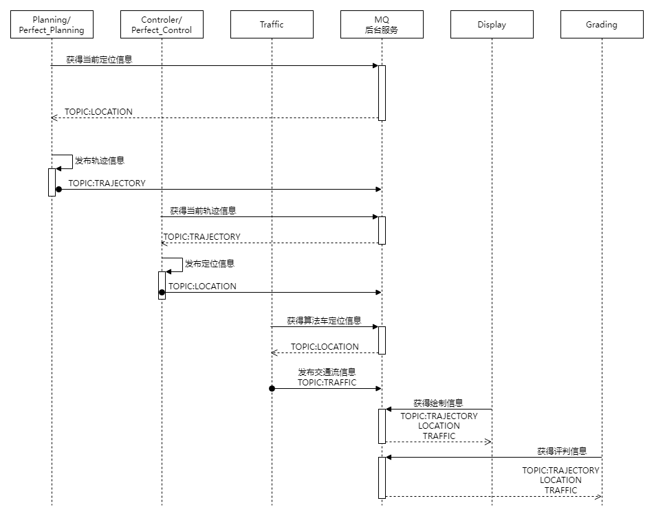</div><br>


# 2、系统结构


## 2.1、要点概述

### 2.1.1 Traffic交通引擎功能体系

<div align="center">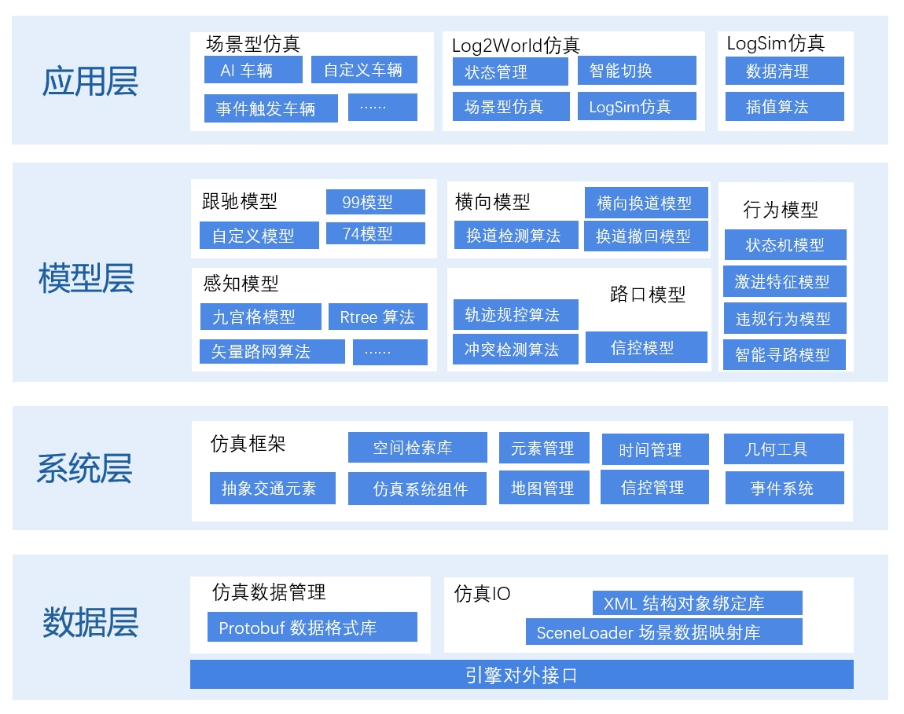</div><br>

### 2.1.2 Traffic交通引擎功能组织结构

<div align="center">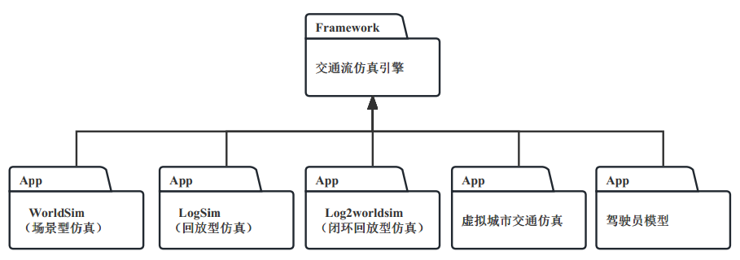</div><br>

<div align="center">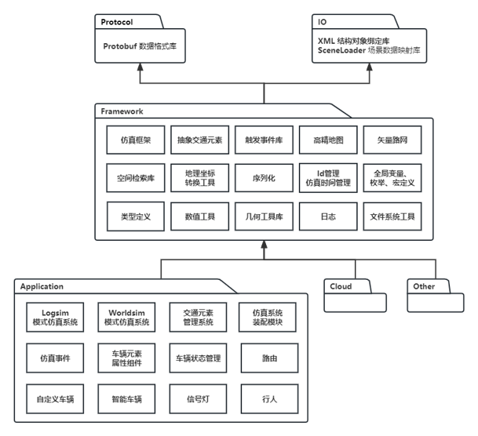</div><br>

如上图所示，交通流引擎采用基于构件设计结构将不同的功能独立成库（Library），通过模块的组合实现不同的应用层逻辑。其中：

- Protobuf支持Message Queue系统集成方式
- IO提供XML文件结构到C++数据数据映射绑定
- Framework提供仿真调用流程和基础功能
- Application提供面向仿真业务的功能，如：Worldsim、Logsim、Log2worldsim、虚拟城市、驾驶员模型等。

### 2.1.3 Traffic交通引擎集成方式

<div align="center"></div><br>

TADSim仿真平台采用了基于仿真功能接口模型、跨语言、平台无关的分布式协同仿真框架，平台中各组件之间通过消息队列协议提供的标准化工作流进行能力集成和连续的数据交换。

如上图所示，用户通过对被测试算法（比如：规划功能）进行基于功能接口模型封装获得集成到TADSim仿真平台的能力。用户也可以通过选择仿真平台自带的预设功能与被测算法一起组成测试系统，进行功能测试验证。

### 2.1.3 主要模块说明

| 序号  | 模块名称     | 功能描述                                                                                                             |
| :---: | :----------- | -------------------------------------------------------------------------------------------------------------------- |
|   1   | 场景加载     | 读取OpenScenario，OpenDrive格式的场景文件，将场景元素及其包含属性进行组织                                            |
|   2   | 高精地图     | 根据交通流模拟器对高精地图信息的需求，建立统一的功能接口，将业务与地图接口解耦                                       |
|   3   | 交通元素管理 | 管理场景中元素（包含Ego）的生命周期，索引检索。支持大规模场景的快速检索（多线程，Entity  Component System），场景快照 |
|   4   | 信号灯       | 信号灯相位周期系统，支持固定相位周期，未来支持路测数据提取，路测事件触发等方式                                       |
|   5   | 场景事件系统 | 支持OpenScenario中定义的事件，场景元素属性的绝对/相对值事件                                                          |
|   6   | 轨迹控制     | 支持参考线驱动、支持智能行为、用户自定义                                                                             |
|   7   | 矢量路网     | 提供交通元素与路网拓扑结构建立对应关系，支持查询                                                                     |
|   8   | 场景区域管理 | 场景级别的开始，结束，路口，停止线区域的描述                                                                         |
|   9   | 仿真框架     | 交通流运行流程管理，提供init，reset，step，stop阶段                                                                  |
|  10   | 路由         | 提供道路级路由计算 A-Star                                                                                            |

### 2.1.4 任务执行过程

<div align="center">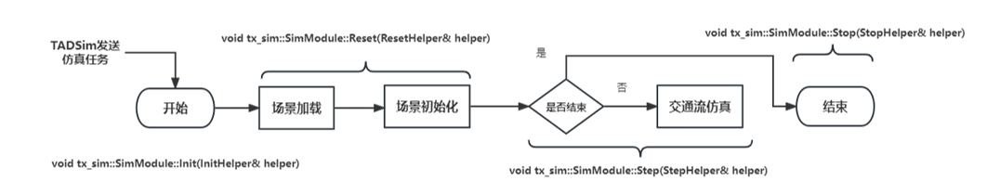</div><br>

<div align="center">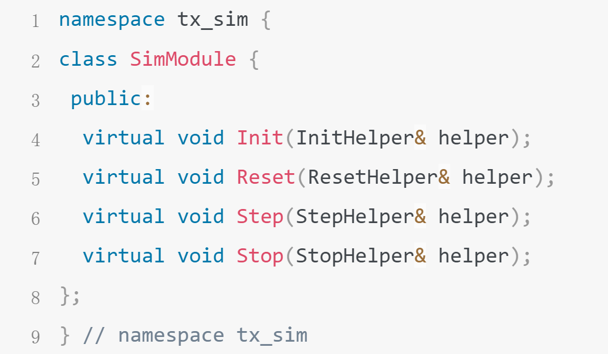</div><br>

## 2.2 场景型交通流仿真

### 2.2.1 概述

支持符合Openscenario标准的场景描述文件作为场景型交通流仿真的输入，将各类场景元素（车辆、行人、路障等）建模为交通智能体（Agent），在OpenDrive标准高精度地图路网上建立连续的运动参数化表达。执行场景文件中的信控配置，建模交通灯信号序列。将场景文件中的事件（Event）建模，纳入场景型交通流仿真事件触发流程。

<div align="center">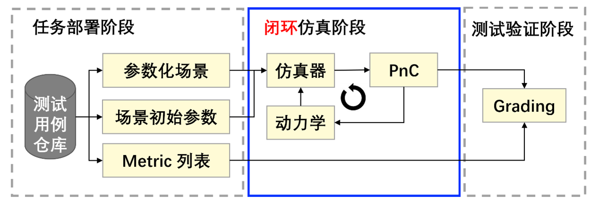</div><br>

### 2.2.2 特点

- 严格按照用户定义生成测试场景，支持复杂交通场景。
- 闭环仿真，根据当前被测模块输出更新场景内容与被测模块进行交互。

### 2.2.3 相关组件

WorldsimSimLoop类 ： 场景型交通流仿真全链路调度逻辑。

TAD_StandAlone_TrafficElementSystem类 ：交通系统类，包含场景中交通元素的仿真管理。

TAD_UserDefined_VehicleElement类 ：支持用户自定义事件触发功能的车辆类型。

TAD_AI_VehicleElement类 ：智能交通车辆类型。

TAD_PedestrianElement类 ：行人类型

TAD_ObstacleElement类 ：静态障碍物类型

TAD_SignalLightElement类 ：信号灯类型

txEventDispatcher_v_1_0_0_0类 ：场景事件触发管理

TAD_SceneEvent_1_0_0_0类 ：场景事件类（时间触发、条件触发等）

## 2.3 回放型开环仿真

### 2.3.1 概述

支持路测真实数据的开环回放型仿真系统。首先，实现基于路测数据生成仿真场景能力，在路测采集的基于时间切片的topic离散数据上建立了连续的空间表达。其次，将路测采集的感知输出数据在仿真环境中进行回放，还原路测环境的时间步和数据发送频率（包括：漏帧，时延，错序）。解决由于路测数据时间步不统一在基于流控的仿真运行时环境中无法进行规整时间步的发送问题。

<div align="center">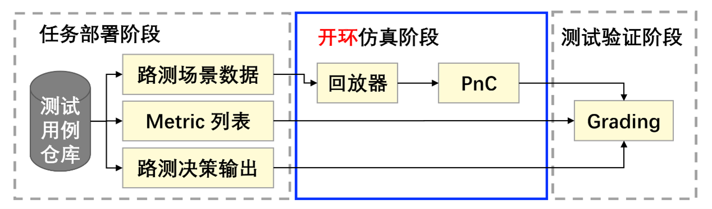</div><br>

### 2.3.2 相关组件

InterpolatePlayerModule类 ：实现了开环回放

## 2.4 Log2worldsim

### 2.4.1 概述

将路测收集的感知输出数据在仿真环境中进行重建，生成准确反映实际路测路况的场景，在交通流系统中使用闭环跑法对规划控制（PnC）模块进行测试和验证。旨在搭建一个基于路测数据且支持闭环跑法的高保真虚拟仿真环境。在虚拟仿真环境中，通过选择重建好的场景，用户可以高效地对规划控制算法的行为进行测试和验证。

Log2worldsim功能在运行初始，通过xosc文件（转换成内部simrec文件）接收路采交通数据，对交通数据的空间属性和时间属性进行重建，得到与路采数据一致的虚拟仿真交通场景，并随着不断接收的路采交通数据，热更新目标交通场景。在切换条件满足时（时间触发），Log2worldsim功能将数据驱动仿真模式切换到模型驱动仿真模式，保证切换过程中，交通元素状态平顺。在模型驱动仿真过程中，系统根据配置对交通状态进行针对性模拟预测，为使用者提供有针对性的交通场景进行功能开发和策略评估等。

<div align="center">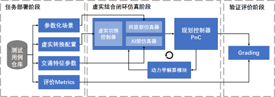</div><br>

### 2.4.2 相关组件

Log2WorldSimLoop类 ：L2W场景仿真全链路调度逻辑

Log2WorldSystem类 ：L2W仿真系统管理

L2W_AssemblerContext类 ：L2W元素创建管理上下文

L2W_VehicleElement类 ：L2W支持回放和仿真能力车辆类型

## 2.5 虚拟城市交通流

### 2.5.1 概述

通过提供车流分布控制组件，为虚拟城市提供符合用户想定的交通流。

支持分布式仿真模式（基于大地图分块），支持车辆跨分布式节点迁移协议，提供大规模交通流仿真能力。

### 2.5.2 车流分布控制组件

#### 出车口 vehicleInput

系统会根据出车口位置，在所涉及车道生成用户指定的车辆。

#### 收车口vehicleExit

系统会根据收车口位置，对进入收车区域的车辆结束生命周期并释放资源。

#### 车辆组件vehicleComposition

针对出车口，生成车辆类型的百分比信息。

#### 车辆行为behaviors

针对生成的车辆，车辆的行为参数。

#### 路由组routeGroups

针对路网，设置路由设置区域，对进入路由设置区域的车辆进行基于概率的路由重置操作。

### 2.5.3 跨区迁移协议

<div align="center">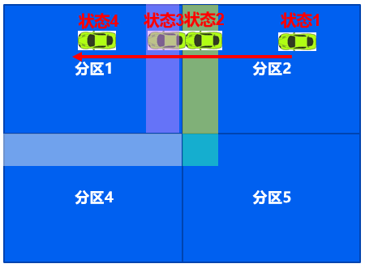</div><br>

状态1：车辆归属分区2，能被分区2内元素所见

状态2：车辆归属分区2，能被分区1、分区2内元素所见

状态3：车辆归属分区1，能被分区1、分区2内元素所见

状态4：车辆归属分区1，能被分区1内元素所见

### 2.5.4 相关组件

TrafficCloud::TrafficManager类 ：与云端仿真基础设施（RegionManager）交互接口（init、step等），实现车辆跨区注册协议。

CloudTrafficElementSystem类 ：分布式节点中交通流系统管理

TAD_Cloud_AssemblerContext类 ：实现了车流分布控制功能


# 3、核心机制
## 3.1、周车感知

### 3.1.1 周车信息建模方式:

- Rtree – boost rtree
  <div align="center">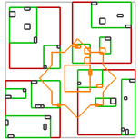</div><br>
<br />
&emsp;&emsp;Rtree（Boost Rtree）是一种空间索引数据结构，用于存储和管理多维空间对象，如点、线、矩形等。其中R树是一种多级平衡树，是B树在多维空间上的扩展。在R树中存放的数据并不是原始数据，而是这些数据的最小边界矩形，空间对象的边界矩形包含于R树的叶结点中。在车辆空间拓扑管理中，Rtree将车辆的矩形包围盒存储在数据结构中，可以高效地检索和更新车辆的位置信息。
<br />

- 矢量路网

<div align="center">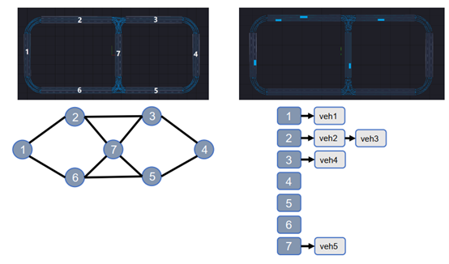</div><br>
<br />
&emsp;&emsp;在大规模交通流仿真中，系统基于性能的考虑采用了矢量路网结构来管理车辆元素的空间信息。矢量路网是道路系统的数据结构，通常由路段和路段关系组成。基于高精地图，构建道路间的拓扑关系，这包括确定道路的上游和下游道路、相邻车道等信息；随着车辆的运动，需要实时更新车辆在矢量路网中的位置拓扑。当车辆通过路口或变换车道时，也需要更新车辆的拓扑关系，例如切换到新的道路或车道。矢量路网结构对交通元素进行管理有很多优点，比如提供并发查询检索；也可以将一般的全局查询模式，优化成局部、拓扑相关的查询，极大提高了空间信息计算的效率。


### 3.1.2 周车信息组织方式—九宫格

<div align="center"></div><br>

&emsp;&emsp;仿真车辆在进行跟驰和换道操作时，需要对周边的交通车流环境进行评估，并据此做出相应的反应。其中对周边车流的评估主要依赖于下图所示的"九宫格"，即以本车（图中绿色车）为中心，在Frenet坐标系(S-T)下，沿着本车车头和车尾包络线的最外沿做两条平行线，这两条平行线和车辆所在的车道中心线方向相垂直，这两条平行线和车辆所在车道的左右两条分隔线共同将车辆所在平面划分出一个虚拟的"九宫格"，并将本车置于其中的中心格位置。四周的8个栅格按顺时针排列依次是正前方，右前方，右侧，右后方，正后方，左后方，左侧，左前方。当周边车辆的中心点位于对应栅格时，则将其视为本车相应方向上的周边车辆。如果有多辆车位于同一栅格内，则取距离本车最近的车作为对应周边车辆。如图所示，本车正前方有车辆1和2，其中车辆1距离本车较近，则车辆1为本车的正前方车辆。车辆左后方有车辆8和7，其中车辆8距离本车较近，则车辆8为本车的左后方车辆。图中的车辆4，5，6，3分别为本车的右前方，右侧，正后方和左前方车辆。

## 3.2、 跟驰

<div align="center">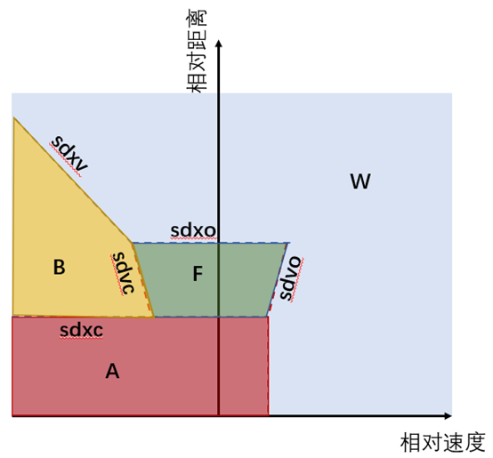</div><br>

```txt
算法输入：

    1. 前车速度、加速度
    2. 自车速度、加速度
    3. 前车与自车的距离

算法执行：

	Wiedemann99--心理物理模型

算法输出：

	自车加速度
```

&emsp;&emsp;TAD Sim中的交通流模型属于微观模型，它以驾驶员-车辆单元为基本实体。该模型的纵向行驶行为是以Wiedemann博士的生理一心理跟驰模型为基础。主要考虑驾驶人对引导车刺激的视觉感知和反应特性，认为当引导车几何外形在视网膜上投影夹角的变化率超过一定阀值时，驾驶人才能感知察觉引导车行驶速度的改变（即速度差发生明显变化）。一旦引导车几何外形的变化率超过该阀值，驾驶人即会采取相应驾驶措施，直至无法感知引导车行驶速度的变化。另外，距离的明显改变亦能够引起驾驶人的注意，即当跟随车与引导车的车间距超过一定可感知的距离变化幅度后，驾驶人能够察觉引导车与自身的距离发生改变。基于以上观点，将驾驶员的行驶状态划分为四种类型(自由行驶→接近→跟驰→紧急制动)，如图所示。
- W-"自由行驶"：跟随车与引导车之间的车间距较大，跟随车驾驶人不会受到前方引导车行驶状态改变的影响，通常按照自身的期望速度自由行驶。
- F-"接近"：跟随车驾驶员减慢车速，以适应引导车的车速。当跟随车接近引导车时，跟随车驾驶员刹车减速以便达到他的期望安全距离。
- B-"跟驰"：该行驶状态下的跟随车驾驶人难以直接感知与相邻引导车的速度差大小，即当速度差小于一定阀值时，跟随车驾驶人认为自身行驶速度与引导车行驶速度较为接近。另外，稳定跟驰状态下跟驰距离不会发生明显变化，即跟驰距离不会明显偏离驾驶人的期望跟驰距离。当满足以上条件时，跟随车驾驶人根据驾驶经验潜意识地操纵车辆使其与引导车的速度差和跟驰距离维持在一定可接受范围内，并尽可能接近自身期望速度和跟驰距离。
- A-"紧急制动"：当前后车的间距小于期望安全距离时，跟随驾驶员制动减速，减速度从中等到最大值。

&emsp;&emsp;对于每一种驾驶状态，跟随车的加速度由前后车的车速和速度差、前后车间距以及驾驶员和车辆的个性特征（车辆的激进程度）决定。当驾驶员达到了某个以速度差和距离表达的阀值时，他将从一种驾驶状态转换到另一种驾驶状态。例如，近距离车辆间的速度差比较小，而当前后车速度差较大时，跟随车驾驶员必须在接近引导车时更早地采取行动。由于Wiedemann模型综合考虑了驾驶员的心理和生理上的感知限制，故称其为生理-心理跟驰模型。
其中Wiedemann99模型多用于高速公路和城市快速路场景，Wiedemann74模型多用于城市道路场景。TAD Sim在此基础上还引入了车辆的激进程度对车辆的个性特征进行了描述，使得车辆的驾驶行为更加多样化。


## 3.3、 换道

<div align="center">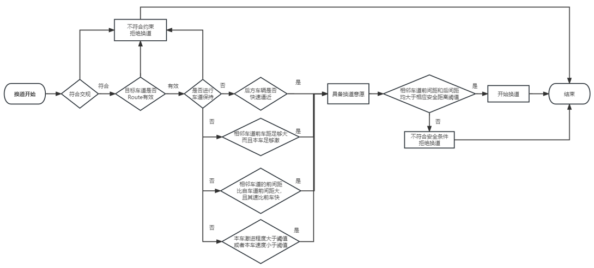</div><br>

&emsp;&emsp;根据前面提到的"九宫格"，对本车周边的车辆进行分类，并进行基于规则的换道判断，如流程图所示。其主要思想是在符合交规的前提下，首先对车辆换道的意愿进行判断，在车辆有换道意愿时，再对换道行为是否安全进行判断，同时满足之后即开始执行换道操作。判断顺序如下，
- 1.	是否符合交规，是则继续，否则拒绝换道。
- 2.	是否处于车道保持状态，否则继续，是拒绝换道。
- 3.	是否有换道意愿，是则继续，否则拒绝换道。其中主要考虑如下几个因素（下面几条为或的关系，都不满足则认为没有换道意愿）
  - 后方是否有车辆快速接近；
  - 相邻车道车前距是否足够大；
  - 相邻车道车前距是否比本车前距大，且速度比前车快；
  - 本车激进程度是否大于某阈值且本车速度小于某阈值。
- 4.	换道是否安全，是则开始换道，否则拒绝换道。


# 4、数据库存储设计

无

# 5、核心接口

## 5.1、应用集成组件

智能交通流引擎基础类库提供了一组类，构成了一个面向交通流仿真领域的应用程序框架，开发者可以在此框架上为Windows和Linux操作系统构建可执行程序（Binary executables），动态链接库（Dynamic-link library）/ 共享库（ Shared Library）

### Application类

Application类封装了交通流仿真器的初始化（Init）、运行仿真循环（Run）和终止（Terminate）功能。如同智能交通流引擎基础类库提供的大部分类一样，开发者可以通过面向对象技术重写成员函数来自定义类的行为。

### Loop类

Loop类为交通流模拟器提供了作为库进行集成的方式，封装了初始化（Init）、重置（Reset）、仿真单步执行（Step）、获得仿真结果（Fill），停止仿真（Stop）功能。

## 5.2、流程调度组件

智能交通流引擎基础类库提供了仿真流程主框架，包含了仿真器运行的初始化和运行时调用流程。涵盖：模块初始化、场景初始化、执行仿真步、仿真结束等。如同智能交通流引擎基础类库提供的大部分类一样，开发者可以通过面向对象技术重写成员函数来自定义类的行为

### SimulationTemplate类

提供了交通流仿真器仿真业务流程的关键流程管理接口，包括：模块初始化（Init）、消息订阅（Subscribe）、获取外来注入消息（GetSubscribedMessage）、场景初始化（Reset）、清空场景（ClearEnv）、解析地图（HdmapConnect）、执行仿真步前处理（PreSimulation）、执行仿真步（Simulation）、执行仿真步后处理（PostSimulation）、发布仿真结果（PublishMessage）、仿真结束（Stop）。

<div align="center">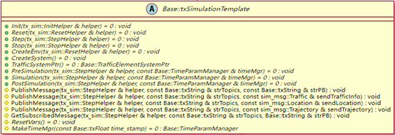</div><br>


### TrafficSystem类

提供了根据特定场景配置生成的交通流仿真系统的关键流程管理接口，包括：

- 系统初始化（Initialize）
- 注册算法车（RegisterPlanningCar）
- 更新算法车（UpdatePlanningCarData）
- 创建交通元素装配上下文（CreateAssemblerCtx）
- 创建交通元素管理器（CreateElemMgr）
- 执行仿真（Step）
- 交通元素生命周期检测（CheckLifeCycle）
- 计算前方碰撞预警（ComputeForwardCollisionWarning）
- 触发场景预设事件（FlushSceneEvents）

<div align="center">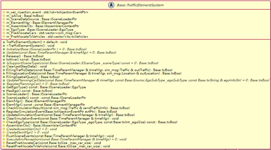</div><br>

#### AssemblerContext类

提供了场景元素创建过程管理接口，包括：

- 上下文初始化接口（Init）
- 清空上下文接口（Clear）
- 重置上下文接口（Reset）
- 装配静态初始场景（GenerateScene）
- 装配动态场景（DynamicChangeScene）

<div align="center"></div><br>

## 5.3、场景解析加载组件

提供了将特定XML Schema的仿真场景描述文件与智能交通流引擎基础类库组件进行数据绑定，将仿真场景描述文件映射到交通流引擎中。接口包括：

- 指定场景文件加载（Load）；
- 获得场景中静态初始车辆信息（GetVehicleData）；
- 获得场景中静态初始非机动车信息（GetNonMotorVehicleData）；
- 获得场景中静态初始行人信息（GetPedestrianData）；
- 获得场景中静态初始障碍物信息（GetObstacleData）；
- 获得场景中静态初始信号灯信息（GetSignalData）；
- 获得场景中动态车流入口信息（GetVehicleInputData）；
- 获得场景中动态车流出口信息（GetVehicleExitData）；
- 获得场景中动态车流属性信息（GetvehicleCompositionData）；
- 获得场景中交通元素路由信息（GetRouteData）；
- 获得场景中事件信息，包括：触发条件、结束条件、执行动作等（GetSceneEventData）。

## 5.4、交通元素组件

### TrafficElement类

智能交通流引擎基础类库提供了对交通元素进行层次化建模的组件，包含了一个交通元素在交通流引擎中每一个阶段所需要的管理接口。

涉及到引擎的关键流程，元素通过实现特定接口类的方式支持功能实现和扩展，包括：仿真流程（ISimulator接口）、身份标识（IIdentity接口）、元素生命周期（ILiftCycle接口）、元素几何属性（IGeometry接口）、元素所在高精度地图定位信息（IMapLocation接口）、元素被周车感知（ISpatialRegister接口）、元素动力属性（IKinetics接口）、元素序列化（ISerialize接口）、元素流式输出（IStream接口）、元素仿真一致性（ISimulationConsistency接口）、元素局部坐标系（ILocalCoord接口）、元素状态（IStatus接口）等。

<div align="center"></div><br>


#### ISimulator接口

提供了单一交通元素仿真过程管理接口，包括：

- 初始化（Initialize）；
- 仿真步前处理（Pre_Update）；
- 仿真步（Update）；
- 仿真步后处理（Post_Update）；
- 获得仿真结果（Fill）；
- 更新空间检索信息（FillingSpatialQuery）；
- 释放资源（Release）

#### IIdentity接口

提供了系统内身份认证管理接口，包括：类型标识符（Id）、全局标识符（SysId）。

#### ILiftCycle接口

提供了交通元素全生命周期管理接口，包括：

- 是否激活（IsAlive）；
- 是否开始仿真（IsStart）;
- 是否结束仿真（IsEnd）；
- 是否被第三方停止（IsStop）；
- 被动结束仿真（Kill）；
- 是否满足开始仿真条件（CheckStart）；
- 是否满足结束仿真条件（CheckEnd）。

#### IGeometry接口

提供了交通元素几何信息管理接口，包括：

- 元素长度（Length）；
- 元素宽度（Width）；
- 元素高度（Height）；
- 元素外包围盒（Polygon）。

#### ISpatialRegister接口

提供了元素与仿真系统全局空间检索交互管理接口，包括：

- 初始化空间注册接口（RegisterInfoOnInit）
- 定位发生变化更新接口（UpdateHashedLaneInfo）
- 元素结束仿真反注册接口（UnRegisterInfoOnKill）

#### IMapLocation接口

提供了交通元素与高精度地图交互管理接口，包括：

- 元素质心经纬度（GetPosition）；
- 元素所处车道的Frenet坐标（FrenetCoord）；
- 是否在道路结构上（IsOnLane）；
- 是否在路口结构上（IsOnLaneLink）；
- 元素所处车道线方向（GetLaneDir）；
- 元素所处道路结构标识信息（GetCurrentLaneInfo）

# 6、主要业务时序

## 6.1 任务初始化

<div align="center">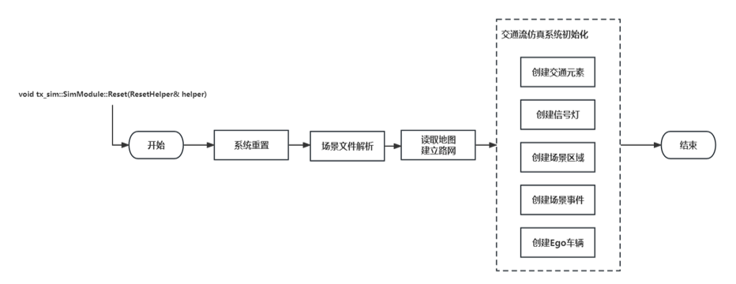</div><br>

<div align="center">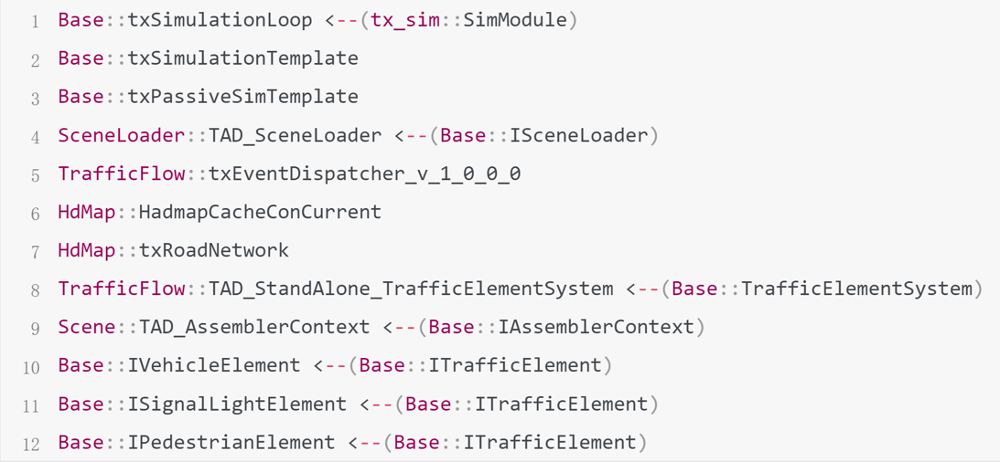</div><br>

<div align="center">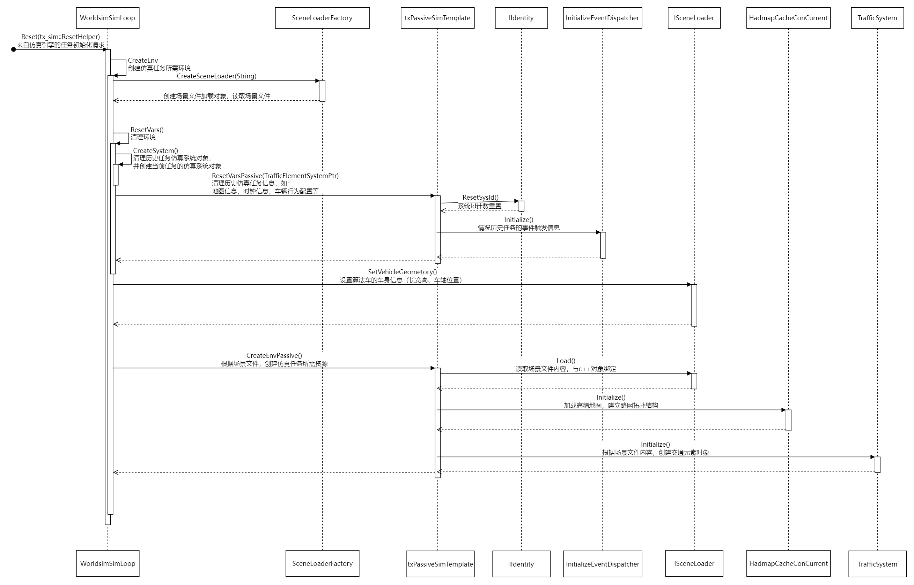</div><br>

<div align="center">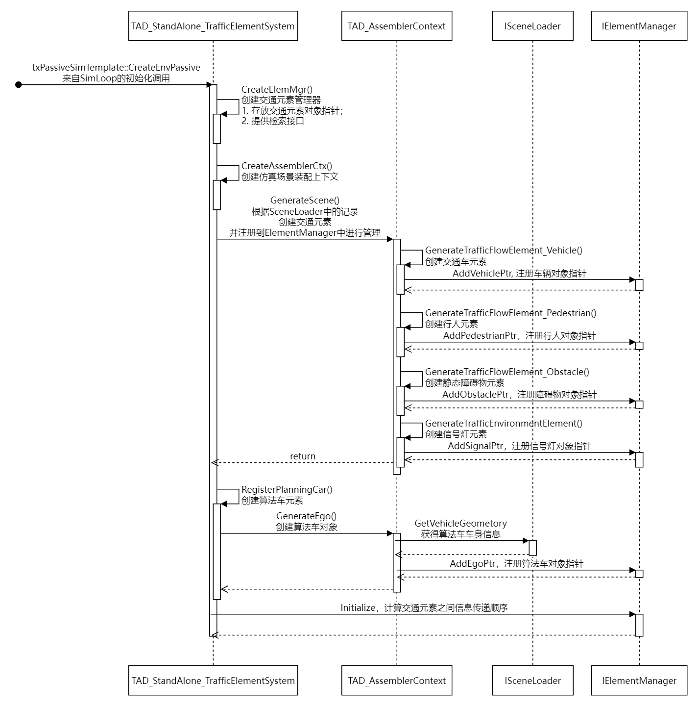</div><br>

## 6.2 单步仿真执行过程

<div align="center">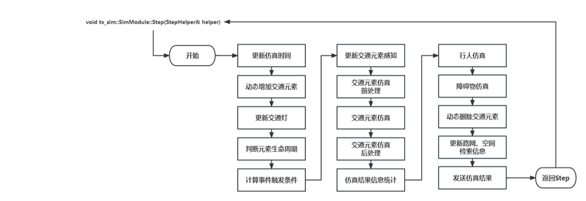</div><br>

<div align="center">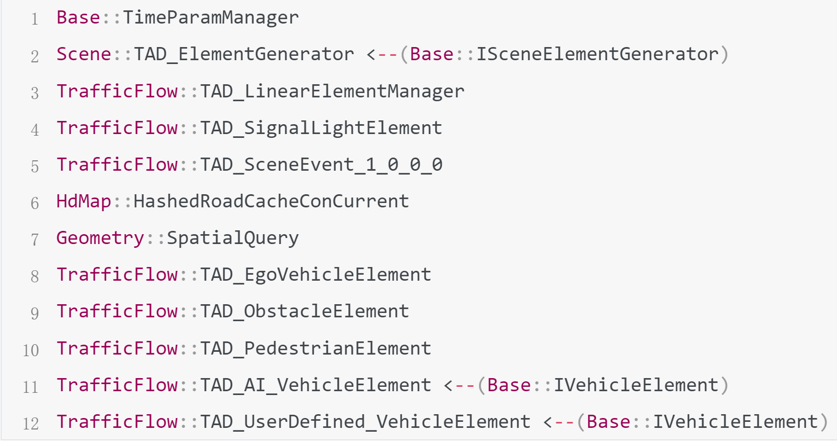</div><br>

<div align="center">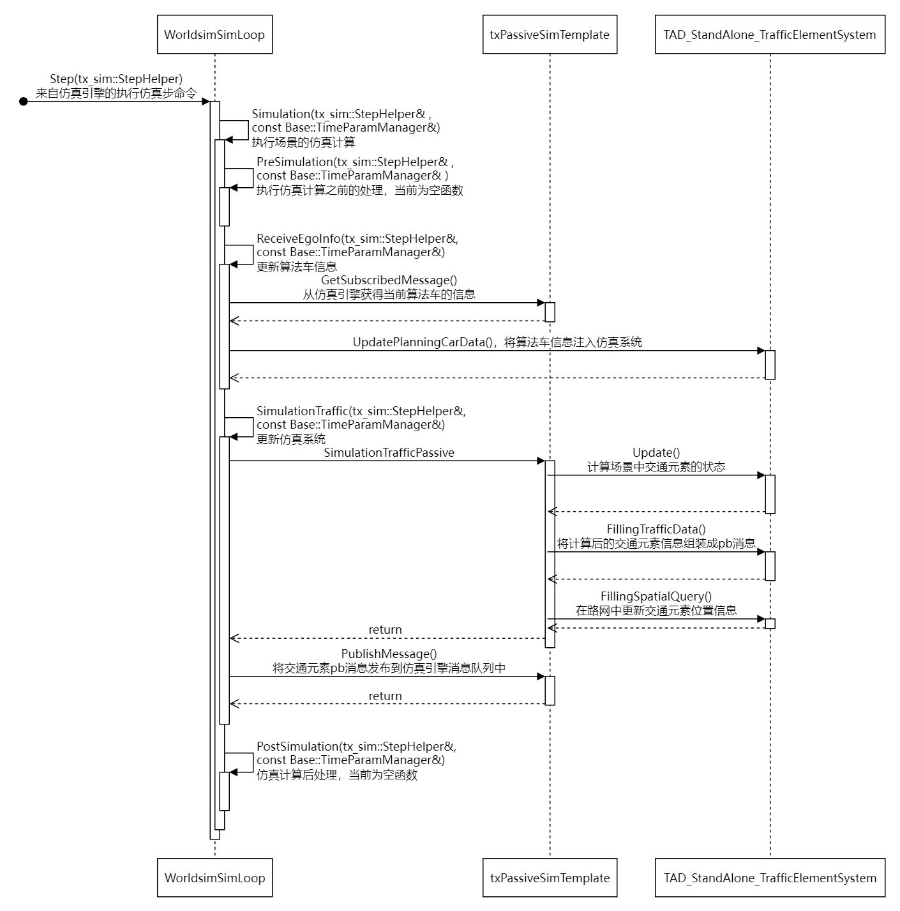</div><br>

<div align="center">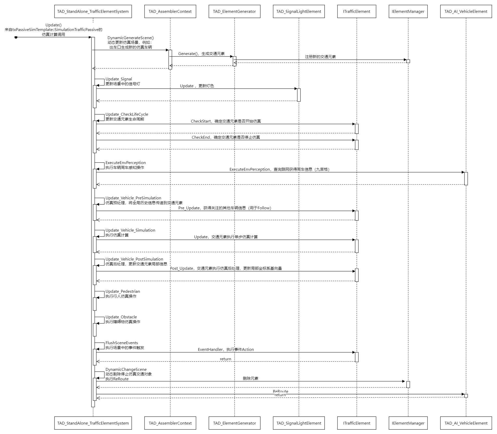</div><br>

<div align="center">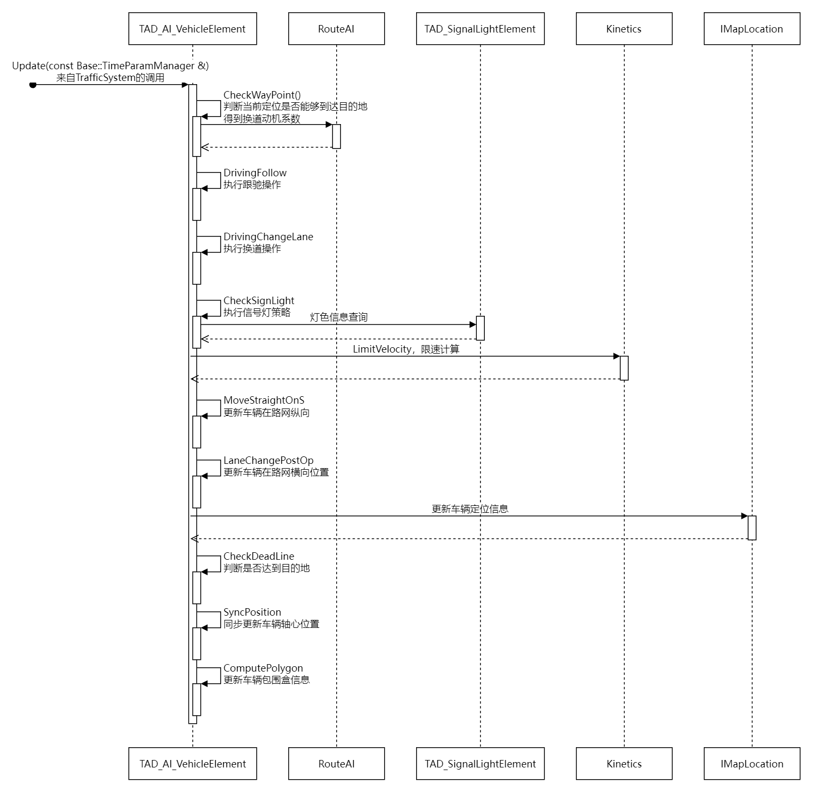</div><br>


# 7、日志格式

GLog 标准格式

# 8、编译
## 8.1 Installing Traffic on Windows
*Steps*
1. make sure you have installed vcpkg and dependencies
2. run build.bat
```bash
cd simcore/traffic && ./build.bat
```
## 8.2 Installing Traffic on Ubuntu
*Steps*
1. make sure you are running in the given docker image environment
2. run build.sh
```bash
cd simcore/traffic && ./build.sh
```
