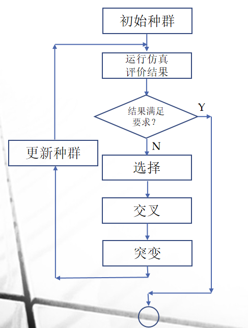
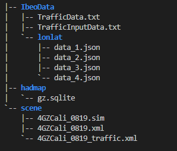
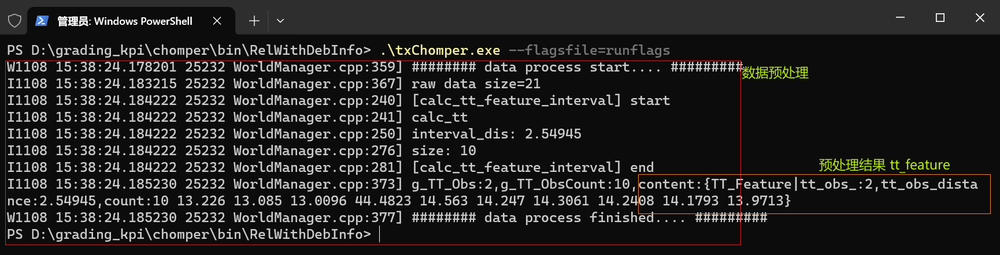
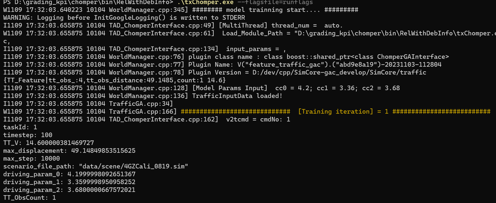
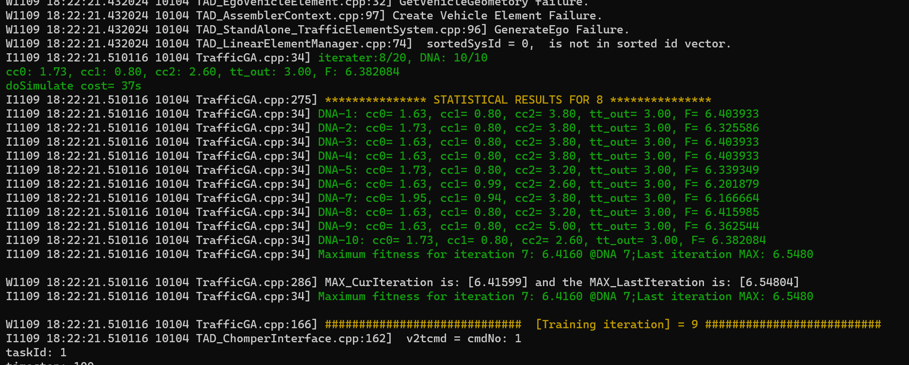
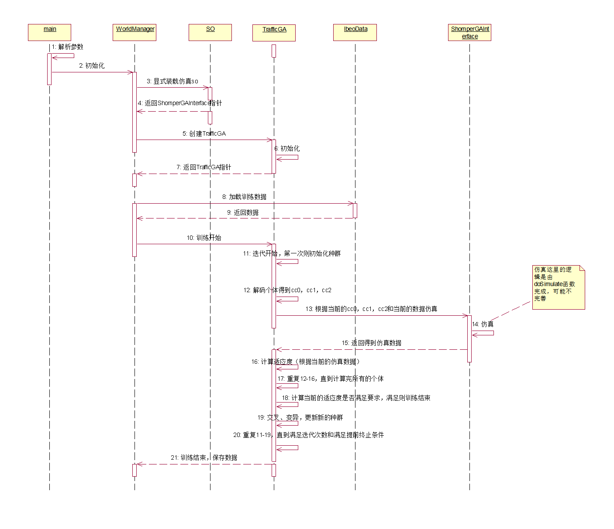
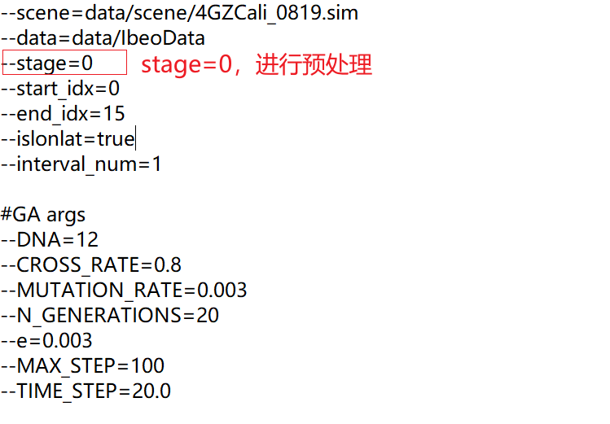
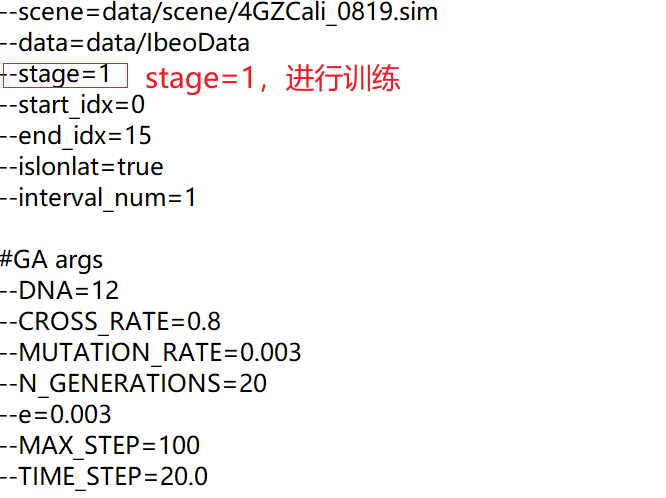

# 1、背景

Chomper模块是交通仿真模型参数训练器模块。通过使用遗传算法不断地迭代仿真传入参数cc0，cc1，cc2，将每一代的参数传入仿真器，并依据第二章理论部分计算出仿真后的输出值，结合原始的真值数据计算出适应度值，最终根据多次迭代出的适应度值获取最佳的三个参数。

------

# 2、遗传算法概述

​	遗传算法（Genetic Algorithm，简称GA）起源于对生物系统所进行的计算机模拟研究，是一种**随机全局搜索优化**方法，它模拟了自然选择和遗传中发生的**复制**、**交叉**(crossover)和**变异(**mutation)等现象，从任一初始种群（Population）出发，通过**随机选择、交叉和变异操作**，产生一群更适合环境的个体，使群体进化到搜索空间中越来越好的区域，这样一代一代不断繁衍进化，最后收敛到一群最适应环境的个体（Individual），从而求得问题的优质解。

## 2.1、训练器中遗传算法介绍

**仿真初始设置和适应度函数:**

- 根据原始数据中的车辆初始间距和速度，设置仿真车辆的初始条件。并将仿真车辆所行驶的路段设置为与采集车行驶路段相同。

- 运行仿真后，将采集车行驶的全程分成10段长度相同的分路段。

  

- 对于每个分路段，记录在仿真时间内所有经过车辆的平均速度，并与相对应的原始数据进行比对计算相对误差。

- 记录并计算仿真中车辆行驶在整个路段的平均行驶时间，并与相对应的原始数据进行比对计算相对误差。

- 结合上面的仿真输出数据计算适应度函数值，

  
  ```math
  F=1/(w*\sqrt{\frac{1}{n}\sum_{i=1}^n\frac{(v_i-\hat{v}_i)^2}{\hat{v}_i^2}}+(1-w)*\frac{TT-\hat{TT}}{\hat{TT}})
  ```
  

------

**遗传算法校准模型参数:**

- 产生初始种群（总数为n）
  - 在需要校准的参数的允许取值范围内随机取值，产生n个个体（n组参数）
  - 如对参数cc0,cc1,cc2产生初始种群(cc01,cc11,cc21), (cc02,cc12,cc22),…,(cc0n,cc1n,cc2n)

- 将每一组仿真参数传入系统并分别运行仿真，并根据仿真结果计算适应度函数。

- 如果本次循环中最大的适应度函数值与前次循环之间的差值小于预先设定阈值或者达到最大循环次数，则退出循环，并将最大适应度函数值所对应的仿真参数作为校准结果。

- 如果结果不能满足要求，则将每一组参数编码为二进制基因，并将所有的基因连接组成一条染色体。

  - 如将参数cc0,cc1,cc2编码为如下染色体，

    

- 选择(selection)：保留结果最优的父代，并根据一定规则(如轮盘赌算法)选择染色体作为父代中的成员，直到父代中个体的数量和初始种群大小相同。
- 交叉(crossover)：将选定的父代两两进行单点杂交，随机选定一个位置按一定几率交叉互换其后面的基因。
- 变异(mutation)：根据一定的概率将杂交后得到的子代基因进行突变，从0变到1或从1变到0 。
- 将通过选择、交叉和变异之后得到的子代染色体解码为仿真参数，运行仿真的下一次迭代，并重复上述步骤。




------

## 2.2 DNA的编码方式

- DNA的长度为12，则生成12位0或者1，通过生成随机数rand()>5000为1,反之为0，生成结果如2.1节中：1 0 1 1 0 0 1 1 0 1 0 1

- 解码分别对三个参数截取四位数字$D_{cci}$，即1011，0011，0101。十进制: 11，3，5

- 然后对三个参数限制上下限范围，程序中采取cc0 [1.2, 2]，cc1[0.8, 1.5]，cc2[2, 11]。

- 最后分别对三个参数的上下限范围[min_cc, max_cc]，以及解码后的结果计算每个参数的值，公式如下：
  ```math
  cci=min_{cci} +D_{cci}*(max_{cci}-min_{cci})/(length(D_{cci})-1)^2
  ```

  ------

  公式说明:

  $cci$ : i为0,1,2，即参数cc0,cc1,cc2

  $min_{cci}$ : cci的最小下限

  $max_{cci}$ : cci的最大上限

  $D_{cci}$ : DNA中cci解码后的十进制数

  $length(D_{cci})$ : DNA中cci解码后二进制数的长度

- 最后获取的$cci$则是最终仿真传入的参数，当前代结束会根据F值通过**随机选择、交叉和变异操作**调整下一代的DNA。

# 3、数据概述

## 3.1、数据目录结构图：



- lonlat目录下的文件是数据预处理所需要的输入文件
- TrafficInputData.txt是预处理过后的输出文件，保存TT_Feature数据，即公式中$\hat{TT}$、$v_i$和n
- TrafficData.txt存储当前的cc0,cc1,cc2数据，是遗传算法训练时的输入文件,保存初始的三个参数
- 4GZCali_0819.sim是仿真时需要的场景文件

## 3.2、数据结构：

**TT_Feature**：

```
struct TT_Feature
{
	float tt_obs_;								// 总行驶时间
	float tt_obs_distance;						// 分路段距离
	std::vector<float> v_obs_;					// 每个分路段车辆的平均速度
}
```

------

# 4、训练器介绍

## 4.1、数据预处理

数据预处理是对lonlat下的文件解析，计算出tt_feature_并保存到TrafficInputData.txt文件，目的是计算公式中$\hat{TT}$、$\hat{v_i}$、n值。

- 程序定义全局变量g_ibeoDataList，用于解析保存json文件中的数据
- 程序检测到stage=0进入数据预处理，根据数据路径进入到json文件存储目录
- 根据开始索引和结束索引解析对应的json文件并保存到g_ibeoDataList
- 解析json文件完毕，对g_ibeoDataList进行计算处理获取tt_feature_，并将tt_feature_存储到数据路径下的TrafficInputData.txt,至此数据预处理完成

其中，每个json文件数据是场景仿真中的一帧数据，包括每辆车的ID、经纬度、速度等信息，JSON文件结构如下：

```
{
    "objects": [
        {													// 场景中id为0的交通车辆
            "shape": "Box",
            "id": "0",
            "type": "Car",
            "rotation": "1.4982000189198048",				
            "duration": "1577762787.000000",				// 当前帧的时间戳
            "longitude": "118.51825626294621",				// 当前帧中id为0的车辆的经度
            "latitude": "-0.019958491021402194",			// 当前帧中id为0的车辆的纬度
            "altitude": "4.9489249550",	
            "velocity": "6.964195965838351",				// 当前帧中id为0的车辆的速度(暂未用到)
            "vertexes": [
                {
                    "x": "-2.500000",
                    "y": "-0.900000"
                },
                {
                    "x": "-2.500000",
                    "y": "0.900000"
                },
                {
                    "x": "2.500000",
                    "y": "0.900000"
                },
                {
                    "x": "2.500000",
                    "y": "-0.900000"
                }
            ]
        },
        {													// 场景中id为1的交通车辆
            "shape": "Box",
            "id": "1",
            "type": "Car",
            "rotation": "1.49820239242537",
            "duration": "1577762787.000000",				// 当前帧的时间戳
            "longitude": "118.51821227559452",				// 当前帧中id为1的车辆的经度
            "latitude": "-0.019927138532642944",			// 当前帧中id为1的车辆的纬度
            "altitude": "4.9489310533",
            "velocity": "7.945060558291163",				// 当前帧中id为1的车辆的速度(暂未用到)
            "vertexes": [
                {
                    "x": "5.783982",
                    "y": "-4.003771"
                },
                {
                    "x": "5.791749",
                    "y": "-2.403790"
                },
                {
                    "x": "10.619372",
                    "y": "-2.427225"
                },
                {
                    "x": "10.611606",
                    "y": "-4.027206"
                }
            ]
        }
    ]
}
```

预处理结果：



**对预处理结果 tt_feature结构的解释说明：**
```math
F=1/(w*\sqrt{\frac{1}{n}\sum_{i=1}^n\frac{(v_i-\hat{v}_i)^2}{\hat{v}_i^2}}+(1-w)*\frac{TT-\hat{TT}}{\hat{TT}})
```

```
{TT_Feature|tt_obs_:2,tt_obs_distance:2.54945,count:10 13.226 13.085 13.0096 44.4823 14.563 14.247 14.3061 14.2408 14.1793 13.9713}
```

tt_obs_: 原始数据的总行驶时间，对应上述公式中的$\hat{TT}$。

count: 对应参数interval_num，分路段个数，对应上述公式中的n。

tt_obs_distance: 原始数据均分路段的路段长度

其他浮点数：每个分路段车辆的平均速度，对应$\hat{v}_i$。

## 4.2、遗传算法训练

遗传算法训练目的是为了每次仿真获取公式中的TT、$v_i$。

遗传算法流程：

- 从TrafficInputData.txt中获取预处理过的tt_feature_，从TrafficData.txt获取初始的cc0、cc1、cc2，用以后续训练
- 根据传入参数--DNA确定DNA的长度，根据--N_GENERATIONS参数确定种群迭代的次数，最大仿真次数即 种群大小(11个) * N_GENERATIONS 次
- 每次迭代中每个DNA中都会调用仿真模块，循环最大种群大小(11个) * N_GENERATIONS次后程序结束，或者根据参数--e=0.003结束程序

训练开始：



训练过程中：

每代的DNA仿真都会输出一个tt_out，即本次仿真时间TT,还有每个分路段车辆的平均速度$v_i$,结合适应度函数计算出F值，并保存本代最大的F值。



每一代仿真结束，会将这一代的参数，仿真时间以及F值统计并输出。

训练结束：结果收敛时或迭代完成后程序结束


结束时，在第10次迭代完，当前最大适应度(F值)的DNA与上一代最大适应度的DNA差值小于阈值，程序结束，并输出Best cc。

## 4.3、主要业务时序图



------

# 5、训练器使用

## 5.1、参数介绍：

### 5.1.1 训练器参数

```
--scene=data/scene/4GZCali_0819.sim				// 场景文件
--data=data/IbeoData							// 数据路径，每次迭代cc0、cc1、cc2存储的路径
--stage=1										// 步骤选择标志，0：数据预处理，1：基于遗传算法参数训练
--start_idx=0									// 预处理数据文件的开始索引
--end_idx=15									// 预处理数据文件的结束索引
--islonlat=true									// 预处理数据是否是经纬度
--interval_num=1								// 分路段个数
```

### 5.1.2 遗传算法模型参数

```
--DNA=12										// DNA长度
--CROSS_RATE=0.8								// 交叉概率，小于该概率交叉生效
--MUTATION_RATE=0.003							// 变异概率，小于该概率变异生效
--N_GENERATIONS=20								// 迭代次数
--e=0.003										// 训练停止阈值
--MAX_STEP=1000									// 每次仿真的最大步数
--TIME_STEP=100.0								// 每步仿真的时长(ms)，一般与原始数据帧时长相同
```

## 5.2、数据预处理

- 数据预处理时，要保证参数--data文件夹下的文件名称有序性，统一命名data_xxx.json,起始编号为start_idx+1,如. start_idx=0，第一个json文件名称为data_1.json，结束编号同样是end_idx+1。

### 5.2.1 参数文件方式（推荐）

```
txChomper --flagsfile=runflags
```



### 5.2.2 命令行方式

```
txChompe --data=data/IbeoData \			
--stage=0 \								
--start_idx=0 \							
--end_idx=15 \							
--islonlat=true \						
--interval_num=1
```

## 5.3  训练

- 在进行参数仿真训练时，需要将车辆微观模型参数文件**vehicle_behavior_db.cfg(文件名需要一致）**与可执行文件放在同一目录下，否则程序运行错误。
- 对于参数scene指向的场景文件，场景中车辆的初始速度应该与第一个数据文件即data_1.json中的车辆初始速度相同。
- 场景中车队前方第一辆车辆的每帧速度应该与数据文件中每一帧的速度一一对应，相当于仿真的边界条件。

### 5.3.1 参数文件方式（推荐）

```
txChomper --flagsfile=runflags
```



### 5.3.2 命令行方式

```
txChomper --scene=data/scene/4GZCali_0819.sim \
--data=data/IbeoData \
--stage=1 \
--DNA=12 \
--CROSS_RATE=0.8 \
--MUTATION_RATE=0.003 \
--N_GENERATIONS=20 \
--e=0.003 
--MAX_STEP=100
--TIME_STEP=20.0
```

# 6、数据埋点

无

# 7、日志格式


# 8、业务状态

无

# 9、代码结构

参照时序图

# 10、开发调试与发布
 需要优先构建 traffic 相关依赖 [**framework**](../../framework/README.md) 、 [**hadmap**](../../hadmap/README.md)。
 具体参见对应目录下的README文档。

```
# linux下编译： 
cd SimCore/traffic && mkdir build && cd build
cmake  -DCMAKE_BUILD_TYPE=Release -DTADChomper=ON -DOnlyTraffic=OFF ..
make

```
